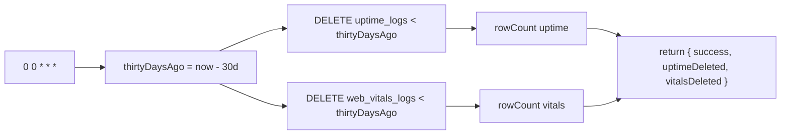
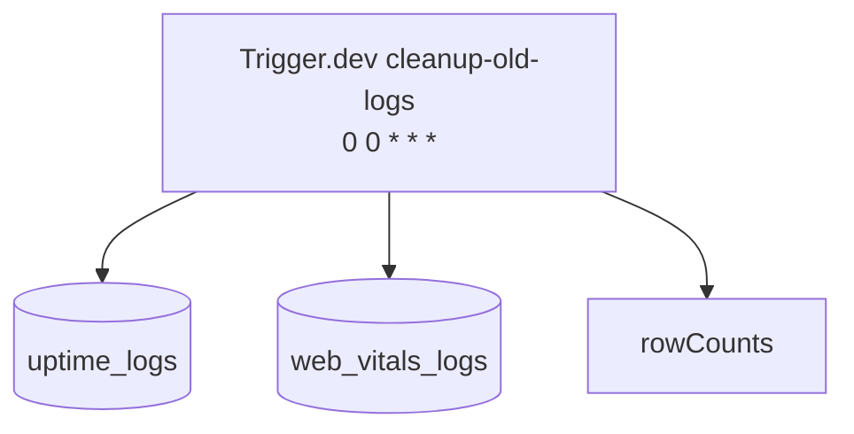
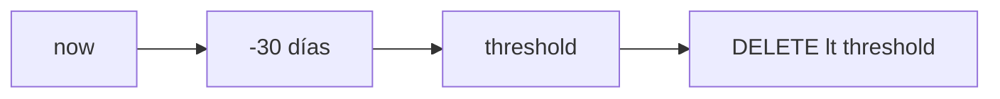

# Job Contract — Cleanup Old Logs (`src/trigger/cleanup.trigger.ts`)

{: .no_toc }

  
Tabla de contenidos

  {: .text-delta }
1. TOC
{:toc}

---

## 0. Estado del job (hallazgo B05)

**Task Trigger.dev:** `cleanup-old-logs` · schedule `0 0 * * *` (diario 00:00) · [VERIFIED]

**Side-effects en BD:** DELETE de `uptime_logs` y `web_vitals_logs` con `checked_at`/`recorded_at` < 30 días [VERIFIED].

**Veredicto de idempotencia:** **PASS** — los DELETE son naturalmente idempotentes: re-ejecutar el mismo ciclo no encuentra filas (ya eliminadas). Retry seguro. [VERIFIED] Ver §5.

---

## 1. Purpose

Purga diaria de registros antiguos (>30 días) de `uptime_logs` y `web_vitals_logs` para controlar el crecimiento de la BD. [VERIFIED del código]

## 2. Trigger

| Propiedad | Valor | Evidencia |
|-----------|-------|-----------|
| Task ID | `cleanup-old-logs` | [VERIFIED] |
| Tipo | `schedules.task` (@trigger.dev/sdk) | [VERIFIED] |
| Cron | `0 0 * * *` | [VERIFIED] |
| Retry | default global (`maxAttempts: 3`) de `trigger.config.ts` | [VERIFIED] |
| Retención | 30 días (`thirtyDaysAgo`) | [VERIFIED] |

## 3. Steps (TRIGGER → JOB → SUCCESS)

**FLOW-190 — Ciclo de purga** · Mermaid `flowchart`

**Steps reales:** 1) calcular `thirtyDaysAgo` [VERIFIED] → 2) `db.delete(uptimeLogs).where(lt(checkedAt, thirtyDaysAgo))` [VERIFIED] → 3) `db.delete(webVitalsLogs).where(lt(recordedAt, thirtyDaysAgo))` [VERIFIED] → 4) retorno con `rowCount` de cada DELETE [VERIFIED].

## 4. Failure → Retry → Limit → Failed → Recovery

**MAT-190 — Gestión de fallos**

| Fase | Comportamiento | Evidencia |
|------|----------------|-----------|
| Failure | Error → `console.error` + `throw` (retry) | [VERIFIED] |
| Retry | 3 intentos máximos (default global) | [VERIFIED] |
| Limit | `rowCount` reportado por tabla | [VERIFIED] |
| Failed | Tras 3 intentos run failed; sin estado persistido | [VERIFIED] |
| Recovery | Próximo ciclo diario; deletes idempotentes | [VERIFIED] |

## 5. Idempotency checklist

| # | Chequeo | Resultado | Evidencia |
|---|---------|-----------|-----------|
| 1 | DELETE idempotente (re-ejecutar no afecta) | ✅ PASS | [VERIFIED: filas ya no existen] |
| 2 | Retry seguro | ✅ PASS | [VERIFIED] |
| 3 | Umbral estable (30 días) | ✅ PASS | [VERIFIED] |
| 4 | No elimina datos de retención requerida | ✅ PASS | [VERIFIED: solo >30d] |

**Fix recomendado [RECOMMENDED] (T05-02):** ninguno crítico. Considerar batched DELETE (`LIMIT`) si las tablas crecen mucho para evitar locks largos en Supabase.

## 6. Dependencies

| Dependencia | Uso | Evidencia |
|-------------|-----|-----------|
| `@/shared/db/schemas` | `uptimeLogs`, `webVitalsLogs` | [VERIFIED] |
| `drizzle-orm` `lt` | Comparación de fecha | [VERIFIED] |
| Env: `DATABASE_URL` | Conexión | [VERIFIED] |

## 7. Database

| Tabla | Operación | Evidencia |
|-------|-----------|-----------|
| `uptime_logs` | DELETE < 30d | [VERIFIED] |
| `web_vitals_logs` | DELETE < 30d | [VERIFIED] |

## 8. Events

- **Consume/emit:** ninguno (job de mantenimiento) [VERIFIED].

## 9. Security

- Sin input de usuario; job interno [VERIFIED].
- Sin secretos [VERIFIED].

## 10. Observability

- `console.log` con rowCounts por tabla [VERIFIED].

## 11. Tests

- **Sin test directo** [VERIFIED].
- Gap B06: test del umbral (30d) con mock de db [RECOMMENDED].

## 12. Failure Modes

- BD caída → throw → retry → failed [VERIFIED].
- Tabla enorme → DELETE largo (potencial lock) [INFERRED].

---

## 13. Requisitos del contrato

| REQ | Requisito | Cumplimiento |
|-----|-----------|--------------|
| REQ-190 | Ejecutar diario | Cumplido (cron) |
| REQ-191 | Purga >30 días en 2 tablas | Cumplido |
| REQ-192 | Idempotencia | Cumplido |

## 14. Arquitectura

**FIG-190 — Contexto del job** · Mermaid `flowchart`

## 15. Flujos

**FLOW-191 — Cálculo de retención** · Mermaid `flowchart`

## 16. Trazabilidad

**MAT-191 — Trazabilidad**

| ID | Tipo | Qué cubre |
|----|------|-----------|
| REQ-190..192 | Requisito | Contrato del job |
| FIG-190 | Diagrama | Contexto del job |
| FLOW-190/191 | Flujo | Ciclo + retención |
| TEST-190 | Test | pendiente B06 |
| DEP-190 | Deployment | Trigger.dev CLI/CI |

## 17. Inconsistencias y cross-check

| Hipótesis | Verificación | Resultado |
|-----------|--------------|-----------|
| "Puede duplicar deletes" | DELETE idempotente | **CONFIRMADO** seguro |
| "Cron diario" | `cron: "0 0 * * *"` | **CONFIRMADO** |
| "Retención 30d" | `setDate(getDate() - 30)` | **CONFIRMADO** |

## 18. Unknowns y supuestos

- [UNKNOWN] Tamaño real de las tablas (impacto de locks).
- [ASSUMPTION] La política de retención de 30 días es la deseada.

## 19. Glosario

| Término | Definición |
|---------|------------|
| Retención | Antigüedad máxima de filas conservadas (30 días) |
| rowCount | Filas afectadas por el DELETE |

## 20. Versionado y verificación

| Versión | Fecha | Cambios | Estado |
|---------|-------|---------|--------|
| 1.0 | 2026-08-02 | Creación inicial (T05-01, BATCH 05) | Aprobado |

**Verificación:** `node scripts/quality-gate.mjs docs/jobs/JOB-CONTRACT-cleanup.md --min 80` → PASS

---

## 21. APIs y endpoints

| Endpoint | Método | Relación |
|----------|--------|----------|
| Sin endpoint manual | — | El job se ejecuta solo por cron interno de Trigger.dev (no expone HTTP propio) [VERIFIED] |

Errores: fallo de DELETE → `throw` (retry); no hay estado persistido [VERIFIED].

**Control de acceso:** credenciales de servicio (service-side), nunca al cliente [VERIFIED].

**Testing:** casos de prueba del umbral de retención (30d) recomendados en B06 [RECOMMENDED].

**Despliegue:** job desplegado vía Trigger.dev CLI desde CI/CD (`.github/workflows/ci.yml`); sin ambientes dedicados ni rollout independiente [VERIFIED].

---

**Fuentes primarias:** `src/trigger/cleanup.trigger.ts` · `trigger.config.ts`
