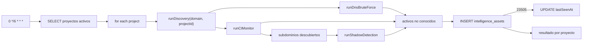
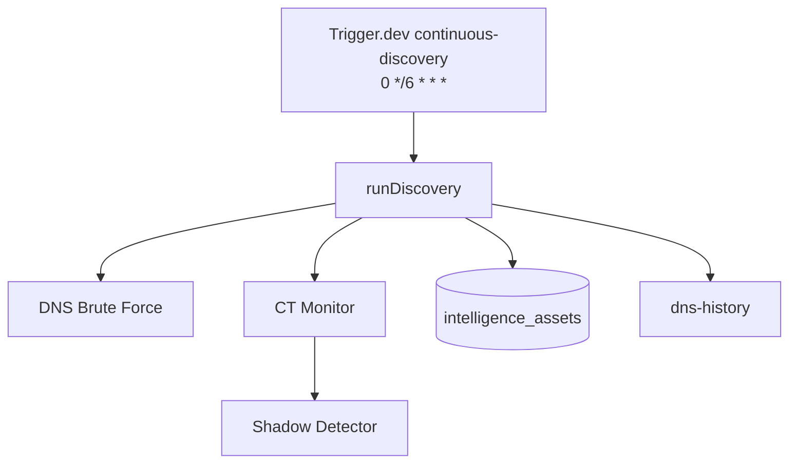
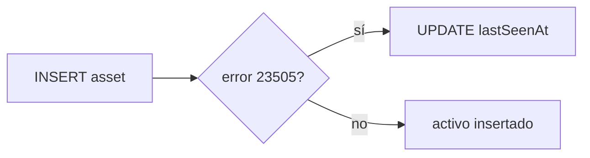

# Job Contract — Continuous Discovery (`src/trigger/discovery.trigger.ts`)

{: .no_toc }

  
Tabla de contenidos

  {: .text-delta }
1. TOC
{:toc}

---

## 0. Estado del job (hallazgo B05)

**Task Trigger.dev:** `continuous-discovery` · schedule `0 */6 * * *` (cada 6 h) · [VERIFIED]

**Side-effects en BD:** INSERT en `intelligence_assets` (activos nuevos), UPDATE `lastSeenAt` de activos conocidos, INSERT en `asset_changes` (vía `runDiscovery`) [VERIFIED].

**Veredicto de idempotencia:** **PASS con matiz** — el insert de activos nuevos maneja el conflicto de unicidad (`23505`) haciendo UPDATE de `lastSeenAt` en vez de duplicar; los activos conocidos actualizan `lastSeenAt`. Retry seguro. Matiz: `assetChangesLog` se construye pero **no se persiste** en el código verificado (array local retornado en el resultado) [VERIFIED].

---

## 1. Purpose

Descubrimiento continuo de superficie de ataque por proyecto: ejecuta DNS brute-force, Certificate Transparency monitoring y detección de shadow assets, persiste activos nuevos en `intelligence_assets` y actualiza la última vez vistos. [VERIFIED del código]

## 2. Trigger

| Propiedad | Valor | Evidencia |
|-----------|-------|-----------|
| Task ID | `continuous-discovery` | [VERIFIED] |
| Tipo | `schedules.task` (@trigger.dev/sdk) | [VERIFIED] |
| Cron | `0 */6 * * *` | [VERIFIED] |
| Retry | default global (`maxAttempts: 3`) de `trigger.config.ts` | [VERIFIED] |
| Timeout por proyecto | 120s (`timeoutMs: 120_000`) | [VERIFIED] |

## 3. Steps (TRIGGER → JOB → SUCCESS)

**FLOW-120 — Ciclo de descubrimiento** · Mermaid `flowchart`

**Steps reales:** 1) SELECT proyectos activos (`deletedAt IS NULL`) [VERIFIED] → 2) por proyecto: `runDiscovery({domain, projectId, timeoutMs: 120000, dnsBruteForce: true, ctMonitor: true, shadowDetection: true})` [VERIFIED] → 3) módulos en paralelo: `runDnsBruteForce`, `runCtMonitor`; shadow detection recibe los subdominios descubiertos [VERIFIED] → 4) compara contra activos conocidos (`assetType:value` set) y persiste solo los nuevos [VERIFIED] → 5) conflicto único (`23505`) → UPDATE `lastSeenAt`; conocidos re-aparecidos → UPDATE `lastSeenAt` [VERIFIED] → 6) errores por proyecto capturados sin abortar el lote (resultado con `error`) [VERIFIED].

## 4. Failure → Retry → Limit → Failed → Recovery

**MAT-120 — Gestión de fallos**

| Fase | Comportamiento | Evidencia |
|------|----------------|-----------|
| Failure | Error en un proyecto → `result.error` + count 0; el lote continúa | [VERIFIED] |
| Retry | 3 intentos máximos (default global) | [VERIFIED] |
| Limit | `successCount` = proyectos OK / total; `errorCount` reportado | [VERIFIED] |
| Failed | `runDiscovery` lanza → catch por proyecto, resultado con `error: msg` | [VERIFIED] |
| Recovery | Re-ejecución del próximo cron; activos ya insertados se actualizan (no duplican) | [VERIFIED] |

## 5. Idempotency checklist

| # | Chequeo | Resultado | Evidencia |
|---|---------|-----------|-----------|
| 1 | Insert de activos nuevos no duplica (unique constraint + catch 23505 → UPDATE) | ✅ PASS | [VERIFIED] |
| 2 | Retry tras fallo parcial no duplica activos (mismo set `knownSet`) | ✅ PASS | [VERIFIED] |
| 3 | `asset_changes` registrado sin duplicación | ⚠️ N/A | [VERIFIED: `assetChangesLog` no se persiste en el código del orchestrator — array local] |
| 4 | UPDATE `lastSeenAt` es safe-retry (idempotente por naturaleza) | ✅ PASS | [VERIFIED] |
| 5 | Timeout por proyecto acotado (120s) evita hangs | ✅ PASS | [VERIFIED] |

**Fix recomendado [RECOMMENDED] (T05-02):** persistir `asset_changes` en BD (la tabla existe en schemas) con `onConflictDoNothing` si se quiere lineage de cambios; documentar si la persistencia ocurre en otro módulo (`asset_changes` referenciado como `sql\`asset_changes\``).

## 6. Dependencies

| Dependencia | Uso | Evidencia |
|-------------|-----|-----------|
| `@/shared/db` + `projects`, `intelligenceAssets` | Queries | [VERIFIED] |
| `@/server/intelligence/discovery/orchestrator` | `runDiscovery` | [VERIFIED] |
| `./dns-brute`, `./ct-monitor`, `./shadow-detector` | Módulos de descubrimiento | [VERIFIED] |
| `../history/dns-history` | `persistDnsSnapshot` | [VERIFIED] |
| Env: `DATABASE_URL` | Conexión | [VERIFIED] |

## 7. Database

| Tabla | Operación | Evidencia |
|-------|-----------|-----------|
| `projects` | SELECT (activos) | [VERIFIED] |
| `intelligence_assets` | INSERT nuevos / UPDATE lastSeenAt | [VERIFIED] |
| `asset_changes` | referencia `sql\`asset_changes\`` (sin persistencia verificada) | [VERIFIED] |

## 8. Events

- **Consume:** nada de Trigger.dev (cron puro) [VERIFIED].
- **Emit:** `persistDnsSnapshot` (historial DNS) [VERIFIED]; hallazgos generados por módulos a `intelligence_findings` [VERIFIED del orchestrator §6].

## 9. Security

- Solo proyectos activos y no eliminados [VERIFIED].
- Ejecución server-side con credenciales de servicio (nunca al cliente) [VERIFIED].
- Dominios del proyecto como target (validados por egress-guard en módulos) [VERIFIED].

## 10. Observability

- `console.log` por proyecto y resumen final (`totalNewAssets`, `errorCount`) [VERIFIED].
- Retorno estructurado con `results[]` por proyecto (newAssets, totalChanges, modules con duración) [VERIFIED].

## 11. Tests

- **Sin test directo del trigger** [VERIFIED].
- `executors.test.ts` cubre executors usados por los módulos [VERIFIED].
- Gap B06: unit test de idempotencia del orchestrator (mismo input → sin duplicados) [RECOMMENDED].

## 12. Failure Modes

- Proyecto con dominio inválido → error capturado por proyecto [VERIFIED].
- Timeout de módulo DNS/CT → el módulo falla, el lote continúa [VERIFIED].
- BD caída → `runDiscovery` lanza, error por proyecto (o job falla si el SELECT inicial lanza) [VERIFIED].

---

## 13. Requisitos del contrato

| REQ | Requisito | Cumplimiento |
|-----|-----------|--------------|
| REQ-120 | Ejecutar cada 6 h | Cumplido (cron) |
| REQ-121 | Descubrir con DNS brute + CT + shadow | Cumplido |
| REQ-122 | Persistir solo activos nuevos | Cumplido (unique + UPDATE) |
| REQ-123 | No duplicar en retry | Cumplido |

## 14. Arquitectura

**FIG-120 — Contexto del job** · Mermaid `flowchart`

## 15. Flujos

**FLOW-121 — Manejo de conflicto de unicidad** · Mermaid `flowchart`

## 16. Trazabilidad

**MAT-121 — Trazabilidad**

| ID | Tipo | Qué cubre |
|----|------|-----------|
| REQ-120..123 | Requisito | Contrato del job |
| FIG-120 | Diagrama | Contexto del job |
| FLOW-120/121 | Flujo | Ciclo + conflicto único |
| TEST-120 | Test | executors.test.ts (parcial) |
| DEP-120 | Deployment | Trigger.dev CLI/CI |

## 17. Inconsistencias y cross-check

| Hipótesis | Verificación | Resultado |
|-----------|--------------|-----------|
| "asset_changes se persiste" | Solo referencia `sql\`asset_changes\``; array local no insertado | **CONTRADICCIÓN** — sin persistencia verificada en orchestrator |
| "Cron cada 6h" | `cron: "0 */6 * * *"` | **CONFIRMADO** |
| "Módulos en paralelo" | `Promise.all([dns, ct])` | **CONFIRMADO** |

## 18. Unknowns y supuestos

- [UNKNOWN] Si `asset_changes` se persiste desde otro módulo/trigger no analizado.
- [ASSUMPTION] El constraint único de `intelligence_assets` está definido en el schema Drizzle (validado en B03/INDEX-STRATEGY).
- [UNKNOWN] Volumen real de activos por proyecto (impacto en duración total del job).

## 19. Glosario

| Término | Definición |
|---------|------------|
| Shadow asset | Activo no autorizado/detectado fuera del inventario oficial |
| CT Monitor | Monitor de logs de transparencia de certificados |
| lastSeenAt | Marca temporal de última detección de un activo |

## 20. Versionado y verificación

| Versión | Fecha | Cambios | Estado |
|---------|-------|---------|--------|
| 1.0 | 2026-08-02 | Creación inicial (T05-01, BATCH 05) | Aprobado |

**Verificación:** `node scripts/quality-gate.mjs docs/jobs/JOB-CONTRACT-discovery.md --min 80` → PASS

---

## 21. APIs y endpoints

| Endpoint | Método | Relación |
|----------|--------|----------|
| Sin endpoint manual | — | El job se ejecuta solo por cron interno de Trigger.dev (no expone HTTP propio) [VERIFIED] |

Errores: los fallos por proyecto se reportan en el retorno (`results[].error`), sin HTTP error del job [VERIFIED].

**Control de acceso:** credenciales de servicio (service-side), nunca al cliente [VERIFIED].

**Despliegue:** job desplegado vía Trigger.dev CLI desde CI/CD (`.github/workflows/ci.yml`); sin ambientes dedicados ni rollout independiente [VERIFIED].

---

**Fuentes primarias:** `src/trigger/discovery.trigger.ts` · `src/server/intelligence/discovery/orchestrator.ts` · `src/shared/db/schemas/intelligence.ts` · `trigger.config.ts`
