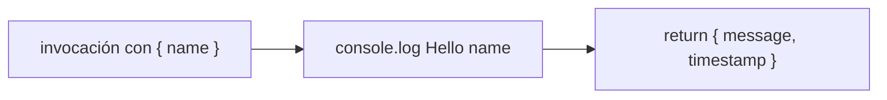
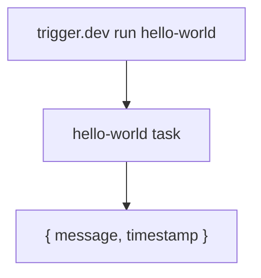
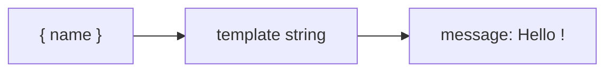

# Job Contract — Hello World (`src/trigger/hello.trigger.ts`)

{: .no_toc }

  
Tabla de contenidos

  {: .text-delta }
1. TOC
{:toc}

---

## 0. Estado del job (hallazgo B05)

**Task Trigger.dev:** `hello-world` · **on-demand** (`task`) · sin retry explícito (usa default global) · [VERIFIED]

**Side-effects en BD:** ninguno — solo `console.log` y retorno `{ message }` [VERIFIED].

**Veredicto de idempotencia:** **PASS** — no muta estado; re-ejecutar con el mismo payload produce el mismo output. [VERIFIED] Ver §5.

---

## 1. Purpose

Job de demo/verificación del pipeline de Trigger.dev: recibe `{ name }` y devuelve `{ message, timestamp }`. [VERIFIED del código]

## 2. Trigger

| Propiedad | Valor | Evidencia |
|-----------|-------|-----------|
| Task ID | `hello-world` | [VERIFIED] |
| Tipo | `task` (@trigger.dev/sdk/v3) — on-demand | [VERIFIED] |
| Retry | default global (`maxAttempts: 3`) de `trigger.config.ts` | [VERIFIED] |
| Input | `{ name: string }` | [VERIFIED] |

## 3. Steps (TRIGGER → JOB → SUCCESS)

**FLOW-220 — Ejecución de demo** · Mermaid `flowchart`

**Steps reales:** 1) `console.log(\`Hello ${payload.name}\`)` [VERIFIED] → 2) retorno `{ message: \`Hello ${name}!\`, timestamp }` [VERIFIED].

## 4. Failure → Retry → Limit → Failed → Recovery

**MAT-220 — Gestión de fallos**

| Fase | Comportamiento | Evidencia |
|------|----------------|-----------|
| Failure | `payload.name` indefinido → message "Hello undefined!" (sin throw) | [VERIFIED] |
| Retry | 3 intentos máximos (default global) | [VERIFIED] |
| Limit | N/A (sin estado) | [VERIFIED] |
| Failed | N/A | [VERIFIED] |
| Recovery | Re-invocación | [VERIFIED] |

## 5. Idempotency checklist

| # | Chequeo | Resultado | Evidencia |
|---|---------|-----------|-----------|
| 1 | Sin side-effects (solo retorno) | ✅ PASS | [VERIFIED] |
| 2 | Determinista (mismo input → mismo output) | ✅ PASS | [VERIFIED] |
| 3 | Retry seguro | ✅ PASS | [VERIFIED] |

**Fix recomendado [RECOMMENDED] (T05-02):** ninguno. Considerar eliminación en limpieza futura o uso como smoke test del runtime (p.ej. en CI de deploy).

## 6. Dependencies

| Dependencia | Uso | Evidencia |
|-------------|-----|-----------|
| — | Ninguna (solo sdk) | [VERIFIED] |

## 7. Database

| Tabla | Operación | Evidencia |
|-------|-----------|-----------|
| — | Ninguna | [VERIFIED] |

## 8. Events

- **Consume/emit:** ninguno [VERIFIED].

## 9. Security

- Sin superficie de seguridad (sin input de BD, sin secretos) [VERIFIED].

## 10. Observability

- `console.log` + retorno estructurado [VERIFIED].

## 11. Tests

- **Sin test** (demo) [VERIFIED].
- Uso potencial: smoke test en CI de deploy de Trigger.dev [RECOMMENDED].

## 12. Failure Modes

- Invocación sin payload → nombre indefinido (output raro, sin crash) [VERIFIED].

---

## 13. Requisitos del contrato

| REQ | Requisito | Cumplimiento |
|-----|-----------|--------------|
| REQ-220 | Responder al payload | Cumplido |
| REQ-221 | Sin side-effects | Cumplido |
| REQ-222 | Idempotente | Cumplido |

## 14. Arquitectura

**FIG-220 — Contexto del job** · Mermaid `flowchart`

## 15. Flujos

**FLOW-221 — Retorno** · Mermaid `flowchart`

## 16. Trazabilidad

**MAT-221 — Trazabilidad**

| ID | Tipo | Qué cubre |
|----|------|-----------|
| REQ-220..222 | Requisito | Contrato del job |
| FIG-220 | Diagrama | Contexto del job |
| FLOW-220/221 | Flujo | Ejecución + retorno |
| TEST-220 | Test | smoke test sugerido [RECOMMENDED] |
| DEP-220 | Deployment | Trigger.dev CLI/CI |

## 17. Inconsistencias y cross-check

| Hipótesis | Verificación | Resultado |
|-----------|--------------|-----------|
| "Es el job de prueba del repo" | `hello-world` + `hello.ts` raíz | **CONFIRMADO** |
| "Tiene dependencias externas" | Sin imports de proyecto | **CONFIRMADO** — sin deps |

## 18. Unknowns y supuestos

- [UNKNOWN] Si se usa como smoke test en algún pipeline.
- [ASSUMPTION] Es artefacto de demostración del boilerplate Trigger.dev.

## 19. Glosario

| Término | Definición |
|---------|------------|
| Demo job | Task de ejemplo sin lógica de negocio |

## 20. Versionado y verificación

| Versión | Fecha | Cambios | Estado |
|---------|-------|---------|--------|
| 1.0 | 2026-08-02 | Creación inicial (T05-01, BATCH 05) | Aprobado |

**Verificación:** `node scripts/quality-gate.mjs docs/jobs/JOB-CONTRACT-hello.md --min 80` → PASS

---

## 21. APIs y endpoints

| Endpoint | Método | Relación |
|----------|--------|----------|
| Sin endpoint HTTP | — | Se invoca vía CLI `trigger.dev run hello-world { name }` [VERIFIED] |

Errores: payload sin `name` → output "Hello undefined!" sin crash [VERIFIED].

**Control de acceso:** sin credenciales (job público de demo, sin side-effects) [VERIFIED].

**Testing:** casos de smoke test del runtime Trigger.dev sugeridos en B06 [RECOMMENDED].

**Despliegue:** job desplegado vía Trigger.dev CLI desde CI/CD (`.github/workflows/ci.yml`); sin ambientes dedicados ni rollout independiente [VERIFIED].

---

**Fuentes primarias:** `src/trigger/hello.trigger.ts` · `trigger.config.ts`
