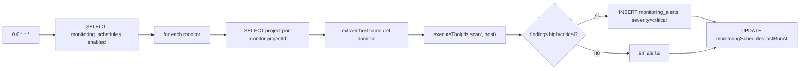
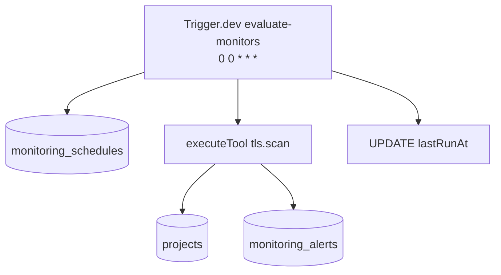
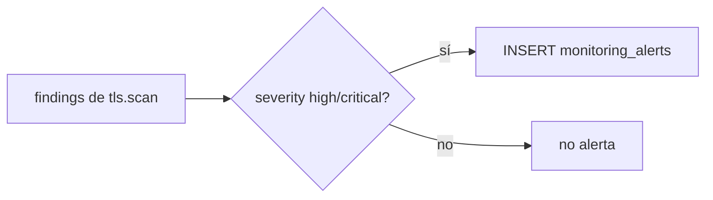

# Job Contract — Evaluate Monitors Task (`src/trigger/monitoring.trigger.ts`)

{: .no_toc }

  
Tabla de contenidos

  {: .text-delta }
1. TOC
{:toc}

---

## 0. Estado del job (hallazgo B05)

**Task Trigger.dev:** `evaluate-monitors-task` · schedule `0 0 * * *` (diario 00:00) · [VERIFIED]

**Side-effects en BD:** SELECT `monitoring_schedules` (enabled), SELECT `projects`, INSERT `monitoring_alerts` (si hallazgos high/critical), UPDATE `monitoring_schedules.lastRunAt` [VERIFIED].

**Veredicto de idempotencia:** **FAIL** — si un monitor detecta hallazgos high/critical dos ciclos seguidos (o un retry re-ejecuta el mismo ciclo), se inserta una alerta **duplicada** en `monitoring_alerts` (INSERT plano sin check de alerta abierta existente). Tampoco hay `onConflictDoNothing`. [VERIFIED] Ver §5.

---

## 1. Purpose

Evaluar diariamente los monitores de seguridad activos (`monitoring_schedules.enabled = true`): ejecuta la herramienta TLS scan desatendida contra el dominio del proyecto y genera alertas (`monitoring_alerts`) cuando aparecen hallazgos de severidad high/critical. [VERIFIED del código]

## 2. Trigger

| Propiedad | Valor | Evidencia |
|-----------|-------|-----------|
| Task ID | `evaluate-monitors-task` | [VERIFIED] |
| Tipo | `schedules.task` (@trigger.dev/sdk/v3) | [VERIFIED] |
| Cron | `0 0 * * *` (diario) | [VERIFIED] |
| Retry | default global (`maxAttempts: 3`) de `trigger.config.ts` | [VERIFIED] |
| Tool | `tls.scan` vía `executeTool` | [VERIFIED] |

## 3. Steps (TRIGGER → JOB → SUCCESS)

**FLOW-160 — Ciclo de evaluación de monitores** · Mermaid `flowchart`

**Steps reales:** 1) SELECT monitores habilitados (`enabled = true`) [VERIFIED] → 2) por monitor: SELECT proyecto (si no existe o sin dominio → `continue`) [VERIFIED] → 3) extraer hostname del dominio (URL parseo) [VERIFIED] → 4) `executeTool("tls.scan", host, {host}, projectId, undefined, ownerId)` [VERIFIED] → 5) si `findings` con severity high/critical → INSERT `monitoring_alerts` (projectId, scheduleId, título "Deterioro de Postura de Seguridad (TLS)", severity critical, resolved false) [VERIFIED] → 6) UPDATE `monitoringSchedules.lastRunAt`/`updatedAt` [VERIFIED].

## 4. Failure → Retry → Limit → Failed → Recovery

**MAT-160 — Gestión de fallos**

| Fase | Comportamiento | Evidencia |
|------|----------------|-----------|
| Failure | Error por monitor → `logger.error`, ciclo continúa | [VERIFIED] |
| Retry | 3 intentos máximos (default global) | [VERIFIED] |
| Limit | Retorno `{ evaluated: activeMonitors.length }` | [VERIFIED] |
| Failed | `executeTool` falla → catch del monitor, no lanza | [VERIFIED] |
| Recovery | Próximo ciclo diario | [VERIFIED] |

## 5. Idempotency checklist

| # | Chequeo | Resultado | Evidencia |
|---|---------|-----------|-----------|
| 1 | Alerta no duplicada para el mismo hallazgo abierto | ❌ **FAIL** | [VERIFIED: INSERT plano; no hay check de alerta `resolved=false` existente] |
| 2 | Retry del mismo ciclo no inserta alerta duplicada | ❌ **FAIL** | [VERIFIED] |
| 3 | `lastRunAt` UPDATE idempotente | ✅ PASS | [VERIFIED] |
| 4 | `executeTool` es read-only (scan) | ✅ PASS | [VERIFIED] |
| 5 | Skip de proyectos sin dominio evita falsos | ✅ PASS | [VERIFIED] |

**Fix recomendado [RECOMMENDED] (T05-02):** antes de INSERT, consultar `monitoring_alerts` por `(project_id, schedule_id, resolved=false)` con el mismo título/firma; si existe, actualizar `lastRunAt` sin insertar. Alternativa: índice único parcial `(schedule_id) WHERE resolved=false` + `onConflictDoNothing`.

## 6. Dependencies

| Dependencia | Uso | Evidencia |
|-------------|-----|-----------|
| `@/shared/db/schemas` | `monitoringSchedules`, `monitoringAlerts`, `projects` | [VERIFIED] |
| `@/server/intelligence/core/dispatcher` | `executeTool` (tls.scan) | [VERIFIED] |
| Env: `DATABASE_URL` | Conexión | [VERIFIED] |

## 7. Database

| Tabla | Operación | Evidencia |
|-------|-----------|-----------|
| `monitoring_schedules` | SELECT (enabled) + UPDATE lastRunAt | [VERIFIED] |
| `projects` | SELECT por id | [VERIFIED] |
| `monitoring_alerts` | INSERT (severity critical) | [VERIFIED] |

## 8. Events

- **Consume:** nada (cron puro) [VERIFIED].
- **Emit:** alertas en `monitoring_alerts` [VERIFIED].

## 9. Security

- TLS scan solo sobre el dominio del proyecto (server-side) [VERIFIED].
- Credenciales service-side, nunca al cliente [VERIFIED].
- Sin secretos en el job [VERIFIED].

## 10. Observability

- `logger.info/warn/error` por monitor [VERIFIED].
- Alertas visibles en el dashboard de monitoreo [VERIFIED].

## 11. Tests

- **Sin test directo del trigger** [VERIFIED].
- `dispatcher` cubierto por tests de executors [VERIFIED].
- Gap B06: test de no-duplicación de alertas [RECOMMENDED].

## 12. Failure Modes

- Monitor sin proyecto/dominio → `continue` (skip silencioso) [VERIFIED].
- `executeTool` sin resultados → sin alerta, solo `lastRunAt` [VERIFIED].
- **Duplicación de alertas** por diseño actual (FAIL) [VERIFIED].

---

## 13. Requisitos del contrato

| REQ | Requisito | Cumplimiento |
|-----|-----------|--------------|
| REQ-160 | Ejecutar diario | Cumplido (cron) |
| REQ-161 | Evaluar monitores enabled | Cumplido |
| REQ-162 | Generar alertas en hallazgos high/critical | Cumplido |
| REQ-163 | No duplicar alertas | **NO** (FAIL) |

## 14. Arquitectura

**FIG-160 — Contexto del job** · Mermaid `flowchart`

## 15. Flujos

**FLOW-161 — Decisión de alerta** · Mermaid `flowchart`

## 16. Trazabilidad

**MAT-161 — Trazabilidad**

| ID | Tipo | Qué cubre |
|----|------|-----------|
| REQ-160..163 | Requisito | Contrato del job |
| FIG-160 | Diagrama | Contexto del job |
| FLOW-160/161 | Flujo | Ciclo + decisión de alerta |
| TEST-160 | Test | dispatcher tests (parcial) |
| DEP-160 | Deployment | Trigger.dev CLI/CI |

## 17. Inconsistencias y cross-check

| Hipótesis | Verificación | Resultado |
|-----------|--------------|-----------|
| "Alerta única por hallazgo abierto" | INSERT plano sin check | **CONTRADICCIÓN** — puede duplicar |
| "Cron diario 00:00" | `cron: "0 0 * * *"` | **CONFIRMADO** |
| "Tool tls.scan" | `executeTool("tls.scan", ...)` | **CONFIRMADO** |

## 18. Unknowns y supuestos

- [UNKNOWN] Si `monitoring_schedules` tiene columnas `toolId`/`target` en producción (el código simula con tls.scan fijo; el comentario lo declara).
- [ASSUMPTION] Las relaciones Drizzle de `monitoringSchedules` con `with: {}` están vacías — no se usan.
- [UNKNOWN] Volumen real de monitores enabled.

## 19. Glosario

| Término | Definición |
|---------|------------|
| Monitor | Fila de `monitoring_schedules` habilitada |
| TLS scan | Escaneo de configuración TLS vía dispatcher |
| lastRunAt | Última evaluación del monitor |

## 20. Versionado y verificación

| Versión | Fecha | Cambios | Estado |
|---------|-------|---------|--------|
| 1.0 | 2026-08-02 | Creación inicial (T05-01, BATCH 05) | Aprobado |

**Verificación:** `node scripts/quality-gate.mjs docs/jobs/JOB-CONTRACT-monitoring.md --min 80` → PASS

---

## 21. APIs y endpoints

| Endpoint | Método | Relación |
|----------|--------|----------|
| `/api/monitoring` | GET | Consulta de resultados/alertas de monitoreo [VERIFIED] |

Errores: monitor sin proyecto/dominio → skip silencioso; fallo de `executeTool` → catch por monitor [VERIFIED].

**Control de acceso:** credenciales de servicio (service-side), nunca al cliente [VERIFIED].

**Testing:** casos unitarios de no-duplicación de alertas recomendados en B06 [RECOMMENDED].

**Despliegue:** job desplegado vía Trigger.dev CLI desde CI/CD (`.github/workflows/ci.yml`); sin ambientes dedicados ni rollout independiente [VERIFIED].

---

**Fuentes primarias:** `src/trigger/monitoring.trigger.ts` · `src/server/intelligence/core/dispatcher.ts` · `src/shared/db/schemas/monitoring.ts` · `trigger.config.ts`
