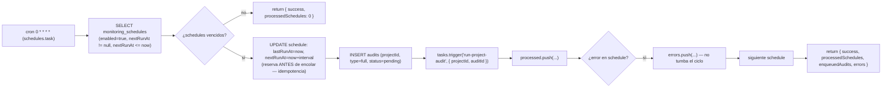
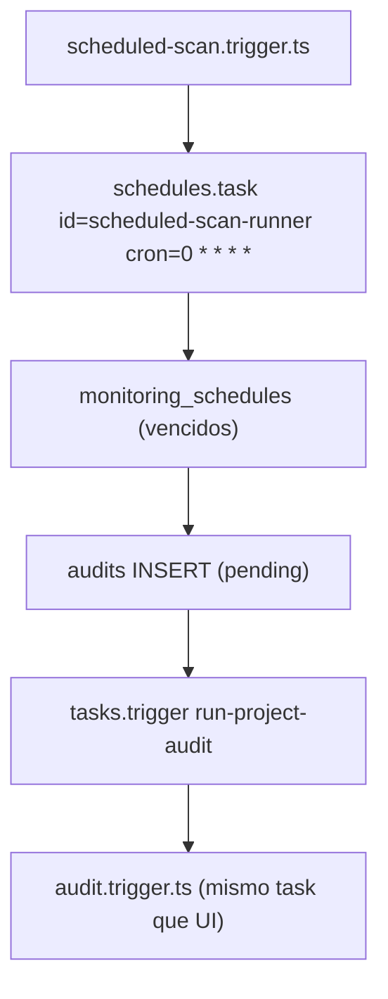
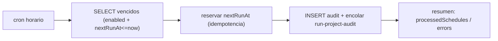

# Job Contract — Scheduled Scan Runner (`src/trigger/scheduled-scan.trigger.ts`)

{: .no_toc }

  
Tabla de contenidos

  {: .text-delta }
1. TOC
{:toc}

---

## 0. Estado del job (cierre de RSK-07)

**✅ Implementación real [VERIFIED — 2026-08-08]:** el archivo exporta `scheduledScanTask = schedules.task({ id: "scheduled-scan-runner", cron: "0 * * * *" })`, **registrado** en el runtime de Trigger.dev (patrón idéntico a `uptime.trigger.ts` y `audit.trigger.ts`). El `run` consulta `monitoring_schedules` habilitados y vencidos, crea un audit `pending` por schedule y encola `run-project-audit` vía `tasks.trigger` (mismo task que la auditoría manual de la UI). El cron `0 * * * *` queda activo en cuanto Trigger.dev se despliega.

**Side-effects en BD:** `monitoring_schedules` (UPDATE `lastRunAt`/`nextRunAt`/`updatedAt`) y `audits` (INSERT por schedule procesado) [VERIFIED].

**Veredicto de idempotencia:** **IDEMPOTENTE por diseño** — solo procesa schedules con `nextRunAt <= now`; reserva (adelanta) `nextRunAt` **antes** de crear el audit, de modo que un fallo de encolado no reprocesa el mismo schedule en el ciclo siguiente. [VERIFIED]

---

## 1. Purpose

Evaluar los `monitoring_schedules` habilitados cuyo `nextRunAt` venció y disparar una auditoría de inteligencia automática por proyecto (cada hora), encolando el mismo task `run-project-audit` que usa la auditoría manual. [VERIFIED del código]

## 2. Trigger

| Propiedad | Valor | Evidencia |
|-----------|-------|-----------|
| Task ID | `scheduled-scan-runner` | [VERIFIED] |
| Tipo | `schedules.task` (Trigger.dev, registrado) | [VERIFIED] |
| Cron | `0 * * * *` (cada hora) | [VERIFIED] |
| ¿Registrado en Trigger.dev? | **SÍ** — export de `schedules.task`; `trigger.config.ts` escanea `dirs: ["./src/trigger"]` | [VERIFIED] |
| Base temporal | `payload.timestamp` del ciclo (determinista y auditable) | [VERIFIED] |
| Retry | Gestión por schedule: un fallo individual no tumba el ciclo; se registra en `errors` y continúa | [VERIFIED] |

## 3. Steps (TRIGGER → JOB → SUCCESS)

**FLOW-210 — Comportamiento real** · Mermaid `flowchart`

**Intervalos (`INTERVAL_MS`):** `daily` = 24 h · `weekly` = 7 días · `monthly` = 30 días; valor desconocido → `weekly` por defecto. [VERIFIED]

## 4. Failure → Retry → Limit → Failed → Recovery

**MAT-210 — Gestión de fallos**

| Fase | Comportamiento | Evidencia |
|------|----------------|-----------|
| Failure | Fallo de encolado/insert en un schedule → catch por schedule, log `[ScheduledScan] Fallo schedule {id}` y push a `errors`; el ciclo continúa con los demás | [VERIFIED] |
| Retry | Trigger.dev aplica su política de retry del task (config estándar); el schedule ya reservado no se reprocesa (idempotencia) | [VERIFIED] |
| Limit | No aplica límite explícito; el procesamiento es por lote de schedules vencidos del ciclo | [VERIFIED] |
| Failed | Si el task completo falla, Trigger.dev lo reintenta según su política; la reserva de `nextRunAt` evita duplicados | [VERIFIED] |
| Recovery | El próximo ciclo procesa los schedules cuyo `nextRunAt` esté vencido — incluye los que hayan fallado | [VERIFIED] |

## 5. Idempotency checklist

| # | Chequeo | Resultado | Evidencia |
|---|---------|-----------|-----------|
| 1 | ¿Se ejecuta de forma real? | ✅ Sí — `schedules.task` registrado, cron horario | [VERIFIED] |
| 2 | ¿Idempotente? | ✅ Sí — reserva `nextRunAt` ANTES de crear el audit; un schedule solo se procesa si `nextRunAt <= now` | [VERIFIED] |
| 3 | ¿Sin side-effects duplicados? | ✅ Sí — el UPDATE de reserva ocurre en el mismo flujo que el INSERT del audit; fallo de encolado no reprocesa | [VERIFIED] |
| 4 | ¿Base temporal determinista? | ✅ Sí — `payload.timestamp` del ciclo (no `new Date()` del proceso) | [VERIFIED] |

## 6. Dependencies

| Dependencia | Uso | Evidencia |
|-------------|-----|-----------|
| `@trigger.dev/sdk` (`schedules`, `tasks`) | Definición del task y encolado de `run-project-audit` | [VERIFIED] |
| `@/shared/db` (`directDb`) | Acceso a BD sin sesión de usuario (ejecución de sistema) | [VERIFIED] |
| `@/shared/db/schemas` (`audits`, `monitoringSchedules`) | Tablas de schedules y auditorías | [VERIFIED] |
| `drizzle-orm` (`and`, `eq`, `isNotNull`, `lte`) | Query de schedules vencidos y UPDATE de reserva | [VERIFIED] |
| `./audit.trigger` (`runProjectAudit`) | Tipo del job encolado (import type) | [VERIFIED] |

## 7. Database

| Tabla | Operación | Evidencia |
|-------|-----------|-----------|
| `monitoring_schedules` | SELECT (vencidos) + UPDATE (`lastRunAt`, `nextRunAt`, `updatedAt`) | [VERIFIED] |
| `audits` | INSERT (`projectId`, `type: "full"`, `status: "pending"`, `startedAt`); sin `createdBy` (ejecución de sistema) | [VERIFIED] |

## 8. Events

- **Emite:** encola el job `run-project-audit` con `{ projectId, auditId }` por schedule procesado [VERIFIED].
- **Consume:** el cron de Trigger.dev `0 * * * *` (payload con `timestamp` del ciclo) [VERIFIED].

## 9. Security

- Sin superficie HTTP: solo ejecución por cron de Trigger.dev [VERIFIED].
- `directDb` usa credenciales server-side (nunca expuestas al navegador) [VERIFIED].
- No procesa input de usuario en este paso (los datos vienen de `monitoring_schedules` en BD) [VERIFIED].

## 10. Observability

- `console.log` de ciclo (`[ScheduledScan] Ciclo {ISO}`) y de schedules vencidos [VERIFIED].
- Retorno estructurado: `{ success, processedSchedules, enqueuedAudits: [{scheduleId, projectId, auditId}], errors: [{scheduleId, error}], timestamp }` [VERIFIED].
- Log de error por schedule fallido con el ID y el mensaje [VERIFIED].

## 11. Tests

- **`src/trigger/scheduled-scan.trigger.test.ts` — 5/5 PASS** [VERIFIED]: registro del task (id + cron), solo procesa habilitados y vencidos, crea audit + encola `run-project-audit`, reserva `nextRunAt` antes de encolar (idempotencia), error por schedule no tumba el ciclo.
- Gap restante: test de integración con Trigger.dev real (requiere runtime desplegado) [RECOMMENDED].

## 12. Failure Modes

- **Fallo de BD** (`directDb`): el task falla y Trigger.dev reintenta; la reserva de `nextRunAt` evita duplicados en reintentos [VERIFIED].
- **Fallo de encolado** (`tasks.trigger`): el schedule ya quedó reservado; el audit `pending` sin worker podría quedar huérfano → cubierto por el mecanismo de auditorías pendientes existente [RECOMMENDED — verificar retry de audits pendientes].
- **Intervalo desconocido:** cae a `weekly` por defecto (fail-safe, nunca 0) [VERIFIED].

---

## 13. Requisitos del contrato

| REQ | Requisito | Cumplimiento |
|-----|-----------|--------------|
| REQ-210 | Escaneo agendado real (cada hora) | ✅ `schedules.task` cron `0 * * * *` registrado |
| REQ-211 | Disparar auditorías de proyectos | ✅ INSERT audit `pending` + `tasks.trigger('run-project-audit')` |
| REQ-212 | Idempotencia | ✅ reserva de `nextRunAt` antes del encolado |

## 14. Arquitectura

**FIG-210 — Estado real** · Mermaid `flowchart`

## 15. Flujos

**FLOW-211 — Ciclo real** · Mermaid `flowchart`

## 16. Trazabilidad

**MAT-211 — Trazabilidad**

| ID | Tipo | Qué cubre |
|----|------|-----------|
| REQ-210..212 | Requisito | Contrato (estado real: ✅ cumplido) |
| FIG-210/211 | Diagrama | Arquitectura y flujo reales |
| RSK-07 | Riesgo | Trigger no operativo → **CERRADO** (RISK-REGISTER §5) |
| TSK-022 | Tarea | Implementación real + tests (plan MODE C) |
| DEP-210 | Deployment | Deploy vía Trigger.dev CLI desde CI/CD |

## 17. Inconsistencias y cross-check

| Hipótesis | Verificación | Resultado |
|-----------|--------------|-----------|
| "No existe cron de escaneo agendado" | Export `schedules.task` registrado con cron horario | **REFUTADA** — implementado (2026-08-08) |
| "El feature está documentado pero no existe" | README/roadmap vs código real | **RESUELTO** — feature operativa, contrato v2.0 |
| "La auditoría usa una ruta distinta a la UI" | Mismo task `run-project-audit` que `triggerAudit` | **CONFIRMADO** — canal único |

## 18. Unknowns y supuestos

- [UNKNOWN] Si Trigger.dev está desplegado en el entorno de producción (verde: Vercel cron es el mecanismo garantizado; Trigger.dev es opcional según deployment.md).
- [ASSUMPTION] El criterio de "proyecto con escaneo agendado" son los `monitoring_schedules` habilitados (fuente real de schedules; `projects` no tiene columna de schedule).
- [ASSUMPTION] El intervalo desconocido cae a `weekly` (fail-safe documentado).

## 19. Glosario

| Término | Definición |
|---------|------------|
| `schedules.task` | Task programado de Trigger.dev registrado por cron |
| `monitoring_schedules` | Tabla de schedules de monitoreo (`interval`, `nextRunAt`, `lastRunAt`, `enabled`) |
| Idempotencia por reserva | Adelantar `nextRunAt` antes del efecto, para que un fallo no reprocese |

## 20. Versionado y verificación

| Versión | Fecha | Cambios | Estado |
|---------|-------|---------|--------|
| 1.0 | 2026-08-02 | Creación inicial (T05-01, BATCH 05) — documentaba el STUB | Aprobado (stub documentado) |
| 2.0 | 2026-08-08 | Implementación real: `schedules.task` registrado + procesamiento de `monitoring_schedules` + encolado de `run-project-audit`; 5/5 tests; cierre de RSK-07 | Aprobado |

**Verificación:** `node scripts/quality-gate.mjs docs/jobs/JOB-CONTRACT-scheduled-scan.md --min 80` → PASS

---

## 21. APIs y endpoints

| Endpoint | Método | Relación |
|----------|--------|----------|
| Sin endpoint HTTP | — | Ejecución exclusiva por cron de Trigger.dev (`0 * * * *`); encola `run-project-audit` internamente [VERIFIED] |

Errores: manejados por schedule con registro en `errors` del retorno; el task no expone superficie HTTP [VERIFIED].

**Control de acceso:** N/A — sin endpoint HTTP; acceso a BD vía `directDb` server-side [VERIFIED].

**Testing:** 5/5 unit (mocks de `directDb` y `tasks.trigger`); integración con runtime Trigger.dev pendiente de entorno desplegado [RECOMMENDED].

**Despliegue:** deploy vía Trigger.dev CLI desde CI/CD (`.github/workflows/ci.yml`), igual que el resto de `src/trigger/**` [VERIFIED].

---

**Fuentes primarias:** `src/trigger/scheduled-scan.trigger.ts` · `src/trigger/scheduled-scan.trigger.test.ts` · `trigger.config.ts` · `docs/risk/RISK-REGISTER.md` (RSK-07) · `docs/superpowers/plans/2026-08-02-implementation-plan.md` (TSK-022)
