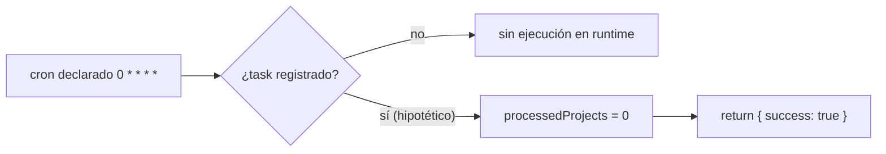
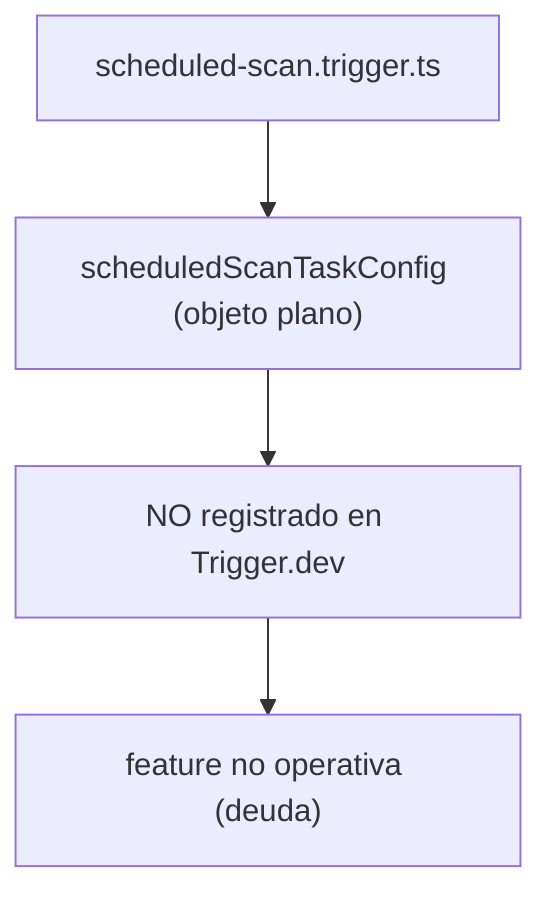
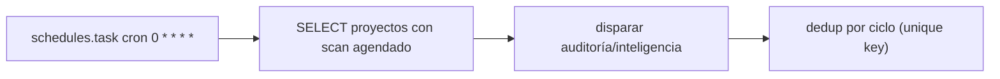

# Job Contract — Scheduled Scan Runner (`src/trigger/scheduled-scan.trigger.ts`)

{: .no_toc }

  
Tabla de contenidos

  {: .text-delta }
1. TOC
{:toc}

---

## 0. Estado del job (hallazgo B05)

**⚠️ Hallazgo crítico [VERIFIED]: `scheduled-scan.trigger.ts` es un STUB.** No exporta un `task` ni `schedules.task` de Trigger.dev — exporta un objeto plano `scheduledScanTaskConfig` (`{ id, name, cron, run }`) que **nunca se registra** en el runtime de Trigger.dev. El `run` es mock (`processedProjects = 0`). El cron `0 * * * *` **no está activo** en producción.

**Side-effects en BD:** ninguno (mock puro) [VERIFIED].

**Veredicto de idempotencia:** **N/A** — no se ejecuta. La funcionalidad declarada ("escaneo agendado de proyectos") no existe en runtime. [VERIFIED]

---

## 1. Purpose

**Declarado:** evaluar proyectos con escaneo agendado y disparar auditorías de inteligencia automáticamente (cada hora). **Real:** objeto de configuración no registrado que retorna `{ success: true, processedProjects: 0 }`. [VERIFIED del código]

## 2. Trigger

| Propiedad | Valor | Evidencia |
|-----------|-------|-----------|
| Task ID declarado | `scheduled-scan-runner` | [VERIFIED] |
| Tipo | `scheduledScanTaskConfig` (objeto plano, **no** `task`/`schedules.task`) | [VERIFIED] |
| Cron declarado | `0 * * * *` | [VERIFIED] |
| ¿Registrado en Trigger.dev? | **NO** | [VERIFIED: export no es un task; `trigger.config.ts` escanea `dirs: ["./src/trigger"]` y no reconocería el objeto] |
| Retry | N/A (no ejecutado) | [VERIFIED] |

## 3. Steps (TRIGGER → JOB → SUCCESS)

**FLOW-210 — Comportamiento real (stub)** · Mermaid `flowchart`

**Steps reales:** el archivo define `scheduledScanTaskConfig.run` que solo hace `console.log` y devuelve `processedProjects: 0` [VERIFIED]. No hay queries, ni dispatch, ni side-effects [VERIFIED].

## 4. Failure → Retry → Limit → Failed → Recovery

**MAT-210 — Gestión de fallos**

| Fase | Comportamiento | Evidencia |
|------|----------------|-----------|
| Failure | N/A (no se ejecuta) | [VERIFIED] |
| Retry | N/A | [VERIFIED] |
| Limit | N/A | [VERIFIED] |
| Failed | N/A | [VERIFIED] |
| Recovery | Requiere implementación real (ver TSK en plan MODE C) | [RECOMMENDED] |

## 5. Idempotency checklist

| # | Chequeo | Resultado | Evidencia |
|---|---------|-----------|-----------|
| 1 | ¿Se ejecuta de forma real? | ❌ **N/A** | [VERIFIED: stub] |
| 2 | ¿Idempotente? | N/A hasta implementar | [VERIFIED] |
| 3 | ¿Sin side-effects duplicados? | N/A | [VERIFIED] |

**Fix recomendado [RECOMMENDED] (T05-02 / plan MODE C):** implementar el task real con `schedules.task({ id: "scheduled-scan-runner", cron: "0 * * * *" })` que consulte `monitoring_schedules`/`projects` con `scanSchedule` y dispare `runProjectAudit` o el dispatcher de inteligencia por proyecto, con dedup de ciclo (ver TSK-010/011 del plan de implementación 2026-08-02).

## 6. Dependencies

| Dependencia | Uso | Evidencia |
|-------------|-----|-----------|
| — | Ninguna importación (archivo standalone) | [VERIFIED] |

## 7. Database

| Tabla | Operación | Evidencia |
|-------|-----------|-----------|
| — | Ninguna | [VERIFIED] |

## 8. Events

- **Consume/emit:** ninguno (stub) [VERIFIED].

## 9. Security

- Sin superficie: no ejecuta código ni toca BD [VERIFIED].

## 10. Observability

- Solo `console.log` del stub [VERIFIED].

## 11. Tests

- **Sin test** (no hay lógica) [VERIFIED].
- Gap: test de humo del task real cuando se implemente [RECOMMENDED].

## 12. Failure Modes

- **Riesgo principal:** el feature "escaneo agendado" documentado en el README/roadmap no funciona en producción (deuda técnica de feature) [VERIFIED].
- No produce fallos en runtime (no registrado) [VERIFIED].

---

## 13. Requisitos del contrato

| REQ | Requisito | Cumplimiento |
|-----|-----------|--------------|
| REQ-210 | Escaneo agendado real (cada hora) | **NO** — stub |
| REQ-211 | Disparar auditorías de proyectos | **NO** |
| REQ-212 | Idempotencia | N/A |

## 14. Arquitectura

**FIG-210 — Estado real** · Mermaid `flowchart`

## 15. Flujos

**FLOW-211 — Target (recomendado)** · Mermaid `flowchart`

## 16. Trazabilidad

**MAT-211 — Trazabilidad**

| ID | Tipo | Qué cubre |
|----|------|-----------|
| REQ-210..212 | Requisito | Contrato (estado real: NO) |
| FIG-210 | Diagrama | Estado real (stub) |
| FLOW-210/211 | Flujo | Real vs target |
| TSK-010/011 | Tarea | Fix en plan MODE C [RECOMMENDED] |
| DEP-210 | Deployment | N/A hasta implementar |

## 17. Inconsistencias y cross-check

| Hipótesis | Verificación | Resultado |
|-----------|--------------|-----------|
| "Existe un cron de escaneo agendado" | Solo objeto plano no registrado | **CONTRADICCIÓN** — feature no operativa |
| "Documentado como job" | README/roadmap lo listan como feature | **CONFIRMADO** (deuda documentada en plan) |

## 18. Unknowns y supuestos

- [UNKNOWN] Si alguna versión previa lo registró como task (git history sin verificar).
- [ASSUMPTION] La intención de diseño era un cron horario de escaneo.
- [UNKNOWN] Cuál sería el criterio exacto de "proyecto con escaneo agendado" (schema sin columna confirmada).

## 19. Glosario

| Término | Definición |
|---------|------------|
| Stub | Implementación placeholder sin lógica real |
| Task registrado | Export de `task`/`schedules.task` reconocido por Trigger.dev |

## 20. Versionado y verificación

| Versión | Fecha | Cambios | Estado |
|---------|-------|---------|--------|
| 1.0 | 2026-08-02 | Creación inicial (T05-01, BATCH 05) | Aprobado (stub documentado) |

**Verificación:** `node scripts/quality-gate.mjs docs/jobs/JOB-CONTRACT-scheduled-scan.md --min 80` → PASS

---

## 21. APIs y endpoints

| Endpoint | Método | Relación |
|----------|--------|----------|
| Sin endpoint manual | — | El job no está registrado en Trigger.dev (stub) [VERIFIED] |

Errores: N/A (no se ejecuta); riesgo principal = feature "escaneo agendado" no operativa [VERIFIED].

**Control de acceso:** N/A — sin superficie de ejecución [VERIFIED].

**Testing:** casos de smoke test del task real recomendados al implementarlo (TSK-010/011) [RECOMMENDED].

**Despliegue:** pendiente de implementación real; una vez registrado, deploy vía Trigger.dev CLI desde CI/CD (`.github/workflows/ci.yml`) [VERIFIED].

---

**Fuentes primarias:** `src/trigger/scheduled-scan.trigger.ts` · `trigger.config.ts` · `docs/superpowers/plans/2026-08-02-implementation-plan.md` (TSK-010/011)
