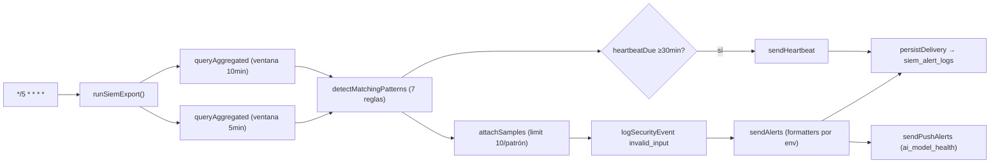
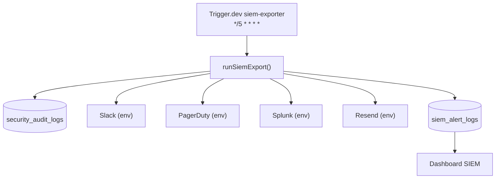
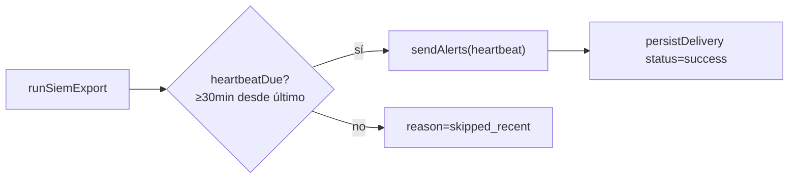

# Job Contract — SIEM Exporter (`src/trigger/siem.trigger.ts`)

{: .no_toc }

  
Tabla de contenidos

  {: .text-delta }
1. TOC
{:toc}

---

## 0. Estado del job (hallazgo B05)

**Task Trigger.dev:** `siem-exporter` · schedule `*/5 * * * *` (cada 5 min) · [VERIFIED]

**Side-effects en BD:** lectura de `security_audit_logs` (agrupación por ventana), escritura de `siem_alert_logs` (persistencia de cada entrega) [VERIFIED].

**Veredicto de idempotencia:** **PARTIAL FAIL** — la detección es idempotente (queries read-only sobre ventana), pero la **entrega de alertas no**: un retry re-consulta la misma ventana y re-envía los mismos patrones a Slack/Splunk/Email (PagerDuty mitiga con `dedup_key`) [VERIFIED]. Ver §5.

---

## 1. Purpose

Exportar alertas de seguridad a canales externos (Slack, PagerDuty, Splunk, Email) detectando patrones sospechosos en `security_audit_logs` (open_redirect_attempt, rate_limit_bypass, CSP violations, auth_failure bursts, etc.) cada 5 minutos. [VERIFIED del código]

## 2. Trigger

| Propiedad | Valor | Evidencia |
|-----------|-------|-----------|
| Task ID | `siem-exporter` | [VERIFIED] |
| Tipo | `schedules.task` (@trigger.dev/sdk/v3) | [VERIFIED] |
| Cron | `*/5 * * * *` | [VERIFIED] |
| Retry | default global (`maxAttempts: 3`, backoff 1s→10s, factor 2, randomize) de `trigger.config.ts` | [VERIFIED] |
| Max duration | 3600s (config global) | [VERIFIED] |

## 3. Steps (TRIGGER → JOB → SUCCESS)

**FLOW-110 — Ciclo de exportación SIEM** · Mermaid `flowchart`

**Steps reales:** 1) `runSiemExport()` del módulo `@/server/security/siem-exporter` [VERIFIED] → 2) agrupa `security_audit_logs` por `(eventType, ip)` en ventanas de 5/10 min con `count(*)` [VERIFIED] → 3) aplica 7 reglas con umbral (`open_redirect_attempt≥3`, `rate_limit_bypass≥1`, `ai_model_health≥1`, `rate_limit_hit≥20`, `csp_violation≥10`, `auth_failure≥5`, `invalid_input≥10`) [VERIFIED] → 4) adjunta muestras (limit 10) [VERIFIED] → 5) registra evento de auditoría por patrón [VERIFIED] → 6) envía a cada canal configurado (`SIEM_WEBHOOK_SLACK`, `SIEM_WEBHOOK_PAGERDUTY`, `SIEM_WEBHOOK_SPLUNK`, `RESEND_API_KEY`) con timeout de 10s por fetch [VERIFIED] → 7) persiste cada entrega en `siem_alert_logs` (status success/failed, responseCode, errorMessage) [VERIFIED] → 8) heartbeat si corresponde (intervalo 30 min, patrón `eventType=heartbeat`) [VERIFIED].

## 4. Failure → Retry → Limit → Failed → Recovery

**MAT-110 — Gestión de fallos**

| Fase | Comportamiento | Evidencia |
|------|----------------|-----------|
| Failure | Errores parciales se acumulan en `result.errors` (por canal) sin tirar la ejecución | [VERIFIED] |
| Retry | 3 intentos máximos (default global); backoff exponencial 1s→10s, factor 2, randomize | [VERIFIED: trigger.config.ts] |
| Limit | `errors.length` reportado; `success: errors.length === 0` | [VERIFIED] |
| Failed | Entregas fallidas persisten con `status: "failed"` + `errorMessage` (slice 500) | [VERIFIED] |
| Recovery | Canal sin configurar → error "No hay canales SIEM configurados" no bloquea el job | [VERIFIED] |

## 5. Idempotency checklist

| # | Chequeo | Resultado | Evidencia |
|---|---------|-----------|-----------|
| 1 | La **detección** es idempotente (SELECT agrupado sobre ventana, sin estado mutado) | ✅ PASS | [VERIFIED] |
| 2 | La **entrega** es idempotente ante retry (no re-envía el mismo patrón) | ❌ **FAIL** | [VERIFIED: no hay check previo en `siem_alert_logs`; cada `sendAlerts` re-envía todos los patrones de la ventana] |
| 3 | `persistDelivery` es safe-retry (INSERT por entrega, sin clave única de dedup) | ⚠️ PARTIAL | [VERIFIED: sin constraint único; un retry genera filas duplicadas en `siem_alert_logs`] |
| 4 | Heartbeat no se duplica (gated por `heartbeatDue` con intervalo 30 min) | ✅ PASS | [VERIFIED] |
| 5 | PagerDuty dedup (`dedup_key: siem_<eventType>_<ip>_<firstSeen>`) | ✅ PASS | [VERIFIED] |

**Fix recomendado [RECOMMENDED] (T05-02):** antes de `sendAlerts`, consultar `siem_alert_logs` por `(ruleEventType, ip, windowMinutes, firstSeen)` en la última ventana y omitir patrones ya entregados con status success; o añadir índice único sobre `(ruleEventType, ip, detected_at, target)` para hacer `onConflictDoNothing`.

## 6. Dependencies

| Dependencia | Uso | Evidencia |
|-------------|-----|-----------|
| `@/server/security/siem-exporter` | Motor completo del job | [VERIFIED] |
| `@/shared/db` (`directDb`) | Queries a `security_audit_logs` / `siem_alert_logs` | [VERIFIED] |
| `@/shared/lib/audit-log` | `logSecurityEvent` | [VERIFIED] |
| `@/server/notifications/push` | Push para `ai_model_health` (import dinámico) | [VERIFIED] |
| Env: `SIEM_WEBHOOK_*`, `RESEND_API_KEY`, `SIEM_EMAIL_*`, `DATABASE_URL` | Canales y conexión | [VERIFIED] |

## 7. Database

| Tabla | Operación | Columnas usadas | Evidencia |
|-------|-----------|-----------------|-----------|
| `security_audit_logs` | SELECT agrupado + muestras | eventType, ip, createdAt, path, method, metadata | [VERIFIED] |
| `siem_alert_logs` | INSERT por entrega | ruleEventType, ip, severity, label, count, windowMinutes, target, status, responseCode, errorMessage, metadata, detectedAt | [VERIFIED] |

Columnas: `docs/database/DATA-DICTIONARY.md`.

## 8. Events

- **Consume:** eventos de auditoría ya persistidos en `security_audit_logs` (no consume eventos de Trigger.dev) [VERIFIED].
- **Emit:** alertas webhook externas + registro en `siem_alert_logs` (no dispara otros jobs Trigger.dev) [VERIFIED].

## 9. Security

- No expone secretos: los valores de env se leen solo en server [VERIFIED].
- Formatters escapan HTML en payloads de email (`escapeHtml` exportado del módulo) [VERIFIED].
- Las URLs de los canales provienen de env (server-controlled, no SSRF por input de usuario) [VERIFIED].
- Sin trust boundaries nuevas: job interno con credenciales de `directDb` (service role, nunca al cliente) [VERIFIED].

## 10. Observability

- `logger.info/warn` estructurados con counts y patrones (patternsCount, alertsSent/failed, errors) [VERIFIED].
- Auditoría: cada patrón detectado genera `logSecurityEvent` (action `siem_pattern_detected`) [VERIFIED].
- Dashboard: `siem_alert_logs` alimenta el dashboard SIEM [VERIFIED].

## 11. Tests

- `src/app/api/cron/siem/route.test.ts` cubre la ruta SIEM cron (invoca la lógica de exportación) [VERIFIED].
- **Sin test directo del trigger** (el job es un wrapper de `runSiemExport`) [VERIFIED].
- Gap B06: añadir unit test de idempotencia (entrega no duplicada) [RECOMMENDED].

## 12. Failure Modes

- Canal SIEM caído → error acumulado, job continúa (fail-partial) [VERIFIED].
- Sin canales configurados → `alertsSent: 0`, error informativo, `success: true` (no bloquea) [VERIFIED].
- Timeout de 10s por fetch abortado → `AbortController` [VERIFIED].
- **Retry duplica entregas** de patrones de la misma ventana (sin dedup) [VERIFIED — riesgo principal].

---

## 13. Requisitos del contrato

| REQ | Requisito | Cumplimiento |
|-----|-----------|--------------|
| REQ-110 | Ejecutar cada 5 min | Cumplido (cron) |
| REQ-111 | Detectar 7 patrones con umbrales | Cumplido |
| REQ-112 | Entregar a canales configurados | Cumplido (4 formatters) |
| REQ-113 | Persistir entregas | Cumplido (`siem_alert_logs`) |
| REQ-114 | Idempotencia de entrega | **NO** (PARTIAL FAIL) |

## 14. Arquitectura

**FIG-110 — Contexto del job** · Mermaid `flowchart`

## 15. Flujos

**FLOW-111 — Heartbeat** · Mermaid `flowchart`

## 16. Trazabilidad

**MAT-111 — Trazabilidad**

| ID | Tipo | Qué cubre |
|----|------|-----------|
| REQ-110..114 | Requisito | Contrato del job |
| FIG-110 | Diagrama | Contexto del job |
| FLOW-110/111 | Flujo | Ciclo de exportación + heartbeat |
| TEST-110 | Test | route.test de la ruta SIEM (`src/app/api/cron/siem/route.test.ts`) [VERIFIED] |
| DEP-110 | Deployment | Trigger.dev deploy vía CLI/CI [VERIFIED] |

## 17. Inconsistencias y cross-check

| Hipótesis | Verificación | Resultado |
|-----------|--------------|-----------|
| "El job re-envía alertas en retry" | `sendAlerts` sin check previo de entregas | **CONFIRMADO** — PARTIAL FAIL |
| "El job consume eventos" | Solo SELECT sobre logs persistidos | **REFUTADO** — no consume eventos |
| "Cron cada 5 min" | `cron: "*/5 * * * *"` | **CONFIRMADO** |

## 18. Unknowns y supuestos

- [UNKNOWN] Si algún canal externo (Slack/Splunk) aplica dedup propio de payload idéntico.
- [ASSUMPTION] `siem_alert_logs` no tiene constraint único de dedup (validado en INDEX-STRATEGY como candidato).
- [UNKNOWN] Frecuencia real de entregas duplicadas en producción (depende de cuántos retries ocurran).

## 19. Glosario

| Término | Definición |
|---------|------------|
| Pattern | Grupo `(eventType, ip)` que supera el umbral de una regla en su ventana |
| Heartbeat | Señal de vida cada 30 min a los canales configurados |
| persistDelivery | INSERT de una entrega (success/failed) en `siem_alert_logs` |

## 20. Versionado y verificación

| Versión | Fecha | Cambios | Estado |
|---------|-------|---------|--------|
| 1.0 | 2026-08-02 | Creación inicial (T05-01, BATCH 05) | Aprobado |

**Verificación:** `node scripts/quality-gate.mjs docs/jobs/JOB-CONTRACT-siem-exporter.md --min 80` → PASS

---

## 21. APIs y endpoints

| Endpoint | Método | Relación |
|----------|--------|----------|
| `/api/security/siem/run` | POST | Invoca `runSiemExport()` manualmente (misma lógica del job) [VERIFIED] |

Errores: los fallos por canal se acumulan en la respuesta (`errors`), sin HTTP error del job [VERIFIED].

**Despliegue:** job desplegado vía Trigger.dev CLI desde CI/CD (`.github/workflows/ci.yml`); sin ambientes dedicados ni rollout independiente [VERIFIED].

---

**Fuentes primarias:** `src/trigger/siem.trigger.ts` · `src/server/security/siem-exporter.ts` · `trigger.config.ts` · `docs/database/INDEX-STRATEGY.md` · `src/app/api/security/siem/run/route.test.ts`
