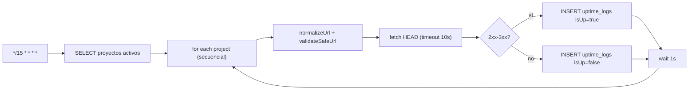
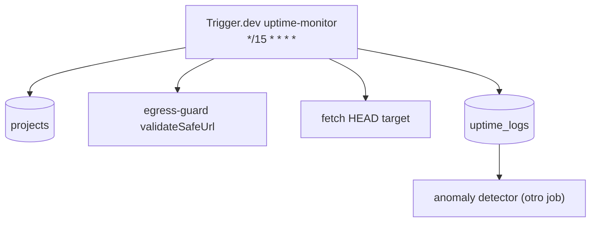
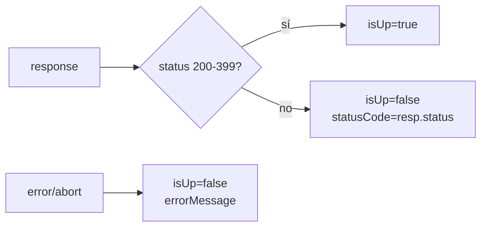

# Job Contract — Uptime Monitor (`src/trigger/uptime.trigger.ts`)

{: .no_toc }

  
Tabla de contenidos

  {: .text-delta }
1. TOC
{:toc}

---

## 0. Estado del job (hallazgo B05)

**Task Trigger.dev:** `uptime-monitor` · schedule `*/15 * * * *` (cada 15 min) · [VERIFIED]

**Side-effects en BD:** INSERT en `uptime_logs` (una fila por proyecto por ciclo) [VERIFIED].

**Veredicto de idempotencia:** **FAIL para retry** — cada ciclo INSERTa una fila nueva de uptime por proyecto; si Trigger.dev reintenta el mismo run tras un fallo parcial, se INSERTan filas duplicadas para el mismo minuto. No hay clave de dedup ni `onConflictDoNothing`. [VERIFIED] Ver §5.

---

## 1. Purpose

Monitorear disponibilidad de todos los proyectos activos cada 15 minutos: HEAD request con timeout de 10s, validación de URL vía egress-guard, y persistencia del resultado en `uptime_logs`. [VERIFIED del código]

## 2. Trigger

| Propiedad | Valor | Evidencia |
|-----------|-------|-----------|
| Task ID | `uptime-monitor` | [VERIFIED] |
| Tipo | `schedules.task` (@trigger.dev/sdk) | [VERIFIED] |
| Cron | `*/15 * * * *` | [VERIFIED] |
| Retry | default global (`maxAttempts: 3`) de `trigger.config.ts` | [VERIFIED] |
| Timeout por request | 10s (`AbortSignal.timeout(10000)`) | [VERIFIED] |

## 3. Steps (TRIGGER → JOB → SUCCESS)

**FLOW-130 — Ciclo de monitoreo de uptime** · Mermaid `flowchart`

**Steps reales:** 1) SELECT proyectos activos [VERIFIED] → 2) por proyecto: `normalizeUrl(domain)` + `validateSafeUrl` (egress-guard) [VERIFIED] → 3) `fetch HEAD` con User-Agent propio y `AbortSignal.timeout(10000)` [VERIFIED] → 4) `isUp = status 200–399` [VERIFIED] → 5) INSERT en `uptime_logs` (projectId, isUp, statusCode, responseTimeMs, errorMessage) [VERIFIED] → 6) `wait.for({seconds: 1})` entre proyectos para no saturar el plan Hobby [VERIFIED].

## 4. Failure → Retry → Limit → Failed → Recovery

**MAT-130 — Gestión de fallos**

| Fase | Comportamiento | Evidencia |
|------|----------------|-----------|
| Failure | Error de red por proyecto → `isUp: false`, errorMessage capturado, el ciclo continúa | [VERIFIED] |
| Retry | 3 intentos máximos (default global); un retry re-ejecuta el ciclo completo | [VERIFIED] |
| Limit | Retorno `{ processed, timestamp }` sin conteo de fallos | [VERIFIED] |
| Failed | Error del SELECT inicial → job falla sin procesar | [VERIFIED] |
| Recovery | Próximo ciclo (15 min) restaura muestras | [VERIFIED] |

## 5. Idempotency checklist

| # | Chequeo | Resultado | Evidencia |
|---|---------|-----------|-----------|
| 1 | INSERT de muestras es deduplicable (misma ventana) | ❌ **FAIL** | [VERIFIED: INSERT plano sin onConflict; retry duplica filas por proyecto/minuto] |
| 2 | `validateSafeUrl` idempotente | ✅ PASS | [VERIFIED] |
| 3 | Retry tras fallo parcial no duplica | ❌ **FAIL** | [VERIFIED: el catch inserta la fila; si el run se reintenta, se re-inserta] |
| 4 | Timeout acotado evita hangs | ✅ PASS | [VERIFIED: 10s] |
| 5 | Consumo de recursos acotado (wait 1s, HEAD) | ✅ PASS | [VERIFIED] |

**Fix recomendado [RECOMMENDED] (T05-02):** añadir `onConflictDoNothing` en el INSERT (con índice único sobre `(project_id, date_trunc('minute', checked_at))`) o registrar `runId` del run Trigger.dev en una columna para dedup por ejecución.

## 6. Dependencies

| Dependencia | Uso | Evidencia |
|-------------|-----|-----------|
| `@/shared/db` + `projects`, `uptimeLogs` | Queries | [VERIFIED] |
| `@/server/intelligence/security/egress-guard` | `validateSafeUrl`, `normalizeUrl` | [VERIFIED] |
| `@trigger.dev/sdk` `wait` | Pausa entre proyectos | [VERIFIED] |
| Env: `DATABASE_URL` | Conexión | [VERIFIED] |

## 7. Database

| Tabla | Operación | Columnas usadas | Evidencia |
|-------|-----------|-----------------|-----------|
| `projects` | SELECT | id, domain, deletedAt | [VERIFIED] |
| `uptime_logs` | INSERT | projectId, isUp, statusCode, responseTimeMs, errorMessage | [VERIFIED] |

## 8. Events

- **Consume:** nada (cron puro) [VERIFIED].
- **Emit:** `uptime_logs` alimenta el detector de anomalías (`anomaly.trigger`) y el dashboard [VERIFIED].

## 9. Security

- `validateSafeUrl` previene SSRF a IPs privadas/loopback [VERIFIED].
- User-Agent identificable `StrategicAudit-UptimeBot/1.0` [VERIFIED].
- Sin secretos en el job [VERIFIED].

## 10. Observability

- `console.log` por ciclo y por fallo [VERIFIED].
- Muestras de uptime visibles en dashboard (feed `uptime_logs`) [VERIFIED].

## 11. Tests

- **Sin test directo del trigger** [VERIFIED].
- `network.test.ts`/egress-guard tests cubren `validateSafeUrl` [VERIFIED].
- Gap B06: unit test de inserción (mock db) verificando dedup y `isUp` mapping [RECOMMENDED].

## 12. Failure Modes

- Dominio sin DNS → `validateSafeUrl` falla o fetch falla → `isUp: false` con errorMessage [VERIFIED].
- Sitio lento (>10s) → timeout aborta → `isUp: false` [VERIFIED].
- BD caída en INSERT → catch del fetch no cubre; error propaga al run → retry → **duplica si reintenta el mismo proyecto** [VERIFIED].

---

## 13. Requisitos del contrato

| REQ | Requisito | Cumplimiento |
|-----|-----------|--------------|
| REQ-130 | Ejecutar cada 15 min | Cumplido (cron) |
| REQ-131 | Monitorear todos los proyectos activos | Cumplido |
| REQ-132 | Persistir muestras en uptime_logs | Cumplido |
| REQ-133 | Idempotencia de muestras | **NO** (FAIL) |

## 14. Arquitectura

**FIG-130 — Contexto del job** · Mermaid `flowchart`

## 15. Flujos

**FLOW-131 — Clasificación isUp** · Mermaid `flowchart`

## 16. Trazabilidad

**MAT-131 — Trazabilidad**

| ID | Tipo | Qué cubre |
|----|------|-----------|
| REQ-130..133 | Requisito | Contrato del job |
| FIG-130 | Diagrama | Contexto del job |
| FLOW-130/131 | Flujo | Ciclo + clasificación |
| TEST-130 | Test | egress-guard tests (parcial) |
| DEP-130 | Deployment | Trigger.dev CLI/CI |

## 17. Inconsistencias y cross-check

| Hipótesis | Verificación | Resultado |
|-----------|--------------|-----------|
| "Muestras deduplicadas" | INSERT plano, sin índice único | **CONTRADICCIÓN** — puede duplicar en retry |
| "Timeout de 10s" | `AbortSignal.timeout(10000)` | **CONFIRMADO** |
| "Procesamiento secuencial" | `for..of` + `wait 1s` | **CONFIRMADO** |

## 18. Unknowns y supuestos

- [UNKNOWN] Si existe índice único sobre `(project_id, checked_at)` en producción (ver INDEX-STRATEGY).
- [ASSUMPTION] Las filas duplicadas de uptime no distorsionan el detector (la media móvil tolera duplicados).
- [UNKNOWN] Cantidad real de proyectos (afecta duración del ciclo).

## 19. Glosario

| Término | Definición |
|---------|------------|
| isUp | Disponibilidad según status HTTP 200–399 |
| HEAD request | Petición HTTP sin cuerpo (ligera) |
| wait.for | Helper de Trigger.dev para pausar |

## 20. Versionado y verificación

| Versión | Fecha | Cambios | Estado |
|---------|-------|---------|--------|
| 1.0 | 2026-08-02 | Creación inicial (T05-01, BATCH 05) | Aprobado |

**Verificación:** `node scripts/quality-gate.mjs docs/jobs/JOB-CONTRACT-uptime.md --min 80` → PASS

---

## 21. APIs y endpoints

| Endpoint | Método | Relación |
|----------|--------|----------|
| Sin endpoint manual | — | El job se ejecuta solo por cron interno de Trigger.dev (no expone HTTP propio) [VERIFIED] |

Errores: los fallos por proyecto se reflejan como `isUp: false` + errorMessage en la fila, sin HTTP error del job [VERIFIED].

**Control de acceso:** credenciales de servicio (service-side), nunca al cliente [VERIFIED].

**Despliegue:** job desplegado vía Trigger.dev CLI desde CI/CD (`.github/workflows/ci.yml`); sin ambientes dedicados ni rollout independiente [VERIFIED].

---

**Fuentes primarias:** `src/trigger/uptime.trigger.ts` · `src/server/intelligence/security/egress-guard.ts` · `trigger.config.ts` · `docs/database/INDEX-STRATEGY.md`
