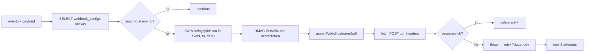
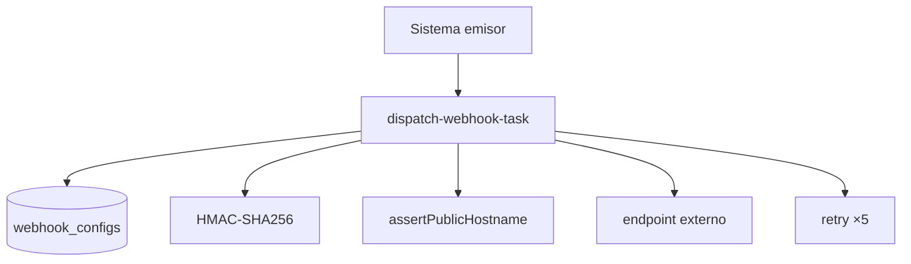
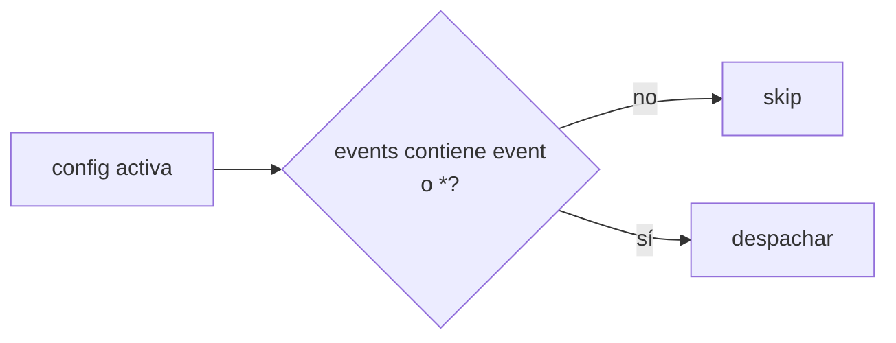

# Job Contract — Dispatch Webhook Task (`src/trigger/webhook.trigger.ts`)

{: .no_toc }

  
Tabla de contenidos

  {: .text-delta }
1. TOC
{:toc}

---

## 0. Estado del job (hallazgo B05)

**Task Trigger.dev:** `dispatch-webhook-task` · **on-demand** (`task`, no schedule) · retry explícito `maxAttempts: 5` [VERIFIED]

**Side-effects en BD:** SELECT `webhook_configs` (activas por proyecto); **ninguna escritura** — el job solo hace POST externos [VERIFIED].

**Veredicto de idempotencia:** **PARTIAL** — el payload firmado incluye `ctx.run.id` como `id` (permite al receptor deduplicar por run), y los retries de Trigger.dev reusan el mismo run id. Matiz: si el job falla a mitad (tras enviar a config A pero fallar en B), el retry **re-envía a A** (no hay tracking por config de entregas ya exitosas dentro del run) [VERIFIED]. Ver §5.

---

## 1. Purpose

Despachar webhooks a los endpoints configurados de un proyecto cuando ocurre un evento, con firma HMAC-SHA256 (`X-StrategicAudit-Signature`), validación anti-SSRF de la URL destino, y reintentos automáticos (máx. 5). [VERIFIED del código]

## 2. Trigger

| Propiedad | Valor | Evidencia |
|-----------|-------|-----------|
| Task ID | `dispatch-webhook-task` | [VERIFIED] |
| Tipo | `task` (@trigger.dev/sdk/v3) — on-demand | [VERIFIED] |
| Retry | **Explícito**: `maxAttempts: 5` (backoff automático de Trigger.dev) | [VERIFIED] |
| Input | `WebhookPayload { projectId, event, data }` | [VERIFIED] |
| Timeout | No explícito en task (config global 3600s) | [VERIFIED] |

## 3. Steps (TRIGGER → JOB → SUCCESS)

**FLOW-170 — Despacho de webhook** · Mermaid `flowchart`

**Steps reales:** 1) SELECT configs activas del proyecto [VERIFIED] → 2) filtrar por suscripción al evento (o `*`) [VERIFIED] → 3) body con `id: ctx.run.id` (idempotencia del receptor) [VERIFIED] → 4) firma `sha256=HMAC(secretToken, body)` [VERIFIED] → 5) `assertPublicHostname` (SSRF guard) [VERIFIED] → 6) POST con headers (`Content-Type`, User-Agent, Signature, Event) [VERIFIED] → 7) si `!response.ok` → `throw` para que Trigger.dev reintente el run [VERIFIED].

## 4. Failure → Retry → Limit → Failed → Recovery

**MAT-170 — Gestión de fallos**

| Fase | Comportamiento | Evidencia |
|------|----------------|-----------|
| Failure | Error de POST → `logger.error` + `throw err` (activa retry) | [VERIFIED] |
| Retry | **5 intentos** con backoff automático de Trigger.dev | [VERIFIED: retry: { maxAttempts: 5 }] |
| Limit | No hay dead-letter explícito; tras 5 intentos el run queda failed | [VERIFIED] |
| Failed | Run failed en el dashboard de Trigger.dev; sin persistencia de fallo | [VERIFIED: ninguna escritura en BD] |
| Recovery | Re-despacho manual o nuevo evento | [VERIFIED] |

## 5. Idempotency checklist

| # | Chequeo | Resultado | Evidencia |
|---|---------|-----------|-----------|
| 1 | Payload con `id: run.id` deduplicable por el receptor | ✅ PASS | [VERIFIED] |
| 2 | Retry reusa el mismo run id (mismo body/firma) | ✅ PASS | [VERIFIED: ctx.run.id estable entre attempts] |
| 3 | Sin tracking por config de entregas ya exitosas en el mismo run | ❌ **FAIL parcial** | [VERIFIED: si A OK y B falla, el retry re-envía A] |
| 4 | Sin webhooks activos → retorno `{ delivered: 0 }` sin error | ✅ PASS | [VERIFIED] |
| 5 | Firma idempotente (mismo body → misma firma) | ✅ PASS | [VERIFIED] |

**Fix recomendado [RECOMMENDED] (T05-02):** persistir entregas por `(run_id, config_id)` en una tabla de delivery log con `onConflictDoNothing`, y en el retry saltar configs ya registradas para ese run.

## 6. Dependencies

| Dependencia | Uso | Evidencia |
|-------------|-----|-----------|
| `@/shared/db/schemas` | `webhookConfigs` | [VERIFIED] |
| `node:crypto` | HMAC-SHA256 | [VERIFIED] |
| `@/server/intelligence/security/egress-guard` | `assertPublicHostname` | [VERIFIED] |
| Env: `DATABASE_URL` | Conexión | [VERIFIED] |

## 7. Database

| Tabla | Operación | Evidencia |
|-------|-----------|-----------|
| `webhook_configs` | SELECT (activas, filtro evento) | [VERIFIED] |
| — | Sin escrituras | [VERIFIED] |

## 8. Events

- **Consume:** payload invocado desde routes/webhooks del sistema (on-demand) [VERIFIED].
- **Emit:** POST HTTP firmado a endpoints externos [VERIFIED].

## 9. Security

- Firma HMAC-SHA256 con `secretToken` del webhook (integridad) [VERIFIED].
- `assertPublicHostname` previene SSRF a IPs privadas/loopback [VERIFIED].
- `secretToken` nunca expuesto al cliente (VULN-002 remediado en P0: GET enmascarado) [VERIFIED: SECURITY-AUDIT v2.2].
- Sin credenciales en el body/logs [VERIFIED].

## 10. Observability

- `logger.info/error` por envío y fallo [VERIFIED].
- Retorno `{ delivered }` [VERIFIED].

## 11. Tests

- `src/app/api/webhooks/route.test.ts` cubre la API de configuración (no el dispatch) [VERIFIED].
- **Sin test del dispatch task** [VERIFIED].
- Gap B06: test de firma (mismo body → misma firma) y de skip de configs ya entregadas [RECOMMENDED].

## 12. Failure Modes

- Endpoint del cliente caído → 5 retries → failed [VERIFIED].
- URL inválida/SSRF → `assertPublicHostname` lanza → retry → failed [VERIFIED].
- Firma con secret incorrecto del lado receptor → 401 del receptor (no es fallo del job) [VERIFIED].
- **Entrega duplicada a configs ya OK tras fallo parcial** (FAIL parcial) [VERIFIED].

---

## 13. Requisitos del contrato

| REQ | Requisito | Cumplimiento |
|-----|-----------|--------------|
| REQ-170 | Despachar webhooks por evento | Cumplido |
| REQ-171 | Firmar con HMAC-SHA256 | Cumplido |
| REQ-172 | Validar URL pública (SSRF) | Cumplido |
| REQ-173 | Reintentar hasta 5 veces | Cumplido |
| REQ-174 | Idempotencia de entrega en retry parcial | **NO** (FAIL parcial) |

## 14. Arquitectura

**FIG-170 — Contexto del job** · Mermaid `flowchart`

## 15. Flujos

**FLOW-171 — Filtro de suscripción** · Mermaid `flowchart`

## 16. Trazabilidad

**MAT-171 — Trazabilidad**

| ID | Tipo | Qué cubre |
|----|------|-----------|
| REQ-170..174 | Requisito | Contrato del job |
| FIG-170 | Diagrama | Contexto del job |
| FLOW-170/171 | Flujo | Despacho + suscripción |
| TEST-170 | Test | webhooks route.test (API, no dispatch) |
| DEP-170 | Deployment | Trigger.dev CLI/CI |

## 17. Inconsistencias y cross-check

| Hipótesis | Verificación | Resultado |
|-----------|--------------|-----------|
| "Los retries evitan entregas duplicadas" | No hay tracking por config; solo run id | **CONTRADICCIÓN** — re-envía configs ya OK |
| "Retry explícito 5" | `retry: { maxAttempts: 5 }` | **CONFIRMADO** |
| "Firma por payload" | HMAC sobre body con run id | **CONFIRMADO** |

## 18. Unknowns y supuestos

- [UNKNOWN] Si los receptores implementan dedup por `id: run.id`.
- [ASSUMPTION] La firma sobre `JSON.stringify` es estable entre retries (mismo body).
- [UNKNOWN] Volumen real de eventos despachados.

## 19. Glosario

| Término | Definición |
|---------|------------|
| Webhook config | Fila de `webhook_configs` (url, eventos, secret) |
| run.id | Identificador del run Trigger.dev (estable entre attempts) |
| assertPublicHostname | Guard anti-SSRF del egress-guard |

## 20. Versionado y verificación

| Versión | Fecha | Cambios | Estado |
|---------|-------|---------|--------|
| 1.0 | 2026-08-02 | Creación inicial (T05-01, BATCH 05) | Aprobado |

**Verificación:** `node scripts/quality-gate.mjs docs/jobs/JOB-CONTRACT-webhook.md --min 80` → PASS

---

## 21. APIs y endpoints

| Endpoint | Método | Relación |
|----------|--------|----------|
| `/api/webhooks` | GET/POST/PATCH | Configuración de webhooks (fuente de datos del job) [VERIFIED] |
| `/api/webhooks` (dispatch) | — | El despacho se invoca internamente con payload `{ projectId, event, data }` [VERIFIED] |

Errores: endpoint del receptor no-OK → `throw` (retry ×5); URL inválida → `assertPublicHostname` falla [VERIFIED].

**Control de acceso:** firma HMAC-SHA256 con secretToken (integridad); sin tokens en logs [VERIFIED].

**Testing:** casos de prueba de firma y de skip de configs ya entregadas recomendados en B06 [RECOMMENDED].

**Despliegue:** job desplegado vía Trigger.dev CLI desde CI/CD (`.github/workflows/ci.yml`); sin ambientes dedicados ni rollout independiente [VERIFIED].

---

**Fuentes primarias:** `src/trigger/webhook.trigger.ts` · `src/server/intelligence/security/egress-guard.ts` · `src/shared/db/schemas/monitoring.ts` · `trigger.config.ts`
