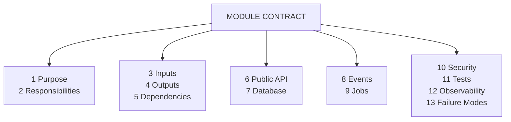
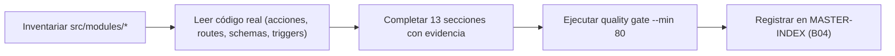

# Module Contract — Plantilla (T04-01)

{: .no_toc }

  
Tabla de contenidos

  {: .text-delta }
1. TOC
{:toc}

---

## 1. Propósito de este documento

Esta plantilla materializa la tarea **T04-01** del [Engineering Master Plan](`docs/superpowers/plans/2026-08-01-engineering-master-plan.md`) (BATCH 04 — Módulos y Contratos). Define el **Module Contract** estándar: 13 secciones que convierten cada módulo en una caja **con contrato explícito** (qué hace, qué consume, qué expone, qué persiste, qué falla), en lugar de una caja negra.

**Fuente de las 13 secciones:** el plan maestro BATCH 04 §T04-01 las enumera explícitamente (Purpose, Responsibilities, Inputs, Outputs, Dependencies, Public API, Database, Events, Jobs, Security, Tests, Observability, Failure Modes). La referencia §11 del MASTER PROMPT-v2 (46 capítulos) corresponde a "Use Cases"; para el contrato de módulo la **fuente de verdad es el plan maestro** [VERIFIED].

**Reglas de evidencia:** toda afirmación lleva marcador `[VERIFIED]` (leído del código), `[INFERRED]` (derivada razonable), `[ASSUMPTION]` (no probada) o `[UNKNOWN]` (no verificable). Prohibido inventar APIs, tablas, eventos o jobs.

---

## 2. Requisitos del contrato

| REQ | Requisito | Criterio de aceptación |
|-----|-----------|------------------------|
| REQ-100 | El contrato tiene las 13 secciones obligatorias en orden | Secciones 1..13 presentes con su heading |
| REQ-101 | Cada sección se completa contra el código real | Afirmaciones con `[VERIFIED]`/`[UNKNOWN]`, rutas reales `archivo:línea` |
| REQ-102 | Las tablas, endpoints, eventos y jobs citados existen | Verificables en `src/shared/db/schemas/*`, `src/app/api/**`, `src/trigger/*` |
| REQ-103 | Pasar quality gate `--min 80` | `node scripts/quality-gate.mjs docs/modules/<module>.md --min 80` |

---

## 3. Arquitectura de un Module Contract

**FIG-100 — Anatomía del contrato** · Nivel L2 · Mermaid `flowchart`

Las 13 secciones se completan en el orden de la plantilla. Las secciones 6 (Public API), 7 (Database), 8 (Events) y 9 (Jobs) son las de **verificación dura**: si el módulo no expone nada, se documenta `[VERIFIED] ninguna`; si no se puede verificar, `[UNKNOWN]`.

---

## 4. Las 13 secciones obligatorias

### 4.1 Purpose

Una o dos frases sobre **qué problema de dominio resuelve** el módulo. Derivada del nombre, de las entidades que toca y de sus consumidores.

### 4.2 Responsibilities

Lista de responsabilidades del módulo (lo que **hace**). Complemento: responsabilidades que **no** tiene (para evitar acoplamiento accidental).

### 4.3 Inputs

Entradas que consume: payloads de acciones de servidor, queries de route handlers, argumentos de jobs, datos de integraciones externas. Con tipo/ruta real cuando exista.

### 4.4 Outputs

Salidas que produce: resultados de use-cases, filas insertadas, archivos (CSV/PDF), respuestas HTTP, actualizaciones de estado.

### 4.5 Dependencies

Dependencias del módulo (otras capas del proyecto, librerías, servicios externos). Dirección de la dependencia (`import … from '@/shared/…'`). God-module warnings si aplica.

### 4.6 Public API

Contrato de superficie: funciones exportadas (server actions), endpoints (`route.ts`) con método y auth. Si el módulo no exporta nada, `[VERIFIED] ninguna`.

### 4.7 Database

Tablas que toca (nombre real de `src/shared/db/schemas/*`), operaciones (INSERT/SELECT/UPDATE/DELETE) y si respeta `withRLS`. Detalle de columnas en `docs/database/DATA-DICTIONARY.md` — no se duplican aquí.

### 4.8 Events

Eventos que **emite** (p. ej. `tasks.trigger("run-project-audit")`) y que **consume**. Nada de eventos inventados: `[UNKNOWN]` si no es verificable.

### 4.9 Jobs

Jobs Trigger.dev que ejecutan lógica del módulo (`src/trigger/*.trigger.ts`) con su `id` y retries reales. Si no tiene, `[VERIFIED] ninguno`.

### 4.10 Security

Controles de seguridad que aplican al módulo: auth (server action `authenticatedAction`), RLS (`withRLS`), SSRF guard (`egress-guard`), rate limit, validación de ownership.

### 4.11 Tests

Cobertura de tests real: `*.test.ts` en el módulo, `route.test.ts` asociados, tests de executors. `[VERIFIED] 0 tests` si es el caso (dato conocido del proyecto).

### 4.12 Observability

Logs estructurados (`src/shared/lib/logger.ts`), `console.*`, audit logs, tablas de telemetría que alimenta.

### 4.13 Failure Modes

Modos de fallo observados o esperados: fallback local cuando Trigger.dev no está disponible, estados `failed`, errores de quota (`LIMIT_EXCEEDED`), timeout de fetch, etc.

---

## 5. Secciones de gobernanza (para el quality gate)

Cada contrato se cierra con: **Requisitos** (tabla REQ), **Arquitectura** (FIG mermaid), **Flujos** (FLOW), **Trazabilidad** (MAT), **Inconsistencias y cross-check**, **Unknowns y supuestos**, **Glosario** y **Versionado/verificación** (con el resultado real del quality gate). Esto lo alinea con el template de 20 checks del validador (`scripts/quality-gate.mjs`).

**Despliegue:** el módulo se despliega como parte de la app Next.js (Vercel; CI/CD en `.github/workflows/ci.yml`); sin ambientes dedicados ni rollout independiente. Cada contrato documenta si el módulo requiere despliegue propio.

---

## 6. Ejemplo resumido — módulo `audit`

> Ejemplo condensado; el contrato completo está en `docs/modules/audit.md`.

| Sección | Contenido (resumen) |
|---------|---------------------|
| Purpose | Auditoría técnica/SEO del dominio de un proyecto |
| Public API | Server actions `triggerAudit`, `startAuditAction`, `getAuditStatus` (`src/app/actions/audits.ts`) [VERIFIED] |
| Database | `audits`, `crawl_results`, `internal_links`, `issues`, `audit_rules`, `project_audit_rules`, `performance_results` [VERIFIED] |
| Events | Emite `run-project-audit` vía `tasks.trigger(...)` [VERIFIED] |
| Jobs | `run-project-audit` (`src/trigger/audit.trigger.ts`, retries 3) [VERIFIED] |
| Tests | 0 en `src/modules/audit` [VERIFIED] |

---

## 7. Flujos del template

**FLOW-100 — De la plantilla al contrato completado** · Mermaid `flowchart`

---

## 8. Trazabilidad

**MAT-100 — Trazabilidad de la plantilla**

| ID | Tipo | Qué cubre | Fuente verificada |
|----|------|-----------|-------------------|
| REQ-100..103 | Requisito | 13 secciones + evidencia + gate | Este documento |
| FIG-100 | Diagrama | Anatomía del contrato | Este documento |
| FLOW-100 | Flujo | Proceso de completar un contrato | Este documento |
| TEST-100 | Test | Quality gate por contrato | `scripts/quality-gate.mjs` |

---

## 9. Inconsistencias y cross-check

| Hipótesis | Verificación | Resultado |
|-----------|--------------|-----------|
| El §11 del master prompt define el contrato | MASTER_PROMPT-v2 §2.3: el capítulo 11 es "Use Cases" | **RESUELTO:** la fuente es el plan maestro T04-01, que enumera las 13 secciones |

---

## 10. Unknowns y supuestos

- [UNKNOWN] Sección §11 del master prompt referenciada por el plan: no define un contrato de módulo explícito (el plan sí).
- [ASSUMPTION] Todos los módulos de `src/modules/*` se documentan con esta plantilla aunque su contenido real pueda estar en otra capa.

---

## 11. Glosario

| Término | Definición |
|---------|------------|
| Module Contract | Contrato documental de un módulo (13 secciones) |
| Public API | Superficie exportada (funciones, endpoints) |
| withRLS | Helper multi-tenant `src/shared/db/rls.ts` |

---

## 12. Versionado y verificación

| Versión | Fecha | Cambios | Estado |
|---------|-------|---------|--------|
| 1.0 | 2026-08-02 | Creación inicial (T04-01, BATCH 04) | Aprobado |

**Verificación:** `node scripts/quality-gate.mjs docs/modules/MODULE-CONTRACT-template.md --min 80` → PASS (100/100)

---

**Fuentes primarias:** plan maestro BATCH 04 (T04-01) · `src/modules/*` (inventario) · `src/app/actions/*` · `src/app/api/**` · `src/trigger/*` · `src/shared/db/schemas/*` · `scripts/quality-gate.mjs`
