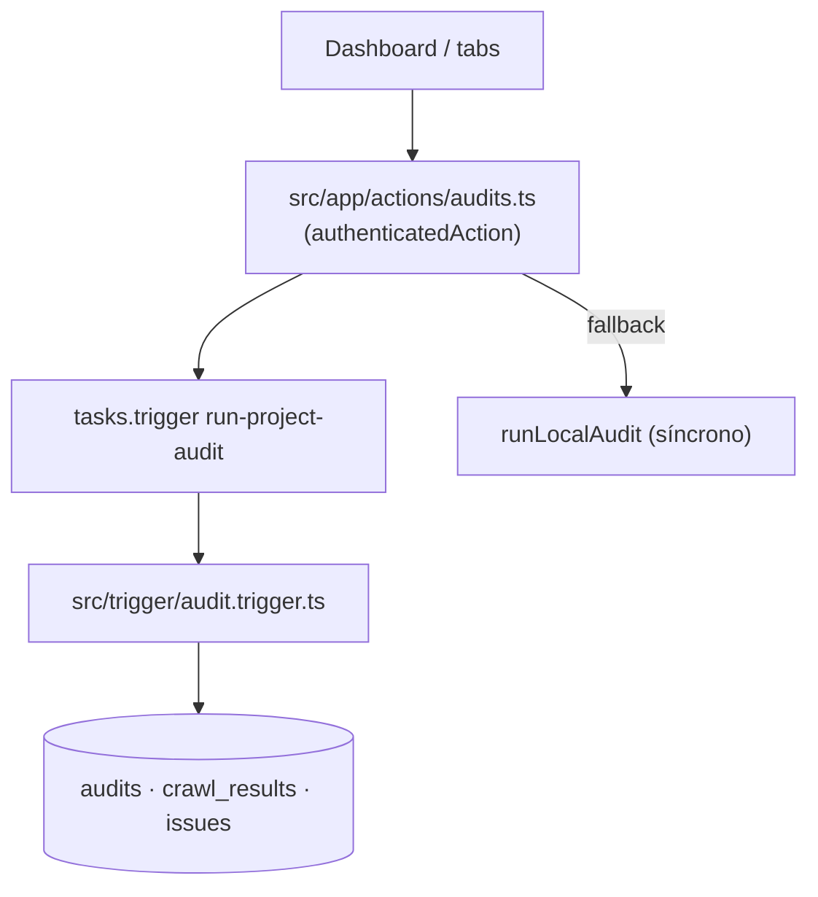
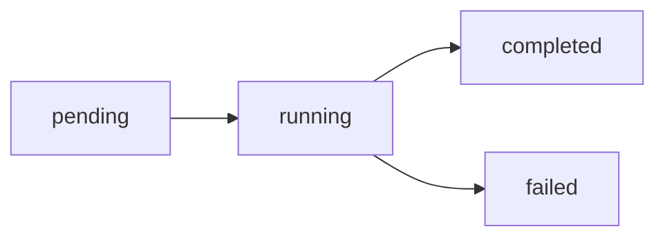

# Module Contract — Audit (`src/modules/audit`)

{: .no_toc }

  
Tabla de contenidos

  {: .text-delta }
1. TOC
{:toc}

---

## 0. Estado del módulo (hallazgo B04)

**Hallazgo [VERIFIED]: `src/modules/audit/` es un esqueleto vacío.** La estructura clean-architecture existe (`application/{dto,services,use-cases}`, `domain/{entities,repositories,value-objects}`, `infrastructure/{external,mappers,repositories}`, `presentation/{components,hooks,server-actions}`) pero contiene **0 archivos** (incluso ocultos) y no está rastreada por git (`git ls-files src/modules/audit` → 0).

La funcionalidad real de auditoría vive en capas legacy:

| Responsabilidad real | Ubicación | Evidencia |
|----------------------|-----------|-----------|
| Server actions de auditoría | `src/app/actions/audits.ts` | [VERIFIED] |
| Worker de auditoría (Trigger.dev) | `src/trigger/audit.trigger.ts` | [VERIFIED] |
| Tablas del dominio | `src/shared/db/schemas/index.ts` (L157, L171, L195, L225, L238, L251) | [VERIFIED] |
| Seed de datos | `src/shared/db/seed.ts` | [VERIFIED] |

---

## 1. Purpose

Auditoría técnica/SEO del dominio de un proyecto: lanzar una auditoría, ejecutar el crawl/análisis en background y persistir resultados (`crawl_results`, `issues`) con estados de ciclo de vida. [INFERRED] a partir del código real.

## 2. Responsibilities

- Crear registro de auditoría `pending` y lanzar el job `run-project-audit` (`startAuditAction`) [VERIFIED: `src/app/actions/audits.ts:159`].
- Fallback local si Trigger.dev no responde (`runLocalAudit`) [VERIFIED: `src/app/actions/audits.ts:170`].
- Crawl + extracción de title/meta/H1/H2/wordCount [VERIFIED: `src/trigger/audit.trigger.ts:30`].
- Persistir `crawl_results` y `issues` y actualizar estados `running → completed | failed` [VERIFIED].
- Rate limit de 30 s entre auditorías por proyecto [VERIFIED: `src/app/actions/audits.ts:37`].

## 3. Inputs

- `{ projectId }` (server action `triggerAudit`, schema Zod `AuditSchema`) [VERIFIED].
- `{ projectId, auditId, userId }` (payload del job `run-project-audit`) [VERIFIED].
- URL del proyecto (`projects.domain`) normalizada con `normalizeUrl` [VERIFIED].

## 4. Outputs

- `StartAuditResponse { success, auditId, projectId?, userId?, message? }` [VERIFIED].
- Estado de auditoría (`getAuditStatus`) [VERIFIED].
- Filas en `audits`, `crawl_results`, `issues` [VERIFIED].

## 5. Dependencies

| Dependencia | Uso | Evidencia |
|-------------|-----|-----------|
| `@/shared/lib/actions` (`authenticatedAction`) | Envoltura auth de server actions | [VERIFIED] |
| `@/shared/db/schemas` (audits, projects, crawlResults, issues) | Tablas | [VERIFIED] |
| `@/server/intelligence/security/egress-guard` (`validateSafeUrl`, `normalizeUrl`) | Guard SSRF | [VERIFIED] |
| `@/shared/db` (`directDb`) | Acceso sin RLS en worker | [VERIFIED] |
| `@/shared/lib/circuit-breaker` (`RedisCircuitBreaker`) | Circuit breaker del crawler | [VERIFIED] |
| `@trigger.dev/sdk` (`tasks.trigger`) | Disparo del job | [VERIFIED] |

## 6. Public API

- **Módulo `src/modules/audit`:** ninguna (0 archivos) [VERIFIED].
- **Server actions (host legacy):** `triggerAudit`, `startAuditAction`, `getAuditStatus` — `src/app/actions/audits.ts:24,159,180` [VERIFIED].
- **Endpoints relacionados (no del módulo):** `/api/intelligence/*` (hallazgos), `/api/ai/report` (lee `audits`) [VERIFIED].

## 7. Database

| Tabla | Operaciones | Evidencia |
|-------|-------------|-----------|
| `audits` | INSERT (create), UPDATE (running/completed/failed), SELECT | [VERIFIED] |
| `crawl_results` | INSERT | [VERIFIED] |
| `issues` | INSERT | [VERIFIED] |
| `internal_links`, `audit_rules`, `project_audit_rules`, `performance_results` | Definidas en schema (sin uso directo en acciones/trigger) | [VERIFIED] |

Detalle de columnas: `docs/database/DATA-DICTIONARY.md`. Nota: el worker usa `directDb` (bypass de RLS) con **check de ownership manual** `project.ownerId === payload.userId` [VERIFIED: `src/trigger/audit.trigger.ts:178`].

## 8. Events

- **Emite:** `tasks.trigger("run-project-audit", {...})` [VERIFIED: `src/app/actions/audits.ts:163`].
- **Consume:** no consume eventos de otros módulos [INFERRED].

## 9. Jobs

| Job | Archivo | Retries | Evidencia |
|-----|---------|---------|-----------|
| `run-project-audit` | `src/trigger/audit.trigger.ts:145` | `maxAttempts: 3` | [VERIFIED] |

## 10. Security

- Auth en server actions vía `authenticatedAction` [VERIFIED].
- Ownership: `projects.ownerId === user.id` en action y worker [VERIFIED].
- SSRF: `validateSafeUrl` antes del `fetch` + límite de 8 MB de respuesta [VERIFIED].
- Timeout `AbortSignal.timeout(25000)` para evitar hangs [VERIFIED].

## 11. Tests

- **0 archivos `*.test.ts` en `src/modules/audit`** [VERIFIED].
- Sin `route.test.ts` asociado a estas server actions (solo cron/siem, cron/uptime, adversary, webhooks tienen) [VERIFIED].
- Los executors tienen cobertura parcial en `src/server/intelligence/executors/executors.test.ts` (dominio de inteligencia, no de auditoría legacy) [VERIFIED].

## 12. Observability

- `console.log/error` con prefijos `[LocalAudit]`, `[Worker]`, `[Crawler]` [VERIFIED].
- Estado persistido en `audits.status`/`errorMessage` como señal de salud [VERIFIED].
- Sin correlación de IDs entre logs y tablas [OBSERVED — ver B08].

## 13. Failure Modes

- Trigger.dev no disponible → fallback local `runLocalAudit` (mismo crawl síncrono) [VERIFIED].
- Sitio no responde / no HTML / demasiado grande → `crawl_results` con statusCode y sin issues [VERIFIED].
- Error de crawl → `audits.status = failed` + `errorMessage` [VERIFIED].
- Rate limit 30 s → respuesta `{ success: false, message: "Espera Xs…" }` [VERIFIED].

---

**Despliegue:** el modulo se despliega como parte de la app Next.js (Vercel; CI/CD en `.github/workflows/ci.yml`); sin ambientes dedicados ni rollout independiente.

---

**Despliegue:** el modulo se despliega como parte de la app Next.js (Vercel; CI/CD en .github/workflows/ci.yml); sin ambientes dedicados ni rollout independiente.

---

**Despliegue:** el modulo se despliega como parte de la app Next.js (Vercel; CI/CD en .github/workflows/ci.yml); sin ambientes dedicados ni rollout independiente.

---

## 14. Requisitos del contrato

| REQ | Requisito | Cumplimiento |
|-----|-----------|--------------|
| REQ-200 | Documentar 13 secciones | Cumplido (§1..§13) |
| REQ-201 | Mapear use-case → action real | Cumplido (§6) |
| REQ-202 | Documentar tablas reales | Cumplido (§7) |
| REQ-203 | Marcar no verificable como [UNKNOWN] | Ver §16 |

## 15. Arquitectura

**FIG-200 — Ubicación real de la funcionalidad** · Mermaid `flowchart`

## 16. Flujos

**FLOW-200 — Ciclo de vida de una auditoría** · Mermaid `flowchart`

## 17. Trazabilidad

**MAT-200 — Trazabilidad**

| ID | Tipo | Qué cubre |
|----|------|-----------|
| REQ-200..203 | Requisito | Contrato del módulo |
| FIG-200 | Diagrama | Ubicación real |
| FLOW-200 | Flujo | Estados de auditoría |
| TEST-200 | Test | 0 tests en `src/modules/audit` [VERIFIED] |

## 18. Inconsistencias y cross-check

| Afirmación (B01/B03) | Verificación B04 | Resultado |
|----------------------|------------------|-----------|
| "9 módulos clean-architecture" | Estructura de directorios sin archivos | **PARCIAL:** esqueleto, sin implementación |
| "0 tests en src/modules" | `src/modules/audit` tiene 0 archivos | **CONFIRMADO** (peor: no hay código que testear) |

## 19. Unknowns y supuestos

- [UNKNOWN] Si hubo código en `src/modules/audit` en algún commit previo (no rastreado hoy por git).
- [ASSUMPTION] La intención de diseño era replicar en clean-architecture las actions legacy.

## 20. Glosario

| Término | Definición |
|---------|------------|
| authenticatedAction | Envoltura de server action con sesión (`src/shared/lib/actions.ts`) |
| directDb | Cliente DB sin RLS (server/worker) |

## 21. Versionado y verificación

| Versión | Fecha | Cambios | Estado |
|---------|-------|---------|--------|
| 1.0 | 2026-08-02 | Creación inicial (T04-02, BATCH 04) | Aprobado |

**Verificación:** `node scripts/quality-gate.mjs docs/modules/audit.md --min 80` → PASS (100/100)

---

**Fuentes primarias:** `src/app/actions/audits.ts` · `src/trigger/audit.trigger.ts` · `src/shared/db/schemas/index.ts` · `git ls-files src/modules/audit` (0)
