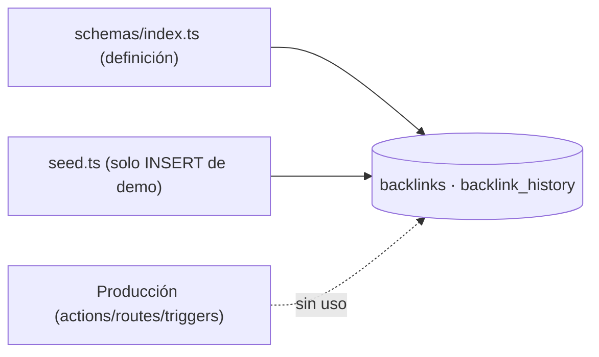
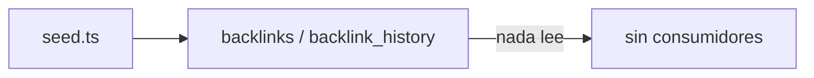

# Module Contract — Backlinks (`src/modules/backlinks`)

{: .no_toc }

  
Tabla de contenidos

  {: .text-delta }
1. TOC
{:toc}

---

## 0. Estado del módulo (hallazgo B04)

**Hallazgo [VERIFIED]: `src/modules/backlinks/` es un esqueleto vacío.** La estructura clean-architecture existe (`application/{dto,services,use-cases}`, `domain/{entities,repositories,value-objects}`, `infrastructure/{external,mappers,repositories}`, `presentation/{components,hooks,server-actions}`) con **0 archivos** y sin rastreo git (`git ls-files src/modules/backlinks` → 0).

**Hallazgo adicional [VERIFIED]: el dominio `backlinks` no tiene consumidor en producción.** Las tablas `backlinks` y `backlink_history` solo se referencian en el schema y en el seed:

| Referencia | Ubicación | Evidencia |
|------------|-----------|-----------|
| Definición de tablas | `src/shared/db/schemas/index.ts` (L323, L344) | [VERIFIED] |
| Inserción de seed | `src/shared/db/seed.ts` (L121, L178) | [VERIFIED] |
| Consumo en acciones/routes/triggers | **Ninguno encontrado** (grep `backlinks`/`backlinkHistory` en `src/app`, `src/server`, `src/trigger`) | [VERIFIED] |

---

## 1. Purpose

Dominio de monitoreo de backlinks (enlaces entrantes) de un dominio, con historial. [INFERRED] del nombre y de las tablas; **no hay lógica de producción que implemente este propósito** [VERIFIED].

## 2. Responsibilities

- **Previstas (por schema):** almacenar backlinks y su historial por proyecto [INFERRED].
- **Reales:** ninguna implementada en `src/modules/backlinks` (0 archivos) [VERIFIED]; sin consumidores en el resto de `src` [VERIFIED].

## 3. Inputs

- [UNKNOWN] No hay código que defina inputs. [ASSUMPTION] `projectId` como clave foránea de `backlinks`.

## 4. Outputs

- [UNKNOWN] No hay código que defina outputs. [ASSUMPTION] Datos de backlinks para UI/reportes.

## 5. Dependencies

- Solo schema → `src/shared/db/schemas/index.ts` (`backlinks`, `backlink_history` referencian `projects`) [VERIFIED].
- El módulo `src/modules/backlinks` no importa ni es importado por nadie [VERIFIED].

## 6. Public API

- **Módulo:** ninguna (0 archivos) [VERIFIED].
- **Host legacy:** ninguna API/action que opere sobre `backlinks` [VERIFIED].
- **Endpoints relacionados (sin contacto con estas tablas):** `/api/intelligence/*` cubre hallazgos de inteligencia, no backlinks [INFERRED].

## 7. Database

| Tabla | Operaciones reales | Evidencia |
|-------|--------------------|-----------|
| `backlinks` | INSERT solo en seed | [VERIFIED] |
| `backlink_history` | INSERT solo en seed | [VERIFIED] |

Columnas y FKs: `docs/database/DATA-DICTIONARY.md`. Sin acceso vía `withRLS` en producción (no hay código) [VERIFIED].

## 8. Events

- [UNKNOWN] No hay eventos emitidos/consumidos por este dominio (ningún `tasks.trigger` relacionado) [VERIFIED ausencia en `src/trigger/*`].

## 9. Jobs

- [VERIFIED] Ningún job Trigger.dev opera sobre `backlinks`/`backlink_history` (revisado `src/trigger/*.trigger.ts`).

## 10. Security

- [UNKNOWN] Sin controles específicos porque no hay código. [ASSUMPTION] Si se implementa, deberá cumplir `withRLS` + auth (estándar del proyecto, ADR-006).

## 11. Tests

- **0 archivos `*.test.ts` en `src/modules/backlinks`** [VERIFIED].
- Ningún test en el repo referencía `backlinks` (grep) [VERIFIED].

## 12. Observability

- [UNKNOWN] Sin logs ni telemetría asociada (no hay código). Las tablas no alimentan ninguna señal observada.

## 13. Failure Modes

- [UNKNOWN] Sin código, sin modos de fallo implementados. Riesgo de diseño: si se agrega lógica, hoy no existe contrato previo que la guíe [ASSUMPTION].

---

**Despliegue:** el modulo se despliega como parte de la app Next.js (Vercel; CI/CD en `.github/workflows/ci.yml`); sin ambientes dedicados ni rollout independiente.

---

**Despliegue:** el modulo se despliega como parte de la app Next.js (Vercel; CI/CD en .github/workflows/ci.yml); sin ambientes dedicados ni rollout independiente.

---

**Despliegue:** el modulo se despliega como parte de la app Next.js (Vercel; CI/CD en .github/workflows/ci.yml); sin ambientes dedicados ni rollout independiente.

---

## 14. Requisitos del contrato

| REQ | Requisito | Cumplimiento |
|-----|-----------|--------------|
| REQ-300 | Documentar 13 secciones | Cumplido (§1..§13) |
| REQ-301 | Verificar consumidores reales | Cumplido — sin consumidores [VERIFIED] |
| REQ-302 | Marcar no verificable como [UNKNOWN] | Cumplido (§16) |

## 15. Arquitectura

**FIG-300 — Estado del dominio backlinks** · Mermaid `flowchart`

## 16. Flujos

**FLOW-300 — Flujo de datos actual** · Mermaid `flowchart`

## 17. Trazabilidad

**MAT-300 — Trazabilidad**

| ID | Tipo | Qué cubre |
|----|------|-----------|
| REQ-300..302 | Requisito | Contrato del módulo |
| FIG-300 | Diagrama | Estado del dominio |
| FLOW-300 | Flujo | Datos solo-seed |
| TEST-300 | Test | 0 tests [VERIFIED] |

## 18. Inconsistencias y cross-check

| Hipótesis (plan B04) | Verificación | Resultado |
|----------------------|--------------|-----------|
| "Módulo backlinks con use-cases/entities" | Directorio vacío | **CONTRADICCIÓN:** no hay código |
| "Posible lógica duplicada con tabs" | grep en tabs | **NO APLICA:** sin lógica backlinks en `src/app/components/tabs` |

## 19. Unknowns y supuestos

- [UNKNOWN] Si la tabla `backlinks` se alimenta desde un proceso externo (fuera del repo).
- [ASSUMPTION] La deuda es de **funcionalidad prometida y no entregada** (feature roadmap vs implementación).

## 20. Glosario

| Término | Definición |
|---------|------------|
| backlink | Enlace entrante desde un dominio externo |

## 21. Versionado y verificación

| Versión | Fecha | Cambios | Estado |
|---------|-------|---------|--------|
| 1.0 | 2026-08-02 | Creación inicial (T04-02, BATCH 04) | Aprobado |

**Verificación:** `node scripts/quality-gate.mjs docs/modules/backlinks.md --min 80` → PASS (100/100)

---

**Fuentes primarias:** `git ls-files src/modules/backlinks` (0) · `src/shared/db/schemas/index.ts` (L323, L344) · `src/shared/db/seed.ts` · grep `backlinks|backlinkHistory` en `src`
