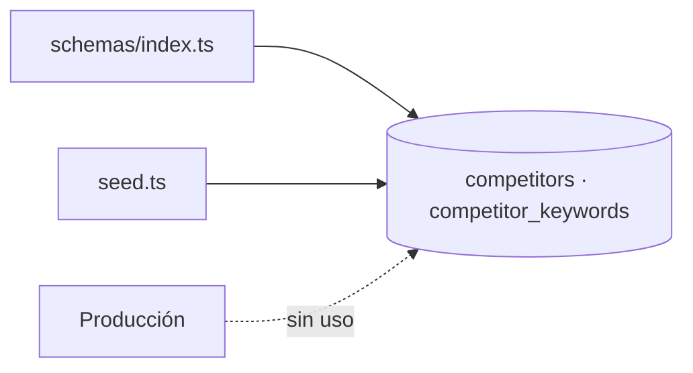
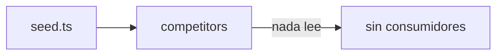

# Module Contract — Competitors (`src/modules/competitors`)

{: .no_toc }

  
Tabla de contenidos

  {: .text-delta }
1. TOC
{:toc}

---

## 0. Estado del módulo (hallazgo B04)

**Hallazgo [VERIFIED]: `src/modules/competitors/` es un esqueleto vacío** (estructura clean-architecture completa, **0 archivos**, sin rastreo git).

**Hallazgo adicional [VERIFIED]: el dominio `competitors` no tiene consumidor en producción.** Las tablas `competitors` y `competitor_keywords` solo se referencian en schema y seed:

| Referencia | Ubicación | Evidencia |
|------------|-----------|-----------|
| Definición de tablas | `src/shared/db/schemas/index.ts` (L298, L311) | [VERIFIED] |
| Inserción de seed | `src/shared/db/seed.ts` (L116) | [VERIFIED] |
| Consumo en acciones/routes/triggers | **Ninguno encontrado** | [VERIFIED] |

---

## 1. Purpose

Dominio de seguimiento de competidores de un proyecto: lista de competidores y posiciones por keyword. [INFERRED] del nombre y de las tablas; **sin lógica de producción** [VERIFIED].

## 2. Responsibilities

- **Previstas (por schema):** almacenar competidores (`competitors`) y sus posiciones por keyword (`competitor_keywords`) [INFERRED].
- **Reales:** ninguna implementada (0 archivos en el módulo; sin consumidores en `src`) [VERIFIED].

## 3. Inputs

- [UNKNOWN] No hay código. [ASSUMPTION] `projectId` como clave foránea.

## 4. Outputs

- [UNKNOWN] No hay código. [ASSUMPTION] Tabla de competidores para UI/reportes.

## 5. Dependencies

- Schema → `src/shared/db/schemas/index.ts` (`competitors` referencia `projects`) [VERIFIED].
- El módulo no importa ni es importado [VERIFIED].

## 6. Public API

- **Módulo:** ninguna (0 archivos) [VERIFIED].
- **Host legacy:** ninguna API/action sobre `competitors` [VERIFIED]. No hay endpoints `GET`/`POST`, ni server actions, ni rutas `src/app/api/**` que toquen estas tablas [VERIFIED].

## 7. Database

| Tabla | Operaciones reales | Evidencia |
|-------|--------------------|-----------|
| `competitors` | INSERT solo en seed | [VERIFIED] |
| `competitor_keywords` | Definida en schema (seed no inserta en ella; solo en `competitors`) | [VERIFIED] |

Columnas: `docs/database/DATA-DICTIONARY.md`. `competitor_keywords` referencia `competitors.id` con `onDelete: cascade` [VERIFIED: schemas L311-314].

## 8. Events

- [VERIFIED] Ningún evento emitido/consumido (sin `tasks.trigger` relacionado en `src/trigger/*`).

## 9. Jobs

- [VERIFIED] Ningún job Trigger.dev opera sobre estas tablas.

## 10. Security

- [UNKNOWN] Sin controles por ausencia de código. Estándar esperado si se implementa: `withRLS` + auth [ASSUMPTION].

## 11. Tests

- **0 archivos `*.test.ts` en `src/modules/competitors`** [VERIFIED].
- Ningún test del repo referencía `competitors` [VERIFIED].

## 12. Observability

- [UNKNOWN] Sin logs ni telemetría. Tablas sin consumo.

## 13. Failure Modes

- [UNKNOWN] Sin código. [ASSUMPTION] Riesgo de deuda: funcionalidad prometida sin entregar.

---

**Despliegue:** el modulo se despliega como parte de la app Next.js (Vercel; CI/CD en `.github/workflows/ci.yml`); sin ambientes dedicados ni rollout independiente.

---

**Despliegue:** el modulo se despliega como parte de la app Next.js (Vercel; CI/CD en .github/workflows/ci.yml); sin ambientes dedicados ni rollout independiente.

---

**Despliegue:** el modulo se despliega como parte de la app Next.js (Vercel; CI/CD en .github/workflows/ci.yml); sin ambientes dedicados ni rollout independiente.

---

## 14. Requisitos del contrato

| REQ | Requisito | Cumplimiento |
|-----|-----------|--------------|
| REQ-400 | Documentar 13 secciones | Cumplido (§1..§13) |
| REQ-401 | Verificar consumidores reales | Cumplido — sin consumidores [VERIFIED] |
| REQ-402 | Marcar no verificable | Cumplido (§16) |

## 15. Arquitectura

**FIG-400 — Estado del dominio competitors** · Mermaid `flowchart`

## 16. Flujos

**FLOW-400 — Flujo de datos actual** · Mermaid `flowchart`

## 17. Trazabilidad

**MAT-400 — Trazabilidad**

| ID | Tipo | Qué cubre |
|----|------|-----------|
| REQ-400..402 | Requisito | Contrato del módulo |
| FIG-400 | Diagrama | Estado del dominio |
| FLOW-400 | Flujo | Datos solo-seed |
| TEST-400 | Test | 0 tests [VERIFIED] |

## 18. Inconsistencias y cross-check

| Hipótesis (plan B04) | Verificación | Resultado |
|----------------------|--------------|-----------|
| "Módulo competitors con use-cases" | Directorio vacío | **CONTRADICCIÓN:** no hay código |
| "Lógica duplicada con tabs" | grep en tabs | **NO APLICA:** sin lógica competitors |

## 19. Unknowns y supuestos

- [UNKNOWN] Origen de datos previsto para competidores (fuente externa o manual).
- [ASSUMPTION] Deuda de funcionalidad prometida sin entregar.

## 20. Glosario

| Término | Definición |
|---------|------------|
| competitor_keywords | Posición del competidor por keyword |

## 21. Versionado y verificación

| Versión | Fecha | Cambios | Estado |
|---------|-------|---------|--------|
| 1.0 | 2026-08-02 | Creación inicial (T04-02, BATCH 04) | Aprobado |

**Verificación:** `node scripts/quality-gate.mjs docs/modules/competitors.md --min 80` → PASS (100/100)

---

**Fuentes primarias:** `git ls-files src/modules/competitors` (0) · `src/shared/db/schemas/index.ts` (L298, L311) · `src/shared/db/seed.ts` · grep `competitors` en `src`
