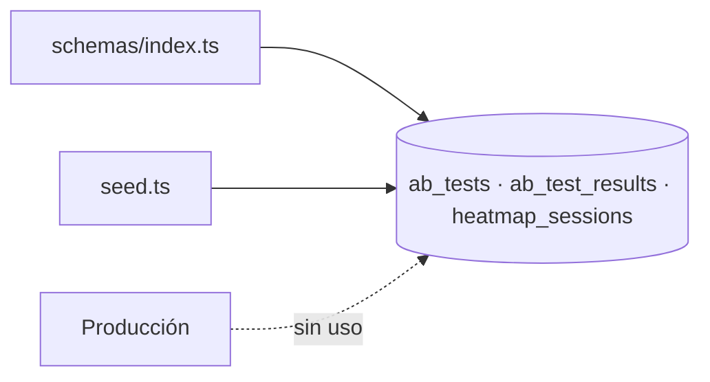
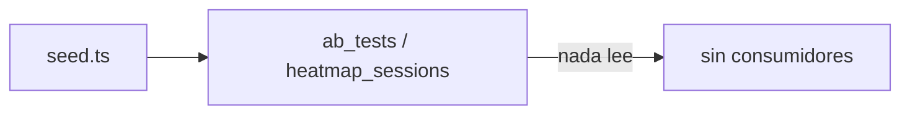

# Module Contract — CRO (`src/modules/cro`)

{: .no_toc }

  
Tabla de contenidos

  {: .text-delta }
1. TOC
{:toc}

---

## 0. Estado del módulo (hallazgo B04)

**Hallazgo [VERIFIED]: `src/modules/cro/` es un esqueleto vacío** (estructura clean-architecture completa, **0 archivos**, sin rastreo git).

**Hallazgo adicional [VERIFIED]: el dominio CRO no tiene consumidor en producción.** Las tablas `ab_tests`, `ab_test_results` y `heatmap_sessions` solo se referencian en schema y seed:

| Referencia | Ubicación | Evidencia |
|------------|-----------|-----------|
| Definición de tablas | `src/shared/db/schemas/index.ts` (L355, L374, L386) | [VERIFIED] |
| Inserción de seed | `src/shared/db/seed.ts` (L126, L131) | [VERIFIED] |
| Consumo en acciones/routes/triggers | **Ninguno encontrado** | [VERIFIED] |

---

## 1. Purpose

Dominio de optimización de conversión (CRO): tests A/B y sesiones de heatmap por proyecto. [INFERRED] del nombre y de las tablas; **sin lógica de producción** [VERIFIED].

## 2. Responsibilities

- **Previstas (por schema):** almacenar tests A/B (`ab_tests`), resultados (`ab_test_results`) y sesiones de heatmap (`heatmap_sessions`) [INFERRED].
- **Reales:** ninguna implementada (0 archivos en el módulo; sin consumidores) [VERIFIED].

## 3. Inputs

- [UNKNOWN] No hay código. [ASSUMPTION] `projectId` como clave foránea de `ab_tests`.

## 4. Outputs

- [UNKNOWN] No hay código. [ASSUMPTION] Resultados A/B y heatmaps para UI.

## 5. Dependencies

- Schema → `src/shared/db/schemas/index.ts` (`ab_tests` referencia `projects`; `ab_test_results` referencia `ab_tests`) [VERIFIED].
- El módulo no importa ni es importado [VERIFIED].

## 6. Public API

- **Módulo:** ninguna (0 archivos) [VERIFIED].
- **Host legacy:** ninguna API/action sobre `ab_tests`/`heatmap_sessions` [VERIFIED]. No hay endpoints `GET`/`POST`, ni server actions, ni rutas `src/app/api/**` que toquen estas tablas [VERIFIED].

## 7. Database

| Tabla | Operaciones reales | Evidencia |
|-------|--------------------|-----------|
| `ab_tests` | INSERT solo en seed | [VERIFIED] |
| `ab_test_results` | Definida en schema (seed inserta en `ab_tests`; `ab_test_results` referenciada por FK) | [VERIFIED] |
| `heatmap_sessions` | INSERT solo en seed | [VERIFIED] |

Columnas y FKs: `docs/database/DATA-DICTIONARY.md`.

## 8. Events

- [VERIFIED] Ningún evento emitido/consumido (sin `tasks.trigger` relacionado).

## 9. Jobs

- [VERIFIED] Ningún job Trigger.dev opera sobre estas tablas.

## 10. Security

- [UNKNOWN] Sin controles por ausencia de código. Estándar esperado: `withRLS` + auth [ASSUMPTION].

## 11. Tests

- **0 archivos `*.test.ts` en `src/modules/cro`** [VERIFIED].
- Ningún test del repo referencía `ab_tests`/`heatmap_sessions` [VERIFIED].

## 12. Observability

- [UNKNOWN] Sin logs ni telemetría. Tablas sin consumo.

## 13. Failure Modes

- [UNKNOWN] Sin código. [ASSUMPTION] Riesgo de deuda: funcionalidad prometida sin entregar.

---

**Despliegue:** el modulo se despliega como parte de la app Next.js (Vercel; CI/CD en `.github/workflows/ci.yml`); sin ambientes dedicados ni rollout independiente.

---

**Despliegue:** el modulo se despliega como parte de la app Next.js (Vercel; CI/CD en .github/workflows/ci.yml); sin ambientes dedicados ni rollout independiente.

---

**Despliegue:** el modulo se despliega como parte de la app Next.js (Vercel; CI/CD en .github/workflows/ci.yml); sin ambientes dedicados ni rollout independiente.

---

## 14. Requisitos del contrato

| REQ | Requisito | Cumplimiento |
|-----|-----------|--------------|
| REQ-500 | Documentar 13 secciones | Cumplido (§1..§13) |
| REQ-501 | Verificar consumidores reales | Cumplido — sin consumidores [VERIFIED] |
| REQ-502 | Marcar no verificable | Cumplido (§16) |

## 15. Arquitectura

**FIG-500 — Estado del dominio CRO** · Mermaid `flowchart`

## 16. Flujos

**FLOW-500 — Flujo de datos actual** · Mermaid `flowchart`

## 17. Trazabilidad

**MAT-500 — Trazabilidad**

| ID | Tipo | Qué cubre |
|----|------|-----------|
| REQ-500..502 | Requisito | Contrato del módulo |
| FIG-500 | Diagrama | Estado del dominio |
| FLOW-500 | Flujo | Datos solo-seed |
| TEST-500 | Test | 0 tests [VERIFIED] |

## 18. Inconsistencias y cross-check

| Hipótesis (plan B04) | Verificación | Resultado |
|----------------------|--------------|-----------|
| "Módulo CRO con use-cases" | Directorio vacío | **CONTRADICCIÓN:** no hay código |
| "Lógica duplicada con tabs" | grep en tabs | **NO APLICA:** sin lógica CRO |

## 19. Unknowns y supuestos

- [UNKNOWN] Plan de integración de heatmaps (proveedor externo previsto).
- [ASSUMPTION] Deuda de funcionalidad prometida sin entregar.

## 20. Glosario

| Término | Definición |
|---------|------------|
| CRO | Conversion Rate Optimization |

## 21. Versionado y verificación

| Versión | Fecha | Cambios | Estado |
|---------|-------|---------|--------|
| 1.0 | 2026-08-02 | Creación inicial (T04-02, BATCH 04) | Aprobado |

**Verificación:** `node scripts/quality-gate.mjs docs/modules/cro.md --min 80` → PASS (100/100)

---

**Fuentes primarias:** `git ls-files src/modules/cro` (0) · `src/shared/db/schemas/index.ts` (L355, L374, L386) · `src/shared/db/seed.ts` · grep `abTests|heatmapSessions` en `src`
