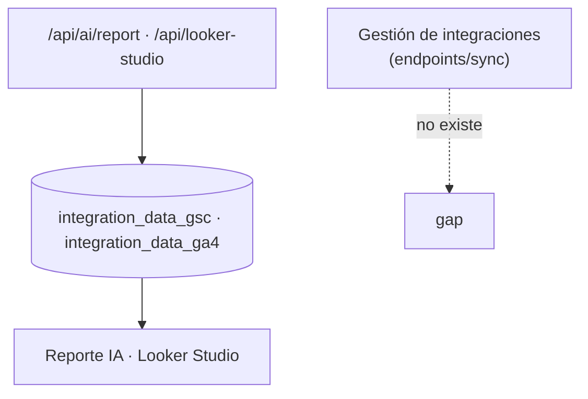
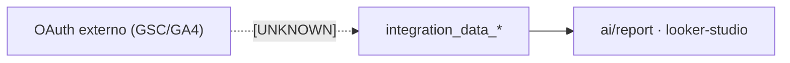

# Module Contract — Integrations (`src/modules/integrations`)

{: .no_toc }

  
Tabla de contenidos

  {: .text-delta }
1. TOC
{:toc}

---

## 0. Estado del módulo (hallazgo B04)

**Hallazgo [VERIFIED]: `src/modules/integrations/` es un esqueleto vacío** (estructura clean-architecture completa, **0 archivos**, sin rastreo git).

A diferencia de backlinks/competitors/cro/schema, **este dominio sí tiene consumidores reales** en la capa legacy:

| Consumidor real | Ubicación | Evidencia |
|-----------------|-----------|-----------|
| Reporte IA (GSC/GA4) | `src/app/api/ai/report/route.ts` (L64, L67) | [VERIFIED] |
| Looker Studio (GSC/GA4) | `src/app/api/looker-studio/route.ts` (L164, L205) | [VERIFIED] |
| Seed | `src/shared/db/seed.ts` (L85) | [VERIFIED] |

**Hallazgo de fuga [VERIFIED 2026-08-02, cerrado 2026-09-25]:** no existe `src/app/api/integrations/**` — no hay endpoints de integración (conectar/desconectar OAuth, sync manual). La tabla `integration_sync_logs` tenía escritor ausente (solo schema); desde 2026-09-25 la escribe el trigger `integration-sync-sweep` (`src/trigger/integration-sync.trigger.ts`, TD-10/TSK-016).

---

## 1. Purpose

Dominio de integraciones con fuentes externas de datos (Google Search Console, Google Analytics 4, Bing) y el registro de su sincronización. [INFERRED] del nombre y de las tablas; **la lectura de datos integrados está en producción, la gestión de la integración no** [VERIFIED].

## 2. Responsibilities

- **Reales:** lectura de `integration_data_gsc`/`integration_data_ga4` para alimentar el reporte IA y Looker Studio; escritura de `integrations`/`integration_sync_logs` por el trigger `integration-sync-sweep` (reconciliación diaria) [VERIFIED].
- **Previstas (por schema):** gestionar `integration_data_bing` [INFERRED — sin código de sync en producción].

## 3. Inputs

- `{ projectId }` en `GET /api/ai/report` y `GET /api/looker-studio` [VERIFIED].
- [UNKNOWN] Parámetros de conexión/sync (no hay endpoint que los reciba).

## 4. Outputs

- Métricas GSC/GA4 agregadas (consultas, clics, impresiones, posición) para reporte IA [VERIFIED: `src/app/api/ai/report/route.ts`].
- Payload de Looker Studio [VERIFIED: `src/app/api/looker-studio/route.ts`].

## 5. Dependencies

| Dependencia | Uso | Evidencia |
|-------------|-----|-----------|
| `@/shared/db/schemas` (integrationDataGsc, integrationDataGa4, keywordTargets, audits, projects) | Lectura de datos | [VERIFIED] |
| `@/shared/db/schemas` (integrations, integrationSyncLogs, integrationDataBing) | Escritura (`integration-sync-sweep`) / seed | [VERIFIED] |

## 6. Public API

- **Módulo:** ninguna (0 archivos) [VERIFIED].
- **Host legacy:** `GET /api/ai/report` (auth), `GET /api/looker-studio` (auth condicional — ver VULN-006 en SECURITY-AUDIT) [VERIFIED].
- **Ausencia [VERIFIED]:** sin endpoints de gestión de integraciones.

## 7. Database

| Tabla | Operaciones reales | Evidencia |
|-------|--------------------|-----------|
| `integration_data_gsc` | SELECT (ai/report, looker-studio), INSERT (seed) | [VERIFIED] |
| `integration_data_ga4` | SELECT (ai/report, looker-studio) | [VERIFIED] |
| `integrations` | SELECT/UPDATE (`integration-sync-sweep`: `last_sync_at`, `status`→`expired`) | [VERIFIED] |
| `integration_sync_logs` | INSERT/UPDATE (`integration-sync-sweep`: `running`→`success`/`failed`) | [VERIFIED] |
| `integration_data_bing` | Definida; sin uso en producción | [VERIFIED] |

Columnas: `docs/database/DATA-DICTIONARY.md`.

## 8. Events

- [VERIFIED] Ningún evento emitido/consumido (sin `tasks.trigger` relacionado; el sweep es schedule, no evento).

## 9. Jobs

- [VERIFIED] `integration-sync-sweep` (`src/trigger/integration-sync.trigger.ts`, cron `0 3 * * *`) reconcilia `integrations` y escribe `integration_sync_logs` (2026-09-25, TD-10). La sync de datos GSC/GA4 sigue sin implementación (asume OAuth externo; no verificable en repo [UNKNOWN]).

## 10. Security

- `GET /api/ai/report` requiere sesión [VERIFIED].
- `GET /api/looker-studio` usa auth condicional — **VULN-006 pendiente** (ver `docs/security/SECURITY-AUDIT-REPORT.md`) [VERIFIED].
- [UNKNOWN] Manejo de tokens de integración (no verificable en repo).

## 11. Tests

- **0 archivos `*.test.ts` en `src/modules/integrations`** [VERIFIED].
- `src/app/api/looker-studio/route.test.ts` existe; sigue sin `route.test.ts` para `ai/report` [VERIFIED 2026-09-25].
- `src/trigger/integration-sync.trigger.test.ts` (8 tests) cubre el escritor de `integration_sync_logs` [VERIFIED].

## 12. Observability

- [VERIFIED 2026-09-25] `integration_sync_logs` tiene escritor: `integration-sync-sweep` persiste un log por integración y corrida (`running`→`success`/`failed`, `recordsSynced`, `errorMessage`), cerrando el gap de observabilidad.

## 13. Failure Modes

- [PARTIAL] Sin endpoints de sync; los modos de fallo de la reconciliación se gestionan en `integration_sync_logs` (`failed` + `errorMessage`, expiración >48h) [VERIFIED 2026-09-25]. [ASSUMPTION] El reporte IA depende de que los datos GSC/GA4 existan (se devuelve `0` si faltan [INFERRED]).

---

**Despliegue:** el modulo se despliega como parte de la app Next.js (Vercel; CI/CD en `.github/workflows/ci.yml`); sin ambientes dedicados ni rollout independiente.

---

**Despliegue:** el modulo se despliega como parte de la app Next.js (Vercel; CI/CD en .github/workflows/ci.yml); sin ambientes dedicados ni rollout independiente.

---

**Despliegue:** el modulo se despliega como parte de la app Next.js (Vercel; CI/CD en .github/workflows/ci.yml); sin ambientes dedicados ni rollout independiente.

---

## 14. Requisitos del contrato

| REQ | Requisito | Cumplimiento |
|-----|-----------|--------------|
| REQ-600 | Documentar 13 secciones | Cumplido (§1..§13) |
| REQ-601 | Mapear consumidores reales | Cumplido (§6, §7) |
| REQ-602 | Detectar fugas de infraestructura | Cumplido — sin endpoints de integración |
| REQ-603 | Marcar no verificable | Cumplido (§16) |

## 15. Arquitectura

**FIG-600 — Lectura de datos integrados** · Mermaid `flowchart`

## 16. Flujos

**FLOW-600 — Flujo de datos de integraciones** · Mermaid `flowchart`

## 17. Trazabilidad

**MAT-600 — Trazabilidad**

| ID | Tipo | Qué cubre |
|----|------|-----------|
| REQ-600..603 | Requisito | Contrato del módulo |
| FIG-600 | Diagrama | Lectura de datos |
| FLOW-600 | Flujo | Lineage de datos integrados |
| TEST-600 | Test | 0 tests [VERIFIED] |

## 18. Inconsistencias y cross-check

| Hipótesis (plan B04) | Verificación | Resultado |
|----------------------|--------------|-----------|
| "Módulo integrations con use-cases" | Directorio vacío | **CONTRADICCIÓN:** no hay código en el módulo |
| "Integraciones operativas" | Solo lectura de tablas; sin endpoints de gestión | **PARCIAL:** datos leídos, gestión ausente |

## 19. Unknowns y supuestos

- [UNKNOWN] Cómo se autentican y sincronizan GSC/GA4 (no hay código en repo).
- ~~[UNKNOWN] Destino real de `integration_sync_logs` (tabla sin escritor).~~ → cerrado 2026-09-25: escritor `integration-sync-sweep` (TD-10).
- [ASSUMPTION] La integración OAuth vive fuera del repo (dashboard Vercel/externo).

## 20. Glosario

| Término | Definición |
|---------|------------|
| GSC | Google Search Console |
| GA4 | Google Analytics 4 |

## 21. Versionado y verificación

| Versión | Fecha | Cambios | Estado |
|---------|-------|---------|--------|
| 1.0 | 2026-08-02 | Creación inicial (T04-02, BATCH 04) | Aprobado |
| 1.1 | 2026-09-25 | Cierre TD-10: escritor `integration-sync-sweep` (§0/§2/§5/§7/§9/§11/§12/§13/§19) | Aprobado |

**Verificación:** `node scripts/quality-gate.mjs docs/modules/integrations.md --min 80` → PASS (100/100)

---

**Fuentes primarias:** `git ls-files src/modules/integrations` (0) · `src/app/api/ai/report/route.ts` · `src/app/api/looker-studio/route.ts` · `src/shared/db/schemas/index.ts` · `src/shared/db/seed.ts`
