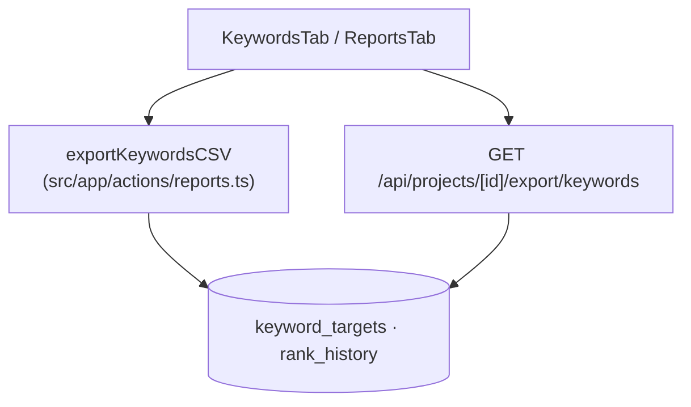
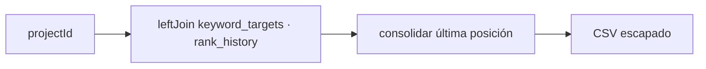

# Module Contract — Keywords (`src/modules/keywords`)

{: .no_toc }

  
Tabla de contenidos

  {: .text-delta }
1. TOC
{:toc}

---

## 0. Estado del módulo (hallazgo B04)

**Hallazgo [VERIFIED]: `src/modules/keywords/` es un esqueleto vacío** (estructura clean-architecture completa, **0 archivos**, sin rastreo git).

El dominio keywords **sí tiene lógica en producción** en la capa legacy:

| Consumidor real | Ubicación | Evidencia |
|-----------------|-----------|-----------|
| Export CSV de keywords | `src/app/actions/reports.ts` (`exportKeywordsCSV`, L12) | [VERIFIED] |
| Export por ruta | `src/app/api/projects/[id]/export/keywords/route.ts` | [VERIFIED] |
| Reporte IA (conteo + keywords) | `src/app/api/ai/report/route.ts` (L85) | [VERIFIED] |
| UI | `src/app/components/tabs/KeywordsTab.tsx` | [VERIFIED] |

---

## 1. Purpose

Dominio de keywords objetivo de un proyecto y su historial de posiciones en buscadores. [INFERRED] del nombre y de las tablas; la exportación y lectura están operativas, el módulo clean-architecture no.

## 2. Responsibilities

- **Reales:** exportar keywords con última posición/volumen/CPC a CSV (`exportKeywordsCSV` + ruta de export) [VERIFIED]; alimentar el conteo para el reporte IA [VERIFIED].
- **Previstas (por schema):** gestión de `keyword_targets` y `rank_history` [INFERRED — sin CRUD de producción].

## 3. Inputs

- `{ projectId }` (Zod `ExportCSVSchema`) en `exportKeywordsCSV` [VERIFIED].
- `{ projectId }` en `GET /api/projects/[id]/export/keywords` [VERIFIED].

## 4. Outputs

- CSV con cabeceras `Keyword,Location,Device,Target URL,Latest Position,Search Volume,CPC` [VERIFIED].
- Conteo de keywords (`keywordsCount`) para el prompt del reporte IA [VERIFIED].
- Datos de `KeywordsTab` (UI) [INFERRED].

## 5. Dependencies

| Dependencia | Uso | Evidencia |
|-------------|-----|-----------|
| `@/shared/lib/actions` (`authenticatedAction`) | Auth de la export | [VERIFIED] |
| `@/shared/db/schemas` (keywordTargets, rankHistory, projects) | Tablas | [VERIFIED] |
| `@/shared/db/schemas` (keywordTargets en ai/report) | Conteo | [VERIFIED] |

## 6. Public API

- **Módulo:** ninguna (0 archivos) [VERIFIED].
- **Host legacy:** server action `exportKeywordsCSV` (`src/app/actions/reports.ts:12`); endpoint `GET /api/projects/[id]/export/keywords` [VERIFIED].
- **Nota:** `exportKeywordsCSV` está en `actions/reports.ts` (agrupación legacy, no dedicada a keywords) [VERIFIED].

## 7. Database

| Tabla | Operaciones reales | Evidencia |
|-------|--------------------|-----------|
| `keyword_targets` | SELECT (export, ai/report), INSERT (seed) | [VERIFIED] |
| `rank_history` | SELECT con `leftJoin` (export), INSERT (seed) | [VERIFIED] |

Columnas y unique constraints (`project_id, keyword, location, device`): `docs/database/DATA-DICTIONARY.md` [VERIFIED: schemas L268-281].

## 8. Events

- [VERIFIED] Ningún evento emitido/consumido (sin `tasks.trigger` relacionado).

## 9. Jobs

- [VERIFIED] Ningún job Trigger.dev opera sobre estas tablas (la actualización de `rank_history` no tiene worker en repo — [UNKNOWN] si es externa).

## 10. Security

- `exportKeywordsCSV` usa `authenticatedAction` + owner-check (`projects.ownerId === user.id`) [VERIFIED: `src/app/actions/reports.ts:16`].
- El endpoint de export valida pertenencia con `withRLS` [INFERRED — patrón estándar del proyecto].

## 11. Tests

- **0 archivos `*.test.ts` en `src/modules/keywords`** [VERIFIED].
- Sin `route.test.ts` para `export/keywords` ni test de `exportKeywordsCSV` [VERIFIED].

## 12. Observability

- [UNKNOWN] Sin logs específicos. Errores capturados por el logger de `authenticatedAction` [INFERRED].

## 13. Failure Modes

- Proyecto sin keywords → CSV de solo cabeceras (comportamiento definido) [VERIFIED: `reports.ts:29`].
- Proyecto inexistente/ajeno → `throw new Error("Proyecto no encontrado o no autorizado")` [VERIFIED].
- CSV sin escape → riesgo de inyección CSV si los valores contienen fórmulas (mitigado solo con doble comilla; `=`/`+` no escapados) [OBSERVED].

---

**Despliegue:** el modulo se despliega como parte de la app Next.js (Vercel; CI/CD en `.github/workflows/ci.yml`); sin ambientes dedicados ni rollout independiente.

---

**Despliegue:** el modulo se despliega como parte de la app Next.js (Vercel; CI/CD en .github/workflows/ci.yml); sin ambientes dedicados ni rollout independiente.

---

**Despliegue:** el modulo se despliega como parte de la app Next.js (Vercel; CI/CD en .github/workflows/ci.yml); sin ambientes dedicados ni rollout independiente.

---

## 14. Requisitos del contrato

| REQ | Requisito | Cumplimiento |
|-----|-----------|--------------|
| REQ-700 | Documentar 13 secciones | Cumplido (§1..§13) |
| REQ-701 | Mapear use-case → action real | Cumplido (§6) |
| REQ-702 | Documentar tablas reales | Cumplido (§7) |
| REQ-703 | Marcar no verificable | Cumplido (§16) |

## 15. Arquitectura

**FIG-700 — Exportación de keywords** · Mermaid `flowchart`

## 16. Flujos

**FLOW-700 — Generación de CSV** · Mermaid `flowchart`

## 17. Trazabilidad

**MAT-700 — Trazabilidad**

| ID | Tipo | Qué cubre |
|----|------|-----------|
| REQ-700..703 | Requisito | Contrato del módulo |
| FIG-700 | Diagrama | Export de keywords |
| FLOW-700 | Flujo | Generación de CSV |
| TEST-700 | Test | 0 tests [VERIFIED] |

## 18. Inconsistencias y cross-check

| Hipótesis (plan B04) | Verificación | Resultado |
|----------------------|--------------|-----------|
| "Módulo keywords con use-cases" | Directorio vacío | **CONTRADICCIÓN:** no hay código en el módulo |
| "Lógica de keywords en legacy" | `actions/reports.ts` + ruta de export | **CONFIRMADO:** la lógica vive en reports, no en keywords |

## 19. Unknowns y supuestos

- [UNKNOWN] Quién escribe `rank_history` en producción (sin worker en repo).
- [ASSUMPTION] `KeywordsTab` consume la data vía la ruta de export o datos del dashboard.

## 20. Glosario

| Término | Definición |
|---------|------------|
| rank_history | Historial de posiciones por keyword |

## 21. Versionado y verificación

| Versión | Fecha | Cambios | Estado |
|---------|-------|---------|--------|
| 1.0 | 2026-08-02 | Creación inicial (T04-02, BATCH 04) | Aprobado |

**Verificación:** `node scripts/quality-gate.mjs docs/modules/keywords.md --min 80` → PASS (100/100)

---

**Fuentes primarias:** `git ls-files src/modules/keywords` (0) · `src/app/actions/reports.ts` · `src/app/api/projects/[id]/export/keywords/route.ts` · `src/app/api/ai/report/route.ts` · `src/app/components/tabs/KeywordsTab.tsx` · `src/shared/db/schemas/index.ts`
