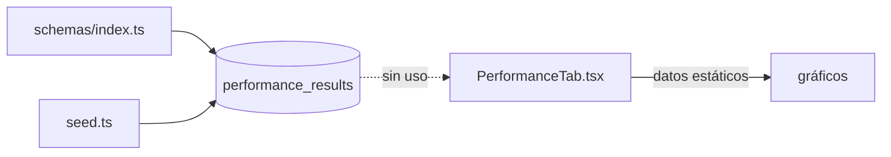
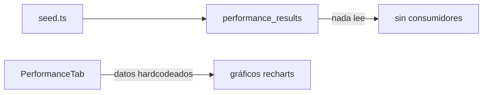

# Module Contract — Performance (`src/modules/performance`)

{: .no_toc }

  
Tabla de contenidos

  {: .text-delta }
1. TOC
{:toc}

---

## 0. Estado del módulo (hallazgo B04)

**Hallazgo [VERIFIED]: `src/modules/performance/` es un esqueleto vacío** (estructura clean-architecture completa, **0 archivos**, sin rastreo git).

El dominio performance está **sin implementar en producción a nivel de datos**; la UI usa datos estáticos:

| Referencia | Ubicación | Evidencia |
|------------|-----------|-----------|
| `performance_results` (tabla) | `src/shared/db/schemas/index.ts` (L207) | [VERIFIED] |
| INSERT de `performance_results` | Solo en `src/shared/db/seed.ts` (L158) | [VERIFIED] |
| UI de rendimiento | `src/app/components/tabs/PerformanceTab.tsx` — **datos hardcodeados** (`sparklineData`, `healthSegments`) | [VERIFIED] |
| Métricas reales de uptime/vitals (dominio monitoring) | `src/trigger/uptime.trigger.ts`, `src/app/api/cron/uptime/route.ts`, `src/app/api/intelligence/live/route.ts` | [VERIFIED] |

**Hallazgo [VERIFIED]:** `performance_results` no tiene consumidor de producción (ni lectura ni escritura fuera de seed).

---

## 1. Purpose

Dominio de rendimiento web de un proyecto (métricas de performance/results) y su visualización. [INFERRED] del nombre y de la tabla; **el módulo clean-architecture no implementa nada** [VERIFIED].

## 2. Responsibilities

- **Reales:** UI con indicadores de rendimiento de muestra (estática) [VERIFIED: `PerformanceTab.tsx`].
- **Previstas (por schema):** almacenar `performance_results` por proyecto [INFERRED — sin lógica].

## 3. Inputs

- `dashboardData` (proyectos) como prop de `PerformanceTab` [VERIFIED].
- [UNKNOWN] Parámetros de medición de rendimiento (no hay código que los reciba).

## 4. Outputs

- [UNKNOWN] No hay outputs de producción (los gráficos del tab usan datos estáticos) [VERIFIED].

## 5. Dependencies

| Dependencia | Uso | Evidencia |
|-------------|-----|-----------|
| `@/shared/db/schemas` (`projects`) | Tipado de `dashboardData` | [VERIFIED] |
| `recharts` | Gráficos (Area, Pie) | [VERIFIED] |
| `next-intl` (`useTranslations('performance')`) | i18n | [VERIFIED] |

## 6. Public API

- **Módulo:** ninguna (0 archivos) [VERIFIED].
- **Host legacy:** `PerformanceTab` es un componente de UI, no expone API [VERIFIED].
- **Relacionado (monitoring, no performance):** `GET /api/intelligence/live` (lee `uptime_logs`) [VERIFIED].

## 7. Database

| Tabla | Operaciones reales | Evidencia |
|-------|--------------------|-----------|
| `performance_results` | INSERT solo en seed; sin SELECT/UPDATE en producción | [VERIFIED] |
| `uptime_logs`, `web_vitals_logs` | Dominio monitoring (ver B05); escritos por `uptime.trigger` y `cleanup.trigger` | [VERIFIED] |

Columnas: `docs/database/DATA-DICTIONARY.md`.

## 8. Events

- [VERIFIED] Ningún evento del dominio performance (la UI no dispara jobs).

## 9. Jobs

- [VERIFIED] Ningún job Trigger.dev opera sobre `performance_results`. (`uptime`/`cleanup` son del dominio monitoring — B05.)

## 10. Security

- [UNKNOWN] Sin controles específicos (módulo sin código). `PerformanceTab` recibe `dashboardData` ya autorizado por el dashboard [INFERRED].

## 11. Tests

- **0 archivos `*.test.ts` en `src/modules/performance`** [VERIFIED].
- Sin `route.test.ts` asociado (no hay ruta del dominio) [VERIFIED].

## 12. Observability

- [UNKNOWN] Sin logs. La tabla de telemetría real es `web_vitals_logs` (dominio monitoring, vía `/api/telemetry/vitals`) [VERIFIED].

## 13. Failure Modes

- UI con datos estáticos → **riesgo de mostrar datos no reales al usuario** [OBSERVED].
- [UNKNOWN] Sin código, sin modos de fallo gestionados.

---

**Despliegue:** el modulo se despliega como parte de la app Next.js (Vercel; CI/CD en `.github/workflows/ci.yml`); sin ambientes dedicados ni rollout independiente.

---

**Despliegue:** el modulo se despliega como parte de la app Next.js (Vercel; CI/CD en .github/workflows/ci.yml); sin ambientes dedicados ni rollout independiente.

---

**Despliegue:** el modulo se despliega como parte de la app Next.js (Vercel; CI/CD en .github/workflows/ci.yml); sin ambientes dedicados ni rollout independiente.

---

## 14. Requisitos del contrato

| REQ | Requisito | Cumplimiento |
|-----|-----------|--------------|
| REQ-800 | Documentar 13 secciones | Cumplido (§1..§13) |
| REQ-801 | Verificar consumidores reales | Cumplido — solo seed [VERIFIED] |
| REQ-802 | Marcar no verificable | Cumplido (§16) |

## 15. Arquitectura

**FIG-800 — Estado del dominio performance** · Mermaid `flowchart`

## 16. Flujos

**FLOW-800 — Flujo de datos actual** · Mermaid `flowchart`

## 17. Trazabilidad

**MAT-800 — Trazabilidad**

| ID | Tipo | Qué cubre |
|----|------|-----------|
| REQ-800..802 | Requisito | Contrato del módulo |
| FIG-800 | Diagrama | Estado del dominio |
| FLOW-800 | Flujo | UI estática vs tabla sin uso |
| TEST-800 | Test | 0 tests [VERIFIED] |

## 18. Inconsistencias y cross-check

| Hipótesis (plan B04) | Verificación | Resultado |
|----------------------|--------------|-----------|
| "Módulo performance con use-cases" | Directorio vacío | **CONTRADICCIÓN:** no hay código |
| "Performance real medible" | `performance_results` sin escritor en producción; UI estática | **PARCIAL:** no hay pipeline de datos |

## 19. Unknowns y supuestos

- [UNKNOWN] Si la medición de performance web estaba prevista vía un executor (no encontrado).
- [ASSUMPTION] La deuda es de **datos falsos en UI** (gráficos de muestra) — prioridad para B07.

## 20. Glosario

| Término | Definición |
|---------|------------|
| recharts | Librería de gráficos React |
| uptime_logs | Logs de disponibilidad (dominio monitoring) |

## 21. Versionado y verificación

| Versión | Fecha | Cambios | Estado |
|---------|-------|---------|--------|
| 1.0 | 2026-08-02 | Creación inicial (T04-02, BATCH 04) | Aprobado |

**Verificación:** `node scripts/quality-gate.mjs docs/modules/performance.md --min 80` → PASS (100/100)

---

**Fuentes primarias:** `git ls-files src/modules/performance` (0) · `src/app/components/tabs/PerformanceTab.tsx` · `src/shared/db/schemas/index.ts` (L207) · `src/shared/db/seed.ts` · `src/trigger/{uptime,cleanup}.trigger.ts`
