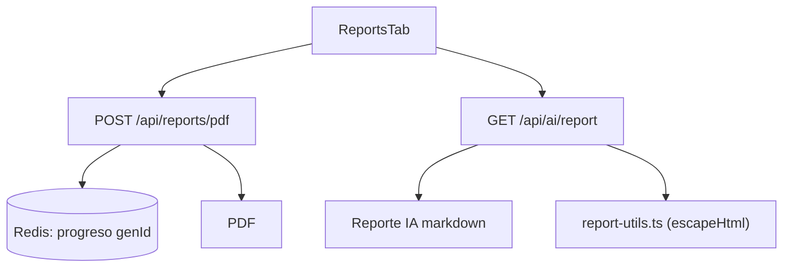
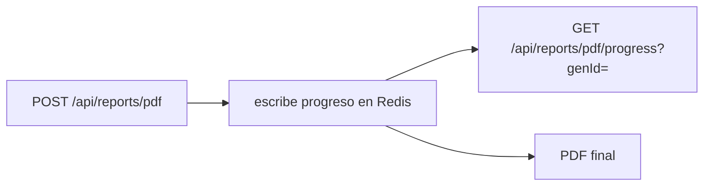

# Module Contract — Reporting (`src/modules/reporting`)

{: .no_toc }

  
Tabla de contenidos

  {: .text-delta }
1. TOC
{:toc}

---

## 0. Estado del módulo (hallazgo B04)

**Hallazgo [VERIFIED]: `src/modules/reporting/` es un esqueleto vacío** (estructura clean-architecture completa, **0 archivos**, sin rastreo git).

El dominio reporting **sí tiene lógica en producción** en la capa legacy:

| Consumidor real | Ubicación | Evidencia |
|-----------------|-----------|-----------|
| PDF de reportes | `src/app/api/reports/pdf/route.ts` + `progress/route.ts` | [VERIFIED] |
| Generación de reporte IA | `src/app/api/ai/report/route.ts` | [VERIFIED] |
| Export CSV (keywords) | `src/app/actions/reports.ts` | [VERIFIED] |
| Utilidades puras de reporte | `src/app/components/report-utils.ts` | [VERIFIED] |
| UI | `src/app/components/tabs/ReportsTab.tsx` | [VERIFIED] |

---

## 1. Purpose

Dominio de generación y exportación de reportes SEO (PDF, IA y CSV) por proyecto. [INFERRED] del nombre y de los consumidores; el módulo clean-architecture no implementa nada, pero la capa legacy sí.

## 2. Responsibilities

- **Reales:** generar PDF de reporte con progreso en Redis (`/api/reports/pdf`, `progress`) [VERIFIED]; generar reporte ejecutivo IA (`/api/ai/report`) [VERIFIED]; exportar keywords CSV [VERIFIED]; parsear/sanitizar secciones de reporte IA (`report-utils.ts`) [VERIFIED].
- **Previstas (por schema):** persistir `reports` y `report_exports` [INFERRED — sin uso en producción].

## 3. Inputs

- `{ projectId }` en `POST /api/reports/pdf` y `GET /api/ai/report` [VERIFIED].
- `{ genId }` en `GET /api/reports/pdf/progress` [VERIFIED].
- `{ projectId }` en `exportKeywordsCSV` [VERIFIED].

## 4. Outputs

- PDF del reporte [VERIFIED].
- Progreso de generación leído desde Redis [VERIFIED: `progress/route.ts` comenta "writes progress to Redis"].
- Reporte IA (texto/markdown) [VERIFIED].
- CSV de keywords [VERIFIED].

## 5. Dependencies

| Dependencia | Uso | Evidencia |
|-------------|-----|-----------|
| `@/shared/db/schemas` (projects, audits, keywordTargets, integrationDataGsc/Ga4, reports, reportExports) | Datos del reporte | [VERIFIED] |
| Redis (Upstash) | Progreso del PDF | [VERIFIED] |
| `@/shared/lib/actions` | `exportKeywordsCSV` | [VERIFIED] |
| `@/shared/db/schemas` (reports, reportExports) | Definidas; sin uso en producción | [VERIFIED] |

## 6. Public API

- **Módulo:** ninguna (0 archivos) [VERIFIED].
- **Host legacy:** `POST /api/reports/pdf`, `GET /api/reports/pdf/progress`, `GET /api/ai/report`, server action `exportKeywordsCSV` [VERIFIED].

## 7. Database

| Tabla | Operaciones reales | Evidencia |
|-------|--------------------|-----------|
| `reports` | INSERT solo en seed | [VERIFIED] |
| `report_exports` | INSERT solo en seed | [VERIFIED] |
| `projects`, `audits`, `keyword_targets`, `integration_data_*` | SELECT para alimentar el reporte | [VERIFIED] |

Columnas: `docs/database/DATA-DICTIONARY.md`. Las tablas de reporte persistidas no se usan en producción (el PDF/IA se generan bajo demanda) [VERIFIED].

## 8. Events

- [VERIFIED] Ningún evento emitido/consumido (sin `tasks.trigger` relacionado con reports en `src/trigger/*`).

## 9. Jobs

- [VERIFIED] Ningún job Trigger.dev del dominio reporting. La generación es síncrona vía route handlers [INFERRED].

## 10. Security

- Rutas de reportes requieren sesión (patrón estándar) [VERIFIED: auth en route handlers; ver SECURITY-AUDIT].
- `report-utils.ts` tiene `escapeHtml` para **mitigar XSS en reportes IA** (relacionado con VULN-001 pendiente) [VERIFIED: `report-utils.ts:233`].
- **VULN-007 pendiente:** `GET /api/reports/pdf/progress` sin auth (ver SECURITY-AUDIT) [VERIFIED].

## 11. Tests

- **0 archivos `*.test.ts` en `src/modules/reporting`** [VERIFIED].
- `report-utils` cubierto por tests existentes (conteo B00: utils de reporte en TEST-001 de ENTERPRISE-ARCHITECTURE) [VERIFIED].
- Sin `route.test.ts` para `reports/pdf` (gap conocido de B06) [VERIFIED].

## 12. Observability

- Progreso de PDF en Redis (clave `genId`) [VERIFIED].
- [UNKNOWN] Logs estructurados específicos de reporting.

## 13. Failure Modes

- Fallo de Redis → progreso no disponible [INFERRED].
- `exportKeywordsCSV` con proyecto inexistente → error controlado [VERIFIED].
- XSS en reporte IA mitigado por `escapeHtml` (parcial; VULN-001 cubre el resto) [VERIFIED].

---

**Despliegue:** el modulo se despliega como parte de la app Next.js (Vercel; CI/CD en `.github/workflows/ci.yml`); sin ambientes dedicados ni rollout independiente.

---

**Despliegue:** el modulo se despliega como parte de la app Next.js (Vercel; CI/CD en .github/workflows/ci.yml); sin ambientes dedicados ni rollout independiente.

---

**Despliegue:** el modulo se despliega como parte de la app Next.js (Vercel; CI/CD en .github/workflows/ci.yml); sin ambientes dedicados ni rollout independiente.

---

## 14. Requisitos del contrato

| REQ | Requisito | Cumplimiento |
|-----|-----------|--------------|
| REQ-900 | Documentar 13 secciones | Cumplido (§1..§13) |
| REQ-901 | Mapear endpoints reales | Cumplido (§6) |
| REQ-902 | Detectar fugas/seguridad | Cumplido — VULN-007, escapeHtml |
| REQ-903 | Marcar no verificable | Cumplido (§16) |

## 15. Arquitectura

**FIG-900 — Generación de reportes** · Mermaid `flowchart`

## 16. Flujos

**FLOW-900 — Generación de PDF con progreso** · Mermaid `flowchart`

## 17. Trazabilidad

**MAT-900 — Trazabilidad**

| ID | Tipo | Qué cubre |
|----|------|-----------|
| REQ-900..903 | Requisito | Contrato del módulo |
| FIG-900 | Diagrama | Generación de reportes |
| FLOW-900 | Flujo | PDF con progreso |
| TEST-900 | Test | 0 tests en módulo [VERIFIED] |

## 18. Inconsistencias y cross-check

| Hipótesis (plan B04) | Verificación | Resultado |
|----------------------|--------------|-----------|
| "Módulo reporting con use-cases" | Directorio vacío | **CONTRADICCIÓN:** no hay código en el módulo |
| "Reporting operativo" | Routes pdf/ai + actions + utils legacy | **CONFIRMADO** en legacy; módulo vacío |

## 19. Unknowns y supuestos

- [UNKNOWN] Si `reports`/`report_exports` se usan desde el dashboard de Vercel o un proceso externo.
- [ASSUMPTION] Las utilidades de reporte en `src/app/components/report-utils.ts` son el "domain lib" de facto.

## 20. Glosario

| Término | Definición |
|---------|------------|
| genId | Identificador de generación de PDF en Redis |

## 21. Versionado y verificación

| Versión | Fecha | Cambios | Estado |
|---------|-------|---------|--------|
| 1.0 | 2026-08-02 | Creación inicial (T04-02, BATCH 04) | Aprobado |

**Verificación:** `node scripts/quality-gate.mjs docs/modules/reporting.md --min 80` → PASS (100/100)

---

**Fuentes primarias:** `git ls-files src/modules/reporting` (0) · `src/app/api/reports/pdf/{route,progress/route}.ts` · `src/app/api/ai/report/route.ts` · `src/app/actions/reports.ts` · `src/app/components/report-utils.ts` · `src/app/components/tabs/ReportsTab.tsx`
