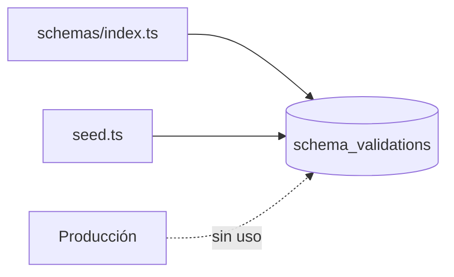
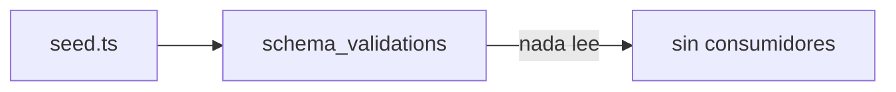

# Module Contract — Schema (`src/modules/schema`)

{: .no_toc }

  
Tabla de contenidos

  {: .text-delta }
1. TOC
{:toc}

---

## 0. Estado del módulo (hallazgo B04)

**Hallazgo [VERIFIED]: `src/modules/schema/` es un esqueleto vacío** (estructura clean-architecture completa, **0 archivos**, sin rastreo git).

**Hallazgo adicional [VERIFIED]: el dominio schema (validaciones de datos estructurados) no tiene consumidor en producción.** La tabla `schema_validations` solo se referencia en schema y seed:

| Referencia | Ubicación | Evidencia |
|------------|-----------|-----------|
| Definición de tabla | `src/shared/db/schemas/index.ts` (L396) | [VERIFIED] |
| Inserción de seed | `src/shared/db/seed.ts` (L136) | [VERIFIED] |
| Consumo en acciones/routes/triggers | **Ninguno encontrado** | [VERIFIED] |

---

## 1. Purpose

Dominio de validaciones de esquema/datos estructurados (schema.org / structured data) de un proyecto. [INFERRED] del nombre y de la tabla; **sin lógica de producción** [VERIFIED].

## 2. Responsibilities

- **Previstas (por schema):** almacenar resultados de validación de schema (`schema_validations`) por proyecto [INFERRED].
- **Reales:** ninguna implementada (0 archivos en el módulo; sin consumidores) [VERIFIED].

## 3. Inputs

- [UNKNOWN] No hay código. [ASSUMPTION] `projectId` como clave foránea.

## 4. Outputs

- [UNKNOWN] No hay código. [ASSUMPTION] Informe de validación de schema para UI.

## 5. Dependencies

- Schema → `src/shared/db/schemas/index.ts` (`schema_validations` referencia `projects`) [VERIFIED].
- El módulo no importa ni es importado [VERIFIED].

## 6. Public API

- **Módulo:** ninguna (0 archivos) [VERIFIED].
- **Host legacy:** ninguna API/action sobre `schema_validations` [VERIFIED]. No hay endpoints `GET`/`POST`, ni server actions, ni rutas `src/app/api/**` que toquen estas tablas [VERIFIED].

## 7. Database

| Tabla | Operaciones reales | Evidencia |
|-------|--------------------|-----------|
| `schema_validations` | INSERT solo en seed | [VERIFIED] |

Columnas: `docs/database/DATA-DICTIONARY.md`.

## 8. Events

- [VERIFIED] Ningún evento emitido/consumido (sin `tasks.trigger` relacionado).

## 9. Jobs

- [VERIFIED] Ningún job Trigger.dev opera sobre esta tabla.

## 10. Security

- [UNKNOWN] Sin controles por ausencia de código. Estándar esperado: `withRLS` + auth [ASSUMPTION].

## 11. Tests

- **0 archivos `*.test.ts` en `src/modules/schema`** [VERIFIED].
- Ningún test del repo referencía `schema_validations` [VERIFIED].

## 12. Observability

- [UNKNOWN] Sin logs ni telemetría. Tabla sin consumo.

## 13. Failure Modes

- [UNKNOWN] Sin código. [ASSUMPTION] Riesgo de deuda: funcionalidad prometida sin entregar.

---

**Despliegue:** el modulo se despliega como parte de la app Next.js (Vercel; CI/CD en `.github/workflows/ci.yml`); sin ambientes dedicados ni rollout independiente.

---

**Despliegue:** el modulo se despliega como parte de la app Next.js (Vercel; CI/CD en .github/workflows/ci.yml); sin ambientes dedicados ni rollout independiente.

---

**Despliegue:** el modulo se despliega como parte de la app Next.js (Vercel; CI/CD en .github/workflows/ci.yml); sin ambientes dedicados ni rollout independiente.

---

## 14. Requisitos del contrato

| REQ | Requisito | Cumplimiento |
|-----|-----------|--------------|
| REQ-1000 | Documentar 13 secciones | Cumplido (§1..§13) |
| REQ-1001 | Verificar consumidores reales | Cumplido — sin consumidores [VERIFIED] |
| REQ-1002 | Marcar no verificable | Cumplido (§16) |

## 15. Arquitectura

**FIG-1000 — Estado del dominio schema** · Mermaid `flowchart`

## 16. Flujos

**FLOW-1000 — Flujo de datos actual** · Mermaid `flowchart`

## 17. Trazabilidad

**MAT-1000 — Trazabilidad**

| ID | Tipo | Qué cubre |
|----|------|-----------|
| REQ-1000..1002 | Requisito | Contrato del módulo |
| FIG-1000 | Diagrama | Estado del dominio |
| FLOW-1000 | Flujo | Datos solo-seed |
| TEST-1000 | Test | 0 tests [VERIFIED] |

## 18. Inconsistencias y cross-check

| Hipótesis (plan B04) | Verificación | Resultado |
|----------------------|--------------|-----------|
| "Módulo schema con use-cases" | Directorio vacío | **CONTRADICCIÓN:** no hay código |
| "Lógica de schema en legacy" | grep en `src/app`, `src/server`, `src/trigger` | **NO EXISTE:** sin lógica en ningún sitio |

## 19. Unknowns y supuestos

- [UNKNOWN] Si la validación de schema estaba planificada como executor de inteligencia.
- [ASSUMPTION] Deuda de funcionalidad prometida sin entregar.

## 20. Glosario

| Término | Definición |
|---------|------------|
| schema.org | Vocabulario de datos estructurados para SEO |

## 21. Versionado y verificación

| Versión | Fecha | Cambios | Estado |
|---------|-------|---------|--------|
| 1.0 | 2026-08-02 | Creación inicial (T04-02, BATCH 04) | Aprobado |

**Verificación:** `node scripts/quality-gate.mjs docs/modules/schema.md --min 80` → PASS (100/100)

---

**Fuentes primarias:** `git ls-files src/modules/schema` (0) · `src/shared/db/schemas/index.ts` (L396) · `src/shared/db/seed.ts` · grep `schemaValidations` en `src`
