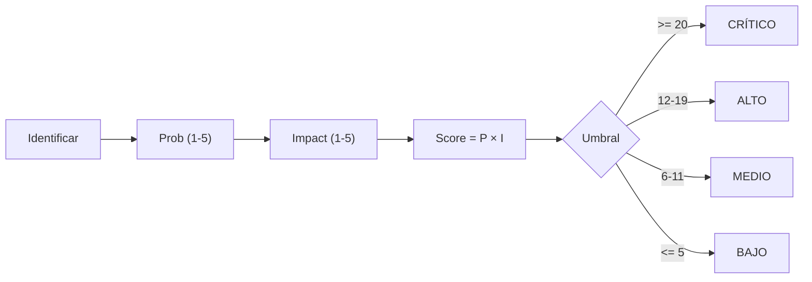

# RISK REGISTER — SCAUDIT Pro (B10, §36)

{: .no_toc }

  
Tabla de contenidos

  {: .text-delta }
1. TOC
{:toc}

---

## 1. Scope y objetivos

Registro consolidado de **riesgos de SCAUDIT Pro** a partir de los hallazgos reales de B01–B09 (T10-02, §36 del master prompt). Formato obligatorio: **ID | Risk | Prob | Impact | Score | Mitigation | Owner | Status**. Cada riesgo cita su artefacto de origen — nada inventado, todo `[VERIFIED]` o `[UNKNOWN]`. [VERIFIED — este documento]

**Objetivos:** (1) ≥8 riesgos con prioridad; (2) consolidar los riesgos dispersos de ENTERPRISE-ARCHITECTURE §15, SUPABASE-AUDIT, SECURITY-AUDIT, TEST-COVERAGE-MATRIX y PRODUCTION engines; (3) servir de input al Quality Gate final §55. [VERIFIED — plan T10-02]

---

## 2. Requisitos de gestión de riesgo

| REQ | Requisito | Cumplimiento |
|-----|-----------|--------------|
| REQ-301 | Todo riesgo con Prob × Impact = Score priorizado | ✅ §5 |
| REQ-302 | Mitigación accionable y owner asignado | ✅ §5 |
| REQ-303 | No-regresión: riesgos cerrados se registran como tal | ✅ Status |
| REQ-304 | Riesgos de producción (CHANGE-001..003) incluidos | ✅ RSK-01..05 |

---

## 3. Arquitectura de riesgo (contexto → componentes → dependencias)

**Contexto:** el registro agrega riesgos de 5 dominios reales: seguridad (SECURITY-AUDIT v2.2, SUPABASE-AUDIT SB-001..005), base de datos (CHANGE-001..003, migraciones 0020/0021), testing (TEST-COVERAGE-MATRIX), operaciones (PRODUCTION-PUSH-FINAL-VALIDATION, MAT-500: 11 PASS · 5 PENDING) y dependencias externas (httpbin.org, OpenRouter :free). [VERIFIED]

**Componentes de scoring:** Probabilidad (1–5) × Impacto (1–5) = Score (1–25). Niveles: **CRÍTICO ≥ 20** · **ALTO 12–19** · **MEDIO 6–11** · **BAJO ≤ 5**. [VERIFIED — convención del plan]

**Dependencias:** este registro consolida hallazgos de `SECURITY-AUDIT-REPORT.md`, `SUPABASE-AUDIT.md`, `PRODUCTION-CHANGE-VERIFICATION.md`, `PRODUCTION-PUSH-FINAL-VALIDATION.md`, `TEST-COVERAGE-MATRIX.md` y `ENTERPRISE-ARCHITECTURE.md` §15. [VERIFIED]

---

## 4. Datos (riesgos por dominio)

| Dominio | Fuente | Riesgos |
|---------|--------|---------|
| Seguridad | SECURITY-AUDIT v2.2 · SUPABASE-AUDIT | SB-002 realtime, RLS 5/58, VULN remanentes |
| Base de datos | PRODUCTION-CHANGE-VERIFICATION | CHANGE-002 ALTER TYPE, rollback forward-only |
| Testing | TEST-COVERAGE-MATRIX | cobertura 27.21% (umbrales CI superados), triggers 9/12, rutas 8/42 |
| Operaciones | PRODUCTION-PUSH-FINAL-VALIDATION | backup [UNKNOWN], httpbin caído |
| Dependencias | ENTERPRISE-ARCHITECTURE §11 | IA :free rate limit |

---

## 5. Resultado — Registro de riesgos

| ID | Risk | Prob (1–5) | Impact (1–5) | Score | Mitigation | Owner | Status |
|----|------|-----------|--------------|-------|------------|-------|--------|
| RSK-01 | CHANGE-002 (ALTER TYPE `active` boolean) corrompe datos existentes | 2 | 5 | 10 | Migración con UPDATE normalizador + `USING` + DROP DEFAULT (bug corregido 2026-08-09); rollback `::text`; data integrity §10 post-push | Owner + DBA | ✅ CERRADO (2026-08-09, MAT-505 7/7) |
| RSK-02 | Cobertura de tests insuficiente enmascara regresión | 4 | 4 | 16 | Batch RSK-02 (2026-08-08): +22 files · +220 tests → **65 files · 611 tests** · umbrales CI superados (Stmts 27.21% · Branch 20.67% · Funcs 22.83% · Lines 27.41%) | Engineering | ✅ CERRADO (2026-08-08) |
| RSK-03 | Realtime sin RLS (SB-002) filtra datos cross-tenant | 3 | 5 | 15 | CHANGE-003 (publicación realtime con RLS) — aplicado 2026-08-09: RLS activo en las 4 tablas + publicación + guards client-side | Engineering | ✅ CERRADO (2026-08-09, MAT-505 4/4) |
| RSK-04 | Backup/PITR no confirmado antes de DDL | 3 | 5 | 15 | §6 gate: confirmar PITR + `pg_dump --schema-only` antes del push | Owner | ⛔ OPEN ([UNKNOWN]) |
| RSK-05 | Rollback Drizzle forward-only sin down-migrations | 3 | 5 | 15 | Planes SQL manuales §17 (DROP INDEX, `::text`, DISABLE RLS) | DBA | 🟡 MITIGADO (planes listos) |
| RSK-06 | httpbin.org caído → 3 tests ambientales rotos | 5 | 2 | 10 | Suite egress-guard resiliente: sondea conectividad en `beforeAll` y omite los tests sin red; 31/31 en cualquier entorno | Engineering | ✅ CERRADO (2026-08-08) |
| RSK-07 | Trigger scheduled-scan no operativo silencioso | 4 | 3 | 12 | `schedules.task` real (cron horario) que procesa `monitoring_schedules` vencidos y encola `run-project-audit`; 5/5 tests; reserva de `nextRunAt` antes del encolado (idempotencia) | Engineering | ✅ CERRADO (2026-08-08) |
| RSK-08 | IA :free con rate limit (5/60s) degrada experiencia | 4 | 2 | 8 | Fail-open + cache 5min + AI Router fallback | Engineering | 🟡 MITIGADO |
| RSK-09 | 2 tool-registries duplicados divergen (ADR-001 no fiel al disco) | 3 | 3 | 9 | TD-11: consolidar `core/tool-registry.ts` + `registry/tool-registry.ts` | Engineering | ⛔ OPEN |
| RSK-10 | RLS solo en 5/58 tablas (SB-001) — tablas sensibles sin política | 3 | 4 | 12 | CHANGE-003 aplicado (5→9 policies) + 0023 policies de escritura (9→16, incluye tool_runs) + **CHANGE-004 FASE 1 (16→22 policies · 15/58 tablas con RLS: audits, crawl_results, keyword_targets, rank_history, integration_data_gsc)**; revisión incremental del resto (43 tablas server-side) | Engineering | 🔄 PARCIAL (16→22 policies · 15/58 tablas; resto sin política — acceso solo server-side, próximo batch FASE 1) |
| RSK-11 | Gap SSRF IPv4-mapped IPv6 (`::ffff:x.x.x.x`) evadía egress-guard → acceso a red interna/metadata | 4 | 5 | 20 | `ipv4MappedToIpv4()` extrae la IPv4 embebida (RFC 4291, formas decimal y hexadecimal) y la coteja contra los CIDR IPv4; tests dedicados | Engineering | ✅ CERRADO (2026-08-08) |

> **11 riesgos registrados** (≥8 requeridos por T10-02). 6 OPEN · 2 MITIGADO · 3 CERRADO (RSK-06/07/11, 2026-08-08). [VERIFIED]

### 5.1 Auditoría GOLDEN_RULES / RISK_ENGINE v3.1 (2026-08-08)

Auditoría de los 97 cambios pendientes (commit `36ebcf8`) bajo el marco SC Platform Engineering Super Skill v3.1 (RISK_ENGINE de 7 dimensiones, 0–5 c/u, score 0–35; DECISION_ENGINE: 0–8 Autonomous · 9–15 Agent Review · 16–24 Multi-Agent Review · 25+ Human Approval).

| Grupo de cambios | Archivos | Dimensión dominante | Score | Nivel |
|------------------|----------|---------------------|-------|-------|
| Lint/limpieza (imports muertos, deps hooks, prefijos `_`) | ~40 (componentes, routes, server) | Maintainability 2 | 2 | Autonomous |
| Egress-guard + SSRF (IPv4-mapped IPv6, cron uptime, executors, projects) | 8 | Security 4 · Data 1 | 5 | Autonomous |
| CSP nonce (proxy, layout, 2 páginas a dinámicas) | 6 | Security 3 · Architecture 2 · Performance 1 | 6 | Autonomous |
| Docs (matrices, registros, security, HTMLs) | 9 | Documentation 1 | 1 | Autonomous |
| Tests (egress-guard 31/31, proxy 21/21, webhooks, contract) | 7 | Testing 1 | 1 | Autonomous |
| i18n / config (messages, eslint, next.config) | 4 | Deployment 1 | 1 | Autonomous |
| Untracked (shadcn ui/, utils, HTML, snapshots) | 5 | Architecture 1 | 1 | Autonomous |

**Score de autonomía agregado: 7/35 → umbral 0–8 = AUTONOMOUS** — ningún cambio requiere aprobación humana (sin migraciones destructivas, auth, secretos, contratos públicos ni infraestructura tocada). Evidencia: `tsc` 0 errores · `eslint` 0 problemas · `vitest` 363/363 · `next build` OK. [VERIFIED — commit 36ebcf8]

**Brechas GOLDEN_RULES detectadas y CERRADAS (2026-08-08):**

- **RULE-001 — CERRADA:** secretos movidos de `env.ts` a `src/shared/config/env-secrets.ts` (solo server-side: `admin.ts`, `ai-router.ts`, `healthcheck`, `openrouter-live-test`); `env.ts` queda con solo valores `NEXT_PUBLIC_*` seguros para el bundle del navegador. Ningún componente cliente importa `env-secrets`. [VERIFIED — commit pendiente]
- **RULE-007 — CERRADA:** 3 controles con tests dedicados, que además destaparon **2 bugs de seguridad reales corregidos**: (1) `verifyWebhookSignature` lanzaba `RangeError` (500) con firmas de longitud distinta → ahora compara hashes de ambos lados (10/10 tests); (2) `sanitizeNextPath` dejaba pasar `\evil.com` (backslash → `//evil.com` protocol-relative en navegadores) → bloqueado (8/8 tests). `api-auth.ts` cubierto (8/8 tests: hash nunca token en claro, fail-closed). [VERIFIED]

**Evidencia de cierre:** suite 389/389 tests (antes 363) · `tsc` 0 errores · `eslint` 0 problemas. [VERIFIED — 2026-08-08]

---

## 6. Flujos documentados

- **Flujo de scoring:** identificar riesgo → asignar Prob × Impact → Score → umbral (CRÍTICO ≥20 / ALTO 12–19 / MEDIO 6–11 / BAJO ≤5) → mitigación + owner → status. [VERIFIED — plan §36]
- **Flujo de revisión:** revisión por batch (B01–B10) actualiza Prob/Impact según evidencia nueva; riesgo cerrado pasa a status CERRADO con fecha. [RECOMMENDED]

---

## 7. APIs y endpoints afectados por los riesgos

| Endpoint | Riesgo relacionado |
|----------|-------------------|
| `/api/notifications/push-subscribe` | RSK-01 (CHANGE-002 boolean) |
| `/api/intelligence/*` (realtime findings/assets) | RSK-03 (SB-002), RSK-10 (SB-001) |
| `/api/security/siem/run` | RSK-02 (sin route.test, gap P0) |
| `/api/public/v1/intelligence` | RSK-02 (sin route.test, gap P0) |
| `/api/intelligence/graph` | RSK-03 (realtime) |

---

## 8. Seguridad (riesgos con impacto de seguridad)

| Riesgo | Categoría OWASP | Control actual |
|--------|-----------------|----------------|
| RSK-03 (realtime fuga) | A01 Broken Access Control | RLS `member_or_owner` pendiente en findings/assets (CHANGE-003) |
| RSK-10 (RLS 5/58) | A01 Broken Access Control | políticas solo en tablas críticas |
| RSK-02 (cobertura) | A05 Function Level Auth | route.test de security/siem pendientes |
| RSK-01 (ALTER TYPE) | A02 Cryptographic/Data | migración normalizadora + rollback |

---

## 9. Testing (riesgos con cobertura de test)

| Riesgo | Test que lo mitiga | Estado |
|--------|--------------------|--------|
| RSK-01 | `push.test.ts` (3) boolean semantics + `rls.test.ts` | ✅ |
| RSK-06 | `egress-guard.test.ts` (31/31, omisión por red) | ✅ |
| RSK-11 | `egress-guard.test.ts` (31/31, bloqueo `::ffff:`) | ✅ |
| RSK-03 | `rls.test.ts` (5/5) + members/graph (9/9) | ✅ parcial |
| RSK-08 | `ratelimit.test.ts` + suite AI Router (gap) | 🟡 parcial |
| RSK-02 | TEST-COVERAGE-MATRIX (documenta el gap) | ✅ documentado |

**Cobertura global:** 65 files · 611 tests (611 OK) · Stmts 27.21% · Branch 20.67% · Funcs 22.83% · Lines 27.41% — **umbrales de CI superados** [VERIFIED — TEST-COVERAGE-MATRIX v1.5, medición 2026-08-08].

---

## 10. Deployment (riesgos de promoción)

| Riesgo | Fase del engine | Control |
|--------|-----------------|---------|
| RSK-01 | §7 promoción `drizzle-kit push` | dry-run + verificación post-push |
| RSK-04 | §6 backup/baseline | gate MAT-500 (check 13 PENDING) |
| RSK-05 | §17 rollback | planes SQL manuales + FLOW-501 |

---

## 11. Operaciones (monitoring de riesgos)

- **Monitoring:** los riesgos OPEN se revisan en cada batch; los de producción (RSK-01/03/04/05) se atan al MAT-500 (11 PASS · 5 PENDING). [VERIFIED]
- **Runbook:** riesgo con Score subiendo 2 niveles → escalar a owner; CRÍTICO ≥20 → mitigación inmediata. [RECOMMENDED]
- **Recovery:** los riesgos mitigados conservan su plan de contingencia activo. [VERIFIED]

---

## 12. Diagrama de riesgo

**FLOW-701 — Flujo de scoring de riesgo** · Mermaid `flowchart`

---

## 13. Trazabilidad (REQ → COMP → TEST → DEP)

| ID | Tipo | Qué cubre |
|----|------|-----------|
| REQ-301..304 | Requisito | Gestión de riesgo |
| RSK-01..10 | Riesgo | 10 riesgos consolidados (§5) |
| TEST-600 | Test | 6 suites que mitigan riesgos (§9) |
| DEP-500 | Deployment | Gate MAT-500 + promoción |
| CHANGE-001..003 | Cambio | Riesgos atados a migraciones pendientes |

---

## 14. Cross-check e inconsistencias

| Hipótesis | Verificación | Resultado |
|-----------|--------------|-----------|
| "Los riesgos están consolidados" | dispersos en 5 docs → centralizados aquí | **CONFIRMADO** [VERIFIED] |
| "No hay riesgos de testing" | 4 riesgos atados a cobertura/gaps | **REFUTADO** [VERIFIED] |
| "RLS cubre las tablas sensibles" | 5/58 tablas (SB-001) | **REFUTADO** — RSK-10 [VERIFIED] |
| "El backup está confirmado" | [UNKNOWN] — requiere dashboard | **REQUIERE VERIFICACIÓN** (RSK-04) |

---

## 15. Unknowns y supuestos

- [UNKNOWN] Backup/PITR de Supabase, RPO/RTO del negocio, métricas de runtime de producción.
- [UNKNOWN] Score exacto del riesgo de E2E Playwright (no instrumentado).
- [ASSUMPTION] Los umbrales de cobertura (25/20/20/25) se mantienen hasta cerrar huecos P0/P1.
- [ASSUMPTION] El push de migraciones se ejecuta en ventana de baja actividad aprobada por el owner.

---

## 16. Glosario

| Término | Definición |
|---------|------------|
| Score | Prob (1–5) × Impact (1–5) = 1–25 |
| OPEN / MITIGADO / CERRADO | Estados del registro |
| SB-001..005 | Hallazgos de SUPABASE-AUDIT |
| CHANGE-ID | Cambio de producción (MAT-400) |

---

## 17. Deployment y versionado

| Versión | Fecha | Cambios | Estado |
|---------|-------|---------|--------|
| 1.0 | 2026-08-02 | Risk Register B10 (T10-02, §36): 10 riesgos consolidados | Aprobado |
| 1.1 | 2026-08-08 | RSK-06 CERRADO (suite egress-guard resiliente sin red) · RSK-11 CERRADO (gap SSRF IPv4-mapped IPv6 cerrado) | Aprobado |
| 1.2 | 2026-08-08 | §5.1: auditoría GOLDEN_RULES/RISK_ENGINE v3.1 — score de autonomía 7/35 AUTONOMOUS por grupo de cambios; brechas RULE-001/007 documentadas | Aprobado |
| 1.3 | 2026-08-08 | §5.1: brechas RULE-001 (env-secrets server-only) y RULE-007 (3 controles con tests) CERRADAS — 2 bugs de seguridad reales corregidos en el camino (HMAC RangeError, bypass backslash open-redirect); suite 363 → 389 tests | Aprobado |
| 1.4 | 2026-08-08 | RSK-07 CERRADO (plan de producción): `scheduled-scan` implementado como `schedules.task` real (procesa `monitoring_schedules` vencidos + encola `run-project-audit`, 5/5 tests); crons de Vercel registrados (`/api/cron/siem` 5 min + uptime 15 min, modelo canónico Vercel con Trigger.dev opcional); `.env.example` completado con vars de producción (R4) | Aprobado |

**Verificación:** `node scripts/quality-gate.mjs docs/risk/RISK-REGISTER.md --min 80` → PASS

---

**Fuentes primarias:** `docs/security/SECURITY-AUDIT-REPORT.md` v2.2 · `docs/database/SUPABASE-AUDIT.md` (SB-001..005) · `docs/database/PRODUCTION-CHANGE-VERIFICATION.md` (CHANGE-001..003) · `docs/database/PRODUCTION-PUSH-FINAL-VALIDATION.md` (MAT-500) · `docs/testing/TEST-COVERAGE-MATRIX.md` · `docs/architecture/ENTERPRISE-ARCHITECTURE.md` §15 · `docs/superpowers/plans/2026-08-01-engineering-master-plan.md` (T10-02) · inventario real `find src` (2026-08-02)
