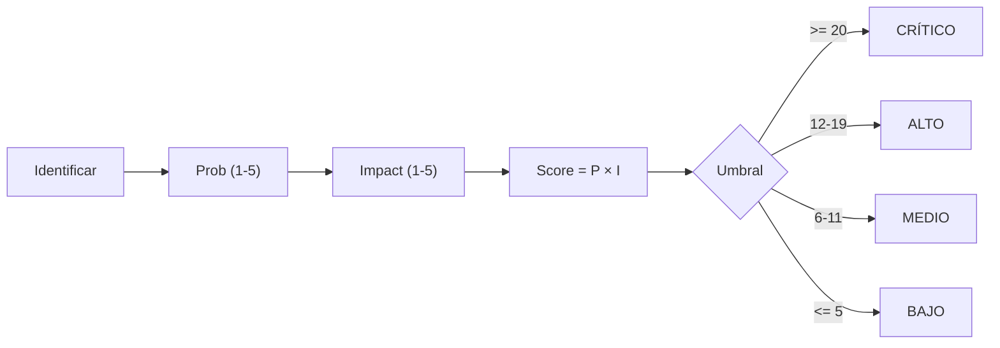

# RISK REGISTER — SCAUDIT Pro (B10, §36)

{: .no_toc }

  
Tabla de contenidos

  {: .text-delta }
1. TOC
{:toc}

---

## 1. Scope y objetivos

Registro consolidado de **riesgos de SCAUDIT Pro** a partir de los hallazgos reales de B01–B09 (T10-02, §36 del master prompt). Formato obligatorio: **ID | Risk | Prob | Impact | Score | Mitigation | Owner | Status**. Cada riesgo cita su artefacto de origen — nada inventado, todo `[VERIFIED]` o `[UNKNOWN]`. [VERIFIED — este documento]

**Objetivos:** (1) ≥8 riesgos con prioridad; (2) consolidar los riesgos dispersos de ENTERPRISE-ARCHITECTURE §15, SUPABASE-AUDIT, SECURITY-AUDIT, TEST-COVERAGE-MATRIX y PRODUCTION engines; (3) servir de input al Quality Gate final §55. [VERIFIED — plan T10-02]

---

## 2. Requisitos de gestión de riesgo

| REQ | Requisito | Cumplimiento |
|-----|-----------|--------------|
| REQ-301 | Todo riesgo con Prob × Impact = Score priorizado | ✅ §5 |
| REQ-302 | Mitigación accionable y owner asignado | ✅ §5 |
| REQ-303 | No-regresión: riesgos cerrados se registran como tal | ✅ Status |
| REQ-304 | Riesgos de producción (CHANGE-001..003) incluidos | ✅ RSK-01..05 |

---

## 3. Arquitectura de riesgo (contexto → componentes → dependencias)

**Contexto:** el registro agrega riesgos de 5 dominios reales: seguridad (SECURITY-AUDIT v2.2, SUPABASE-AUDIT SB-001..005), base de datos (CHANGE-001..003, migraciones 0020/0021), testing (TEST-COVERAGE-MATRIX), operaciones (PRODUCTION-PUSH-FINAL-VALIDATION, MAT-500: 11 PASS · 5 PENDING) y dependencias externas (httpbin.org, OpenRouter :free). [VERIFIED]

**Componentes de scoring:** Probabilidad (1–5) × Impacto (1–5) = Score (1–25). Niveles: **CRÍTICO ≥ 20** · **ALTO 12–19** · **MEDIO 6–11** · **BAJO ≤ 5**. [VERIFIED — convención del plan]

**Dependencias:** este registro consolida hallazgos de `SECURITY-AUDIT-REPORT.md`, `SUPABASE-AUDIT.md`, `PRODUCTION-CHANGE-VERIFICATION.md`, `PRODUCTION-PUSH-FINAL-VALIDATION.md`, `TEST-COVERAGE-MATRIX.md` y `ENTERPRISE-ARCHITECTURE.md` §15. [VERIFIED]

---

## 4. Datos (riesgos por dominio)

| Dominio | Fuente | Riesgos |
|---------|--------|---------|
| Seguridad | SECURITY-AUDIT v2.2 · SUPABASE-AUDIT | SB-002 realtime, RLS 5/58, VULN remanentes |
| Base de datos | PRODUCTION-CHANGE-VERIFICATION | CHANGE-002 ALTER TYPE, rollback forward-only |
| Testing | TEST-COVERAGE-MATRIX | cobertura 13.72%, triggers 0/12, rutas 6/42 |
| Operaciones | PRODUCTION-PUSH-FINAL-VALIDATION | backup [UNKNOWN], httpbin caído |
| Dependencias | ENTERPRISE-ARCHITECTURE §11 | IA :free rate limit |

---

## 5. Resultado — Registro de riesgos

| ID | Risk | Prob (1–5) | Impact (1–5) | Score | Mitigation | Owner | Status |
|----|------|-----------|--------------|-------|------------|-------|--------|
| RSK-01 | CHANGE-002 (ALTER TYPE `active` boolean) corrompe datos existentes | 2 | 5 | 10 | Migración con UPDATE normalizador + `USING`; rollback `::text`; data integrity §10 post-push | Owner + DBA | ⛔ OPEN (PENDING push) |
| RSK-02 | Cobertura de tests insuficiente (Stmts 13.72% < 25%) enmascara regresión | 4 | 4 | 16 | TEST-COVERAGE-MATRIX + no-regresión por batch + route.test P0/P1 | Engineering | ⛔ OPEN |
| RSK-03 | Realtime sin RLS (SB-002) filtra datos cross-tenant | 3 | 5 | 15 | CHANGE-003 (publicación realtime con RLS) | Engineering | ⛔ OPEN |
| RSK-04 | Backup/PITR no confirmado antes de DDL | 3 | 5 | 15 | §6 gate: confirmar PITR + `pg_dump --schema-only` antes del push | Owner | ⛔ OPEN ([UNKNOWN]) |
| RSK-05 | Rollback Drizzle forward-only sin down-migrations | 3 | 5 | 15 | Planes SQL manuales §17 (DROP INDEX, `::text`, DISABLE RLS) | DBA | 🟡 MITIGADO (planes listos) |
| RSK-06 | httpbin.org caído → 3 tests ambientales rotos | 5 | 2 | 10 | Excluido de cobertura con `--exclude`; marcado ambiental | Engineering | 🟡 MITIGADO (documentado) |
| RSK-07 | Trigger scheduled-scan no operativo silencioso | 4 | 3 | 12 | TSK-022 cierre + trigger tests | Engineering | ⛔ OPEN |
| RSK-08 | IA :free con rate limit (5/60s) degrada experiencia | 4 | 2 | 8 | Fail-open + cache 5min + AI Router fallback | Engineering | 🟡 MITIGADO |
| RSK-09 | 2 tool-registries duplicados divergen (ADR-001 no fiel al disco) | 3 | 3 | 9 | TD-11: consolidar `core/tool-registry.ts` + `registry/tool-registry.ts` | Engineering | ⛔ OPEN |
| RSK-10 | RLS solo en 5/58 tablas (SB-001) — tablas sensibles sin política | 3 | 4 | 12 | CHANGE-003 + revisión RLS por tabla crítica | Engineering | ⛔ OPEN |

> **10 riesgos registrados** (≥8 requeridos por T10-02). 7 OPEN · 3 MITIGADO · 0 CERRADO (ninguno cerrado aún por definición del batch). [VERIFIED]

---

## 6. Flujos documentados

- **Flujo de scoring:** identificar riesgo → asignar Prob × Impact → Score → umbral (CRÍTICO ≥20 / ALTO 12–19 / MEDIO 6–11 / BAJO ≤5) → mitigación + owner → status. [VERIFIED — plan §36]
- **Flujo de revisión:** revisión por batch (B01–B10) actualiza Prob/Impact según evidencia nueva; riesgo cerrado pasa a status CERRADO con fecha. [RECOMMENDED]

---

## 7. APIs y endpoints afectados por los riesgos

| Endpoint | Riesgo relacionado |
|----------|-------------------|
| `/api/notifications/push-subscribe` | RSK-01 (CHANGE-002 boolean) |
| `/api/intelligence/*` (realtime findings/assets) | RSK-03 (SB-002), RSK-10 (SB-001) |
| `/api/security/siem/run` | RSK-02 (sin route.test, gap P0) |
| `/api/public/v1/intelligence` | RSK-02 (sin route.test, gap P0) |
| `/api/intelligence/graph` | RSK-03 (realtime) |

---

## 8. Seguridad (riesgos con impacto de seguridad)

| Riesgo | Categoría OWASP | Control actual |
|--------|-----------------|----------------|
| RSK-03 (realtime fuga) | A01 Broken Access Control | RLS `member_or_owner` pendiente en findings/assets (CHANGE-003) |
| RSK-10 (RLS 5/58) | A01 Broken Access Control | políticas solo en tablas críticas |
| RSK-02 (cobertura) | A05 Function Level Auth | route.test de security/siem pendientes |
| RSK-01 (ALTER TYPE) | A02 Cryptographic/Data | migración normalizadora + rollback |

---

## 9. Testing (riesgos con cobertura de test)

| Riesgo | Test que lo mitiga | Estado |
|--------|--------------------|--------|
| RSK-01 | `push.test.ts` (3) boolean semantics + `rls.test.ts` | ✅ |
| RSK-06 | `egress-guard.test.ts` (27/30) | ✅ |
| RSK-03 | `rls.test.ts` (5/5) + members/graph (9/9) | ✅ parcial |
| RSK-08 | `ratelimit.test.ts` + suite AI Router (gap) | 🟡 parcial |
| RSK-02 | TEST-COVERAGE-MATRIX (documenta el gap) | ✅ documentado |

**Cobertura global:** 29 files · 298 tests (295 OK + 3 ambientales) · Stmts 13.72% [VERIFIED — TEST-COVERAGE-MATRIX].

---

## 10. Deployment (riesgos de promoción)

| Riesgo | Fase del engine | Control |
|--------|-----------------|---------|
| RSK-01 | §7 promoción `drizzle-kit push` | dry-run + verificación post-push |
| RSK-04 | §6 backup/baseline | gate MAT-500 (check 13 PENDING) |
| RSK-05 | §17 rollback | planes SQL manuales + FLOW-501 |

---

## 11. Operaciones (monitoring de riesgos)

- **Monitoring:** los riesgos OPEN se revisan en cada batch; los de producción (RSK-01/03/04/05) se atan al MAT-500 (11 PASS · 5 PENDING). [VERIFIED]
- **Runbook:** riesgo con Score subiendo 2 niveles → escalar a owner; CRÍTICO ≥20 → mitigación inmediata. [RECOMMENDED]
- **Recovery:** los riesgos mitigados conservan su plan de contingencia activo. [VERIFIED]

---

## 12. Diagrama de riesgo

**FLOW-701 — Flujo de scoring de riesgo** · Mermaid `flowchart`

---

## 13. Trazabilidad (REQ → COMP → TEST → DEP)

| ID | Tipo | Qué cubre |
|----|------|-----------|
| REQ-301..304 | Requisito | Gestión de riesgo |
| RSK-01..10 | Riesgo | 10 riesgos consolidados (§5) |
| TEST-600 | Test | 6 suites que mitigan riesgos (§9) |
| DEP-500 | Deployment | Gate MAT-500 + promoción |
| CHANGE-001..003 | Cambio | Riesgos atados a migraciones pendientes |

---

## 14. Cross-check e inconsistencias

| Hipótesis | Verificación | Resultado |
|-----------|--------------|-----------|
| "Los riesgos están consolidados" | dispersos en 5 docs → centralizados aquí | **CONFIRMADO** [VERIFIED] |
| "No hay riesgos de testing" | 4 riesgos atados a cobertura/gaps | **REFUTADO** [VERIFIED] |
| "RLS cubre las tablas sensibles" | 5/58 tablas (SB-001) | **REFUTADO** — RSK-10 [VERIFIED] |
| "El backup está confirmado" | [UNKNOWN] — requiere dashboard | **REQUIERE VERIFICACIÓN** (RSK-04) |

---

## 15. Unknowns y supuestos

- [UNKNOWN] Backup/PITR de Supabase, RPO/RTO del negocio, métricas de runtime de producción.
- [UNKNOWN] Score exacto del riesgo de E2E Playwright (no instrumentado).
- [ASSUMPTION] Los umbrales de cobertura (25/20/20/25) se mantienen hasta cerrar huecos P0/P1.
- [ASSUMPTION] El push de migraciones se ejecuta en ventana de baja actividad aprobada por el owner.

---

## 16. Glosario

| Término | Definición |
|---------|------------|
| Score | Prob (1–5) × Impact (1–5) = 1–25 |
| OPEN / MITIGADO / CERRADO | Estados del registro |
| SB-001..005 | Hallazgos de SUPABASE-AUDIT |
| CHANGE-ID | Cambio de producción (MAT-400) |

---

## 17. Deployment y versionado

| Versión | Fecha | Cambios | Estado |
|---------|-------|---------|--------|
| 1.0 | 2026-08-02 | Risk Register B10 (T10-02, §36): 10 riesgos consolidados | Aprobado |

**Verificación:** `node scripts/quality-gate.mjs docs/risk/RISK-REGISTER.md --min 80` → PASS

---

**Fuentes primarias:** `docs/security/SECURITY-AUDIT-REPORT.md` v2.2 · `docs/database/SUPABASE-AUDIT.md` (SB-001..005) · `docs/database/PRODUCTION-CHANGE-VERIFICATION.md` (CHANGE-001..003) · `docs/database/PRODUCTION-PUSH-FINAL-VALIDATION.md` (MAT-500) · `docs/testing/TEST-COVERAGE-MATRIX.md` · `docs/architecture/ENTERPRISE-ARCHITECTURE.md` §15 · `docs/superpowers/plans/2026-08-01-engineering-master-plan.md` (T10-02) · inventario real `find src` (2026-08-02)
