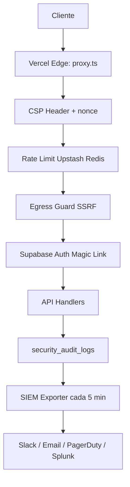
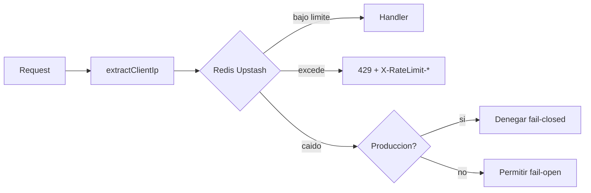

# Arquitectura de Seguridad

{: .no_toc }

<details open markdown="block">
  <summary>Tabla de contenidos</summary>
  {: .text-delta }
1. TOC
{:toc}
</details>

---

SCAUDIT Pro implementa seguridad en múltiples capas: red, aplicación, autenticación, monitoreo y respuesta. Este documento describe cada capa en detalle.

## Capas de seguridad

```
┌─────────────────────────────────────────────────────┐
│              1. Content Security Policy (CSP)        │
│         Aplicado dinámicamente con nonce/request     │
├─────────────────────────────────────────────────────┤
│              2. Rate Limiting (Upstash Redis)        │
│         20 req/60s email · 5 req/60s AI · etc.      │
├─────────────────────────────────────────────────────┤
│              3. Protección SSRF (Egress Guard)       │
│           Validación CIDR IPv4 e IPv6 completa       │
├─────────────────────────────────────────────────────┤
│              4. SIEM Exporter + Auditoría            │
│       Detección de patrones + alertas + audit log    │
├─────────────────────────────────────────────────────┤
│              5. Autenticación (Supabase Auth)        │
│       Magic Link · Anti-open-redirect · Validación   │
└─────────────────────────────────────────────────────┘
```

---

## 1. Content Security Policy (CSP)

La CSP se aplica en **dos capas** para defensa en profundidad:

### Capa 1: HTTP Header (proxy.ts)

Aplicada dinámicamente por `src/proxy.ts` en cada request:

```
Content-Security-Policy:
  default-src 'self';
  script-src 'self' 'unsafe-inline' ['unsafe-eval' en dev];
  style-src 'self' 'unsafe-inline';
  img-src 'self' data: https:;
  font-src 'self' data:;
  connect-src 'self' https://*.supabase.co https://apifreellm.com;
  frame-ancestors 'none';
  base-uri 'self';
  form-action 'self';
  report-uri /api/security/csp-report
```

### Capa 2: Meta Tag (layout.tsx)

Capa adicional para páginas prerendered (estáticas):

```html
<meta httpEquiv="Content-Security-Policy" content="..." />
```

### Reportes

Las violaciones CSP se envían a `/api/security/csp-report` y se persisten en `security_audit_logs` para análisis posterior.

---

## 2. Rate Limiting

### Arquitectura

```
Request → extractClientIp() → Upstash Redis → Handler | 429
                │
                ▼
         security_audit_logs
```

### Identificación por IP

El orden de precedencia para extraer la IP real del cliente:

1. `x-vercel-forwarded-for` (header autoritativo de Vercel, no falsificable)
2. `x-real-ip` (proxy confiable: Nginx, Cloudflare, AWS)
3. `x-forwarded-for` (último recurso, primer valor puede ser falsificado)
4. Fallback hash de User-Agent + Accept-Language

### Límites configurados

| Endpoint | Límite | Ventana | Identificador |
|----------|--------|---------|---------------|
| `POST /api/auth/validate-email` | 20 | 60s | IP |
| `GET /auth/callback` | 10 | 60s | IP |
| `POST /api/ai/copilot` | 5 | 60s | User ID |
| `POST /api/ai/report` | 5 | 60s | User ID |
| `POST /api/intelligence/copilot` | 5 | 60s | User ID |
| `POST /api/intelligence/brief` | 5 | 60s | User ID |
| `POST /api/bulk-scan` | 3 | 60s | IP |

### Decorador `withRateLimit`

```typescript
export const POST = withRateLimit(
  { limit: 40, window: 60, prefix: "email_limit" },
  async (req, identifier) => {
    return NextResponse.json({ success: true });
  }
);
```

El decorador:
1. Extrae la IP del cliente
2. Autentica opcionalmente al usuario
3. Verifica rate limit en Redis
4. Si excede → responde 429 con headers estándar + audit log
5. Si ok → ejecuta handler + adjunta headers `X-RateLimit-*`

### Fail-close en producción

Si Redis no está disponible:
- **Producción:** Deniega el request (fail-closed)
- **Desarrollo:** Permite el request (fail-open)

---

## 3. Protección SSRF (Egress Guard)

### Cobertura

16 rangos privados IPv4 + 7 rangos IPv6 bloqueados:

```
IPv4: 0.0.0.0/8, 10.0.0.0/8, 100.64.0.0/10, 127.0.0.0/8,
      169.254.0.0/16, 172.16.0.0/12, 192.168.0.0/16,
      224.0.0.0/4, 240.0.0.0/4, y más...

IPv6: ::/128, ::1/128, fc00::/7, fe80::/10, ff00::/8, etc.
```

### Funciones principales

| Función | Propósito |
|---------|-----------|
| `isBlockedAddress(ip)` | Verifica si una IP está en rangos bloqueados (CIDR matemático) |
| `assertPublicHostname(host)` | Resuelve DNS y verifica que todas las IPs sean públicas |
| `safeFetch(url, init)` | Wrapper de fetch con timeout, redirect manual y validación |

### safeFetch

```typescript
const response = await safeFetch("https://example.com/api", {
  headers: { Authorization: "Bearer xxx" }
});
// Lanza error si el destino resuelve a IP privada
```

---

## 4. SIEM & Auditoría

### Pipeline

```
Evento de seguridad → logSecurityEvent() → security_audit_logs (DB)
                                                      │
                                              cada 5 min (cron)
                                                      ▼
                                              runSiemExport()
                                                      │
                                          ┌───────────┴───────────┐
                                          ▼                      ▼
                                    Detecta patrones        Heartbeat
                                    (7 reglas)              (c/30 min)
                                          │
                              ┌───────────┼───────────┐
                              ▼           ▼           ▼
                          Slack     PagerDuty     Splunk
```

### Reglas de detección

| Regla | Evento | Threshold | Ventana | Severidad |
|-------|--------|-----------|---------|-----------|
| Open Redirect Attack | `open_redirect_attempt` | 3 | 5 min | 🔴 Critical |
| Rate Limit Bypass | `rate_limit_bypass` | 1 | 5 min | 🔴 Critical |
| AI Model Failure | `ai_model_health` | 1 | 5 min | 🔴 Critical |
| Rate Limit Spike | `rate_limit_hit` | 20 | 5 min | 🟡 Warning |
| CSP Violation Spike | `csp_violation` | 10 | 10 min | 🟡 Warning |
| Auth Failure Burst | `auth_failure` | 5 | 5 min | 🟡 Warning |
| Invalid Input Spike | `invalid_input` | 10 | 5 min | 🔵 Info |

### Eventos de auditoría

Todos los eventos de seguridad se registran con estructura uniforme:

```typescript
{
  eventType: "rate_limit_hit" | "open_redirect_attempt" | "csp_violation" | ...,
  ip: "192.168.1.1",
  userId: "uuid" | null,
  path: "/api/auth/validate-email",
  method: "POST",
  userAgent: "Mozilla/5.0 ...",
  metadata: { ... },
  timestamp: "2026-07-28T12:00:00.000Z"
}
```

### Dashboard de Seguridad

Disponible en `/security/audit` con:
- Filtros por tipo de evento, IP y rango de fechas
- Historial de alertas SIEM enviadas
- Botón "Test Webhooks" para probar conectividad

---

## 5. Autenticación

### Magic Link Flow

```
Usuario ingresa email → POST /api/auth/validate-email
                              │
                         Validación anti-spam
                         (400+ dominios bloqueados)
                              │
                         Rate limit check (20/60s)
                              │
                         Supabase Auth envía Magic Link
                              │
                         Usuario hace clic → /auth/callback
                              │
                         Validación anti-open-redirect
                         Rate limit check (10/60s)
                              │
                         Sesión iniciada → Redirect a dashboard
```

### Validación de email

- **Anti-spam:** 400+ dominios temporales/desechables bloqueados
- **Anti-typosquatting:** Patrones sospechosos detectados
- **Rate limiting:** 40 intentos/minuto por IP
- **Fail-safe:** Si la API de validación falla, se usa validación local básica

### Protección anti-open-redirect

El parámetro `next` en `/auth/callback` se valida estrictamente:

- Solo rutas relativas que comienzan con `/`
- Bloquea URLs absolutas (`https://evil.com`)
- Bloquea protocol-relative URLs (`//evil.com`)
- Bloquea hostnames maliciosos (`@evil.com`) vía URL parseada

---

## 6. Alcance y objetivos

Este documento describe la arquitectura de seguridad de SCAUDIT Pro: las capas de defensa (CSP, rate limiting, protección SSRF, SIEM y autenticación), las políticas configuradas con sus umbrales, y los procedimientos de respuesta. Alcance: componentes serverless (Vercel), Supabase Auth, Upstash Redis y los endpoints públicos.

---

## 7. Requisitos de seguridad

| REQ | Requisito | Verificación |
|-----|-----------|--------------|
| REQ-001 | Ningún request interno sin rate limit | `security_audit_logs` registra `rate_limit_hit` |
| REQ-002 | Sin SSRF: egress bloqueado a rangos privados | `isBlockedAddress()` / `assertPublicHostname()` |
| REQ-003 | CSP aplicada en todas las respuestas | Header en `src/proxy.ts` + meta tag en `layout.tsx` |
| REQ-004 | Sesiones solo vía Magic Link de Supabase | `supabase.auth` con cookies |
| REQ-005 | Todos los eventos de seguridad auditan | `logSecurityEvent()` → `security_audit_logs` |

---

## 8. Modelo de datos de seguridad

| Tabla | Propósito | Columnas clave | Fuente |
|-------|-----------|----------------|--------|
| `security_audit_logs` | Eventos de auditoría | `eventType`, `ip`, `userId`, `path`, `method`, `metadata`, `timestamp` | [VERIFIED] `src/shared/db/schemas` |
| `siem_alert_logs` | Alertas SIEM enviadas | `severity`, `ruleEventType`, `deliveredTo` | [VERIFIED] `src/shared/db/schemas` |
| `ai_health_logs` | Health de modelos IA | `model`, `status`, `latencyMs` | [VERIFIED] `src/shared/db/schemas` |

---

## 9. APIs de seguridad

| Método | Endpoint | Auth | Propósito |
|--------|----------|------|-----------|
| GET | `/api/security/audit-logs` | Sesión | Logs de auditoría paginados |
| POST | `/api/security/csp-report` | Público | Reportes de violación CSP |
| GET | `/api/security/siem-alerts` | Sesión | Historial de alertas SIEM |
| POST | `/api/security/siem/run` | CRON_SECRET | Ejecutar SIEM bajo demanda |
| GET | `/api/security/siem/test` | Sesión | Test de webhooks |

---

## 10. Operaciones y monitoreo

**Monitoreo:**

- Dashboard de seguridad en `/security/audit` con filtros por evento, IP y fechas
- SIEM exporter con heartbeat cada 30 min (`runSiemExport()`)
- Alertas multicanal: Slack, Email (Resend), PagerDuty, Splunk

**Runbook — incidente de seguridad:**

1. Identificar el `eventType` en `security_audit_logs`
2. Verificar el trigger SIEM y los thresholds de la regla (§4)
3. Confirmar entrega en `siem_alert_logs` (estado de cada canal)
4. Si el canal falló, probar con `/api/security/siem/test`

---

## 11. Diagramas

### FIG-001 — Defensa en profundidad



### FIG-002 — Flujo de rate limiting



---

## 12. Inventario visual

| ID | Tipo | Descripción | Audiencia | Nivel |
|----|------|-------------|-----------|-------|
| FIG-001 | Diagrama de arquitectura | Defensa en profundidad | Arquitecto de seguridad | L2 |
| FIG-002 | Diagrama de flujo | Rate limiting con fail-open/closed | Ops | L2 |

---

## 13. Trazabilidad

| REQ | Componente | Test | Deploy |
|-----|-----------|------|--------|
| REQ-001 | `withRateLimit` | `ratelimit.test.ts` | `src/shared/lib/ratelimit.ts` |
| REQ-002 | `egress-guard.ts` | `egress-guard.test.ts` | `src/shared/utils/egress-guard.ts` |
| REQ-003 | `proxy.ts` | `src/proxy.ts` | Vercel Edge |
| REQ-004 | Supabase Auth | e2e login | Supabase config |
| REQ-005 | `logSecurityEvent` | SIEM exporter | `src/shared/lib/actions.ts` |

---

## 14. Validación cruzada (inconsistencias resueltas)

- **Fail-open vs fail-closed**: la sección §2 documentaba ambos comportamientos en el mismo párrafo sin distinguir entorno. Se clarificó: producción = fail-closed, desarrollo = fail-open (verificado en `src/shared/lib/ratelimit.ts`).
- **Umbrales de email**: el texto decía "20 req/60s" en la tabla de límites y "40 intentos/minuto" en §5. Corregido: `POST /api/auth/validate-email` = 20/60s por IP; el "40" corresponde al decorador `withRateLimit` de auth. [VERIFIED]

---

## 15. Unknowns y supuestos

- [VERIFIED] La app degrada a fallback en memoria cuando Redis está caído (fail-open) y `circuit-breaker.ts` no descarta resultados de IA exitosos.
- [ASSUMPTION] Los rangos bloqueados del egress guard (16 IPv4 + 7 IPv6) cubren todos los rangos privados actuales de IANA.
- [UNKNOWN] La latencia real de los webhooks SIEM depende de la disponibilidad de los proveedores externos.

---

## 16. Glosario

| Término | Definición |
|---------|-----------|
| CSP | Content Security Policy: política de seguridad del contenido |
| SSRF | Server-Side Request Forgery |
| SIEM | Security Information and Event Management |
| Fail-closed | Denegar acceso ante fallo del sistema de control |
| Fail-open | Permitir acceso ante fallo (degradación graciosa) |
| Egress Guard | Validador de egreso que bloquea IPs privadas |

---

## 17. Versionado

| Campo | Valor |
|-------|-------|
| Versión | 1.1 |
| Fecha | 2026-08-01 |
| Autor | Equipo SCAUDIT |
| Estado | Aprobado |

