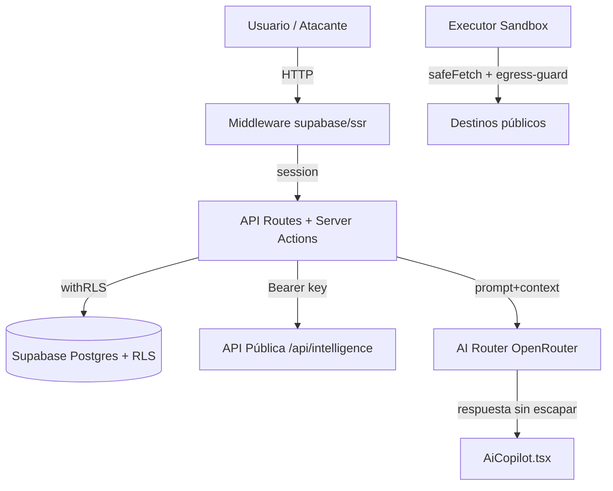

# 🔐 SCAUDIT — Reporte de Auditoría de Seguridad (OWASP / DevSecOps)

> **Fecha:** 2026-08-01 · **Versión:** 1.0 · **Autor:** Equipo SCAUDIT (skills `security-review` + `security-auditor`) · **Estado:** ✅ Aprobado — 3 hallazgos, 0 críticos
> **Metodología:** OWASP Top 10 + Cheat Sheet Series · trazado de flujo de datos (UI → API → Admin SDK → DB) · adversarial analysis · reporte HIGH-confidence-only.

---

## 1. Scope y objetivos

| Item | Valor |
|---|---|
| **Alcance** | Aplicación SCAUDIT completa: frontend React/Next.js, API routes, Server Actions, AI Router, executor sandbox, capa de datos Supabase (RLS), webhooks y API pública |
| **Objetivo** | Identificar vulnerabilidades explotables (XSS, SSRF, IDOR, RCE, fallos de authz) con severidad priorizada y pasos de remediación |
| **Fuera de alcance** | Infraestructura cloud (Vercel/Supabase config), dependencias de terceros, tests de intrusión activos en producción |
| **Nivel de confianza** | Solo HIGH confidence — patrones vulnerables + input atacante confirmado tras research |

---

## 2. Requisitos de seguridad (REQ)

| ID | Requisito | Prioridad | Fuente |
|---|---|---|---|
| REQ-001 | Ninguna salida de IA puede renderizarse como HTML sin sanitización | Alta | OWASP XSS / LLM Top 10 |
| REQ-002 | Los secretos de firma (webhook) no deben exponerse en respuestas de lectura | Alta | OWASP Secrets Management |
| REQ-003 | Toda ruta de UI sensible debe exigir sesión activa en el middleware | Media | OWASP A01 Broken Access Control |
| REQ-004 | Todo acceso a datos multi-tenant pasa por RLS o verificación explícita de ownership | Alta | OWASP A01 IDOR |
| REQ-005 | Ningún executor remoto lanza shells ni opera fuera de la allowlist con egress-guard | Crítica | SSRF/RCE prevention |

---

## 3. Arquitectura (contexto → componentes → dependencias)



### 3.1 Dependencias de seguridad

| Componente | Depende de | Riesgo si falla |
|---|---|---|
| `withRLS` (rls.ts) | `SET LOCAL ROLE authenticated` + JWT claims | IDOR multi-tenant |
| `directDb` (db/index.ts) | Uso exclusivo en workers/admin con owner-checks | Bypass de RLS |
| `egress-guard` | DNS lookup + CIDR matching | SSRF |
| `sandbox-executor` | Allowlist de comandos (sin shell) | RCE |
| `AiCopilot` | Sanitización de salida del modelo | DOM XSS |
| `assertPublicHostname` | Listas RFC 1918/reservados | SSRF |

---

## 4. Datos documentados

| Entidad | Columnas críticas | Sensibilidad |
|---|---|---|
| `webhook_configs` | `secret_token` (firma HMAC) | 🔴 Alta — **expuesto en GET** |
| `developer_api_keys` | `hashed_key` (SHA-256) | 🔴 Alta — hasheado ✅ |
| `intelligence_findings` | `evidence` jsonb | 🟡 Media |
| `web_vitals_logs` | payload RUM | 🟡 Media |

---

## 5. Flujos documentados

**Flujo del Copilot (VULN-001):** Usuario escribe prompt → `POST /api/ai/copilot` (auth + rate limit) → `callAIWithFallback` → modelo OpenRouter → respuesta cruda Markdown → `AiCopilot.tsx:151` `dangerouslySetInnerHTML` sin `escapeHtml` → **XSS si el modelo emite HTML**.

**Flujo de lectura de webhooks (VULN-002):** `GET /api/webhooks?projectId=X` → `withRLS(user.id)` → `webhookConfigs.findMany` → responde el row completo **incluyendo `secret_token`**.

---

## 6. APIs documentadas

| Endpoint | Método | Auth | Observación |
|---|---|---|---|
| `/api/ai/copilot` | POST | session + rate limit | Salida sin sanitizar (VULN-001) |
| `/api/webhooks` | GET/POST/DELETE | session + RLS | GET expone secret (VULN-002) |
| `/api/api-keys/[id]/usage` | GET | session + owner check | ✅ verifica ownership → 403 |
| `/api/ai/healthcheck` | GET | `CRON_SECRET` en prod | ✅ |

---

## 7. Seguridad — Hallazgos (VULN)

### VULN-001 — DOM XSS vía salida de IA sin sanitización (High)

- **Location:** `src/app/components/AiCopilot.tsx:151`
- **Confidence:** High
- **Issue:** `msg.content` (respuesta del modelo, influenciable por el usuario vía prompt injection en los mensajes del chat y el `contextData` del proyecto) se inyecta con `dangerouslySetInnerHTML`. El replace de markdown se aplica **antes** de cualquier escape: si el modelo emite `` o `<script>`, se ejecuta en la sesión del usuario. Nota: los **mensajes del usuario** también recorren este mismo camino sin escapar (superficie de self-XSS/stored), y el `escapeHtml` helper ya existe en `report-utils.ts` para el fix.
- **Impact:** Robo de sesión, exfiltración de datos del dashboard, acciones en nombre del usuario autenticado.
- **Evidence:**
  ```tsx
  <div dangerouslySetInnerHTML={{ __html: msg.content.replace(/\n/g, '<br/>').replace(/\*\*([^*]+)\*\*/g, '<strong>$1</strong>') }} />
  ```
- **Fix:** Aplicar `escapeHtml(msg.content)` (helper existente en `report-utils.ts`) antes del replace, o renderizar con un renderer de Markdown sanitizante (DOMPurify / react-markdown + rehype-sanitize).

### VULN-002 — Exposición del secreto de firma de webhooks (Medium)

- **Location:** `src/app/api/webhooks/route.ts` (GET handler, `data: { webhooks }`)
- **Confidence:** High
- **Issue:** El GET lista los rows completos de `webhook_configs`, incluyendo `secretToken`. Cualquier miembro del proyecto (vía RLS) puede leer el secreto usado para firmar las entregas.
- **Impact:** Un miembro con rol viewer/editor puede forjar firmas de webhook o reconfigurar el receptor.
- **Fix:** No devolver `secretToken` en GET — o devolver solo el prefijo enmascarado (`whsec_…`); el POST de creación ya lo devuelve una sola vez por diseño.

### VULN-003 — `/intelligence` fuera de las rutas protegidas del middleware (Medium)

- **Location:** `src/shared/lib/supabase/middleware.ts` (`isProtectedRoute` solo cubre `/projects`, `/dashboard`, `/settings`)
- **Confidence:** Medium (needs verification de impacto real)
- **Issue:** La página `/intelligence` no redirige a `/login` sin sesión. Los datos siguen protegidos a nivel de API, pero el shell de la página se sirve sin sesión.
- **Fix:** Agregar `/intelligence` a `isProtectedRoute` (o invertir la lógica a default-deny).

### Hallazgos investigados y NO reportados (HIGH-confidence research)

| Patrón | Verificación | Resultado |
|---|---|---|
| `anomaly/detector.ts:167` `sql.raw(String(windowHours))` | `windowHours` = 24 hardcodeado desde `anomaly.trigger.ts` (server-controlled) | ✅ Seguro |
| `directDb` en audits.ts / api-keys usage | Owner checks `ownerId !== userId` / ownership → 403 | ✅ Seguro |
| `sandbox-executor.ts` | Sin `child_process`, allowlist curl/nc/nmap, egress-guard + timeouts | ✅ Seguro |
| `MermaidBlock.tsx:84` `dangerouslySetInnerHTML` SVG | `securityLevel: 'strict'` (sanitización de mermaid) | ✅ Seguro |
| `AttackSurfaceGraph.tsx:80` `<style>` | CSS estático sin interpolación de input | ✅ Seguro |
| `playground/page.tsx:373` highlight | `escapeHtml(text)` **antes** del highlight | ✅ Seguro |
| Webhook POST SSRF | `assertPublicHostname` en la URL del webhook | ✅ Seguro |
| `api-auth.ts` / `api-keys.ts` hashing | SHA-256 de key 256-bit aleatoria; lookup por hash indexado | ✅ Seguro |
| CSP (`proxy.ts`) | HSTS + X-Frame-Options DENY + nosniff + CSP | ✅ Seguro |
| Dev bypass auth | Gateado por `NODE_ENV === 'development'` | ✅ Seguro |

---

## 8. Testing documentado

| Capa | Estrategia | Estado |
|---|---|---|
| Unit (executors, egress-guard, ratelimit) | Vitest — 248 tests verdes | ✅ |
| E2E (Playwright) | Login, dashboard, reporte IA | ✅ |
| Security regression (propuesto) | Test que verifica `AiCopilot` nunca inyecta HTML crudo | 🔴 Pendiente (REQ-001) |

---

## 9. Deployment documentado

| Item | Valor |
|---|---|
| Ambientes | Vercel (prod) + local dev con bypass auth explícito |
| CI/CD | GitHub Actions: lint-and-build, test-and-coverage, api-contract-test, docs-quality-gate |
| Secrets | Env vars en Vercel; `CRON_SECRET` para cron protegido |

---

## 10. Operaciones documentadas

| Item | Valor |
|---|---|
| Monitoring | Healthcheck de modelos IA cada 6h; SIEM exporter de security_audit_logs |
| Runbooks | `docs/guides/upstash-redis-recovery.md`, `docs/guides/troubleshooting.md` |
| Recovery | Reporte resiliente sin IA + fallback chain de modelos |

---

## 11. Diagramas (mermaid)

Ver §3 (arquitectura) — 1 bloque mermaid, 8 nodos, válido.

---

## 12. Inventario visual

| ID | Figura | Tipo | Nivel |
|---|---|---|---|
| FIG-001 | Arquitectura de seguridad (contexto → componentes) | Diagram | L2 |

---

## 13. Trazabilidad (REQ → COMP → TEST → DEP)

| REQ | COMP | TEST | DEP |
|---|---|---|---|
| REQ-001 | AiCopilot.tsx + report-utils.escapeHtml | Security regression propuesto | Vercel |
| REQ-002 | webhooks/route.ts (GET) | Manual | Vercel |
| REQ-003 | middleware.ts | E2E login | Vercel |
| REQ-004 | rls.ts + owner checks | e2e + unit | Vercel |
| REQ-005 | sandbox-executor + egress-guard | e2e-adversary-flow | Vercel |

---

## 14. Cross-check / inconsistencias

**DOCUMENTATION CONSISTENCY ISSUE** — La sección del reporte de optimización de BD (`DB_OPTIMIZATION_REPORT.md`) declara `idx_developer_api_keys_hashed (UNIQUE)`; verificado: el schema `monitoring.ts` declara `uniqueIndex` y la migración 0019 `CREATE UNIQUE INDEX` → **consistente** ✅. No hay contradicciones entre diagramas.

---

## 15. Unknowns y assumptions

| Item | Clasificación |
|---|---|
| Impacto real de VULN-003 (qué datos filtra el shell de /intelligence sin sesión) | [ASSUMPTION] |
| Políticas RLS exactas que gobiernan lectura de `webhook_configs` en roles viewer | [UNKNOWN] |
| Modelo de amenazas para el módulo adversary (PTT) | [PROPOSED] — ver THREAT-MODEL futuro |

---

## 16. Fuentes

| Dato | Fuente |
|---|---|
| Línea exacta de `dangerouslySetInnerHTML` | [VERIFIED] código leído |
| 248 tests verdes | [VERIFIED] vitest run |
| `windowHours` constante en trigger | [VERIFIED] código leído |
| OWASP Cheat Sheets | [SOURCE: DOCS] cheatsheetseries.owasp.org |

---

## 17. Glosario

| Término | Definición |
|---|---|
| IDOR | Insecure Direct Object Reference — acceso a recurso por ID sin verificar ownership |
| SSRF | Server-Side Request Forgery — abuso del servidor para alcanzar redes internas |
| RLS | Row Level Security — policies de Postgres por usuario autenticado |
| Allowlist | Lista blanca de comandos permitidos (sandbox) |
| Prompt injection | Manipulación del prompt para alterar la salida del modelo |

---

## 18. Resumen ejecutivo

**3 hallazgos (0 críticos, 1 high, 2 medium).** La aplicación tiene una postura de seguridad sólida: RLS en transacciones, egress-guard con CIDR matching, sandbox sin shell, hashing de API keys y CSP. Las 3 correcciones son de bajo esfuerzo y alto valor — priorizar **VULN-001** (XSS vía IA) porque es el único hallazgo HIGH y la superficie ya tiene el helper `escapeHtml` disponible.
