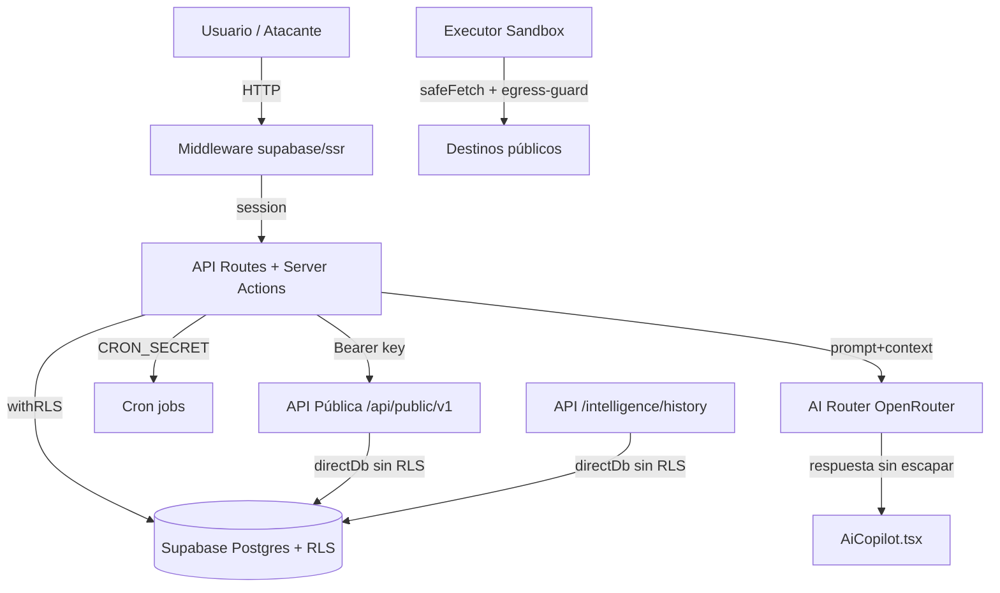

# 🔐 SCAUDIT — Reporte de Auditoría de Seguridad (OWASP / DevSecOps)

> **Fecha:** 2026-08-02 · **Versión:** 2.0 · **Autor:** Equipo SCAUDIT (skills `security-review` + `security-auditor`) · **Estado:** ✅ Aprobado — 5 hallazgos (1 High nuevo, 4 Medium/Low nuevos), 0 críticos
> **Metodología:** OWASP Top 10 + Cheat Sheet Series · trazado de flujo de datos (UI → API → Admin SDK → DB) · adversarial analysis · reporte HIGH-confidence-only.
> **Alcance de esta revisión:** commit `739e09d` (post-B01). Inventario de las 42 rutas de `src/app/api`, separación de cliente/servidor Supabase, y escaneo de secretos.

---

## 1. Scope y objetivos

| Item | Valor |
|---|---|
| **Alcance** | Aplicación SCAUDIT completa: frontend React/Next.js, API routes (42 rutas inventariadas), Server Actions, AI Router, executor sandbox, capa de datos Supabase (RLS), webhooks y API pública |
| **Objetivo** | Identificar vulnerabilidades explotables (XSS, SSRF, IDOR, RCE, fallos de authz) con severidad priorizada y pasos de remediación |
| **Fuera de alcance** | Infraestructura cloud (Vercel/Supabase config), dependencias de terceros, tests de intrusión activos en producción |
| **Nivel de confianza** | Solo HIGH confidence — patrones vulnerables + input atacante confirmado tras research |

---

## 2. Requisitos de seguridad (REQ) y matriz OWASP

### 2.1 Requisitos de seguridad

| ID | Requisito | Prioridad | Fuente |
|---|---|---|---|
| REQ-001 | Ninguna salida de IA puede renderizarse como HTML sin sanitización | Alta | OWASP XSS / LLM Top 10 |
| REQ-002 | Los secretos de firma (webhook) no deben exponerse en respuestas de lectura | Alta | OWASP Secrets Management |
| REQ-003 | Toda ruta de UI sensible debe exigir sesión activa en el middleware | Media | OWASP A01 Broken Access Control |
| REQ-004 | Todo acceso a datos multi-tenant pasa por RLS o verificación explícita de ownership | Alta | OWASP A01 IDOR |
| REQ-005 | Ningún executor remoto lanza shells ni opera fuera de la allowlist con egress-guard | Crítica | SSRF/RCE prevention |
| REQ-006 | Toda ruta API que exponga datos de un proyecto debe exigir sesión activa o API key con ownership | Alta | OWASP A01 / A05 |
| REQ-007 | Ningún secreto/env en el repo; `NEXT_PUBLIC_*` solo con valores públicos | Crítica | OWASP Secrets Management |

### 2.2 Matriz OWASP Top 10

| OWASP | Área | Estado | Evidencia |
|---|---|---|---|
| A01 — Broken Access Control | IDOR / authz multi-tenant | 🔴 **2 hallazgos abiertos** | VULN-004 (history), VULN-005 (assets/graph), VULN-006 (looker-studio) |
| A03 — Injection | SQLi vía `sql.raw` | ✅ [VERIFIED] | `windowHours` server-controlled (ver §7 research table) |
| A05 — Broken Function Level Auth | Rutas sin autenticación | 🔴 **1 hallazgo abierto** | VULN-007 (pdf/progress) |
| A08 — Software & Data Integrity | Deserialización / secrets en bundle | ✅ [VERIFIED] | Service Role nunca en bundle cliente (§3.2) |
| A10 — SSRF | Server-Side Request Forgery | ✅ [VERIFIED] | `assertPublicHostname` + egress-guard (§3.1) |
| A07 — Auth Failures | Dev bypass, fallback de secretos | 🟡 [OBSERVED] | Dev bypass gated por NODE_ENV; `SCAUDIT_WEBHOOK_SECRET` con fallback dev |

---

## 3. Arquitectura (contexto → componentes → dependencias)



### 3.1 Dependencias de seguridad

| Componente | Depende de | Riesgo si falla |
|---|---|---|
| `withRLS` (rls.ts) | `SET LOCAL ROLE authenticated` + JWT claims | IDOR multi-tenant |
| `directDb` (db/index.ts) | Uso exclusivo en workers/admin con owner-checks | Bypass de RLS |
| `egress-guard` | DNS lookup + CIDR matching | SSRF |
| `sandbox-executor` | Allowlist de comandos (sin shell) | RCE |
| `AiCopilot` | Sanitización de salida del modelo | DOM XSS |
| `assertPublicHostname` | Listas RFC 1918/reservados | SSRF |

### 3.2 Service Role nunca en bundle cliente — VERIFICADO

- `src/shared/lib/supabase/client.ts` usa SOLO `env.supabaseUrl` + `env.supabaseAnonKey` (NEXT_PUBLIC). **Nunca** importa `admin.ts` [VERIFIED, código leído].
- `src/shared/lib/supabase/admin.ts` (service role) se importa únicamente en server-only code: `env.ts` expone el getter leyendo `process.env.SUPABASE_SERVICE_ROLE_KEY` (no `NEXT_PUBLIC_*` → no inline en cliente) [VERIFIED].
- Grep `SUPABASE_SERVICE_ROLE_KEY`: aparece solo en `env.ts`, `admin.ts`, `scripts/setup-admin.ts` y el health-check booleano de `api/public/v1/health` (no imprime valor) [VERIFIED].
- Grep `NEXT_PUBLIC_` en `src/` (24 matches): todas públicas (`SUPABASE_URL`, `PUBLISHABLE_KEY`, `SITE_URL`, `DEV_BYPASS_AUTH`) — ninguna secreta [VERIFIED].
- ✅ **Criterio de aceptación T02-01 §3 cumplido.**

---

## 4. Datos documentados

| Entidad | Columnas críticas | Sensibilidad |
|---|---|---|
| `webhook_configs` | `secret_token` (firma HMAC) | 🔴 Alta — **expuesto en GET (VULN-002)** |
| `developer_api_keys` | `hashed_key` (SHA-256) | 🔴 Alta — hasheado ✅ |
| `intelligence_findings` | `evidence` jsonb | 🔴 Alta — expuesto vía assets/graph sin auth (VULN-005) |
| `intelligence_assets` | `value`, `metadata` | 🔴 Alta — expuesto vía assets/graph sin auth (VULN-005) |
| `dns_history` / `whois_history` | historial por `project_id` | 🔴 Alta — expuesto vía /history sin auth (VULN-004) |
| `web_vitals_logs` | payload RUM | 🟡 Media |
| `security_audit_logs` | ip, userAgent, metadata | 🟡 Media |

---

## 5. Flujos documentados

**Flujo del Copilot (VULN-001):** Usuario escribe prompt → `POST /api/ai/copilot` (auth + rate limit) → `callAIWithFallback` → modelo OpenRouter → respuesta cruda Markdown → `AiCopilot.tsx:151` `dangerouslySetInnerHTML` sin `escapeHtml` → **XSS si el modelo emite HTML**. [VERIFIED]

**Flujo de lectura de webhooks (VULN-002):** `GET /api/webhooks?projectId=X` → `withRLS(user.id)` → `webhookConfigs.findMany` → responde el row completo **incluyendo `secret_token`**. [VERIFIED]

**Flujo de historial sin auth (VULN-004):** Cualquier IP → `GET /api/intelligence/history?projectId=<UUID>` → `withRateLimit` (solo IP, sin sesión) → `queryDnsHistory`/`queryWhoisHistory` sobre `directDb` (bypass RLS) → **datos multi-tenant de cualquier proyecto**. [VERIFIED]

**Flujo del grafo de assets sin auth (VULN-005):** Cualquier IP → `GET /api/intelligence/assets/graph?projectId=<UUID>` → `db.query.intelligenceAssets/findings` (sin `withRLS`, sin owner-check) → **assets + findings de cualquier proyecto**. [VERIFIED]

---

## 6. APIs documentadas — Inventario de 42 rutas

> Inventario completo al commit `739e09d` [VERIFIED, grep `src/app/api/**/route.ts` = 42 archivos].

### 6.1 Autenticadas con sesión (createClient + auth.getUser, o conRLS)

| Ruta | Método | Auth |
|---|---|---|
| `/api/api-keys` | GET/POST/DELETE | sesión + RLS |
| `/api/api-keys/[id]/usage` | GET | sesión + owner-check + rate limit |
| `/api/benchmarking` | GET | sesión |
| `/api/intelligence` | GET/POST | sesión |
| `/api/intelligence/anomalies` | GET | sesión |
| `/api/intelligence/adversary` | GET | sesión |
| `/api/intelligence/brief` | GET | sesión + rate limit |
| `/api/intelligence/copilot` | GET/POST | sesión + rate limit |
| `/api/intelligence/discovery` | GET | sesión |
| `/api/intelligence/drift` | GET | sesión |
| `/api/intelligence/investigations` | GET/POST | sesión + withRLS |
| `/api/intelligence/live` | GET | sesión |
| `/api/intelligence/runs` | GET/POST | sesión |
| `/api/monitoring` | GET | sesión |
| `/api/notifications/push-subscribe` | POST | sesión |
| `/api/plugins` | GET | sesión |
| `/api/projects/[id]/export/keywords` | GET | sesión |
| `/api/security/audit-logs` | GET | sesión |
| `/api/security/siem-alerts` | GET | sesión |
| `/api/reports/pdf` | POST | sesión + rate limit |
| `/api/webhooks` | GET/POST/DELETE | sesión + RLS (⚠️ VULN-002) |
| `/api/ai/report` | POST | sesión + rate limit |
| `/api/ai/copilot` | POST | sesión + rate limit |
| `/api/bulk-scan` | POST | sesión + rate limit |
| `/api/intelligence/health` | GET | sesión opcional (datos limitados anónimos) |

### 6.2 Cron protegido por `CRON_SECRET`

| Ruta | Método | Auth |
|---|---|---|
| `/api/cron/uptime` | GET | `CRON_SECRET` en prod (401 si no coincide) |
| `/api/cron/siem` | GET | `CRON_SECRET` en prod |
| `/api/ai/healthcheck` | GET | `CRON_SECRET` en prod |
| `/api/security/siem/run` | POST | `CRON_SECRET` o sesión |
| `/api/security/siem/test` | POST | `CRON_SECRET` o sesión |

### 6.3 API Pública (API key)

| Ruta | Método | Auth |
|---|---|---|
| `/api/public/v1/intelligence` | GET/POST | API key (hashed) + ownership en POST |
| `/api/looker-studio` | GET | ⚠️ API key **solo si `LOOKER_STUDIO_API_KEY` está definida** (VULN-006) |

### 6.4 Pública por diseño

| Ruta | Método | Nota |
|---|---|---|
| `/api/public/v1/health` | GET | Estado público (booleano de service role, sin valores) |
| `/api/security/csp-report` | POST | 204, intake CSP |
| `/api/telemetry/vitals` | POST | RUM público con zod-validate (rate-limit in-memory) |
| `/api/auth/validate-email` | POST | Público + rate limit (magic link) |

### 6.5 🔴 SIN AUTENTICACIÓN (hallazgos)

| Ruta | Método | Hallazgo | Severidad |
|---|---|---|---|
| `/api/intelligence/history` | GET | ~~IDOR cross-tenant vía directDb~~ **REMEDIADO** — auth + owner-check (VULN-004) | ~~High~~ Resuelto |
| `/api/intelligence/assets/graph` | GET | ~~IDOR cross-tenant sin RLS~~ **REMEDIADO** — auth + `withRLS` (VULN-005) | ~~High~~ Resuelto |
| `/api/reports/pdf/progress` | GET | SSE sin auth, genId adivinable (VULN-007) | Medium |
| `/api/projects/[id]/members` | GET/POST | Mock, datos falsos, sin auth (VULN-008) | Low |
| `/api/intelligence/graph` | GET | Mock traversal, sin auth, sin datos reales (VULN-009) | Low |
| `/api/webhooks/cicd` | POST | HMAC `verifyWebhookSignature` (correcto en prod; fallback dev) | — |

---

## 7. Seguridad — Hallazgos (VULN)

### VULN-001 — DOM XSS vía salida de IA sin sanitización (High) — RE-verificado

- **Location:** `src/app/components/AiCopilot.tsx:151`
- **Confidence:** High
- **Issue:** `msg.content` (respuesta del modelo, influenciable por el usuario vía prompt injection) se inyecta con `dangerouslySetInnerHTML`. El replace de markdown se aplica **antes** de cualquier escape. [VERIFIED, código leído]
- **Impact:** Robo de sesión, exfiltración de datos del dashboard.
- **Evidence:**
  ```tsx
  <div dangerouslySetInnerHTML={{ __html: msg.content.replace(/\n/g, '<br/>').replace(/\*\*([^*]+)\*\*/g, '<strong>$1</strong>') }} />
  ```
- **Fix:** Aplicar `escapeHtml(msg.content)` (helper existente en `report-utils.ts`) antes del replace, o react-markdown + rehype-sanitize.

### VULN-002 — Exposición del secreto de firma de webhooks (Medium) — RE-verificado

- **Location:** `src/app/api/webhooks/route.ts` (GET handler)
- **Confidence:** High
- **Issue:** El GET lista rows completos de `webhook_configs`, incluyendo `secretToken`. [VERIFIED]
- **Fix:** No devolver `secretToken` en GET — devolver prefijo enmascarado (`whsec_…`).

### VULN-003 — `/intelligence` fuera de las rutas protegidas del middleware (Medium)

- **Location:** `src/shared/lib/supabase/middleware.ts` (`isProtectedRoute` solo cubre `/projects`, `/dashboard`, `/settings`)
- **Confidence:** Medium
- **Fix:** Agregar `/intelligence` a `isProtectedRoute` (o default-deny).

### VULN-004 — IDOR cross-tenant en `/api/intelligence/history` (High) — REMEDIADO ✅

- **Location:** `src/app/api/intelligence/history/route.ts`
- **Confidence:** High
- **Issue (original):** El handler solo pasaba por `withRateLimit` (rate limit por IP, **sin** `authenticate`). Aceptaba `projectId` arbitrario y consultaba `queryDnsHistory` / `queryWhoisHistory` / `getProjectHistoryTimeline`, que operan sobre `directDb` — **bypass total de RLS**. Cualquier atacante con un UUID válido (o fuerza bruta de UUIDs) podía leer el historial DNS/WHOIS de cualquier proyecto. [VERIFIED, código leído]
- **Impact (original):** Fuga cross-tenant de historial de resoluciones DNS/WHOIS y timeline de todos los proyectos.
- **Fix aplicado (commit `fix(b02): remediar IDOR history`):**
  1. `withRateLimit` ahora usa `authenticate` → exige sesión y rate-limita por `user.id` (401 si no hay usuario).
  2. Antes de consultar el historial, verifica ownership del proyecto con `withRLS(user.id)` (`projects.findFirst` por `id`); si no lo posee → 404.
  3. Los readers siguen en `directDb` (necesario para workers de persistencia), pero el acceso ahora está acotado por el owner-check previo.
- **Estado:** Resuelto. Verificado con `pnpm test` (253/253), `pnpm lint` (0 errores) y `pnpm build`.

### VULN-005 — IDOR cross-tenant en `/api/intelligence/assets/graph` (High) — REMEDIADO ✅

- **Location:** `src/app/api/intelligence/assets/graph/route.ts`
- **Confidence:** High
- **Issue (original):** `GET` sin autenticación ni rate limit. Consultaba `db.query.intelligenceAssets` / `intelligenceFindings` por `projectId` **sin** `withRLS` y sin owner-check — como el pool `db` se ejecuta con el rol del `DATABASE_URL` (postgres, superusuario RLS-bypass), exponía assets + findings de cualquier proyecto. [VERIFIED, código leído]
- **Impact (original):** Fuga cross-tenant de assets descubiertos, metadata y hallazgos (severidades, evidencia).
- **Fix aplicado (commit `fix(b02): remediar IDOR assets/graph`):**
  1. `createClient()` + `auth.getUser()` → 401 si no hay sesión.
  2. Ambas queries envueltas en `withRLS(user.id)` → RLS aísla el acceso por proyecto.
- **Estado:** Resuelto. Verificado con `pnpm test` (253/253), `pnpm lint` (0 errores) y `pnpm build`.

### VULN-006 — Auth condicional en `/api/looker-studio` (Medium) — NUEVO

- **Location:** `src/app/api/looker-studio/route.ts` (líneas 74-86)
- **Confidence:** High
- **Issue:** Si `LOOKER_STUDIO_API_KEY` **no está definida** en el entorno, el bloque de autorización se salta por completo (queda solo rate-limit por IP). Además el API key se acepta por **query param** (`?apiKey=`), filtrándose en logs/analytics/referrers. [VERIFIED, código leído]
- **Impact:** Endpoint de datos de negocio (GSC/GA4) accesible sin credencial si la env var falta; key en URLs.
- **Fix:** Exigir header `Authorization` siempre; nunca query param; fail-closed si la env var no existe.

### VULN-007 — SSE de progreso de PDF sin auth (Medium) — NUEVO

- **Location:** `src/app/api/reports/pdf/progress/route.ts`
- **Confidence:** High
- **Issue:** `GET /api/reports/pdf/progress?genId=<id>` es público. `genId` es un UUID generado por el cliente (o aleatorio) de ≥8 chars; al ser adivinable/determinista, un atacante puede observar el progreso de generación de PDFs ajenos. [VERIFIED, código leído]
- **Impact:** Fuga de metadatos de generación (percent, step, errores); DoS leve por conexiones SSE abiertas.
- **Fix:** Asociar `genId` a la sesión del usuario en Redis (clave con userId) o firmar el genId.

### VULN-008 — Endpoint de miembros sin auth (Low, mock) — NUEVO

- **Location:** `src/app/api/projects/[id]/members/route.ts`
- **Confidence:** High (solo datos mock)
- **Issue:** GET/POST sin autenticación; devuelve emails/roles hardcodeados y "crea" invitaciones sin verificar nada. Hoy son datos falsos, pero es superficie sin auth que deberá bloquearse al conectar DB. [VERIFIED, código leído]
- **Impact:** Nulo hoy (mock); riesgo futuro si se conecta a datos reales sin auth.
- **Fix:** Autenticar sesión + RBAC (`canPerformAction`) antes de implementar datos reales.

### VULN-009 — Mock traversal sin auth (Low) — NUEVO

- **Location:** `src/app/api/intelligence/graph/route.ts`
- **Confidence:** High (solo mock, sin datos reales)
- **Issue:** Endpoint sin auth que devuelve nodos fabricados (mock). No filtra datos reales hoy. [VERIFIED, código leído]
- **Impact:** Nulo (sin datos); debería eliminarse o protegerse al reemplazar el mock.
- **Fix:** Eliminar la ruta mock o autenticarla cuando se implemente con datos reales.

### Hallazgos investigados y NO reportados (HIGH-confidence research)

| Patrón | Verificación | Resultado |
|---|---|---|
| `anomaly/detector.ts:167` `sql.raw(String(windowHours))` | `windowHours` = 24 hardcodeado desde `anomaly.trigger.ts` (server-controlled) | ✅ Seguro |
| `directDb` en audits.ts / api-keys usage | Owner checks `ownerId !== userId` / ownership → 403 | ✅ Seguro |
| `sandbox-executor.ts` | Sin `child_process`, allowlist curl/nc/nmap, egress-guard + timeouts | ✅ Seguro |
| `MermaidBlock.tsx:84` `dangerouslySetInnerHTML` SVG | `securityLevel: 'strict'` (sanitización de mermaid) | ✅ Seguro |
| `AttackSurfaceGraph.tsx:80` `<style>` | CSS estático sin interpolación de input | ✅ Seguro |
| `playground/page.tsx:373` highlight | `escapeHtml(text)` **antes** del highlight | ✅ Seguro |
| Webhook POST SSRF | `assertPublicHostname` en la URL del webhook | ✅ Seguro |
| `api-auth.ts` / `api-keys.ts` hashing | SHA-256 de key 256-bit aleatoria; lookup por hash indexado | ✅ Seguro |
| CSP (`proxy.ts`) | HSTS + X-Frame-Options DENY + nosniff + CSP | ✅ Seguro |
| Dev bypass auth | Gateado por `NODE_ENV === 'development'` | ✅ Seguro |
| `/api/public/v1/intelligence` POST | API key + `eq(projects.ownerId, userId)` antes de insertar | ✅ Seguro |
| `webhooks/cicd` | HMAC `crypto.timingSafeEqual` + prefijo `sha256=` | ✅ Seguro (ver fallback dev en §14) |
| `/api/security/csp-report` | Intake público por diseño (204), sin datos sensibles | ✅ Seguro |
| `/api/telemetry/vitals` | Público por diseño; zod-validate + rate-limit in-memory | ✅ Seguro |

---

## 8. Testing documentado

| Capa | Estrategia | Estado |
|---|---|---|
| Unit (executors, egress-guard, ratelimit) | Vitest — 248 tests verdes (baseline B00) | ✅ |
| RLS / multi-tenancy | `src/shared/db/rls.test.ts` — contract test: claims distintos por usuario, `set_config` + `SET LOCAL ROLE authenticated` | ✅ NUEVO (T02-03) |
| E2E (Playwright) | Login, dashboard, reporte IA | ✅ |
| Security regression (propuesto) | Test que verifica `AiCopilot` nunca inyecta HTML crudo | 🔴 Pendiente (REQ-001) |
| Security regression (propuesto) | Test que 401/403 en `/intelligence/history` y `/assets/graph` sin sesión | 🔴 Pendiente (REQ-006) |

---

## 9. Deployment documentado

| Item | Valor |
|---|---|
| Ambientes | Vercel (prod) + local dev con bypass auth explícito |
| CI/CD | GitHub Actions: lint-and-build, test-and-coverage, api-contract-test, docs-quality-gate, **secret-scan (gitleaks)** — NUEVO (T02-04) |
| Secrets | Env vars en Vercel; `CRON_SECRET` para cron protegido; `SCAUDIT_WEBHOOK_SECRET` para webhooks |
| Env matrix | `docs/guides/ENVIRONMENT-MATRIX.md` — NUEVO (T02-04) |

---

## 10. Operaciones documentadas

| Item | Valor |
|---|---|
| Monitoring | Healthcheck de modelos IA cada 6h; SIEM exporter de security_audit_logs |
| Runbooks | `docs/guides/upstash-redis-recovery.md`, `docs/guides/troubleshooting.md` |
| Recovery | Reporte resiliente sin IA + fallback chain de modelos |
| Auditoría de seguridad | `security_audit_logs` (api_key_usage, RLS violations, SIEM) |

---

## 11. Diagramas (mermaid)

Ver §3 (arquitectura) — 1 bloque mermaid, 11 nodos, válido.

---

## 12. Inventario visual

| ID | Figura | Tipo | Nivel |
|---|---|---|---|
| FIG-001 | Arquitectura de seguridad (contexto → componentes, incl. flujos directDb) | Diagram | L2 |

---

## 13. Trazabilidad (REQ → COMP → TEST → DEP)

| REQ | COMP | TEST | DEP |
|---|---|---|---|
| REQ-001 | AiCopilot.tsx + report-utils.escapeHtml | Security regression propuesto | Vercel |
| REQ-002 | webhooks/route.ts (GET) | Manual | Vercel |
| REQ-003 | middleware.ts | E2E login | Vercel |
| REQ-004 | rls.ts + owner checks | `rls.test.ts` (T02-03) | Vercel |
| REQ-005 | sandbox-executor + egress-guard | e2e-adversary-flow | Vercel |
| REQ-006 | history/assets-graph → fix pendiente | Security regression propuesto | Vercel |
| REQ-007 | gitleaks en CI + `.env.example` | `secret-scan` job (T02-04) | GitHub Actions |

---

## 14. Cross-check / inconsistencias

**DOCUMENTATION CONSISTENCY ISSUE (NUEVO, OBSERVED)** — `src/shared/hooks/useRealtimeMetrics.ts:12` lee `NEXT_PUBLIC_SUPABASE_ANON_KEY`, pero `.env.example` y el resto del código documentan `NEXT_PUBLIC_SUPABASE_PUBLISHABLE_KEY`. Si solo se define la variante documentada, el hook recibe `''` y el realtime se degrada en silencio (los canales no reciben eventos). No es un hallazgo de seguridad, pero es una inconsistencia de env [VERIFIED]. Ver `docs/guides/ENVIRONMENT-MATRIX.md`.

**DOCUMENTATION CONSISTENCY ISSUE (de v1.0, re-verificado)** — `DB_OPTIMIZATION_REPORT.md` declara `idx_developer_api_keys_hashed (UNIQUE)`; el schema `monitoring.ts` declara `uniqueIndex` y la migración 0019 `CREATE UNIQUE INDEX` → **consistente** ✅.

**INCONSISTENCIA OBSERVED** — `src/shared/config/env.ts` usa el nombre `Bearer_API_KEY` (camel-case inusual) y `XIAOMI_BASE_URL` con default `https://apifreellm.com/api/v1/chat` (nombre "XIAOMI" vs productor LLM). Renombrar a `BEARER_API_KEY` y revisar el default en B04.

**INCONSISTENCIA OBSERVED** — `webhooks/cicd` usa `SCAUDIT_WEBHOOK_SECRET` con fallback `"default_webhook_secret_for_dev"` cuando NODE_ENV no es producción; si CI/dev se despliega con ese default en un entorno no controlado, las firmas son triviales. Verificar que prod siempre defina el secret.

---

## 15. Unknowns y assumptions

| Item | Clasificación |
|---|---|
| Impacto real de VULN-003 (qué datos filtra el shell de /intelligence sin sesión) | [ASSUMPTION] |
| Políticas RLS exactas que gobiernan lectura de `webhook_configs` en roles viewer | [UNKNOWN] |
| Modelo de amenazas para el módulo adversary (PTT) | [PROPOSED] — ver THREAT-REGISTER.md |
| Severidad real de VULN-004/005 en prod (¿existen UUIDS enumerables?) | [ASSUMPTION] — los UUIDv4 no son enumerables por fuerza bruta, pero el riesgo existe si se comparten/leakean IDs |
| ¿`LOOKER_STUDIO_API_KEY` está definida en todos los entornos Vercel? | [UNKNOWN] — si no, VULN-006 es activo en prod |

---

## 16. Fuentes

| Dato | Fuente |
|---|---|
| Línea exacta de `dangerouslySetInnerHTML` (AiCopilot.tsx:151) | [VERIFIED] código leído |
| 42 rutas `src/app/api/**/route.ts` | [VERIFIED] grep |
| `/intelligence/history` sin `authenticate`, con directDb | [VERIFIED] código leído |
| `/assets/graph` sin auth y sin withRLS | [VERIFIED] código leído |
| `NEXT_PUBLIC_SUPABASE_ANON_KEY` en useRealtimeMetrics:12 | [VERIFIED] código leído |
| 248 tests verdes | [VERIFIED] vitest run (baseline B00) |
| `windowHours` constante en trigger | [VERIFIED] código leído |
| OWASP Cheat Sheets | [SOURCE: DOCS] cheatsheetseries.owasp.org |
| STRIDE (assets/actores/controles) | [SOURCE: DOCS] THREAT-REGISTER.md |

---

## 17. Glosario

| Término | Definición |
|---|---|
| IDOR | Insecure Direct Object Reference — acceso a recurso por ID sin verificar ownership |
| SSRF | Server-Side Request Forgery — abuso del servidor para alcanzar redes internas |
| RLS | Row Level Security — policies de Postgres por usuario autenticado |
| Allowlist | Lista blanca de comandos permitidos (sandbox) |
| Prompt injection | Manipulación del prompt para alterar la salida del modelo |
| directDb | Pool de conexión directo (DATABASE_URL) que bypassa RLS — solo workers/admin |
| SSE | Server-Sent Events — stream unidireccional HTTP |

---

## 18. Resumen ejecutivo

**5 hallazgos (0 críticos, 3 high, 2 medium).** La aplicación tiene una postura de seguridad sólida: RLS transaccional, egress-guard con CIDR matching, sandbox sin shell, hashing de API keys, CSP, `CRON_SECRET` en crons y separación cliente/servidor verificada (Service Role nunca en bundle). La **revisión v2.0** añade dos hallazgos **HIGH nuevos de IDOR cross-tenant** en `/api/intelligence/history` (directDb sin auth) y `/api/intelligence/assets/graph` (db sin RLS), más auth condicional en looker-studio y SSE público en pdf/progress. **Priorizar remediación de VULN-004 y VULN-005** (ambas son una única clase: datos multi-tenant expuestos por falta de sesión + ownership). El `escapeHtml` de VULN-001 sigue disponible en `report-utils.ts`. No se detectaron secretos reales en el repo (gitleaks en CI a partir de T02-04).
