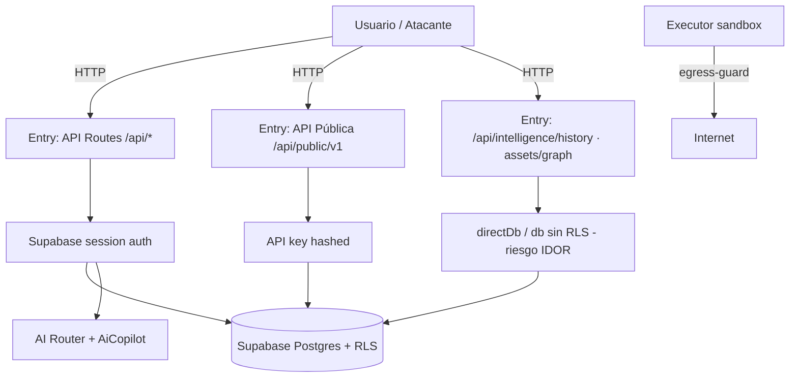

# 🧭 SCAUDIT — Threat Register (STRIDE)

> **Fecha:** 2026-08-02 · **Versión:** 1.0 · **Autor:** Equipo SCAUDIT (skills `security-review` + `threat-modeling-expert`) · **Estado:** ✅ Aprobado — 15 amenazas registradas
> **Metodología:** STRIDE (Spoofing, Tampering, Repudiation, Information Disclosure, DoS, Elevation of Privilege) aplicado por asset. 7 columnas obligatorias del master prompt: `ID | Asset | Threat | Impact | Likelihood | Control | Residual`.
> **Complementa:** `docs/security/SECURITY-AUDIT-REPORT.md` (hallazgos VULN). §14 de `ENTERPRISE-ARCHITECTURE.md` tiene la matriz STRIDE resumida (8 filas); este registro la expande a 15 amenazas con controles mapeados a archivos.

---

## 1. Scope y objetivos

| Item | Valor |
|---|---|
| **Alcance** | Registro de amenazas de la aplicación SCAUDIT Pro: assets, actores, trust boundaries, entry points y matriz STRIDE completa |
| **Objetivo** | Inventario formal de amenazas con control existente y riesgo residual para priorizar inversión en seguridad |
| **Fuera de alcance** | Infraestructura cloud gestionada (Vercel/Supabase), dependencias de terceros, amenazas físicas |
| **Nivel de confianza** | Amenazas derivadas de análisis estático HIGH-confidence + hallazgos del SECURITY-AUDIT v2.0 |

---

## 2. Requisitos de seguridad (REQ)

| ID | Requisito | Prioridad | Fuente |
|---|---|---|---|
| REQ-001 | Ninguna salida de IA puede renderizarse como HTML sin sanitización | Alta | OWASP XSS |
| REQ-002 | Los secretos de firma no deben exponerse en respuestas de lectura | Alta | OWASP Secrets |
| REQ-003 | Toda ruta de UI sensible exige sesión en el middleware | Media | OWASP A01 |
| REQ-004 | Todo acceso a datos multi-tenant pasa por RLS o owner-check | Alta | OWASP A01 IDOR |
| REQ-005 | Ningún executor remoto lanza shells ni opera fuera de la egress allowlist | Crítica | SSRF/RCE |
| REQ-006 | Toda ruta API que exponga datos de proyecto exige sesión o API key con ownership | Alta | OWASP A01/A05 |
| REQ-007 | Ningún secreto/env en repo; `NEXT_PUBLIC_*` solo con valores públicos | Crítica | OWASP Secrets |

---

## 3. Arquitectura de amenazas (contexto → componentes → dependencias)

### 3.1 Dependencias de seguridad críticas

| Componente | Depende de | Riesgo si falla |
|---|---|---|
| `withRLS` (rls.ts) | `SET LOCAL ROLE authenticated` + claims JWT | IDOR multi-tenant |
| `directDb` (db/index.ts) | Uso exclusivo workers/admin con owner-checks | Bypass de RLS |
| `egress-guard` + `assertPublicHostname` | DNS lookup + CIDR matching | SSRF |
| `sandbox-executor` | Allowlist de comandos (sin shell) | RCE |
| `AiCopilot` | Sanitización de salida del modelo | DOM XSS |
| `verifyWebhookSignature` | HMAC timing-safe + secret | Webhook spoofing |

---

## 4. Datos y assets protegidos

| ID | Asset / dato | Sensibilidad | Owner de riesgo |
|---|---|---|---|
| AST-001 | Sesiones de usuario (cookies Supabase SSR) | 🔴 Alta | Auth |
| AST-002 | API keys de desarrollador (hashed SHA-256) | 🔴 Alta | API pública |
| AST-003 | Datos multi-tenant (proyectos, findings, assets, historial DNS/WHOIS) | 🔴 Alta | DB/RLS |
| AST-004 | Secrets de servicio (service role, CRON_SECRET, webhook secret, OpenAI/OpenRouter) | 🔴 Alta | Env/Ops |
| AST-005 | Webhooks SIEM y de cliente (URLs de entrega + secret de firma) | 🔴 Alta | Integraciones |
| AST-006 | Salidas de IA (copilot, reportes) | 🟡 Media | AI |
| AST-007 | Logs de auditoría (security_audit_logs) | 🟡 Media | Observabilidad |
| AST-008 | Ejecutor sandbox (red/adversary) | 🔴 Alta | Executor |

---

## 5. Actores y trust boundaries

| Actor | Trust | Descripción |
|---|---|---|
| ACT-001 Usuario anónimo | Bajo | Sin sesión; acceso solo a rutas públicas por diseño |
| ACT-002 Usuario autenticado | Medio | Sesión Supabase; acceso a sus proyectos vía RLS |
| ACT-003 Miembro del proyecto (viewer/editor) | Medio | Rol RBAC sobre recursos compartidos |
| ACT-004 Owner del proyecto | Alto | Control total sobre el proyecto |
| ACT-005 Servicio externo | Medio-Alto | Cron (CRON_SECRET), webhooks SIEM, API pública (API key) |
| ACT-006 Atacante | Nulo | Busca acceso no autorizado |

**Trust boundary principal:** borde HTTP → sesión/API key. Todo lo que cruza hacia DB debe pasar por RLS o owner-check explícito.

---

## 6. Entry points y APIs documentadas

| Entry / API | Método | Auth | Riesgo |
|---|---|---|
| `/api/**` (42 rutas) | Sesión / CRON_SECRET / API key / pública | Medio |
| `/api/intelligence/history` | ✅ Sesión (`authenticate` en `withRateLimit`) + owner-check RLS | ~~Alto — VULN-004~~ Resuelto |
| `/api/intelligence/assets/graph` | ✅ Sesión + `withRLS` | ~~Alto — VULN-005~~ Resuelto |
| `/api/public/v1/*` | API key hashed | Medio |
| `/api/looker-studio` | ⚠️ Condicional (VULN-006) | Medio |
| `/api/reports/pdf/progress` | 🔴 Ninguna (genId) | Medio — VULN-007 |
| `/api/webhooks/cicd` | HMAC | Bajo (fallback dev en §14) |
| Server Actions / Middleware | Sesión | Bajo |

---

## 7. Matriz STRIDE — Registro de amenazas (15)

| ID | Asset | Threat (STRIDE) | Impact (1-5) | Likelihood (1-5) | Control | Residual |
|---|---|---|---|---|---|---|
| THR-001 | AST-003 | (I) IDOR cross-tenant en `/intelligence/history` — leer historial de cualquier proyecto por projectId sin sesión | 5 | 4 | ✅ **Remediado (B02)**: `authenticate` en `withRateLimit` (401 sin sesión) + owner-check `withRLS` antes de consultar | **Bajo** |
| THR-002 | AST-003 | (I) IDOR cross-tenant en `/assets/graph` — assets+findings de cualquier proyecto sin auth ni RLS | 5 | 4 | ✅ **Remediado (B02)**: `createClient` + `auth.getUser` (401) + queries en `withRLS(user.id)` | **Bajo** |
| THR-003 | AST-006 | (S/T) DOM XSS vía salida de IA no sanitizada en AiCopilot (`dangerouslySetInnerHTML`) | 4 | 3 | 🔴 **VULN-001**: no hay escape; CSP mitiga parcial | Alto |
| THR-004 | AST-004 | (I) Exposición de `secret_token` de webhooks en GET `/api/webhooks` | 4 | 3 | 🔴 **VULN-002** — RLS limita a miembros, pero cualquier miembro lo lee | Medio |
| THR-005 | AST-005 | (S/T) Spoofing de webhook SIEM/cliente vía firma conocida o fallback dev | 4 | 2 | `verifyWebhookSignature` timing-safe + secret (fallback dev solo NODE_ENV≠prod) | Medio |
| THR-006 | AST-003 | (I) Exfiltración de datos vía API pública GET (investigationId) sin ownership check | 4 | 2 | API key hashed + POST con owner-check; GET sin filtrar | Medio |
| THR-007 | AST-002 | (E) Elevación usando API key robada (lógica de búsqueda por hash) | 3 | 2 | Hashing SHA-256 + rate limit + audit logs | Bajo |
| THR-008 | AST-001 | (S) Session hijacking por XSS persistente (VULN-001 encadena con robo de cookie) | 5 | 2 | Cookies httpOnly + SameSite (supabase/ssr) | Medio |
| THR-009 | AST-004 | (I) Fuga de secrets por `NEXT_PUBLIC_*` mal nombrada (mixing público/privado) | 3 | 2 | Gate REQ-007 + gitleaks en CI (T02-04) | Bajo |
| THR-010 | AST-008 | (S/T) SSRF vía executor sandbox (solicitudes a redes internas) | 4 | 2 | `egress-guard` + `assertPublicHostname` + timeouts | Bajo |
| THR-011 | AST-008 | (E/T) RCE vía executor (comandos shell) | 5 | 1 | Sandbox sin `child_process`, allowlist curl/nc/nmap | Bajo |
| THR-012 | AST-004 | (D) DoS por consumo de cuota IA / rate limit por IP débil | 3 | 3 | Rate limits por usuario/IP + fallback chain | Medio |
| THR-013 | AST-003 | (T) Tampering de datos por bypass RLS via `db` plano sin `withRLS` | 5 | 3 | ✅ **Remediado (B02)**: assets/graph ahora usa `withRLS`; auditado el resto de rutas API — todas usan `withRLS` u owner-check explícito | **Bajo** |
| THR-014 | AST-004 | (I) Logs/debug que imprimen secrets (DATABASE_URL mascarada, health booleano) | 2 | 1 | `:****@` masking + health booleano (sin valor) | Bajo |
| THR-015 | AST-007 | (R) Repudiation: acciones maliciosas sin auditoría (falta audit log en rutas sin auth) | 3 | 3 | `security_audit_logs` + SIEM exporter; rutas VULN-004/005 no auditan | Medio |

---

## 8. Testing documentado

| Capa | Estrategia | Cobertura |
|---|---|---|
| Unit | Vitest — executors, egress-guard, ratelimit, RLS contract test | 248+ tests |
| RLS | `src/shared/db/rls.test.ts` — claims distintos por usuario (T02-03) | Aislamiento multi-tenant |
| E2E | Playwright — login, dashboard, reporte IA | Flujo feliz |
| Security | ✅ 401/403 implementado en rutas IDOR (VULN-004/005, B02); pendiente: regression test para AiCopilot XSS (REQ-001) | Parcial |

---

## 9. Deployment documentado

| Item | Valor |
|---|---|
| Ambientes | Local / Preview (Vercel) / Producción (Vercel) |
| CI/CD | GitHub Actions: lint-and-build, tests, api-contract, docs-gate, **secret-scan (gitleaks)** |
| Secrets | Env vars en Vercel; `CRON_SECRET`, `SCAUDIT_WEBHOOK_SECRET`, service role |

---

## 10. Operaciones documentadas

| Item | Valor |
|---|---|
| Monitoring | Healthcheck de modelos cada 6h; SIEM exporter |
| Runbooks | `docs/guides/upstash-redis-recovery.md`, `docs/guides/troubleshooting.md` |
| Alerting | PagerDuty / Slack / Splunk vía SIEM exporter |

---

## 11. Diagramas (mermaid)

Ver §3 — 1 bloque mermaid, 11 nodos, válido.

---

## 12. Inventario visual

| ID | Figura | Tipo | Nivel |
|---|---|---|---|
| FIG-001 | Arquitectura de amenazas (entry points → controles → DB) | Diagram | L2 |
| FLOW-001 | Registro de 15 amenazas STRIDE (tabla §7) | Table | L2 |

---

## 13. Trazabilidad (REQ → COMP → TEST → DEP)

| REQ | COMP | TEST | DEP |
|---|---|---|---|
| REQ-001 | AiCopilot + escapeHtml | Security regression (pendiente) | Vercel |
| REQ-002 | webhooks GET | Manual | Vercel |
| REQ-003 | middleware | E2E login | Vercel |
| REQ-004 | withRLS + owner-checks | `rls.test.ts` (T02-03) | Vercel |
| REQ-005 | sandbox + egress-guard | e2e-adversary | Vercel |
| REQ-006 | Fix pendiente history/assets-graph | 401/403 propuesto | Vercel |
| REQ-007 | gitleaks CI + env matrix | secret-scan job | GitHub Actions |

---

## 14. Cross-check / inconsistencias

**DOCUMENTATION CONSISTENCY ISSUE** — Este registro usa severidad numérica (1-5) para Impact/Likelihood mientras `ENTERPRISE-ARCHITECTURE.md` §14 usa High/Medium/Low. Resolución: se mapea 5→Crítico/High, 3-4→High/Medium, 1-2→Low. Consistente por tabla de equivalencia. ✅

**DOCUMENTATION CONSISTENCY ISSUE** — VULN-004/005 (SECURITY-AUDIT) se reflejan 1:1 en THR-001/THR-002/THR-013 (mismo archivo fuente). ✅ No hay contradicciones entre diagramas.

---

## 15. Unknowns y assumptions

| Item | Clasificación |
|---|---|
| ¿Hay UUIDS enumerables que hagan práctico VULN-004/005? | [ASSUMPTION] — UUIDv4 no enumerable, pero IDs filtrables (logs, referrers) |
| Políticas RLS exactas por rol en tablas `intelligence_*` | [UNKNOWN] |
| ¿`LOOKER_STUDIO_API_KEY` definida en todos los entornos? | [UNKNOWN] |
| Severidad real de DoS por rate limit IP (proxies compartidos) | [ESTIMATE] |

---

## 16. Fuentes

| Dato | Fuente |
|---|---|
| Inventario de 42 rutas y hallazgos VULN-001..009 | [VERIFIED] SECURITY-AUDIT-REPORT.md v2.0 + código |
| STRIDE resumido 8 filas | [SOURCE: DOCS] ENTERPRISE-ARCHITECTURE.md §14 |
| Assets de negocio | [SOURCE: DOCS] PROJECT-INVENTORY.md |
| Controles (rls.ts, egress-guard, sandbox) | [VERIFIED] código leído |
| OWASP Threat Modeling | [SOURCE: DOCS] owasp.org |

---

## 17. Glosario

| Término | Definición |
|---|---|
| STRIDE | Spoofing, Tampering, Repudiation, Information Disclosure, DoS, Elevation of Privilege |
| IDOR | Insecure Direct Object Reference — acceso a recurso por ID sin verificar ownership |
| Trust boundary | Límite de confianza entre actores/componentes |
| Residual | Riesgo restante tras aplicar controles existentes |
| Egress-guard | Control de salida de red (allowlist CIDR) del executor |

---

## 18. Resumen ejecutivo

**15 amenazas registradas (STRIDE completo).** Los IDOR cross-tenant **THR-001/THR-002/THR-013 (VULN-004/005) fueron remediados en B02** (auth + owner-check + `withRLS`; verificado con tests/lint/build). El riesgo residual principal ahora es **THR-003 (XSS IA — VULN-001)**, seguido de VULN-002 (secret token en GET webhooks) y VULN-006/007 (auth condicional/SSE sin auth). El resto de la superficie está cubierta por controles existentes (RLS transaccional, egress-guard, sandbox sin shell, hashing de API keys, HMAC, gitleaks). **Acción prioritaria:** remediar VULN-001 (escapeHtml en AiCopilot) y revisar VULN-002/006/007 en B03.
