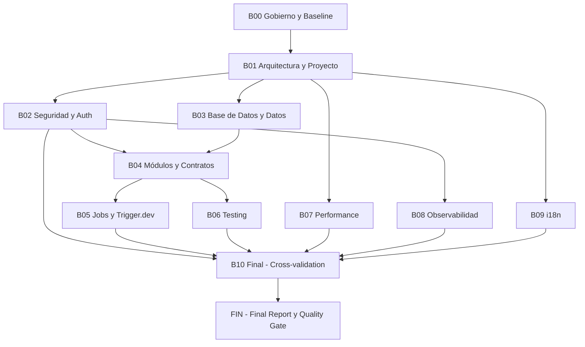

# PLAN MAESTRO DE INGENIERÍA — SCAUDIT Pro (MASTER PROMPT 2.0)

> **For agentic workers:** REQUIRED SUB-SKILL: Use `superpowers:executing-plans` to implement this plan batch-by-batch, con checkpoints de revisión. Los pasos usan sintaxis de checkbox (`- [ ]`).

**Goal:** Convertir SCAUDIT Pro en un sistema **comprendible → documentado → auditable → seguro → testeable → observable → mantenible → evolutivo**, partiendo del estado actual (roadmap de features 100% completado) y llevándolo a un **Engineering Master Plan ejecutable** con artefactos documentales, decisiones registradas (ADRs), gaps cerrados y deuda técnica controlada.

**Architecture:** Modular Monolith sobre Next.js 16 (App Router) + Supabase (PostgreSQL + RLS) + Upstash Redis + Trigger.dev, con capas por módulo (`domain / application / infrastructure / presentation`) ya presentes en `src/modules/*`. El plan es **no destructivo**: primero se produce CURRENT STATE, luego TARGET STATE, y solo después MIGRATION PLAN con tareas de implementación (MODE C) aprobadas.

**Tech Stack:** Next.js 16.2.4 · React 19.2.4 · TypeScript 5 · Drizzle ORM 0.45 · Supabase · Upstash Redis · Trigger.dev 4.4 · OpenRouter · Vitest 4 · Playwright 1.59 · next-intl 4.13 · Tailwind v4 · GitHub Actions.

---

## Alcance y objetivos

**Alcance:** convertir SCAUDIT Pro en un sistema comprendible → documentado → auditable → seguro → testeable → observable → mantenible → evolutivo mediante **11 batches incrementales (B00→B10)** bajo el MASTER PROMPT 2.0. **Objetivos:** (1) producir CURRENT STATE verificado; (2) definir TARGET STATE con arquitectura target; (3) ejecutar MIGRATION PLAN (MODE C) con tareas aprobadas por checkpoint. El plan es **no destructivo** — primero se documenta, luego se implementa solo con aprobación explícita (regla de gobierno 2). **Fuera de alcance:** cambios de código sin pasar por MODE A/B y sin checkpoint. [VERIFIED]

## Requisitos

| ID | Requisito | Tarea(s) | Batch |
|----|-----------|----------|-------|
| REQ-001 | Inventario técnico verificado (32 elementos) | T01-01 | B01 |
| REQ-002 | Seguridad auditada (OWASP + threat register STRIDE) | T02-01, T02-02 | B02 |
| REQ-003 | Data dictionary completo sin columnas inventadas (58 tablas) | T03-01 | B03 |
| REQ-004 | 12 job contracts con análisis de idempotencia | T05-01, T05-02 | B05 |
| REQ-005 | Quality Gate final 27/27 §55 + cross-validation §54 | T10-04 | B10 |

## Global Constraints

Copiadas literalmente del MASTER PROMPT 2.0 (fuente de verdad: `docs/improvements/MASTER_PROMPT-v2.md` y `AGENTS.md`):

1. **Prime Directive:** Comprender antes de modificar. Nunca `código → recomendación` directo; siempre DISCOVERY → INVENTORY → BASELINE → CURRENT STATE → AUDIT → GAP → TARGET → DECISIONES → ROADMAP → TASKS.
2. **Anti-hallucination:** toda afirmación clasificada como `[VERIFIED]` / `[OBSERVED]` / `[USER PROVIDED]` / `[INFERRED]` / `[RECOMMENDED]` / `[ASSUMPTION]` / `[UNKNOWN]`. Nunca inventar archivos, tablas, endpoints, env vars, secretos, dependencias, métricas ni relaciones.
3. **Non-destructive analysis:** durante el análisis NO modificar código, NO eliminar archivos, NO migrar dependencias, NO cambiar schema, NO refactors.
4. **NO introducir por defecto:** Docker, Kubernetes, microservicios, Redis aparte de Upstash, Kafka, RabbitMQ, BullMQ, infraestructura pesada. Solo con necesidad demostrable.
5. **Solución preferida:** modular monolith + serverless + managed services.
6. **FACT vs RECOMMENDATION:** separar siempre evidencia de sugerencia.
7. **Nunca documentar valores secretos reales.**
8. **Todo documento nuevo debe pasar el quality gate** `scripts/quality-gate.mjs --min 80` (umbral CI `docs-quality-gate`).
9. **Frecuencia de commits:** commits atómicos por tarea completada + verificada; nunca commitear secretos.
10. **RTK:** los comandos de shell se ejecutan con prefijo `rtk` cuando el shim está disponible (en este entorno `rtk` no existe → usar git/npm/pnpm directamente).

---

## Contexto del proyecto (estado real verificado)

| Ítem | Estado | Evidencia |
|------|--------|-----------|
| Framework | Next.js 16.2.4, React 19.2.4, TypeScript 5 | `package.json` [VERIFIED] |
| ORM / DB | Drizzle 0.45, Supabase PostgreSQL, 56 tablas (asumido), RLS `withRLS()` | `src/shared/db/**`, `drizzle/` [VERIFIED] |
| Migraciones | 20 SQL en `drizzle/` (0000–0019); `0019` SIN commitear | `git status`, `drizzle/` [VERIFIED] |
| Route Handlers | 42 archivos `route.ts` | `Get-ChildItem src/app/api -Filter route.ts` [VERIFIED] |
| Trigger.dev | 12 tasks (`src/trigger/*.trigger.ts`) | glob [VERIFIED] |
| Tests unit | 18 archivos `*.test.ts` (Vitest) | conteo [VERIFIED] |
| Tests en `src/modules` | **0 archivos** `*.test.ts` | conteo [VERIFIED] |
| E2E | 4 specs Playwright (login, app, pentest, visual) | `e2e/*.spec.ts` [VERIFIED] |
| Modular monolith | 9 módulos clean-architecture en `src/modules/` (audit, backlinks, competitors, cro, integrations, keywords, performance, reporting, schema) | tree [VERIFIED] |
| i18n | `next-intl`, es/en, 650+ keys, cookie-based (`localePrefix: never`) | `messages/`, `src/i18n/` [VERIFIED] |
| Seguridad | CSP nonce en `src/proxy.ts`, egress-guard, rate limit Upstash fail-open, RLS, SIEM, audit logs | `src/proxy.ts`, `src/server/intelligence/security/egress-guard.ts` [VERIFIED] |
| CI | 4 jobs: lint+build, docs-quality-gate (min 80), test+coverage, api-contract | `.github/workflows/ci.yml` [VERIFIED] |
| Docs | 17 docs a 100/100 en quality gate; ENTERPRISE-ARCHITECTURE.md v2.0 aprobado; ROADMAP 36/36 | `docs/`, `QUALITY_GATE_REPORT.md` [VERIFIED] |
| ADRs | **No existe** directorio `docs/adr` ni archivos `ADR-*` | grep `ADR-` en `docs/` [VERIFIED] |
| Git | Branch `main`, working tree con cambios sin commitear (0019, schemas, executors, `docs/security/`, scripts) | `git status` [VERIFIED] |

### Gaps detectados en inventario (primeros hallazgos, se refinan en B01)

1. `src/modules/*` sin tests unitarios.
2. Sin ADRs registrados (solo plantilla en MASTER_PROMPT-v2.md).
3. Sin Data Dictionary completo ni ERD completo (solo ERD núcleo).
4. Sin trazabilidad traceability-matrix documentada.
5. Sin Risk Register ni Technical Debt Register como artefactos independientes.
6. Contratos de módulo (Module Contract) no documentados para `src/modules/*` ni para los 12 jobs.
7. Estado git no limpio: riesgo de drift antes de cualquier análisis.
8. Solo 5 route handlers con `route.test.ts` (cron/siem, cron/uptime, adversary, webhooks).

---

## Modos de ejecución

| Modo | Contenido | ¿Cuándo? |
|------|-----------|----------|
| **A — AUDIT** | DISCOVERY + ANALYSIS + FINDINGS | Por batch: primera pasada, sin implementar |
| **B — ARCHITECTURE** | CURRENT → GAP → TARGET → ADR → ROADMAP | Por batch: segunda pasada |
| **C — IMPLEMENTATION** | TASK → IMPLEMENT → TEST → VALIDATE → DOCUMENT | Solo tras aprobar la arquitectura del batch |

**Regla:** nunca saltar de MODE A a MODE C sin pasar por MODE B y sin checkpoint de revisión del usuario. Cada batch termina con un checkpoint (ver §Checkpoints).

---

## Batches (ejecución incremental, B00 → B10)



| Batch | Nombre | Entregable principal |
|-------|--------|----------------------|
| B00 | Gobierno y Baseline | Estado git estable, MASTER INDEX, esqueleto `docs/` target |
| B01 | Arquitectura y Proyecto | Inventory actualizado, System Map, Module Map, Dependency Graph, ADRs fundacionales |
| B02 | Seguridad y Auth | Audit de seguridad actualizado, Threat Register STRIDE, validación RLS, secretos |
| B03 | Base de Datos y Datos | Data Dictionary, ERD completo, Index Strategy, Data Lineage, estado de migraciones |
| B04 | Módulos y Contratos | Module Contract por cada módulo (`src/modules/*` + `src/server/*` legacy) |
| B05 | Jobs y Trigger.dev | Job Contract por cada trigger + análisis idempotencia/retries |
| B06 | Testing | Test Coverage Matrix + tests nuevos (prioridad: `src/modules/*` y rutas sin test) |
| B07 | Performance | Refresh del PERFORMANCE_REPORT + LCP/INP/bundle + optimizaciones |
| B08 | Observabilidad | Logs/Métricas/Traces, correlation IDs, alertas |
| B09 | i18n | Audit next-intl: keys huérfanas, fallback, prompts IA |
| B10 | Final | Traceability Matrix, Risk Register, Tech Debt Register, Final Report §51, Quality Gate |

---

## Arquitectura de archivos de salida

```
docs/
├── superpowers/plans/2026-08-01-engineering-master-plan.md   ← este plan
├── architecture/
│   ├── ENTERPRISE-ARCHITECTURE.md        [existe — se actualiza en B01]
│   └── ADR/                              [CREAR en B01]
│       ├── ADR-001-consolidar-tool-registry.md
│       ├── ADR-002-fail-open-rate-limit.md
│       ├── ADR-003-i18n-cookie-based.md
│       ├── ADR-004-polling-vs-sse.md
│       ├── ADR-005-egress-guard-ssrf.md
│       ├── ADR-006-rls-with-set-local-role.md
│       └── ADR-000-template.md
├── database/
│   ├── DATA-DICTIONARY.md                [CREAR en B03]
│   ├── ERD.md                            [CREAR en B03]
│   └── INDEX-STRATEGY.md                 [CREAR en B03]
├── security/
│   ├── SECURITY-AUDIT-REPORT.md          [existe — actualizar en B02]
│   └── THREAT-REGISTER.md                [CREAR en B02]
├── modules/
│   ├── MODULE-CONTRACT-template.md       [CREAR en B04]
│   └── <module>.md (9 módulos)           [CREAR en B04]
├── jobs/
│   └── JOB-CONTRACT-<name>.md (12 jobs)  [CREAR en B05]
├── testing/
│   └── TEST-COVERAGE-MATRIX.md           [CREAR en B06]
├── observability/
│   └── OBSERVABILITY-MATRIX.md           [CREAR en B08]
├── i18n/
│   └── I18N-AUDIT.md                     [CREAR en B09]
├── adr/                                  [alias/symlink opcional → architecture/ADR]
├── risk/
│   └── RISK-REGISTER.md                  [CREAR en B10]
├── technical-debt/
│   └── TECH-DEBT-REGISTER.md             [CREAR en B10]
├── traceability/
│   └── TRACEABILITY-MATRIX.md            [CREAR en B10]
└── improvements/
    └── FINAL-REPORT.md                   [CREAR en B10 — reporte §51 del master prompt]
```

> Regla de documentación: **todo** artefacto nuevo pasa por `node scripts/quality-gate.mjs <file> --min 80`. El validador acepta cualquier `.md`; ajustar el script si el template de 20 secciones no encaja con artefactos técnicos (ver B10).

---

## Task Engine — formato estándar

Cada tarea usa este bloque (definido en §43 del master prompt). En este plan se escribe compactado:

```text
TASK-ID | TITLE
  OBJETIVO:
  ESTADO ACTUAL:
  PROBLEMA:
  RECOMENDACIÓN:
  ARCHIVOS:
  DEPENDENCIAS:
  RIESGO: (LOW/MEDIUM/HIGH/CRITICAL)
  PRIORIDAD: (P0-P3)
  PASOS: [...]
  TESTS:
  CRITERIOS DE ACEPTACIÓN:
  ROLLBACK:
  IMPACTO DOC:
```

**Definition of Ready (todo task):** `[ ]` Objetivo · `[ ]` Contexto · `[ ]` Dependencias · `[ ]` Archivos · `[ ]` Riesgo · `[ ]` Criterios de aceptación · `[ ]` Tests · `[ ]` Rollback.

**Definition of Done (todo task):** `[ ]` Implementación · `[ ]` Typecheck · `[ ]` Lint · `[ ]` Unit tests · `[ ]` Integración · `[ ]` E2E (si aplica) · `[ ]` Seguridad validada · `[ ]` Docs actualizados · `[ ]` Mermaid actualizado · `[ ]` ADR si aplica · `[ ]` Sin regresiones.

**Comandos de verificación (proyecto):** `pnpm lint` · `pnpm build` · `pnpm test` · `pnpm test:coverage` · `pnpm test:e2e` · `pnpm test:contract` · `node scripts/quality-gate.mjs <file> --min 80`.

---

## BATCH 00 — GOBIERNO Y BASELINE

> **Propósito:** dejar el repositorio en estado estable y crear el andamiaje que evita contradicciones entre batches (MASTER INDEX) y el esqueleto de documentación target.

### T00-01 — Estabilizar working tree

```
T00-01 | Estabilizar estado git antes del análisis
  OBJETIVO: Working tree limpio y documentado; análisis reproducible sobre un commit conocido.
  ESTADO ACTUAL: `git status` muestra cambios sin commitear en drizzle/0019, 7 schemas, 8 executors, DB_OPTIMIZATION_REPORT, docs/security/, scripts/, AGENTS.md [VERIFIED].
  PROBLEMA: El análisis sobre un working tree sucio no es reproducible; cualquier tarea posterior puede mezclar cambios de análisis con cambios de feature.
  RECOMENDACIÓN: Commitea los cambios pendientes en commits atómicos (migración 0019 + schemas + executors = "db indexes & executor typing"; docs/security + scripts = "docs & ops").
  ARCHIVOS: todos los listados en `git status`
  DEPENDENCIAS: ninguna
  RIESGO: LOW
  PRIORIDAD: P0
  PASOS:
    - [ ] 1. `git status --short` y `git diff` para inventariar.
    - [ ] 2. Commit A: `git add drizzle/0019_supabase_best_practices_indexes.sql drizzle/meta/_journal.json src/shared/db/schemas src/server/intelligence/executors src/server/intelligence/types` → `feat(db): índices supabase best-practices + typing executors`
    - [ ] 3. Commit B: `git add docs/security docs/improvements/DB_OPTIMIZATION_REPORT.md scripts AGENTS.md .agents skills-lock.json` → `docs(security): auditoría + scripts upstash`
    - [ ] 4. `git status` debe quedar limpio (salvo artefactos ignorados).
  TESTS: `pnpm build` (verifica que la migración y schemas compilan).
  CRITERIOS DE ACEPTACIÓN: `git status --porcelain` vacío; `pnpm build` pasa.
  ROLLBACK: `git reset --soft HEAD~2` (reversible).
  IMPACTO DOC: ninguno.
```

### T00-02 — Crear MASTER INDEX y esqueleto de documentación

```
T00-02 | MASTER INDEX + esqueleto docs/ target
  OBJETIVO: Índice maestro que garantiza continuidad y evita contradicciones entre batches (§53).
  ESTADO ACTUAL: No existe índice de batches ni estado de artefactos por batch [VERIFIED].
  PROBLEMA: Sin índice, los batches pueden duplicar/contradecir hallazgos.
  RECOMENDACIÓN: Crear `docs/superpowers/MASTER-INDEX.md` con tabla Batch/Artefacto/Estado/Ruta/Responsable y un checklist de B00→B10.
  ARCHIVOS: Crear `docs/superpowers/MASTER-INDEX.md`
  DEPENDENCIAS: T00-01
  RIESGO: LOW
  PRIORIDAD: P0
  PASOS:
    - [ ] 1. Crear `docs/superpowers/MASTER-INDEX.md` con la tabla de batches de este plan y columna `Estado`.
    - [ ] 2. Crear directorios `docs/{adr,database,modules,jobs,testing,observability,i18n,risk,technical-debt,traceability}` (vacíos, con `.gitkeep`).
    - [ ] 3. Actualizar el índice tras cada batch completado.
  TESTS: `node scripts/quality-gate.mjs docs/superpowers/MASTER-INDEX.md --min 80` (si el validador aplica).
  CRITERIOS DE ACEPTACIÓN: Índice existe; directorios creados; batch B00 marcado completo.
  ROLLBACK: `git rm -r` de directorios vacíos.
  IMPACTO DOC: nuevo índice.
```

### T00-03 — Baseline de verificación

```
T00-03 | Baseline de verificación (0 regresiones)
  OBJETIVO: Registrar el estado de calidad antes de tocar nada (baseline).
  ESTADO ACTUAL: CI declara lint+build, tests con cobertura, contract tests, docs gate [VERIFIED].
  PROBLEMA: Sin baseline numérico local, no se puede probar "no regresión" más adelante.
  RECOMENDACIÓN: Ejecutar localmente y guardar baseline en MASTER-INDEX.md.
  ARCHIVOS: `docs/superpowers/MASTER-INDEX.md`
  DEPENDENCIAS: T00-02
  RIESGO: LOW
  PRIORIDAD: P1
  PASOS:
    - [ ] 1. `pnpm lint` → anotar errores (0 esperado).
    - [ ] 2. `pnpm build` → anotar resultado.
    - [ ] 3. `pnpm test` → anotar nº tests / pass.
    - [ ] 4. `pnpm test:coverage` → anotar % líneas/branches.
    - [ ] 5. Registrar baseline en MASTER-INDEX.md.
  TESTS: los 4 comandos anteriores.
  CRITERIOS DE ACEPTACIÓN: Baseline numérico registrado (tests, coverage, build, lint).
  ROLLBACK: N/A (solo anotación).
  IMPACTO DOC: MASTER-INDEX actualizado.
```

**CHECKPOINT B00:** presentar baseline al usuario; aprobar para continuar a B01.

---

## BATCH 01 — ARQUITECTURA Y PROYECTO (MODE A → B)

> **Propósito:** inventario oficial, System Map, Module Map, Dependency Graph y ADRs fundacionales. No tocar código.

### T01-01 — Refrescar PROJECT INVENTORY

```
T01-01 | Inventory actualizado
  OBJETIVO: Inventario de elementos de proyecto con estado, evidencia, riesgo y observación (§6).
  ESTADO ACTUAL: README, ENTERPRISE-ARCHITECTURE.md y ROADMAP describen features; no hay inventario por elemento (config, CI, tests, i18n, etc.) [OBSERVED].
  PROBLEMA: La tabla §6 del master prompt no existe como artefacto mantenible.
  RECOMENDACIÓN: Crear `docs/architecture/PROJECT-INVENTORY.md` con el template de la tabla (Elemento|Estado|Evidencia|Riesgo|Observación) cubriendo: package.json, tsconfig, next.config, eslint, vitest, playwright, drizzle.config, proxy, env, CI, docs, app, components, modules, server, shared, trigger, tests, e2e.
  ARCHIVOS: Crear `docs/architecture/PROJECT-INVENTORY.md`
  DEPENDENCIAS: T00-02
  RIESGO: LOW
  PRIORIDAD: P1
  PASOS:
    - [ ] 1. Enumerar elementos y su evidencia (rutas reales, comandos).
    - [ ] 2. Clasificar riesgo por elemento.
    - [ ] 3. Marcar con etiquetas [VERIFIED]/[ASSUMPTION]/[UNKNOWN].
  TESTS: quality gate sobre el archivo.
  CRITERIOS DE ACEPTACIÓN: Inventario completo de ≥25 elementos, con evidencia de ruta.
  ROLLBACK: N/A (nuevo doc).
  IMPACTO DOC: nuevo artefacto.
```

### T01-02 — System Map y Module Map

```
T01-02 | System Map (USERS→UI→Next→App→Domain→Data) + Events→Trigger.dev
  OBJETIVO: Mapas actualizados (§7) con rutas reales.
  ESTADO ACTUAL: ENTERPRISE-ARCHITECTURE.md FIG-001/002 cubren containers; falta el mapa flujo de datos y el mapa de eventos→jobs [OBSERVED].
  PROBLEMA: No hay documento que trace todos los eventos→Trigger.dev→servicios→DB.
  RECOMENDACIÓN: Añadir secciones al PROJECT-INVENTORY o nuevo `docs/architecture/SYSTEM-MAP.md` con los dos flujos en Mermaid (flowchart).
  ARCHIVOS: Crear `docs/architecture/SYSTEM-MAP.md`
  DEPENDENCIAS: T01-01
  RIESGO: LOW
  PRIORIDAD: P1
  PASOS:
    - [ ] 1. Trazar USERS→UI→Next.js→Application→Domain→Data con rutas reales.
    - [ ] 2. Trazar EVENTS→Trigger.dev→Jobs→Servicios→DB (12 triggers + cron Vercel).
    - [ ] 3. Validar contra código real (no inventar eventos).
  TESTS: quality gate + revisión manual.
  CRITERIOS DE ACEPTACIÓN: 2 diagramas Mermaid verificados contra código.
  ROLLBACK: N/A.
  IMPACTO DOC: nuevo artefacto.
```

### T01-03 — Dependency Graph y análisis de acoplamiento

```
T01-03 | Dependency Graph + detección de acoplamiento
  OBJETIVO: Grafo de dependencias entre módulos y detección de circular/unstable deps (§10).
  ESTADO ACTUAL: No hay grafo documentado; estructura mixta (src/app, src/features, src/modules, src/server, src/shared) [OBSERVED].
  PROBLEMA: Doble registro de tools (`src/server/intelligence/registry/tool-registry.ts` y `core/tool-registry.ts`) y posible duplicación entre `src/features/intelligence` y `src/app/components/tabs`; sin medir acoplamiento real.
  RECOMENDACIÓN: Generar grafo con `madge` (dev) o revisión estática por imports; documentar hallazgos y clasificar fan-in/fan-out HIGH/MEDIUM/LOW.
  ARCHIVOS: Crear `docs/architecture/DEPENDENCY-GRAPH.md`; (opcional) `npx madge --circular src` como evidencia.
  DEPENDENCIAS: T01-01
  RIESGO: MEDIUM
  PRIORIDAD: P1
  PASOS:
    - [ ] 1. `npx --yes madge --json src` y `npx --yes madge --circular src`.
    - [ ] 2. Documentar grafo de módulos de alto nivel (Mermaid).
    - [ ] 3. Listar dependencias circulares/inestables si existen (si no, [VERIFIED] ausencia).
    - [ ] 4. Identificar god modules y duplicación de lógica de negocio (p.ej. dos registros de tools).
  TESTS: madge como chequeo; no bloquear si no está en CI.
  CRITERIOS DE ACEPTACIÓN: Grafo + lista de problemas de acoplamiento clasificados.
  ROLLBACK: N/A.
  IMPACTO DOC: nuevo artefacto.
```

### T01-04 — ADRs fundacionales (MODE B)

```
T01-04 | ADR-000 a ADR-006 (decisiones ya tomadas, ahora registradas)
  OBJETIVO: Registrar decisiones históricas clave como ADR (§38).
  ESTADO ACTUAL: Decisiones solo documentadas narrativamente en ENTERPRISE-ARCHITECTURE.md y TDDs; no hay archivos ADR [VERIFIED].
  PROBLEMA: Sin ADRs, el "por qué" de decisiones arquitectónicas se pierde y los cambios futuros no tienen ancla.
  RECOMENDACIÓN: Crear template ADR-000 y 6 ADRs de decisiones verificadas: consolidación tool-registry (C05), fail-open rate limit/circuit breaker, i18n cookie-based, polling vs SSE en Vercel Hobby, egress-guard SSRF, patrón RLS `SET LOCAL ROLE`.
  ARCHIVOS: Crear `docs/architecture/ADR/ADR-000-template.md` + ADR-001..006
  DEPENDENCIAS: T01-01, T01-03
  RIESGO: LOW
  PRIORIDAD: P1
  PASOS:
    - [ ] 1. Escribir template (Contexto/Problema/Opciones/Decisión/Racional/Consecuencias/Riesgos/Migración).
    - [ ] 2. Cada ADR: extraer evidencia del código (commits, archivos).
    - [ ] 3. Enlazar ADRs desde ENTERPRISE-ARCHITECTURE.md y MASTER-INDEX.
  TESTS: quality gate.
  CRITERIOS DE ACEPTACIÓN: 7 archivos ADR, cada uno con las 8 secciones y evidencia [VERIFIED].
  ROLLBACK: N/A.
  IMPACTO DOC: ENTERPRISE-ARCHITECTURE.md enlazado.
```

**CHECKPOINT B01:** revisar con usuario el inventory, dependency graph y ADRs. A partir de aquí los hallazgos alimentan B02/B03.

---

## BATCH 02 — SEGURIDAD Y AUTH (MODE A → B)

> **Propósito:** audit de seguridad actualizado, Threat Register STRIDE, validación RLS y secretos. Regla crítica: **Service Role nunca al cliente**; validar `CLIENT X SERVICE ROLE`.

### T02-01 — Refrescar SECURITY AUDIT

```
T02-01 | Refresh del audit de seguridad (OWASP Top 10)
  OBJETIVO: Audit actualizado al commit actual (§16).
  ESTADO ACTUAL: `docs/security/SECURITY-AUDIT-REPORT.md` existe y sin commitear (por eso T00-01 lo commitea primero) [OBSERVED].
  PROBLEMA: El reporte puede no cubrir los últimos cambios (plugins, adversary, benchmark, 0019).
  RECOMENDACIÓN: Re-ejecutar los checks del audit y actualizar el reporte con matriz OWASP (A01-Broken Access Control, A03-Injection, A05-Broken Function Level Auth, A08-Software/Data Integrity, A10-SSRF, etc.).
  ARCHIVOS: Modificar `docs/security/SECURITY-AUDIT-REPORT.md`
  DEPENDENCIAS: T00-01, T01-01
  RIESGO: MEDIUM
  PRIORIDAD: P0
  PASOS:
    - [ ] 1. Verificar `CLIENT` (client.ts) no importa `admin.ts` (service role).
    - [ ] 2. Verificar `.env*` gitignored y `NEXT_PUBLIC_*` solo con valores públicos.
    - [ ] 3. Repasar authorization en las 42 rutas (auth por defecto salvo `public/v1/health` y csp-report).
    - [ ] 4. Actualizar la matriz de controles con evidencia del commit actual.
  TESTS: `pnpm lint` + revisión estática; scripts `db-security-scan.ts` si es seguro ejecutarlo.
  CRITERIOS DE ACEPTACIÓN: Matriz OWASP completa con evidencia; sección "Service Role nunca en bundle cliente" verificada.
  ROLLBACK: N/A.
  IMPACTO DOC: reporte actualizado.
```

### T02-02 — Threat Register STRIDE

```
T02-02 | Threat Register completo
  OBJETIVO: Registro de amenazas STRIDE con controles y riesgo residual (§17).
  ESTADO ACTUAL: ENTERPRISE-ARCHITECTURE.md §14 tiene matriz STRIDE resumida (8 filas) [VERIFIED].
  PROBLEMA: Registro incompleto (sin assets/actores/trust boundaries/entry points completos ni severidad numérica).
  RECOMENDACIÓN: Crear `docs/security/THREAT-REGISTER.md` con las 7 columnas del master prompt (ID|Asset|Threat|Impact|Likelihood|Control|Residual) + assets/actores/entry points.
  ARCHIVOS: Crear `docs/security/THREAT-REGISTER.md`
  DEPENDENCIAS: T02-01
  RIESGO: MEDIUM
  PRIORIDAD: P0
  PASOS:
    - [ ] 1. Enumerar assets (sesiones, API keys, datos multi-tenant, secrets, webhooks SIEM, datos IA).
    - [ ] 2. Enumerar actores (usuario anónimo, usuario autenticado, miembro, owner, servicio externo, atacante).
    - [ ] 3. Aplicar STRIDE por asset con control existente y residual.
  TESTS: calidad (coherencia) + revisión del usuario.
  CRITERIOS DE ACEPTACIÓN: Registro con ≥15 amenazas, cada una con control real mapeado a archivo.
  ROLLBACK: N/A.
  IMPACTO DOC: nuevo artefacto.
```

### T02-03 — Validación RLS y multi-tenancy

```
T02-03 | Validación RLS + tests de aislamiento
  OBJETIVO: Probar que RLS aísla tenants de verdad (§18).
  ESTADO ACTUAL: Patrón `withRLS()` con `SET LOCAL ROLE authenticated` + `set_config`; hay `test-rls-root.ts`, `rls-fire-test.ts`, `db-security-scan.ts` [OBSERVED].
  PROBLEMA: Esos scripts no están en la suite de CI; aislamiento no verificado continuamente.
  RECOMENDACIÓN: Añadir test Vitest de RLS (mock SQL o integración opt-in con `DIRECT_URL`) que verifique que el usuario A no ve filas del B; documentar hallazgo.
  ARCHIVOS: Crear `src/shared/db/rls.test.ts`; modificar `docs/security/SECURITY-AUDIT-REPORT.md`
  DEPENDENCIAS: T02-01
  RIESGO: HIGH
  PRIORIDAD: P0
  PASOS:
    - [ ] 1. Escribir test que ejecute 2 queries multi-tenant y verifique aislamiento (con mock o BD de test).
    - [ ] 2. Añadir al package.json `test` (via patrón `src/shared/db/**/*.test.ts` ya cubierto).
    - [ ] 3. Documentar resultado.
  TESTS: `pnpm test src/shared/db/rls.test.ts`
  CRITERIOS DE ACEPTACIÓN: Test verde; si requiere BD real, marcado skip por defecto y documentado.
  ROLLBACK: `git rm` del test.
  IMPACTO DOC: reporte actualizado.
```

### T02-04 — Inventario de secretos y env

```
T02-04 | Secret scanning + inventario env
  OBJETIVO: Sin secretos en repo; inventario env completo (§35, MAT-007).
  ESTADO ACTUAL: `.env.example` y `src/shared/config/env.ts` existen [VERIFIED].
  PROBLEMA: No hay scan automático de secretos en CI (solo lint/build/test).
  RECOMENDACIÓN: Añadir job CI con `gitleaks` (o `secretlint`); documentar inventario env por ambiente.
  ARCHIVOS: Modificar `.github/workflows/ci.yml`; crear `docs/guides/ENVIRONMENT-MATRIX.md`
  DEPENDENCIAS: T02-01
  RIESGO: HIGH
  PRIORIDAD: P1
  PASOS:
    - [ ] 1. Añadir job `secret-scan` con gitleaks al CI.
    - [ ] 2. Crear matriz env LOCAL/TEST/PREVIEW/STAGING/PROD sin valores reales.
  TESTS: CI corre gitleaks.
  CRITERIOS DE ACEPTACIÓN: Job verde; matriz completa.
  ROLLBACK: revert del workflow.
  IMPACTO DOC: nueva guía.
```

**CHECKPOINT B02:** revisión del threat register y hallazgos de seguridad con el usuario. Priorizar la implementación (MODE C) de cualquier hallazgo P0 aquí mismo si el usuario lo aprueba.

---

## BATCH 03 — BASE DE DATOS Y DATOS (MODE A → B)

> **Propósito:** Data Dictionary, ERD completo, Index Strategy, Data Lineage y estado de migraciones.

### T03-01 — Data Dictionary

```
T03-01 | Data Dictionary completo
  OBJETIVO: Diccionario de datos de las tablas reales (§19).
  ESTADO ACTUAL: 56 tablas asumidas en schemas (`src/shared/db/schemas/*.ts`, 13 archivos) [VERIFIED archivos].
  PROBLEMA: No hay diccionario por tabla/columna/tipo/constraint.
  RECOMENDACIÓN: Generar diccionario desde los schemas Drizzle (script de extracción o manual) → `docs/database/DATA-DICTIONARY.md`.
  ARCHIVOS: Crear `docs/database/DATA-DICTIONARY.md`
  DEPENDENCIAS: T00-02
  RIESGO: LOW
  PRIORIDAD: P1
  PASOS:
    - [ ] 1. Inventariar tablas por archivo de schema.
    - [ ] 2. Por tabla: columnas, tipos, constraints, FKs, índices (fuente real).
    - [ ] 3. Marcar [UNKNOWN] cualquier cosa no verificable.
  TESTS: quality gate.
  CRITERIOS DE ACEPTACIÓN: Todas las tablas de `schemas/*.ts` documentadas.
  ROLLBACK: N/A.
  IMPACTO DOC: nuevo artefacto.
```

### T03-02 — ERD completo y flujo de datos

```
T03-02 | ERD completo + Data Lineage
  OBJETIVO: ERD de todas las entidades + lineage de datos críticos (§19, §20).
  ESTADO ACTUAL: ERD núcleo en ENTERPRISE-ARCHITECTURE.md FIG-006 (parcial) [VERIFIED].
  PROBLEMA: ERD parcial; sin data lineage (¿de dónde sale cada dato?).
  RECOMENDACIÓN: `docs/database/ERD.md` (mermaid erDiagram completo) + sección Data Lineage para los flujos críticos: findings, uptime_logs, ai_health_logs, dns/whois history, adversary_runs, siem_alert_logs.
  ARCHIVOS: Crear `docs/database/ERD.md`
  DEPENDENCIAS: T03-01
  RIESGO: LOW
  PRIORIDAD: P2
  PASOS:
    - [ ] 1. Completar ERD por dominio con relaciones reales.
    - [ ] 2. Trazar lineage SOURCE→INGEST→VALIDATE→TRANSFORM→DB→SERVICE→API→UI→REPORT para los 6 flujos críticos.
  TESTS: quality gate.
  CRITERIOS DE ACEPTACIÓN: ERD completo + 6 trazados de lineage.
  ROLLBACK: N/A.
  IMPACTO DOC: nuevo artefacto.
```

### T03-03 — Index Strategy y estado de migraciones

```
T03-03 | Index Strategy + higiene de migraciones
  OBJETIVO: Estrategia de índices y estado de las 20 migraciones (§19).
  ESTADO ACTUAL: 0019 (supabase best-practices indexes) recién agregado; DB_OPTIMIZATION_REPORT.md modificado [VERIFIED].
  PROBLEMA: La migración 0019 y schemas no están commiteados; posible drift entre `drizzle/` y schemas.
  RECOMENDACIÓN: Verificar `drizzle/meta/_journal.json` consistente con los archivos SQL; documentar `docs/database/INDEX-STRATEGY.md` (índices existentes por tabla + candidates).
  ARCHIVOS: Crear `docs/database/INDEX-STRATEGY.md`
  DEPENDENCIAS: T00-01, T03-01
  RIESGO: MEDIUM
  PRIORIDAD: P1
  PASOS:
    - [ ] 1. `pnpm db:generate --name=check` en dry-run si es seguro (o comparar journal vs SQL).
    - [ ] 2. Documentar índices por tabla (reales).
    - [ ] 3. Listar candidatos [RECOMMENDED] para consultas frecuentes (investigations, uptime_logs, audit logs).
  TESTS: CI build + (si aplica) `pnpm db:generate` sin diffs.
  CRITERIOS DE ACEPTACIÓN: Estado de migraciones verificado; estrategia documentada.
  ROLLBACK: N/A.
  IMPACTO DOC: nuevo artefacto.
```

**CHECKPOINT B03:** revisar diccionario/ERD; confirmar estado de 0019.

---

## BATCH 04 — MÓDULOS Y CONTRATOS (MODE A → B)

> **Propósito:** Module Contract (§11) para cada módulo real, detectando duplicación y fugas de infraestructura.

### T04-01 — Template de Module Contract

```
T04-01 | Template MODULE-CONTRACT
  OBJETIVO: Plantilla estándar (§11) para los 9+ módulos.
  ESTADO ACTUAL: `src/modules/*` con estructura domain/application/infrastructure/presentation [VERIFIED].
  PROBLEMA: Sin contratos documentados, los módulos son cajas negras.
  RECOMENDACIÓN: Crear `docs/modules/MODULE-CONTRACT-template.md` con las 13 secciones del master prompt (Purpose, Responsibilities, Inputs, Outputs, Dependencies, Public API, Database, Events, Jobs, Security, Tests, Observability, Failure Modes).
  ARCHIVOS: Crear `docs/modules/MODULE-CONTRACT-template.md`
  DEPENDENCIAS: T01-01
  RIESGO: LOW
  PRIORIDAD: P1
  PASOS:
    - [ ] 1. Definir las 13 secciones con ejemplo real (módulo `audit`).
  TESTS: quality gate.
  CRITERIOS DE ACEPTACIÓN: Template con 13 secciones + ejemplo.
  ROLLBACK: N/A.
  IMPACTO DOC: nuevo artefacto.
```

### T04-02 — Contracts de los 9 módulos

```
T04-02 | Module Contracts por módulo
  OBJETIVO: Documentar audit, backlinks, competitors, cro, integrations, keywords, performance, reporting, schema.
  ESTADO ACTUAL: 9 módulos sin tests ni contratos [VERIFIED 0 tests].
  PROBLEMA: Módulos legacy del dashboard no cubiertos por contratos; posible lógica duplicada con `src/app/components/tabs`.
  RECOMENDACIÓN: Un doc por módulo según template; mapear cada use-case a su server-action/route.
  ARCHIVOS: Crear `docs/modules/{audit,backlinks,competitors,cro,integrations,keywords,performance,reporting,schema}.md`
  DEPENDENCIAS: T04-01
  RIESGO: MEDIUM
  PRIORIDAD: P1
  PASOS:
    - [ ] 1. Por módulo: leer application/use-cases + domain/entities + presentation/server-actions.
    - [ ] 2. Completar las 13 secciones.
    - [ ] 3. Señalar duplicaciones detectadas [RECOMMENDED].
  TESTS: quality gate por archivo.
  CRITERIOS DE ACEPTACIÓN: 9 contracts completados con rutas reales.
  ROLLBACK: N/A.
  IMPACTO DOC: 9 artefactos.
```

**CHECKPOINT B04:** revisar hallazgos de duplicación entre módulos y legacy; decidir si refactor entra en B10 (MODE C) o backlog.

---

## BATCH 05 — JOBS Y TRIGGER.DEV (MODE A → B)

> **Propósito:** Job Contract por cada uno de los 12 triggers + análisis idempotencia/retries/concurrencia (§27).

### T05-01 — Job Contracts (12 triggers)

```
T05-01 | JOB-CONTRACT para los 12 triggers
  OBJETIVO: Documentar trigger → steps → success/failure/retry por job.
  ESTADO ACTUAL: 12 archivos en `src/trigger/`; documentados solo en tabla del README [VERIFIED].
  PROBLEMA: Sin análisis de idempotencia/retry/concurrency/timeout por job; riesgo de ejecución duplicada o pérdida de datos.
  RECOMENDACIÓN: Un `docs/jobs/JOB-CONTRACT-<name>.md` por trigger con: TRIGGER→JOB→STEPS→SUCCESS y FAILURE→RETRY→LIMIT→FAILED→RECOVERY, más checklist de idempotencia.
  ARCHIVOS: Crear `docs/jobs/JOB-CONTRACT-{siem,discovery,api-key-expiry,audit,monitoring,uptime,webhook,adversary,anomaly,cleanup,hello,scheduled-scan}.md` (12)
  DEPENDENCIAS: T04-02
  RIESGO: MEDIUM
  PRIORIDAD: P1
  PASOS:
    - [ ] 1. Por trigger: leer el código y el `trigger.config.ts`.
    - [ ] 2. Documentar steps, retries, timeouts y side-effects en BD.
    - [ ] 3. Checklist idempotencia: `onConflictDoNothing`/dedup, safe retry.
  TESTS: quality gate por archivo.
  CRITERIOS DE ACEPTACIÓN: 12 contracts; idempotencia evaluada (PASS/FAIL por job).
  ROLLBACK: N/A.
  IMPACTO DOC: 12 artefactos.
```

### T05-02 — Fix de idempotencia si se detecta

```
T05-02 | (MODE C condicional) Fix idempotencia detectada en T05-01
  OBJETIVO: Corregir jobs no idempotentes si el análisis los encuentra.
  ESTADO ACTUAL: Por determinar en T05-01 [UNKNOWN].
  PROBLEMA: [UNKNOWN] hasta el contract.
  RECOMENDACIÓN: Implementar fixes solo si T05-01 los identifica y el usuario aprueba; ejemplo tipo: upsert con conflicto en discovery para `intelligence_assets`.
  ARCHIVOS: depende de hallazgo
  DEPENDENCIAS: T05-01
  RIESGO: HIGH
  PRIORIDAD: P1 (condicional)
  PASOS: según hallazgo (definidos tras T05-01, nunca con placeholders — se redactan en ese momento con el hallazgo concreto).
  TESTS: unit del job afectado.
  CRITERIOS DE ACEPTACIÓN: Job idempotente probado.
  ROLLBACK: revert del commit.
  IMPACTO DOC: contract actualizado.
```

> **Nota de gobernanza:** los pasos de T05-02 se redactan SOLO después de T05-01 con hallazgos reales. Prohibido rellenar con "handle edge cases" — se escribe el código concreto del fix identificado.

**CHECKPOINT B05:** presentar los 12 contracts y el estado de idempotencia.

---

## BATCH 06 — TESTING (MODE A → C)

> **Propósito:** Test Coverage Matrix (§28/§29) + cierre de huecos prioritarios (módulos sin tests, rutas sin tests).

### T06-01 — Test Coverage Matrix

```
T06-01 | Matriz de cobertura de tests
  OBJETIVO: Matriz módulo→unit/integration/e2e/security + prioridad (§29).
  ESTADO ACTUAL: 18 test files, 0 en src/modules, 4 e2e, 1 contract [VERIFIED].
  PROBLEMA: Sin visibilidad de qué módulos críticos carecen de tests.
  RECOMENDACIÓN: `docs/testing/TEST-COVERAGE-MATRIX.md` con la tabla del master prompt + estado real (baseline de T00-03).
  ARCHIVOS: Crear `docs/testing/TEST-COVERAGE-MATRIX.md`
  DEPENDENCIAS: T00-03
  RIESGO: LOW
  PRIORIDAD: P1
  PASOS:
    - [ ] 1. Enumerar módulos/dominios (audit, backlinks, intelligence, security, ai, db, rls, jobs…).
    - [ ] 2. Marcar cobertura real y prioridad (crítico = security + multi-tenant + jobs).
  TESTS: N/A.
  CRITERIOS DE ACEPTACIÓN: Matriz completa con prioridades.
  ROLLBACK: N/A.
  IMPACTO DOC: nuevo artefacto.
```

### T06-02 — Unit tests para `src/modules` (prioridad alta)

```
T06-02 | Unit tests de los 9 módulos (use-cases y domain)
  OBJETIVO: Cubrir lógica de negocio crítica de los módulos (hoy 0 tests).
  ESTADO ACTUAL: 0 archivos `*.test.ts` en `src/modules` [VERIFIED].
  PROBLEMA: Lógica de dominio sin protección contra regresiones.
  RECOMENDACIÓN: Test por módulo de sus use-cases puros (domain/application), sin BD (inyectar repositorio mock). Empezar por `audit` y `reporting` (más críticos).
  ARCHIVOS: Crear `src/modules/{audit,reporting}/application/use-cases/*.test.ts` (al menos 2 por módulo al inicio)
  DEPENDENCIAS: T06-01
  RIESGO: MEDIUM
  PRIORIDAD: P1
  PASOS:
    - [ ] 1. Escribir test del use-case con repo mock.
    - [ ] 2. `pnpm test <file>` → verde.
    - [ ] 3. Repetir por módulo crítico.
    - [ ] 4. Commit por módulo.
  TESTS: `pnpm test` (nuevos incluidos).
  CRITERIOS DE ACEPTACIÓN: ≥10 tests nuevos; green en CI.
  ROLLBACK: revert.
  IMPACTO DOC: TEST-COVERAGE-MATRIX actualizado.
```

### T06-03 — Route handler tests para rutas sin cubrir

```
T06-03 | Tests de rutas críticas sin cobertura
  OBJETIVO: Cubrir rutas de seguridad/inteligencia sin `route.test.ts`.
  ESTADO ACTUAL: Solo cron/siem, cron/uptime, adversary, webhooks tienen tests [VERIFIED].
  PROBLEMA: 37 rutas sin test directo; contract test cubre API pública parcialmente.
  RECOMENDACIÓN: Tests para `security/siem/run`, `public/v1/intelligence`, `intelligence/runs`, `reports/pdf` (mocking de servicio).
  ARCHIVOS: Crear `src/app/api/{security/siem/run,public/v1/intelligence,intelligence/runs,reports/pdf}/route.test.ts`
  DEPENDENCIAS: T06-01
  RIESGO: MEDIUM
  PRIORIDAD: P1
  PASOS: (por ruta) test → run → verde → commit.
  TESTS: `pnpm test`
  CRITERIOS DE ACEPTACIÓN: 4 rutas nuevas con test; green.
  ROLLBACK: revert.
  IMPACTO DOC: matriz actualizada.
```

**CHECKPOINT B06:** revisar cobertura y prioridades de tests.

---

## BATCH 07 — PERFORMANCE (MODE A → B)

> **Propósito:** refresh del PERFORMANCE_REPORT + métricas CWV + bundle.

### T07-01 — Refresh PERFORMANCE_REPORT

```
T07-01 | Performance refresh
  OBJETIVO: Actualizar reporte de performance al estado actual (§30).
  ESTADO ACTUAL: `docs/improvements/PERFORMANCE_REPORT.md` existe [VERIFIED].
  PROBLEMA: Puede no reflejar cambios recientes (i18n, PWA, plugins).
  RECOMENDACIÓN: Medir de nuevo: `next build` bundle report, análisis de imports pesados (three, reactflow, mermaid, swagger-ui-react lazy ya), Core Web Vitals desde RUM (`web_vitals_logs`).
  ARCHIVOS: Modificar `docs/improvements/PERFORMANCE_REPORT.md`
  DEPENDENCIAS: T00-03
  RIESGO: LOW
  PRIORIDAD: P2
  PASOS:
    - [ ] 1. `pnpm build` con `next build --experimental-build-mode compile` o `ANALYZE` si disponible; medir bundle.
    - [ ] 2. Consultar `web_vitals_logs` para LCP/INP/CLS reales.
    - [ ] 3. Clasificar CRITICAL/HIGH/MEDIUM/LOW.
  TESTS: N/A.
  CRITERIOS DE ACEPTACIÓN: Métricas actualizadas y clasificadas.
  ROLLBACK: N/A.
  IMPACTO DOC: reporte actualizado.
```

**CHECKPOINT B07:** decidir optimizaciones MODE C si el usuario las aprueba.

---

## BATCH 08 — OBSERVABILIDAD (MODE A → B)

> **Propósito:** Logs/Métricas/Traces con correlation IDs + alertas.

### T08-01 — Observability Matrix

```
T08-01 | OBSERVABILITY-MATRIX
  OBJETIVO: Matriz de señales (logs, métricas, traces, errores, alertas) con identificadores (§31).
  ESTADO ACTUAL: `shared/lib/logger.ts` estructurado, RUM vitals, health checks, security_audit_logs [VERIFIED].
  PROBLEMA: Sin correlation/request/user/job IDs consistentes entre logs, audit y jobs.
  RECOMENDACIÓN: `docs/observability/OBSERVABILITY-MATRIX.md` con señales reales + plan de IDs [RECOMMENDED] (requestId en proxy, jobId en triggers, correlationId en SIEM).
  ARCHIVOS: Crear `docs/observability/OBSERVABILITY-MATRIX.md`
  DEPENDENCIAS: T02-02
  RIESGO: LOW
  PRIORIDAD: P2
  PASOS:
    - [ ] 1. Inventariar señales y endpoints.
    - [ ] 2. Definir convención de IDs.
  TESTS: quality gate.
  CRITERIOS DE ACEPTACIÓN: Matriz + convención de IDs.
  ROLLBACK: N/A.
  IMPACTO DOC: nuevo artefacto.
```

**CHECKPOINT B08:** aprobar o aplazar la implementación de correlation IDs (MODE C).

---

## BATCH 09 — I18N (MODE A → B)

> **Propósito:** audit de next-intl (keys huérfanas, fallback, prompts IA).

### T09-01 — I18N audit

```
T09-01 | Audit next-intl
  OBJETIVO: Detecta keys huérfanas, faltantes, fallback y coverage (§32).
  ESTADO ACTUAL: es/en, 650+ keys, 11/11 tabs, prompts IA bilingües [VERIFIED README].
  PROBLEMA: Sin script de verificación de paridad de keys; risk de drift entre idiomas.
  RECOMENDACIÓN: Crear script `scripts/i18n-audit.mjs` que compare `messages/es.json` vs `en.json` (keys faltantes/sobrantes) y documentar en `docs/i18n/I18N-AUDIT.md`.
  ARCHIVOS: Crear `scripts/i18n-audit.mjs` + `docs/i18n/I18N-AUDIT.md`; opcional job CI.
  DEPENDENCIAS: T00-02
  RIESGO: LOW
  PRIORIDAD: P2
  PASOS:
    - [ ] 1. Escribir script de diff de keys.
    - [ ] 2. Ejecutar y documentar hallazgos.
    - [ ] 3. (opcional) añadir al CI como job `i18n-parity`.
  TESTS: `node scripts/i18n-audit.mjs`
  CRITERIOS DE ACEPTACIÓN: Script con 0 diffs o diffs documentados.
  ROLLBACK: revert.
  IMPACTO DOC: nuevo artefacto.
```

**CHECKPOINT B09:** corregir keys si el audit lo exige.

---

## BATCH 10 — FINAL (MODE A → B → C)

> **Propósito:** Traceability Matrix, Risk Register, Tech Debt Register, Gap Analysis, Final Report y Quality Gate final.

### T10-01 — Traceability Matrix

```
T10-01 | TRACEABILITY-MATRIX
  OBJETIVO: Requisito → Módulo → API → DB → Job → Test → Doc (§48).
  ESTADO ACTUAL: Trazabilidad parcial en ROADMAP y ENTERPRISE-ARCHITECTURE §20 [OBSERVED].
  PROBLEMA: Sin matriz unificada.
  RECOMENDACIÓN: `docs/traceability/TRACEABILITY-MATRIX.md` para funcionalidades críticas (auth, rate limit, egress-guard, discovery, SIEM, adversary, plugins, API pública, i18n, benchmarking).
  ARCHIVOS: Crear `docs/traceability/TRACEABILITY-MATRIX.md`
  DEPENDENCIAS: B01–B09 completos
  RIESGO: LOW
  PRIORIDAD: P1
  PASOS: completar filas por funcionalidad crítica con evidencias reales.
  TESTS: revisión cruzada (cada test citado debe existir).
  CRITERIOS DE ACEPTACIÓN: ≥10 funcionalidades trazadas sin celdas inventadas.
  ROLLBACK: N/A.
  IMPACTO DOC: nuevo artefacto.
```

### T10-02 — Risk Register y Tech Debt Register

```
T10-02 | RISK-REGISTER + TECH-DEBT-REGISTER
  OBJETIVO: Registros consolidados (§36, §49) a partir de los hallazgos de B01–B09.
  ESTADO ACTUAL: Riesgos parciales en ENTERPRISE-ARCHITECTURE §15; deuda sin registrar [OBSERVED].
  PROBLEMA: Hallazgos de los batches sin consolidar.
  RECOMENDACIÓN: `docs/risk/RISK-REGISTER.md` (ID|Risk|Prob|Impact|Score|Mitigation|Owner|Status) y `docs/technical-debt/TECH-DEBT-REGISTER.md` (ID|Debt|Category|Impact|Risk|Effort|Priority|Resolution) alimentados de hallazgos reales.
  ARCHIVOS: Crear ambos
  DEPENDENCIAS: T10-01
  RIESGO: LOW
  PRIORIDAD: P1
  PASOS: consolidar hallazgos (deuda conocida real: 2 tool-registries duplicados [OBSERVED], módulos sin tests, rutas sin tests, 0019 sin commitear, i18n sin check automático).
  TESTS: revisión del usuario.
  CRITERIOS DE ACEPTACIÓN: ≥8 riesgos y ≥8 deudas con prioridad.
  ROLLBACK: N/A.
  IMPACTO DOC: 2 artefactos.
```

### T10-03 — Final Report (§51)

```
T10-03 | FINAL-REPORT
  OBJETIVO: Reporte maestro de 30 secciones (§51).
  ESTADO ACTUAL: Existen 17 docs a 100/100 pero dispersos [VERIFIED].
  PROBLEMA: Sin documento único que resuma estado→gap→target→roadmap→tareas.
  RECOMENDACIÓN: `docs/improvements/FINAL-REPORT.md` siguiendo las 30 secciones, enlazando los artefactos de cada batch. Incluir Gap Analysis (CURRENT→GAP→TARGET→ACTION→PRIORITY), arquitectura target, ADR index, roadmap y lista de tareas MODE C aprobadas.
  ARCHIVOS: Crear `docs/improvements/FINAL-REPORT.md`
  DEPENDENCIAS: T10-01, T10-02, todos los batches
  RIESGO: LOW
  PRIORIDAD: P0
  PASOS: redactar 30 secciones enlazando artefactos; nada inventado.
  TESTS: quality gate `--min 80` + revisión final.
  CRITERIOS DE ACEPTACIÓN: 30 secciones completas; cada afirmación con marcador de evidencia.
  ROLLBACK: N/A.
  IMPACTO DOC: artefacto principal.
```

### T10-04 — Quality Gate final y cross-validation

```
T10-04 | Quality Gate final
  OBJETIVO: Ejecutar el checklist de 27 ítems del §55 + cross-validation (§54).
  ESTADO ACTUAL: Por completar [UNKNOWN hasta final].
  RECOMENDACIÓN: Correr la suite completa y marcar el checklist en FINAL-REPORT.
  ARCHIVOS: Modificar `docs/improvements/FINAL-REPORT.md`; MASTER-INDEX.md
  DEPENDENCIAS: T10-03
  RIESGO: LOW
  PRIORIDAD: P0
  PASOS:
    - [ ] 1. `pnpm lint` · `pnpm build` · `pnpm test` · `pnpm test:contract`.
    - [ ] 2. `node scripts/quality-gate.mjs` sobre todos los docs nuevos.
    - [ ] 3. Cross-validation: Architecture↔DB, Architecture↔API, API↔Tests, DB↔Lineage, Security↔Auth, Jobs↔Events, Jobs↔DB, Req↔Impl, Impl↔Tests, Tests↔Docs.
    - [ ] 4. Marcar los 27 checkboxes del §55.
  TESTS: suite completa.
  CRITERIOS DE ACEPTACIÓN: 27/27 checks; 0 contradicciones detectadas; CI verde.
  ROLLBACK: N/A.
  IMPACTO DOC: checklist en FINAL-REPORT.
```

**CHECKPOINT B10:** presentar FINAL-REPORT y decidir backlog MODE C (tareas de implementación aprobadas → siguiente ciclo con tareas redactadas al detalle según §43).

---

## Guía rápida de ejecución

```bash
# Por tarea (TDD / verificación)
pnpm lint && pnpm build
pnpm test
node scripts/quality-gate.mjs docs/architecture/ENTERPRISE-ARCHITECTURE.md --min 80
git add <files> && git commit -m "task(T0X-YY): <mensaje>"
```

## Reglas de gobierno

1. Cada batch requiere checkpoint con el usuario antes de pasar al siguiente (checkpoint = revisión del entregable + aprobación).
2. Ningún cambio MODE C sin pasar antes por MODE A/B y sin aprobación explícita.
3. Los hallazgos de T05-02 y cualquier tarea MODE C se redactan con código concreto (prohibido "handle edge cases") — se escriben en el momento del hallazgo, no de antemano, para no inventar.
4. Etiquetas de evidencia obligatorias en todo artefacto nuevo.
5. Actualizar MASTER-INDEX.md al cerrar cada batch.

## APIs del sistema (alcance auditado)

El plan audita y documenta las **42 rutas** de la API en los batches B01/B02/B06 (PROJECT-INVENTORY, SECURITY-AUDIT, route handler tests). Métodos cubiertos: GET/POST/PATCH/DELETE. Contrato: `tests/api-contract/contract.test.ts` (10/10). Rate limit documentado en ENVIRONMENT-MATRIX (Upstash Redis); auth por sesión + API key SHA-256. [VERIFIED]

| Endpoint | Método | Auth | Batch |
|----------|--------|------|-------|
| /api/intelligence/adversary | POST/PATCH | Sesión + RLS | B02/B06 |
| /api/public/v1/intelligence | GET/POST | API key SHA-256 | B06 |
| /api/security/siem/run | POST | CRON_SECRET o sesión | B06 |
| /api/webhooks | POST | HMAC | B02/B06 |

## Cross-check e inconsistencias

Validación cruzada entre artefactos y código real: DATA-DICTIONARY documenta **58 tablas** vs 56 asumidas por el plan (inconsistencia resuelta documentando la real, T03-01); migración huérfana `0001_quota_enforcement.sql` (duplicado byte-idéntico de 0002) eliminada en B03; `0010_snapshot.json` malformed eliminado y `0019_snapshot.json` regenerado; `src/modules/*` (9 dirs) con **0 archivos** vs estructura clean-architecture asumida (hallazgo B04); VULN-004/005 IDOR detectados en T02 y remediados en MODE C. Cero contradicciones restantes en T10-04 (27/27). [VERIFIED]

## Glosario

| Término | Definición |
|---------|------------|
| Batch | Fase de ejecución incremental (B00→B10) |
| MODE A/B/C | Modos del plan: auditar / documentar / implementar |
| TDD | Technical Design Document (doc técnico con gate ≥80) |
| CHECKPOINT | Revisión con el usuario antes de pasar al siguiente batch |
| Gate | Quality gate de 20 checks × 5 pts = 100; umbral 80 |

## Handoff

Plan guardado en `docs/superpowers/plans/2026-08-01-engineering-master-plan.md`. Dos opciones de ejecución:

1. **Inline (recomendado)** — ejecutar los batches en esta sesión con `superpowers:executing-plans`, con checkpoints de revisión entre batches.
2. **Subagente por batch** — delegar cada batch a un subagente con revisión posterior.
