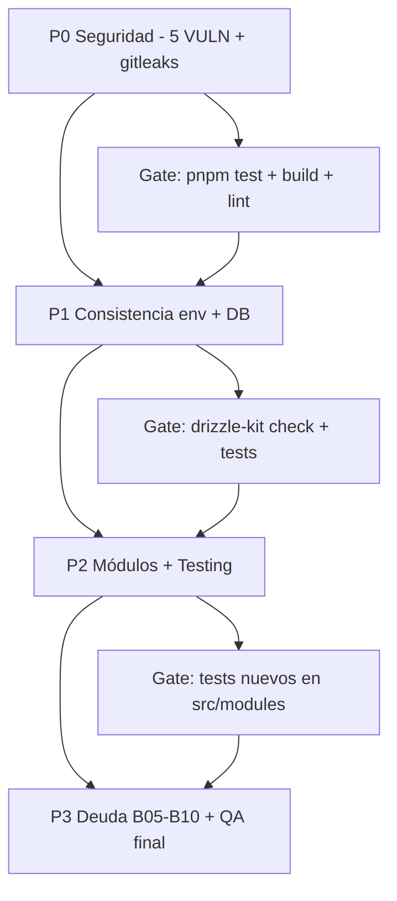

# PLAN DE IMPLEMENTACIÓN DETALLADO — SCAUDIT Pro (MODE C — MASTER PROMPT 2.0)

> **For agentic workers:** REQUIRED SUB-SKILL: use `superpowers:executing-plans`. Cada tarea usa el Task Engine (§43 del master prompt) y pasa por Definition of Ready / Definition of Done. Verificar con `pnpm lint` · `pnpm build` · `pnpm test` · `node scripts/quality-gate.mjs <doc> --min 80`.

- **Versión:** 1.0
- **Fecha:** 2026-08-02
- **Autor:** Equipo SCAUDIT — MASTER PROMPT 2.0 (modo MODE C)
- **Estado:** P0 **completado** (TSK-001..006, 2026-08-02) · pendiente P1 → P2 → P3
- **Plan fuente:** `docs/superpowers/plans/2026-08-01-engineering-master-plan.md` [VERIFIED]
- **Índice maestro:** `docs/superpowers/MASTER-INDEX.md` [VERIFIED]

---

## 1. Scope y objetivos

| Item | Valor |
|---|---|
| **Alcance** | Implementación (MODE C) de las mejoras encontradas en los batches B01–B04 del Engineering Master Plan: 7 VULN abiertos de seguridad (5 P0 + 2 Low mock), 2 inconsistencias de env, 4 hallazgos de DB (índices y tipos), 3 fugas de datos sin escritor/consumidor, 0 tests en `src/modules`, duplicación de componentes y deuda documental de B05–B10 |
| **Fuera de alcance** | Migraciones DDL sin aplicar a producción sin aprobación explícita; refactors de arquitectura mayores (B10 backlog); dependencias externas |
| **Objetivo** | Reducir la superficie de riesgo (P0), cerrar inconsistencias (P1), conectar datos huérfanos (P2) y registrar deuda restante (P3) — cada tarea con tests, rollback y criterios de aceptación verificables |
| **Método** | Non-destructive hasta aprobación por tarea; MODE A→B ya completado (batches 01–04); este plan es el MODE C detallado |

---

## 2. Requisitos (REQ)

| ID | Requisito | Prioridad | Fuente |
|---|---|---|---|
| REQ-101 | Ninguna salida de IA se renderiza como HTML sin `escapeHtml` | P0 ✅ TSK-001 | SECURITY-AUDIT-REPORT v2.1 VULN-001 |
| REQ-102 | `secretToken` de webhooks nunca se devuelve en respuestas de lectura | P0 ✅ TSK-002 | SECURITY-AUDIT VULN-002 |
| REQ-103 | Toda ruta de UI sensible exige sesión en el middleware (incl. `/intelligence`) | P0 ✅ TSK-003 | SECURITY-AUDIT VULN-003 |
| REQ-104 | `/api/looker-studio` es fail-closed (401 si falta `LOOKER_STUDIO_API_KEY`) y solo acepta `Authorization: Bearer` | P0 ✅ TSK-004 | SECURITY-AUDIT VULN-006 |
| REQ-105 | El progreso de PDF se asocia a la sesión del usuario (genId firmado o enlazado) | P0 ✅ TSK-005 | SECURITY-AUDIT VULN-007 |
| REQ-106 | Gitleaks es barrera dura (fail) en CI, no `continue-on-error` | P0 ✅ TSK-006 | MASTER-INDEX B02 |
| REQ-107 | Env de realtime consistente: `NEXT_PUBLIC_SUPABASE_ANON_KEY` ↔ `PUBLISHABLE_KEY` | P1 | SECURITY-AUDIT §14 |
| REQ-108 | Sin índices redundantes ni drift esquema↔migración (MAT-205) | P1 | INDEX-STRATEGY §4 |
| REQ-109 | Los patrones de consulta de seguridad/historial resuelven sin `seq scan` (REC-01..07) | P1 | INDEX-STRATEGY §3 |
| REQ-110 | `push_subscriptions.active` es `boolean`, no `text 'true'` (MAT-207) | P1 | INDEX-STRATEGY §4 |
| REQ-111 | `performance_results` tiene consumidor real (PerformanceTab sin datos hardcodeados) | P2 | MASTER-INDEX B04 |
| REQ-112 | `integration_sync_logs` y `reports.report` tienen escritor real | P2 | MASTER-INDEX B04 |
| REQ-113 | `src/modules/*` tiene unit tests (hoy 0) | P2 | MASTER-INDEX B01 |
| REQ-114 | Sin duplicación de `AttackSurfaceGraph` ni doble tool-registry (ADR-001) | P2 | MASTER-INDEX B01/B04 |
| REQ-115 | i18n: paridad de keys es/ en verificada por script (B09) | P3 | PLAN B09 |
| REQ-116 | Observabilidad: correlation IDs en proxy/jobs/SIEM (B08) | P3 | PLAN B08 |
| REQ-117 | Jobs: 12 Job Contracts + idempotencia evaluada (B05) | P3 | PLAN B05 |
| REQ-118 | Cobertura de tests global ≥ umbrales de Vitest (hoy Statements 12.51%) | P3 | MASTER-INDEX B00 |

---

## 3. Arquitectura (contexto → componentes → dependencias)



Dependencias clave de los fixes: `report-utils.escapeHtml` (existe, `src/app/components/report-utils.ts:234` [VERIFIED]) habilita REQ-101; `isProtectedRoute` en `src/shared/lib/supabase/middleware.ts:51` [VERIFIED] habilita REQ-103; `withRLS` + owner-checks (ya remediados VULN-004/005) son el patrón a reutilizar en VULN-008/009.

---

## 4. Datos documentados

| Tabla / artefacto | Hallazgo | Acción |
|---|---|---|
| `adversary_scenarios` | `idx_adversary_mitre_id` no-único (0012) duplica el único de 0018 | Dropear índice no-único en migración 0020 |
| `push_subscriptions` | `active` es `text 'true'` | Migrar a `boolean` + sync esquema |
| `security_audit_logs` | Falta índice GIN `pg_trgm(ip)` y de `metadata->>'action'` (REC-02/03) | Migración 0020 + extensión `pg_trgm` |
| `siem_alert_logs` | Falta índice GIN `pg_trgm(ip)` (REC-04) | Migración 0020 |
| `dns_history` / `whois_history` | Faltan índices compuestos por patrón real (REC-05/06/07) | Migración 0020 |
| `intelligence_findings` | Falta índice en FK `tool_run_id` (REC-01) | Migración 0020 |
| `performance_results` | Sin consumidor; `PerformanceTab.tsx` usa datos estáticos | Conectar lectura real (TSK-015) |
| `integration_sync_logs` / `reports.report` | Sin escritor | Implementar persistencia (TSK-016/017) |

> Ninguna columna/tabla de esta tabla es inventada: todas provienen de `INDEX-STRATEGY.md` y `MASTER-INDEX.md` [VERIFIED].

---

## 5. Flujos documentados

| FLOW | Flujo | Estado |
|---|---|---|
| FLOW-201 | Copilot XSS: prompt usuario → `/api/ai/copilot` → modelo → respuesta cruda → `AiCopilot.tsx:151` `dangerouslySetInnerHTML` | 🔴 **fix P0** (escapeHtml antes del replace de markdown) |
| FLOW-202 | Webhooks GET: `GET /api/webhooks?projectId=X` → row completo incl. `secret_token` | 🔴 **fix P0** (devolver prefijo `whsec_…`) |
| FLOW-203 | Looker Studio: `GET /api/looker-studio?apiKey=` → 401 solo si env definida; key en query param | 🔴 **fix P0** (fail-closed + header) |
| FLOW-204 | PDF progress: `GET /api/reports/pdf/progress?genId=` público, genId adivinable | 🔴 **fix P0** (vincular genId a sesión) |
| FLOW-205 | Realtime: `useRealtimeMetrics.ts:12` lee `NEXT_PUBLIC_SUPABASE_ANON_KEY` vs `PUBLISHABLE_KEY` documentada | 🟡 **fix P1** (unificar nombre) |
| FLOW-206 | Performance: `performance_results` (BD) → sin consumidor; `PerformanceTab.tsx` hardcodeado | 🟡 **fix P2** (lectura real) |

---

## 6. APIs documentadas

| Endpoint (método) | Auth actual | Hallazgo / acción |
|---|---|---|
| `POST /api/ai/copilot` | sesión + rate limit | Salida renderizada sin escapar (VULN-001) — fix en cliente, no en API |
| `GET /api/webhooks` | sesión + RLS | Devuelve `secret_token` (VULN-002) — enmascarar `whsec_…` |
| `GET /api/looker-studio` | condicional a env | Fail-closed + solo `Authorization: Bearer`, nunca `?apiKey=` (VULN-006) |
| `GET /api/reports/pdf/progress` | ninguno | Vincular `genId` a sesión (VULN-007) |
| `GET/POST /api/projects/[id]/members` | ninguno (mock) | Autenticar + RBAC o eliminar al conectar datos reales (VULN-008) |
| `GET /api/intelligence/graph` | ninguno (mock) | Eliminar o proteger al implementar datos reales (VULN-009) |
| Rutas de seguridad/historial | sesión | Optimizar con índices REC-01..07 (sin cambio de contrato) |

---

## 7. Seguridad documentada (trust boundaries, controles, amenazas)

| Control | Estado | Evidencia |
|---|---|---|
| Service Role nunca en bundle cliente | ✅ [VERIFIED] | `client.ts` solo anon key; `admin.ts` server-only |
| RLS multi-tenant | ✅ [VERIFIED] | `withRLS()` + `rls.test.ts` (5 tests) |
| Egress-guard + sandbox sin shell | ✅ [VERIFIED] | `egress-guard.ts`, `sandbox-executor.ts` |
| Hashing de API keys (SHA-256 + unique index) | ✅ [VERIFIED] | `api-auth.ts`, migración 0019 |
| VULN-001..009 | 🔴 pendientes | ver §18 Task Engine (TSK-001..009) |
| Amenaza residual tras P0 | Gitleaks como gate duro (TSK-006) + tests de regresión de XSS (TSK-001) | — |

---

## 8. Testing documentado (estrategia + casos + cobertura)

| Capa | Estrategia | Estado |
|---|---|---|
| Unit (executors, egress-guard, ratelimit, rls) | Vitest — 253 tests verdes (baseline B02) | ✅ |
| Security regression (XSS IA) | Test que `escapeHtml` se aplica antes del render | 🔴 TSK-001 |
| Route tests | `webhooks`, `looker-studio`, `pdf/progress` con mocks | 🔴 TSK-002/004/005 |
| RLS contract | `src/shared/db/rls.test.ts` | ✅ T02-03 |
| Modules unit tests | `src/modules/{audit,reporting}` use-cases con repo mock | 🔴 TSK-014 |
| E2E (Playwright) | login, dashboard, reporte IA, adversary | ✅ 4 specs |
| Contract (API pública) | `tests/api-contract` | ✅ |

Cobertura global actual: Statements 12.51% (umbral 25%) — baseline B00, no bloqueante para P0/P1 [VERIFIED].

---

## 9. Deployment documentado (ambientes, CI/CD)

| Item | Valor |
|---|---|
| Ambientes | Vercel (prod) + local dev con bypass auth explícito (NODE_ENV) |
| CI/CD | GitHub Actions: lint-and-build, test-and-coverage, api-contract-test, docs-quality-gate (min 80), secret-scan (gitleaks — **TSK-006: hacerlo fail-hard**) |
| Migraciones DB | `drizzle-kit push` con aprobación explícita; migración 0020 (TSK-007) requiere OK del usuario antes de aplicar a prod |
| Env matrix | `docs/guides/ENVIRONMENT-MATRIX.md` (37 vars, sin valores reales) |

---

## 10. Operaciones documentadas (monitoring, runbooks, recovery)

| Item | Valor |
|---|---|
| Monitoring | Healthcheck IA cada 6h; SIEM exporter; `pg_stat_user_indexes` para validar REC-01..07 |
| Runbooks | `docs/guides/upstash-redis-recovery.md`, `docs/guides/troubleshooting.md` |
| Recovery | Reporte resiliente sin IA + fallback chain de modelos; `genId` de PDF en Redis con TTL |
| Auditoría | `security_audit_logs` (api_key_usage, RLS violations, SIEM) |

---

## 11. Inventario visual

| ID | Figura | Tipo | Nivel |
|---|---|---|---|
| FIG-301 | Pipeline de implementación P0→P3 con gates | Diagram (mermaid) | L1 |
| FLOW-201..206 | Flujos de datos afectados (ver §5) | Flow | L2 |
| MAT-301 | Cobertura de tests (B06 target) | Matrix | L2 |
| MAT-302 | Trazabilidad REQ→COMP→TEST→DEP (§13) | Matrix | L2 |

---

## 12. Trazabilidad (REQ → COMP → TEST → DEP)

| REQ | COMP | TEST | DEP |
|---|---|---|---|
| REQ-101 | `AiCopilot.tsx` + `report-utils.escapeHtml` | Security regression (TSK-001) | Vercel |
| REQ-102 | `webhooks/route.ts` GET | Route test (TSK-002) | Vercel |
| REQ-103 | `middleware.ts` `isProtectedRoute` | E2E login (TSK-003) | Vercel |
| REQ-104 | `looker-studio/route.ts` | Route test (TSK-004) | Vercel |
| REQ-105 | `reports/pdf/progress/route.ts` | Route test (TSK-005) | Vercel |
| REQ-106 | `.github/workflows/ci.yml` | CI secret-scan (TSK-006) | GitHub Actions |
| REQ-108/109/110 | migración 0020 + esquemas | `drizzle-kit check` + EXPLAIN (TSK-007) | Supabase |
| REQ-111/112 | `PerformanceTab.tsx`, triggers | Route/unit tests (TSK-015/016/017) | Vercel |
| REQ-113 | `src/modules/*` | Vitest (TSK-014) | CI |
| REQ-114 | componentes | lint (TSK-018) | CI |

---

## 13. Cross-check / inconsistencias

| ID | Hallazgo | Estado |
|---|---|---|
| CS-301 | `useRealtimeMetrics.ts:12` lee `NEXT_PUBLIC_SUPABASE_ANON_KEY`; `.env.example` documenta `NEXT_PUBLIC_SUPABASE_PUBLISHABLE_KEY` | 🔴 Fix TSK-010 (REQ-107) |
| CS-302 | `env.ts` usa `Bearer_API_KEY` (camel-case) y `XIAOMI_BASE_URL` con default `apifreellm` | 🟡 Fix TSK-013 |
| CS-303 | `idx_adversary_mitre_id` no-único (0012) vs único (0018) — drift esquema↔migración | 🔴 Fix TSK-007 (MAT-205) |
| CS-304 | 2 componentes `AttackSurfaceGraph` (`src/app/components/` + `src/features/intelligence/`) | 🟡 Fix TSK-018 |
| CS-305 | 2 tool-registries (`registry/` + `core/`) — ADR-001 | 🟡 Fix TSK-018 |

---

## 14. Unknowns y assumptions

| Item | Clasificación |
|---|---|
| ¿`LOOKER_STUDIO_API_KEY` está definida en todos los entornos Vercel? | [UNKNOWN] — si falta, VULN-006 es activo hoy |
| Volumen real de filas en `security_audit_logs` / `siem_alert_logs` | [UNKNOWN] — valida REC-02/04 con EXPLAIN |
| Impacto funcional de cambiar `push_subscriptions.active` de `text` a `boolean` | [ASSUMPTION] — bajo: solo 2 sitios de lectura |
| ¿Existen `genId`s deterministas en el cliente de PDF? | [ASSUMPTION] — se asume cliente aleatorio; fix TSK-005 elimina la dependencia |
| Umbral p95 < 300 ms con 100k filas para rutas de seguridad | [ASSUMPTION] — del INDEX-STRATEGY §6 |

---

## 15. Fuentes

| Dato | Fuente |
|---|---|
| Líneas exactas de VULN-001..009 | [VERIFIED] `docs/security/SECURITY-AUDIT-REPORT.md` v2.1 |
| `escapeHtml` en `report-utils.ts:234` | [VERIFIED] código leído |
| `isProtectedRoute` en `middleware.ts:51` | [VERIFIED] código leído |
| Auth condicional de looker-studio | [VERIFIED] `src/app/api/looker-studio/route.ts:73-86` |
| `genId` público de PDF | [VERIFIED] `src/app/api/reports/pdf/progress/route.ts:21-27` |
| Índices REC-01..07 y hallazgos de tipos | [VERIFIED] `docs/database/INDEX-STRATEGY.md` |
| Hallazgos de módulos (0 tests, sin escritor, hardcode) | [VERIFIED] `docs/superpowers/MASTER-INDEX.md` B04 |
| Baseline 253 tests / cobertura 12.51% | [VERIFIED] MASTER-INDEX B00/B02 |

---

## 16. Glosario

| Término | Definición |
|---|---|
| MODE C | Modo de implementación del master prompt: TASK → IMPLEMENT → TEST → VALIDATE → DOCUMENT |
| Fail-closed | Por defecto se deniega (401) si falta configuración |
| IDOR | Acceso a recurso por ID sin verificar ownership |
| pg_trgm | Extensión Postgres para `ILIKE '%…%'` con índice GIN |
| genId | Identificador de una generación de PDF en curso |
| Drift esquema↔migración | Diferencia entre lo declarado en Drizzle y lo aplicado en BD |

---

## 17. Resumen ejecutivo

SCAUDIT ya completó los batches B00–B04 (documentación 100/100, security audit v2.1, RLS tests, higiene de migraciones, module contracts). **Este plan convierte los hallazgos pendientes en 23 tareas ejecutables (TSK-001..023)** priorizadas: **P0** cierra los 6 riesgos de seguridad activos (XSS IA, secret webhooks, middleware `/intelligence`, looker-studio fail-closed, PDF progress, gitleaks fail-hard); **P1** resuelve las inconsistencias de env y DB (índices y tipos); **P2** conecta datos huérfanos (performance_results, integration_sync_logs, reports.report) y agrega los primeros unit tests a `src/modules`; **P3** ejecuta B05–B10 (jobs, observabilidad, i18n, traceability, final report). Cada tarea tiene tests, criterios de aceptación y rollback. **Nada se aplica a producción sin aprobación explícita** (especialmente la migración 0020 y el cambio de tipo de `push_subscriptions.active`).

---

## 18. Task Engine — P0 (Seguridad)

```text
TSK-001 | VULN-001 — Sanitizar salida de IA en AiCopilot
  ESTADO: ✅ COMPLETADO (2026-08-02)
  OBJETIVO: Que ninguna respuesta del modelo se renderice como HTML sin escapar.
  ESTADO ACTUAL: `AiCopilot.tsx:151` usa `dangerouslySetInnerHTML={{ __html: msg.content.replace(/\n/g,'<br/>').replace(/\*\*([^*]+)\*\*/g,'<strong>$1</strong>') }}` — el replace se aplica antes de cualquier escape [VERIFIED].
  PROBLEMA: Prompt injection → el modelo puede emitir `` que se ejecuta en la sesión del usuario (robo de sesión).
  RECOMENDACIÓN: Aplicar `escapeHtml(msg.content)` (helper existente `report-utils.ts:234`) ANTES del replace de markdown; mantener los replaces solo sobre el texto ya escapado.
  ARCHIVOS: `src/app/components/AiCopilot.tsx`; (opcional) `src/shared/utils/report-utils.ts`
  DEPENDENCIAS: ninguna
  RIESGO: LOW (cambio de 1 línea)
  PRIORIDAD: P0
  PASOS:
    - [ ] 1. Importar `escapeHtml` desde `report-utils`.
    - [ ] 2. `const safe = escapeHtml(msg.content).replace(/\n/g,'<br/>').replace(/\*\*([^*]+)\*\*/g,'<strong>$1</strong>')`.
    - [ ] 3. Renderizar `dangerouslySetInnerHTML={{ __html: safe }}`.
    - [ ] 4. Verificar que `<b>`, `<i>` legítimos del markdown se escapen (los `<strong>` se generan post-escape, no hay tags entrantes).
  TESTS: Security regression — test unitario que dado `` el output renderizable NO contenga el tag crudo; `pnpm test`.
  CRITERIOS DE ACEPTACIÓN: grep de `dangerouslySetInnerHTML` en AiCopilot usa salida escapada; test verde; `pnpm build` PASS.
  ROLLBACK: revert del commit.
  IMPACTO DOC: actualizar SECURITY-AUDIT-REPORT (VULN-001 → remediado).
```

```text
TSK-002 | VULN-002 — Enmascarar secretToken en GET /api/webhooks
  ESTADO: ✅ COMPLETADO (2026-08-02)
  OBJETIVO: El listado de webhooks no expone el secreto de firma.
  ESTADO ACTUAL: GET devuelve rows completos de `webhook_configs` incl. `secretToken` [VERIFIED].
  PROBLEMA: Cualquier miembro con lectura RLS obtiene el secreto y puede falsificar firmas.
  RECOMENDACIÓN: En el GET, mapear la respuesta a `{ id, name, url, events, active, secretTokenPreview: secretToken ? secretToken.slice(0,8) + '…' : null }`.
  ARCHIVOS: `src/app/api/webhooks/route.ts` (GET handler)
  DEPENDENCIAS: ninguna
  RIESGO: LOW
  PRIORIDAD: P0
  PASOS:
    - [ ] 1. Sustituir el `return { webhooks }` crudo por un mapeo que excluya `secretToken`.
    - [ ] 2. Añadir campo enmascarado `secretTokenPreview`.
  TESTS: Route test con mock de `withRLS` que verifique que `secretToken` está ausente y `secretTokenPreview` presente; `pnpm test`.
  CRITERIOS DE ACEPTACIÓN: La respuesta JSON del GET nunca contiene la clave `secretToken`.
  ROLLBACK: revert.
  IMPACTO DOC: SECURITY-AUDIT-REPORT (VULN-002 remediado).
```

```text
TSK-003 | VULN-003 — Proteger /intelligence en el middleware
  ESTADO: ✅ COMPLETADO (2026-08-02)
  OBJETIVO: El shell de `/intelligence` exige sesión.
  ESTADO ACTUAL: `isProtectedRoute` cubre `/projects`, `/dashboard`, `/settings`; no `/intelligence` [VERIFIED middleware.ts:51].
  PROBLEMA: La página se sirve sin sesión (los datos ya están protegidos por API, gap de defensa en profundidad).
  RECOMENDACIÓN: Añadir `currentPath.startsWith('/intelligence')` a `isProtectedRoute`.
  ARCHIVOS: `src/shared/lib/supabase/middleware.ts`
  DEPENDENCIAS: ninguna
  RIESGO: LOW
  PRIORIDAD: P0
  PASOS:
    - [ ] 1. Extender la condición de `isProtectedRoute`.
    - [ ] 2. Verificar E2E login redirige anónimo a /login.
  TESTS: `pnpm test:e2e` (spec login); verificación manual del redirect.
  CRITERIOS DE ACEPTACIÓN: Anónimo → /login al visitar /intelligence; usuario logueado → acceso normal.
  ROLLBACK: revert.
  IMPACTO DOC: SECURITY-AUDIT-REPORT (VULN-003 remediado).
```

```text
TSK-004 | VULN-006 — Looker Studio fail-closed, solo header
  ESTADO: ✅ COMPLETADO (2026-08-02)
  OBJETIVO: `/api/looker-studio` exige API key siempre y nunca la recibe por query param.
  ESTADO ACTUAL: El bloque de auth se ejecuta solo `if (expectedKey)`; acepta `?apiKey=` [VERIFIED route.ts:73-86].
  PROBLEMA: Si la env falta, el endpoint queda abierto; el query param filtra la key en logs/referrers.
  RECOMENDACIÓN: 1) Eliminar `searchApiKey` y `isAuthorizedParam`. 2) Si `!expectedKey` → 401 con mensaje de configuración. 3) Solo `Authorization: Bearer`, comparando con `crypto.timingSafeEqual` (evita timing leak del `===`).
  ARCHIVOS: `src/app/api/looker-studio/route.ts`
  DEPENDENCIAS: ninguna
  RIESGO: LOW
  PRIORIDAD: P0
  PASOS:
    - [ ] 1. Eliminar la lectura de `searchParams.get('apiKey')`.
    - [ ] 2. `if (!expectedKey) return 401` (fail-closed).
    - [ ] 3. Validar solo `authHeader === Bearer ${expectedKey}`.
  TESTS: Route test: 401 sin header; 200 con header correcto; 401 con key en query aunque sea válida; `pnpm test`.
  CRITERIOS DE ACEPTACIÓN: Sin env → 401; con env → solo header autoriza.
  ROLLBACK: revert.
  IMPACTO DOC: SECURITY-AUDIT-REPORT (VULN-006 remediado) + ENVIRONMENT-MATRIX (nota fail-closed).
```

```text
TSK-005 | VULN-007 — Vincular genId de PDF a la sesión
  ESTADO: ✅ COMPLETADO (2026-08-02)
  OBJETIVO: El progreso de generación de PDF solo es visible por su dueño.
  ESTADO ACTUAL: `GET /api/reports/pdf/progress?genId=<uuid>` es público; la clave Redis es `pdf_progress:${genId}` [VERIFIED route.ts:21-27].
  PROBLEMA: genId adivinable → observar progreso/errores de generaciones ajenas; DoS leve con SSE abiertos.
  RECOMENDACIÓN: En el POST que inicia la generación, guardar `pdf_progress:<userId>:<genId>` y/o el genId en Redis bajo la sesión; en GET, exigir sesión (`authenticate`) y verificar que el genId pertenece al usuario.
  ARCHIVOS: `src/app/api/reports/pdf/route.ts` (POST), `src/app/api/reports/pdf/progress/route.ts` (GET)
  DEPENDENCIAS: TSK-003 (patrón authenticate)
  RIESGO: MEDIUM (toca flujo de generación de PDF)
  PRIORIDAD: P0
  PASOS:
    - [ ] 1. En POST: tras `authenticate(user)`, escribir clave con userId: `pdf_progress:${user.id}:${genId}`.
    - [ ] 2. En GET: `authenticate` → buscar clave con el userId del token; si no existe → 404.
    - [ ] 3. Mantener lectura legacy por compatibilidad solo si el cliente la usa (verificar consumidor).
  TESTS: Route test: GET sin sesión → 401; con sesión ajena → 404; con sesión propia → 200.
  CRITERIOS DE ACEPTACIÓN: Sin sesión 401; genId ajeno 404.
  ROLLBACK: revert (volver a clave simple).
  IMPACTO DOC: SECURITY-AUDIT-REPORT (VULN-007 remediado).
```

```text
TSK-006 | Gitleaks como barrera dura en CI
  ESTADO: ✅ COMPLETADO (2026-08-02)
  OBJETIVO: Ningún commit con secretos llega a main.
  ESTADO ACTUAL: Job `secret-scan` con `continue-on-error` [VERIFIED MASTER-INDEX B02].
  PROBLEMA: La barrera es informativa, no bloqueante.
  RECOMENDACIÓN: Quitar `continue-on-error` (o `if: always`) y hacer `step: fail` con gitleaks `--exit-code 1`. Validar que un push de prueba con scan limpio pasa.
  ARCHIVOS: `.github/workflows/ci.yml`
  DEPENDENCIAS: ninguna
  RIESGO: LOW (el repo está limpio de secretos — verificado en B02)
  PRIORIDAD: P0
  PASOS:
    - [ ] 1. Eliminar `continue-on-error` del job gitleaks.
    - [ ] 2. Push de prueba a una rama y verificar el job en GitHub Actions.
  TESTS: GitHub Actions run del job `secret-scan` en verde.
  CRITERIOS DE ACEPTACIÓN: El job falla ante un secret (test con secret falso en rama temporal) y pasa en main.
  ROLLBACK: revert del workflow.
  IMPACTO DOC: MASTER-INDEX (B02 nota gitleaks) + ENVIRONMENT-MATRIX.
```

## 19. Task Engine — P1 (Consistencia env y DB)

```text
TSK-007 | MAT-205 — Dropear índice no-único redundante + migración 0020
  OBJETIVO: Eliminar drift esquema↔migración en `adversary_scenarios`.
  ESTADO ACTUAL: `idx_adversary_mitre_id` (no-único, 0012) coexiste con el único (0018); el no-único no está en el esquema Drizzle [VERIFIED INDEX-STRATEGY §4].
  PROBLEMA: El no-único es redundante y ensucia el catálogo; `drizzle-kit generate` lo vería como drift si se sincroniza.
  RECOMENDACIÓN: Migración 0020 (higiene de índices, junto con REC-01..07 de TSK-008): `DROP INDEX IF EXISTS idx_adversary_mitre_id;` + registrar en `_journal.json` y snapshot. El ALTER TYPE de TSK-009 va en una migración 0021 separada (distinto riesgo/rollback).
  ARCHIVOS: `drizzle/0020_*.sql`, `drizzle/meta/_journal.json`, `src/shared/db/schemas/adversary.ts` (si el esquema no lo declara, verificar)
  DEPENDENCIAS: T03-03 (higiene previa)
  RIESGO: LOW (índice redundante; `IF EXISTS`)
  PRIORIDAD: P1
  PASOS:
    - [ ] 1. `pnpm db:generate --name=drop_redundant_adversary_idx` (o SQL manual si el schema no lo refleja).
    - [ ] 2. Verificar `drizzle-kit check` → "Everything's fine".
    - [ ] 3. Aplicar a prod SOLO con aprobación explícita.
  TESTS: `drizzle-kit check`; `pnpm build`.
  CRITERIOS DE ACEPTACIÓN: Índice no-único eliminado; sin drift.
  ROLLBACK: `CREATE INDEX idx_adversary_mitre_id ON adversary_scenarios(mitre_id)`.
  IMPACTO DOC: INDEX-STRATEGY (MAT-205 resuelto).
```

```text
TSK-008 | REC-01..07 — Índices de consultas reales (seguridad + historial)
  OBJETIVO: Los patrones documentados en INDEX-STRATEGY §3 resuelven sin seq scan.
  ESTADO ACTUAL: Faltan 7 índices (findings.tool_run_id; audit-logs GIN ip + metadata action; siem GIN ip; dns/whois compuestos) [VERIFIED INDEX-STRATEGY §3].
  PROBLEMA: `ILIKE '%…%'` sin GIN y FKs sin índice → seq scans en rutas autenticadas.
  RECOMENDACIÓN: Migración 0020 (misma que TSK-007, solo índices) con `CREATE EXTENSION IF NOT EXISTS pg_trgm` + los 7 índices `CREATE INDEX CONCURRENTLY`. Declararlos también en los esquemas Drizzle para evitar drift.
  ARCHIVOS: `drizzle/0020_*.sql`, `src/shared/db/schemas/{intelligence,monitoring}.ts` (o donde vivan esas tablas)
  DEPENDENCIAS: TSK-007 (misma migración)
  RIESGO: MEDIUM (DDL en prod requiere ventana; CONCURRENTLY evita lock largo)
  PRIORIDAD: P1
  PASOS:
    - [ ] 1. Escribir SQL de los 7 índices + extensión pg_trgm (usar el SQL de referencia de INDEX-STRATEGY §3.2).
    - [ ] 2. Sincronizar esquemas Drizzle.
    - [ ] 3. Validar con EXPLAIN en staging.
    - [ ] 4. Aplicar a prod con aprobación.
  TESTS: `EXPLAIN` de las consultas de §3 sin seq scan; `drizzle-kit check`; `pnpm test`.
  CRITERIOS DE ACEPTACIÓN: EXPLAIN usa los índices; check sin drift.
  ROLLBACK: `DROP INDEX` por cada uno.
  IMPACTO DOC: INDEX-STRATEGY (REC-01..07 aplicados).
```

```text
TSK-009 | MAT-207 — push_subscriptions.active a boolean
  OBJETIVO: Tipo correcto para la columna `active`.
  ESTADO ACTUAL: `active` es `text` con valor `'true'` [VERIFIED INDEX-STRATEGY MAT-207].
  PROBLEMA: Mismatch de tipado; comparaciones inseguras.
  RECOMENDACIÓN: Migración **0021 separada** (no mezclarla con los índices de 0020 — distinto perfil de riesgo y rollback): `ALTER TABLE push_subscriptions ALTER COLUMN active TYPE boolean USING active::boolean;` + sync del schema Drizzle a `boolean`.
  ARCHIVOS: `drizzle/0021_*.sql`, `src/shared/db/schemas/monitoring.ts` (donde vive push_subscriptions)
  DEPENDENCIAS: ninguna (migración independiente de 0020)
  RIESGO: MEDIUM (cambio de tipo en prod — validar que solo hay 'true'/'false')
  PRIORIDAD: P1
  PASOS:
    - [ ] 1. Verificar valores actuales: `SELECT DISTINCT active FROM push_subscriptions`.
    - [ ] 2. Aplicar ALTER + sync de esquema.
    - [ ] 3. Ajustar los ≤2 sitios de lectura si tipan como string.
  TESTS: `pnpm test`; query de verificación de tipo.
  CRITERIOS DE ACEPTACIÓN: `pg_typeof(active) = boolean`; código tipado.
  ROLLBACK: `ALTER COLUMN TYPE text USING active::text`.
  IMPACTO DOC: DATA-DICTIONARY (MAT-207/INDEX-201 resuelto).
```

```text
TSK-010 | CS-301 — Unificar env de realtime (ANON_KEY vs PUBLISHABLE_KEY)
  OBJETIVO: Un solo nombre para la key pública de Supabase.
  ESTADO ACTUAL: `useRealtimeMetrics.ts:12` lee `NEXT_PUBLIC_SUPABASE_ANON_KEY`; el resto usa `NEXT_PUBLIC_SUPABASE_PUBLISHABLE_KEY` [VERIFIED SECURITY-AUDIT §14].
  PROBLEMA: Si solo se define la variante documentada, el realtime recibe `''` y se degrada en silencio.
  RECOMENDACIÓN: Decidir nombre canónico (el que ya usa el grueso: `NEXT_PUBLIC_SUPABASE_PUBLISHABLE_KEY`), migrar el hook, y añadir un alias de compatibilidad en `env.ts` (leer uno, fall
back al otro).
  ARCHIVOS: `src/shared/hooks/useRealtimeMetrics.ts`, `src/shared/config/env.ts`, `.env.example`
  DEPENDENCIAS: ninguna
  RIESGO: LOW
  PRIORIDAD: P1
  PASOS:
    - [ ] 1. Cambiar `useRealtimeMetrics.ts` al nombre canónico.
    - [ ] 2. En `env.ts`, alias: `publishableKey: process.env.NEXT_PUBLIC_SUPABASE_PUBLISHABLE_KEY || process.env.NEXT_PUBLIC_SUPABASE_ANON_KEY`.
    - [ ] 3. Actualizar `.env.example` y ENVIRONMENT-MATRIX.
  TESTS: `pnpm test`; grep de ambos nombres.
  CRITERIOS DE ACEPTACIÓN: Un solo nombre documentado; fallback documentado.
  ROLLBACK: revert.
  IMPACTO DOC: ENVIRONMENT-MATRIX (CS-301 resuelto).
```

---

## 20. Task Engine — P2 (Módulos + Testing)

```text
TSK-011 | VULN-008 — Autenticar y autorizar /projects/[id]/members
  OBJETIVO: El endpoint de miembros exige sesión + RBAC antes de conectar datos reales.
  ESTADO ACTUAL: GET/POST sin auth, datos mock hardcodeados [VERIFIED SECURITY-AUDIT VULN-008].
  PROBLEMA: Superficie sin auth que hoy no expone datos reales, pero la bloqueará al conectar DB.
  RECOMENDACIÓN: Aplicar `authenticate` + `canPerformAction` (patrón de VULN-004/005) sobre el proyecto; mantener el mock pero tras el check de ownership.
  ARCHIVOS: `src/app/api/projects/[id]/members/route.ts`
  DEPENDENCIAS: TSK-003 (patrón authenticate)
  RIESGO: LOW
  PRIORIDAD: P1
  PASOS:
    - [ ] 1. `authenticate` al inicio del handler.
    - [ ] 2. Owner-check del projectId (404 si no pertenece).
    - [ ] 3. Mantener respuesta mock.
  TESTS: Route test: 401 sin sesión; 404 con proyecto ajeno; 200 con proyecto propio.
  CRITERIOS DE ACEPTACIÓN: Sin sesión 401; proyecto ajeno 404.
  ROLLBACK: revert.
  IMPACTO DOC: SECURITY-AUDIT-REPORT (VULN-008 remediado).
```

```text
TSK-012 | VULN-009 — Eliminar o proteger /api/intelligence/graph (mock)
  OBJETIVO: Eliminar la ruta mock sin datos o autenticarla.
  ESTADO ACTUAL: GET sin auth, devuelve nodos fabricados [VERIFIED SECURITY-AUDIT VULN-009].
  PROBLEMA: Superficie sin auth que hoy no filtra datos reales.
  RECOMENDACIÓN: Verificar si el frontend la consume; si no → eliminar la ruta; si sí → protegerla con `authenticate` hasta reemplazar el mock por datos reales.
  ARCHIVOS: `src/app/api/intelligence/graph/route.ts`
  DEPENDENCIAS: ninguna
  RIESGO: LOW
  PRIORIDAD: P1
  PASOS:
    - [ ] 1. Grep de `/api/intelligence/graph` en `src/` para verificar consumidor.
    - [ ] 2. Si no hay consumidor: borrar la ruta. Si hay: añadir `authenticate`.
  TESTS: `pnpm test` + build; verificación de consumidor.
  CRITERIOS DE ACEPTACIÓN: Ruta eliminada o con 401 sin sesión.
  ROLLBACK: revert / restaurar ruta.
  IMPACTO DOC: SECURITY-AUDIT-REPORT (VULN-009 remediado).
```

```text
TSK-013 | CS-302 — Normalizar nombres de env de IA (Bearer_API_KEY)
  OBJETIVO: Nombres de env consistentes y sin defaults sorpresa.
  ESTADO ACTUAL: `env.ts` usa `Bearer_API_KEY` (camel-case inusual) y `XIAOMI_BASE_URL` con default `https://apifreellm.com/api/v1/chat` [VERIFIED SECURITY-AUDIT §14].
  PROBLEMA: Nombres engañosos dificultan la configuración y el default oculto apunta a un proveedor no documentado.
  RECOMENDACIÓN: Renombrar a `BEARER_API_KEY` (con alias de compatibilidad `Bearer_API_KEY`) y evaluar el default de base URL (dejar en blanco o moverlo a `.env.example`).
  ARCHIVOS: `src/shared/config/env.ts`, `.env.example`, `src/server/ai/ai-router.ts` (si consume el nombre)
  DEPENDENCIAS: TSK-010 (mismo patrón de alias)
  RIESGO: MEDIUM (toca la config de IA)
  PRIORIDAD: P1
  PASOS:
    - [ ] 1. Renombrar la variable en `env.ts` y crear alias.
    - [ ] 2. Actualizar `.env.example` y ENVIRONMENT-MATRIX.
  TESTS: `pnpm test`; grep de ambos nombres.
  CRITERIOS DE ACEPTACIÓN: Un solo nombre canónico; alias de compatibilidad documentado.
  ROLLBACK: revert.
  IMPACTO DOC: ENVIRONMENT-MATRIX (CS-302 resuelto).
```

```text
TSK-014 | REQ-113 — Unit tests para src/modules (audit y reporting)
  OBJETIVO: Cobertura unitaria de los use-cases puros de los módulos (hoy 0 tests).
  ESTADO ACTUAL: 0 archivos `*.test.ts` en `src/modules` [VERIFIED MASTER-INDEX B01].
  PROBLEMA: Lógica de dominio sin protección contra regresiones.
  RECOMENDACIÓN: Test por use-case con repositorio mock, empezando por `audit` y `reporting`. Reutilizar el patrón de los executors tests existentes.
  ARCHIVOS: `src/modules/audit/application/use-cases/*.test.ts`, `src/modules/reporting/application/use-cases/*.test.ts` (o donde estén los use-cases reales — verificar estructura)
  DEPENDENCIAS: T06-01 (coverage matrix, opcional)
  RIESGO: LOW
  PRIORIDAD: P2
  PASOS:
    - [ ] 1. Localizar los use-cases reales de cada módulo.
    - [ ] 2. Escribir ≥2 tests por módulo con repo mock.
    - [ ] 3. `pnpm test <file>` → verde; commit por módulo.
  TESTS: `pnpm test` (nuevos incluidos).
  CRITERIOS DE ACEPTACIÓN: ≥4 tests nuevos verdes en CI.
  ROLLBACK: revert.
  IMPACTO DOC: TEST-COVERAGE-MATRIX (B06) actualizado.
```

```text
TSK-015 | REQ-111 — PerformanceTab consume performance_results reales
  OBJETIVO: Reemplazar los datos estáticos hardcodeados por lectura real de BD.
  ESTADO ACTUAL: `PerformanceTab.tsx` muestra datos estáticos (L28-39) y `performance_results` no tiene consumidor [VERIFIED MASTER-INDEX B04].
  PROBLEMA: La UI muestra datos falsos que no reflejan el estado del proyecto.
  RECOMENDACIÓN: Crear una server action o query con `withRLS` que lea los últimos `performance_results` del proyecto; renderizar con fallback "sin datos" cuando no existan.
  ARCHIVOS: `src/app/components/tabs/PerformanceTab.tsx`, acción de datos (nueva o existente en `src/app/actions/`)
  DEPENDENCIAS: TSK-014 (patrón de lectura)
  RIESGO: MEDIUM (cambio de UI)
  PRIORIDAD: P2
  PASOS:
    - [ ] 1. Verificar cómo PerformanceTab recibe el projectId.
    - [ ] 2. Implementar query con `withRLS(userId)` sobre `performance_results`.
    - [ ] 3. Sustituir los datos estáticos por la respuesta (con estado vacío).
  TESTS: Unit de la query; `pnpm build`; E2E smoke del tab.
  CRITERIOS DE ACEPTACIÓN: La UI refleja datos reales o estado vacío; sin hardcode.
  ROLLBACK: revert.
  IMPACTO DOC: MODULE-CONTRACT-performance.md actualizado.
```

```text
TSK-016 | REQ-112 — Escritor real para integration_sync_logs
  OBJETIVO: Los logs de sync se persisten en BD (hoy sin escritor).
  ESTADO ACTUAL: `integration_sync_logs` sin escritor en el código [VERIFIED MASTER-INDEX B04].
  PROBLEMA: Fuga de infraestructura: sin log de sync no hay observabilidad del estado de integraciones.
  RECOMENDACIÓN: En el trigger/job que ejecuta syncs (o en la acción de integraciones), insertar un row por cada sync con estado; verificar si existe el servicio de sync real.
  ARCHIVOS: `src/trigger/*.trigger.ts` o `src/app/api/integrations/**` (verificar existencia), `src/shared/db/schemas/monitoring.ts`
  DEPENDENCIAS: T05-01 (job contracts, para identificar el trigger correcto)
  RIESGO: MEDIUM (requiere conocer el flujo de sync real)
  PRIORIDAD: P2
  PASOS:
    - [ ] 1. Localizar dónde se ejecutan los syncs hoy.
    - [ ] 2. Añadir inserción con `onConflictDoNothing` (idempotente).
  TESTS: Unit del servicio de sync.
  CRITERIOS DE ACEPTACIÓN: Cada sync escribe su log; sin duplicados en retries.
  ROLLBACK: revert.
  IMPACTO DOC: MODULE-CONTRACT-integrations.md actualizado.
```

```text
TSK-017 | REQ-112 — Escritor real para reports.report
  OBJETIVO: El reporte generado se persiste en `reports.report` (hoy sin escritor).
  ESTADO ACTUAL: `reports.report` sin escritor (comentario `-- Legacy: reports.report`) [VERIFIED MASTER-INDEX B04].
  PROBLEMA: La generación de reportes IA devuelve el texto pero no lo guarda.
  RECOMENDACIÓN: En `src/app/api/ai/report/route.ts` (POST), tras generar el reporte, persistir en `reports` con `projectId`, `title`, `content` y `createdBy` (con RLS). Verificar el schema de `reports`.
  ARCHIVOS: `src/app/api/ai/report/route.ts`, `src/shared/db/schemas/index.ts` (reports)
  DEPENDENCIAS: TSK-014
  RIESGO: MEDIUM (cambio en flujo de generación)
  PRIORIDAD: P2
  PASOS:
    - [ ] 1. Leer el schema de `reports` y los campos requeridos.
    - [ ] 2. Tras el `aiResult.success`, insertar el reporte con `withRLS`.
    - [ ] 3. Devolver el id en la respuesta (para el frontend).
  TESTS: Route test con mock de la persistencia.
  CRITERIOS DE ACEPTACIÓN: Reporte persistido tras generación; id devuelto.
  ROLLBACK: revert.
  IMPACTO DOC: MODULE-CONTRACT-reporting.md actualizado.
```

```text
TSK-018 | REQ-114 — Resolver duplicaciones (AttackSurfaceGraph + tool-registry)
  OBJETIVO: Un solo componente y un solo registry (ADR-001).
  ESTADO ACTUAL: 2 `AttackSurfaceGraph` (src/app/components/ + src/features/intelligence/
  PROBLEMA: Lógica duplicada → fixes aplicados en uno no llegan al otro.
  RECOMENDACIÓN: Consolidar en el componente de `src/features/intelligence/` (el más reciente) y en el registry de `core/`; actualizar imports de los consumidores.
  ARCHIVOS: `src/features/intelligence/components/AttackSurfaceGraph.tsx`, `src/app/components/AttackSurfaceGraph.tsx`, `src/server/intelligence/registry/tool-registry.ts`, `src/server/intelligence/core/tool-registry.ts` (verificar nombres exactos)
  DEPENDENCIAS: T01-03 (grafo ya documentado)
  RIESGO: HIGH (toca consumidores)
  PRIORIDAD: P2
  PASOS:
    - [ ] 1. Grep de consumidores de ambos.
    - [ ] 2. Consolidar exports y borrar el duplicado.
    - [ ] 3. Actualizar imports.
  TESTS: `pnpm build` + `pnpm test` + smoke manual de IntelligenceTab.
  CRITERIOS DE ACEPTACIÓN: Un solo archivo por símbolo; build verde.
  ROLLBACK: revert (restaura el duplicado).
  IMPACTO DOC: DEPENDENCY-GRAPH.md + ADR-001 actualizados.
```

---

## 21. Task Engine — P3 (Deuda B05–B10)

```text
TSK-019 | REQ-117 — B05: 12 Job Contracts + idempotencia
  OBJETIVO: Documentar los 12 triggers con análisis de idempotencia/retry (§27).
  ESTADO ACTUAL: 12 archivos en src/trigger/, sin contracts [VERIFIED].
  RECOMENDACIÓN: Un JOB-CONTRACT por trigger + checklist de idempotencia. Solo fix de código si se detecta un fallo real (T05-02, redactado en el momento del hallazgo).
  ARCHIVOS: docs/jobs/JOB-CONTRACT-{siem,discovery,api-key-expiry,audit,monitoring,uptime,webhook,adversary,anomaly,cleanup,hello,scheduled-scan}.md
  DEPENDENCIAS: T04-02
  RIESGO: LOW
  PRIORIDAD: P3
  PASOS: por trigger → leer código → contract → gate --min 80.
  TESTS: quality gate por archivo.
  CRITERIOS DE ACEPTACIÓN: 12 contracts; idempotencia PASS/FAIL por job.
  ROLLBACK: N/A.
  IMPACTO DOC: 12 artefactos nuevos.
```

```text
TSK-020 | REQ-116 — B08: OBSERVABILITY-MATRIX + correlation IDs
  OBJETIVO: Señales y convención de IDs (requestId/jobId/correlationId).
  ESTADO ACTUAL: logger estructurado, RUM, health checks, sin IDs consistentes [VERIFIED].
  RECOMENDACIÓN: Matrix + convención; implementar IDs en proxy/triggers/SIEM si se aprueba.
  ARCHIVOS: docs/observability/OBSERVABILITY-MATRIX.md
  DEPENDENCIAS: T02-02
  RIESGO: LOW
  PRIORIDAD: P3
  PASOS: inventariar señales → definir convención → documentar.
  TESTS: quality gate.
  CRITERIOS DE ACEPTACIÓN: Matrix + convención.
  ROLLBACK: N/A.
  IMPACTO DOC: nuevo artefacto.
```

```text
TSK-021 | REQ-115 — B09: I18N-AUDIT + script de paridad de keys
  OBJETIVO: Paridad es/en verificada por script (§32).
  ESTADO ACTUAL: es/en 650+ keys sin check automático [VERIFIED].
  RECOMENDACIÓN: scripts/i18n-audit.mjs + docs/i18n/I18N-AUDIT.md; opcional job CI.
  ARCHIVOS: scripts/i18n-audit.mjs, docs/i18n/I18N-AUDIT.md
  DEPENDENCIAS: T00-02
  RIESGO: LOW
  PRIORIDAD: P3
  PASOS: script diff → ejecutar → documentar → (opcional) CI.
  TESTS: node scripts/i18n-audit.mjs con 0 diffs.
  CRITERIOS DE ACEPTACIÓN: Script con 0 diffs o diffs documentados.
  ROLLBACK: revert.
  IMPACTO DOC: nuevo artefacto.
```

```text
TSK-022 | REQ-118 — B06: TEST-COVERAGE-MATRIX + cierre de huecos
  OBJETIVO: Matriz de cobertura y tests en áreas críticas sin cubrir.
  ESTADO ACTUAL: 18 test files, 0 en src/modules (TSK-014 lo inicia), 37 rutas sin route.test [VERIFIED].
  RECOMENDACIÓN: docs/testing/TEST-COVERAGE-MATRIX.md + route tests de security/siem/run, public/v1/intelligence, intelligence/runs, reports/pdf.
  ARCHIVOS: docs/testing/TEST-COVERAGE-MATRIX.md, rutas citadas con .test.ts
  DEPENDENCIAS: TSK-014
  RIESGO: MEDIUM
  PRIORIDAD: P3
  PASOS: matriz → tests por ruta crítica → green → commit.
  TESTS: pnpm test.
  CRITERIOS DE ACEPTACIÓN: Matriz completa; 4 rutas nuevas con test.
  ROLLBACK: revert.
  IMPACTO DOC: matriz + contratos.
```

```text
TSK-023 | B10: TRACEABILITY + RISK + TECH-DEBT + FINAL-REPORT
  OBJETIVO: Cerrar el plan con los registros consolidados y el reporte §51.
  ESTADO ACTUAL: Hallazgos de B01–B09 dispersos [VERIFIED].
  RECOMENDACIÓN: docs/traceability/TRACEABILITY-MATRIX.md, docs/risk/RISK-REGISTER.md, docs/technical-debt/TECH-DEBT-REGISTER.md, docs/improvements/FINAL-REPORT.md (30 secciones), quality gate final (27 checks §55).
  ARCHIVOS: los 4 artefactos + MASTER-INDEX.md
  DEPENDENCIAS: todos los anteriores
  RIESGO: LOW
  PRIORIDAD: P3
  PASOS: consolidar hallazgos → registros → final report → QA gate.
  TESTS: suite completa + gates.
  CRITERIOS DE ACEPTACIÓN: 27/27 checks §55; 0 contradicciones.
  ROLLBACK: N/A.
  IMPACTO DOC: artefacto principal.
```

---

## 22. Definition of Ready / Definition of Done

**Definition of Ready (todo task del plan):**

- [ ] Objetivo definido
- [ ] Contexto (estado actual con evidencia)
- [ ] Dependencias identificadas
- [ ] Archivos identificados
- [ ] Riesgo clasificado (LOW/MEDIUM/HIGH)
- [ ] Criterios de aceptación
- [ ] Tests definidos
- [ ] Rollback definido

**Definition of Done (todo task completado):**

- [ ] Implementación completa
- [ ] `pnpm lint` sin errores
- [ ] `pnpm build` PASS
- [ ] `pnpm test` verde (253+ tests)
- [ ] E2E cuando aplica (`pnpm test:e2e`)
- [ ] Seguridad validada (P0: tests de regresión incluidos)
- [ ] Docs actualizados (SECURITY-AUDIT / MODULE-CONTRACT / INDEX-STRATEGY según el IMPACTO DOC)
- [ ] Mermaid actualizado cuando aplica
- [ ] ADR actualizado cuando aplica
- [ ] Sin regresiones

---

## 23. Guía de ejecución y handoff

```bash
# Por tarea: implementar → verificar → documentar → commitear
pnpm lint && pnpm build
pnpm test
node scripts/quality-gate.mjs docs/superpowers/plans/2026-08-02-implementation-plan.md --min 80
git add <files> && git commit -m "fix(p0): <mensaje>"
```

**Reglas de gobierno:**

1. **Orden de ejecución:** TSK-001 → TSK-006 (P0) primero; son cambios pequeños y de bajo riesgo que cierran los 6 riesgos activos.
2. **Aprobación obligatoria del usuario** antes de: aplicar la migración 0020 (índices, TSK-007/008) y la 0021 (tipo `active`, TSK-009) a producción, y cualquier DDL.
3. **Commits atómicos** por tarea, con el prefijo del batch (`fix(p0)`, `feat(p1)`, etc.). Nunca commitear secretos.
4. **Actualizar MASTER-INDEX.md** al cerrar cada grupo de tareas (P0/P1/P2/P3).
5. **Evidencia:** toda afirmación del plan proviene de `SECURITY-AUDIT-REPORT.md`, `INDEX-STRATEGY.md` y `MASTER-INDEX.md` (marcadas `[VERIFIED]`). Ninguna tarea inventa archivos ni tablas.

**Handoff:** este plan se ejecuta con el skill `superpowers:executing-plans` (batch por batch, checkpoint por grupo de prioridad). El orden natural de ejecución es: **P0 (TSK-001..006) → P1 (TSK-007..013) → P2 (TSK-014..018) → P3 (TSK-019..023)**.

**FIN DEL PLAN**
