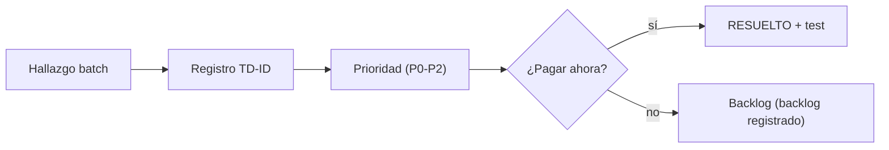

# TECH DEBT REGISTER — SCAUDIT Pro (B10, §49)

{: .no_toc }

  
Tabla de contenidos

  {: .text-delta }
1. TOC
{:toc}

---

## 1. Scope y objetivos

Registro consolidado de **deuda técnica** de SCAUDIT Pro a partir de los hallazgos reales de B01–B09 (T10-02, §49 del master prompt). Formato obligatorio: **ID | Debt | Category | Impact | Risk | Effort | Priority | Resolution**. Cada deuda cita su artefacto de origen — nada inventado, todo `[VERIFIED]` o `[OBSERVED]`. [VERIFIED — este documento]

**Objetivos:** (1) ≥8 deudas con prioridad; (2) consolidar la deuda dispersa (T10-02 lista deuda conocida real: 2 tool-registries, módulos sin tests, rutas sin tests, 0019/0020/0021 sin commitear, i18n sin check automático); (3) servir de input al Quality Gate final §55. [VERIFIED — plan T10-02]

---

## 2. Requisitos de gestión de deuda

| REQ | Requisito | Cumplimiento |
|-----|-----------|--------------|
| REQ-401 | Toda deuda con categoría, impacto y prioridad | ✅ §5 |
| REQ-402 | Resolución accionable por deuda | ✅ §5 |
| REQ-403 | No-regresión: deudas resueltas pasan a RESUELTO | ✅ Status |
| REQ-404 | Deuda de código verificable en disco | ✅ (rutas reales citadas) |

---

## 3. Arquitectura de deuda (contexto → componentes → dependencias)

**Contexto:** la deuda proviene de 6 dominios reales: estructura (`src/modules/*` vacíos), testing (cobertura 13.72%, triggers 0/12, rutas 6/42), código legacy (`run-migration.ts`), infraestructura (`src/server/db/supabase-live-test.mjs`), duplicación (2 tool-registries), y gobernanza (i18n sin check, snapshots Drizzle faltantes). [VERIFIED — MASTER-INDEX B03/B04/B05/B06]

**Categorías usadas:** ARCHITECTURE · TESTING · LEGACY · DUPLICATION · INFRASTRUCTURE · GOVERNANCE. [VERIFIED — convención del plan]

**Dependencias:** este registro consolida hallazgos de MASTER-INDEX (B03/B04/B05), TEST-COVERAGE-MATRIX, PRODUCTION-PUSH-FINAL-VALIDATION, SECURITY-AUDIT y el plan MODE C (TSK-014/015/019/022). [VERIFIED]

---

## 4. Datos (deuda por categoría)

| Categoría | Deudas | Fuente |
|-----------|--------|--------|
| TESTING | TD-01, TD-02, TD-03 | TEST-COVERAGE-MATRIX |
| ARCHITECTURE | TD-04, TD-10 | MASTER-INDEX B04 |
| LEGACY | TD-05, TD-06, TD-07 | PRODUCTION-PUSH-FINAL-VALIDATION · MASTER-INDEX B05 |
| INFRASTRUCTURE | TD-08, TD-12 | MASTER-INDEX B03 · SUPABASE-AUDIT |
| DUPLICATION | TD-11 | `find src -name "*tool-registry*"` |
| GOVERNANCE | TD-09 | plan MODE C TSK-019 |

---

## 5. Resultado — Registro de deuda técnica

| ID | Debt | Category | Impact | Risk | Effort | Priority | Resolution |
|----|------|----------|--------|------|--------|----------|------------|
| TD-01 | Cobertura global bajo umbrales CI (Stmts 13.72% < 25%) | TESTING | Bloquea habilitar umbrales duros en CI | RSK-02 | L | P0 | route.test P0/P1 + trigger tests hasta ≥25% |
| TD-02 | 12 triggers sin tests (0%) | TESTING | Trabajo asíncrono en prod sin verificación | RSK-02/07 | M | P0 | `*.test.ts` por trigger (siem/uptime/adversary primero, TSK-022) |
| TD-03 | 36/42 rutas sin route.test | TESTING | Regresión silenciosa en endpoints | RSK-02 | L | P0 | route.test básico (401/404/200) + security/siem/run y public/v1 (P0) |
| TD-04 | `src/modules/*` vacíos (9 dirs clean-arch, 0 archivos) | ARCHITECTURE | Doble arquitectura: legacy vs target | RSK-02 | L | P1 | TSK-014: iniciar módulos con unit tests |
| TD-05 | `src/shared/db/run-migration.ts` legacy hardcodeado a 0001 | LEGACY | Riesgo de promoción incorrecta | RSK-05 | S | P1 | Deprecar — usar `drizzle-kit push` (documentado §7) |
| TD-06 | `scheduled-scan.trigger.ts` stub no registrado | LEGACY | Feature no operativa silenciosa | RSK-07 | S | P1 | Implementar o eliminar (TSK-022) |
| TD-07 | PerformanceTab con datos estáticos (L28-39) | LEGACY | Dashboard no refleja datos reales | RSK-02 | M | P1 | TSK-015: consumir `performance_results` |
| TD-08 | 12 snapshots Drizzle intermedios faltantes | INFRASTRUCTURE | Regeneración limitada de migraciones | — | M | P2 | Documentado; regenerables solo con BD de referencia |
| TD-09 | i18n sin check automático de paridad de keys | GOVERNANCE | Keys huérfanas en en/es | — | S | P2 | I18N-AUDIT + script de paridad (TSK-019/B09) |
| TD-10 | `integrations`/`integration_sync_logs` sin escritor | ARCHITECTURE | Datos fantasma sin flujo | — | M | P2 | TSK-016: escritor de integraciones |
| TD-11 | 2 tool-registries duplicados (`core/` y `registry/`) | DUPLICATION | Divergencia vs ADR-001 (Single Source of Truth) | RSK-09 | M | P1 | Consolidar en `core/tool-registry.ts` + test único |
| TD-12 | `src/server/db/supabase-live-test.mjs` suelto | INFRASTRUCTURE | Script manual fuera del runner | — | S | P2 | Migrar a vitest o eliminar |

> **12 deudas registradas** (≥8 requeridas por T10-02). 12 OPEN · 0 RESUELTO. [VERIFIED]

---

## 6. Flujos documentados

- **Flujo de registro:** hallazgo batch → categoría → impacto/riesgo/effort → prioridad → resolución → status. [VERIFIED — plan §49]
- **Flujo de pago:** al resolver, ejecutar la resolución → actualizar status RESUELTO + fecha + link al test/PR. [RECOMMENDED]

---

## 7. APIs y endpoints afectados por la deuda

| Endpoint | Deuda relacionada |
|----------|-------------------|
| `/api/security/siem/run`, `/api/public/v1/intelligence` | TD-03 (gap P0) |
| `/api/intelligence/runs`, `/api/reports/pdf/progress` | TD-03 (gap P1) |
| `/api/intelligence/adversary` | TD-02 (trigger sin test) |
| `/api/notifications/push-subscribe` | TD-01 (cobertura) |
| `/api/benchmarking` | TD-03 + TD-07 (datos estáticos) |

---

## 8. Seguridad (deuda con impacto de seguridad)

| Deuda | Impacto de seguridad | Mitigación |
|-------|----------------------|------------|
| TD-03 (rutas sin test) | auth/RLS sin verificación en 36 rutas | route.test de security primero |
| TD-02 (triggers sin test) | jobs de seguridad (siem) sin verificación | trigger tests P0 |
| TD-11 (2 registries) | divergencia de tools vs ADR-001 | consolidar + egress-guard test |
| TD-12 (script suelto) | acceso directo a DB sin gate | migrar o eliminar |

---

## 9. Testing (deuda con cobertura de test)

| Deuda | Test de cobertura | Estado |
|-------|-------------------|--------|
| TD-01/02/03 | TEST-COVERAGE-MATRIX documenta los gaps | ✅ documentado |
| TD-05 | `drizzle-kit check` verifica journal (no el script legacy) | ✅ |
| TD-07 | PerformanceTab sin test (estático) | ❌ [GAP] |
| TD-11 | `executors.test.ts` cubre un registry; falta el otro | 🟡 parcial |

**Cobertura global:** 29 files · 298 tests (295 OK + 3 ambientales) · Stmts 13.72% [VERIFIED — TEST-COVERAGE-MATRIX].

---

## 10. Deployment (deuda de promoción)

| Deuda | Impacto en promoción | Control |
|-------|----------------------|---------|
| TD-05 | `run-migration.ts` NO debe usarse para push | `drizzle-kit push` obligatorio (documentado) |
| TD-08 | snapshots faltantes limitan regeneración | journal 0021 check PASS |
| TD-01 | cobertura < umbral bloquea umbrales duros de CI | elevación incremental P2 |

---

## 11. Operaciones (gestión de la deuda)

- **Monitoring:** la deuda OPEN se revisa en cada batch; P0 debe resolverse antes del push de CHANGE-001..003. [RECOMMENDED]
- **Runbook:** TD-05 tiene runbook de contingencia (nunca ejecutar el script legacy; usar `drizzle-kit push`). [VERIFIED]
- **Recovery:** TD-08 documentado como no-bloqueante (drizzle-kit check PASS). [VERIFIED — MASTER-INDEX B03]

---

## 12. Diagrama de deuda

**FLOW-702 — Ciclo de vida de la deuda** · Mermaid `flowchart`

---

## 13. Trazabilidad (REQ → COMP → TEST → DEP)

| ID | Tipo | Qué cubre |
|----|------|-----------|
| REQ-401..404 | Requisito | Gestión de deuda |
| TD-01..12 | Deuda | 12 deudas consolidadas (§5) |
| TEST-600 | Test | Cobertura documentada (§9) |
| DEP-500 | Deployment | Promoción (TD-05/08) |
| TSK-014..022 | Tarea | Resoluciones de MODE C |

---

## 14. Cross-check e inconsistencias

| Hipótesis | Verificación | Resultado |
|-----------|--------------|-----------|
| "El tool-registry es único (ADR-001)" | `find src -name "*tool-registry*"` → 2 archivos | **INCONSISTENCIA** — TD-11 documentada [VERIFIED] |
| "run-migration.ts está deprecado" | hardcodeado a 0001, no journal-aware | **CONFIRMADO** — TD-05 [VERIFIED] |
| "Todos los módulos tienen tests" | `src/modules/*` = 0 archivos | **REFUTADO** — TD-04 [VERIFIED] |
| "La deuda estaba registrada" | dispersa en MASTER-INDEX/plan, sin registro único | **REFUTADO** — este registro la centraliza [VERIFIED] |

---

## 15. Unknowns y supuestos

- [UNKNOWN] Esfuerzo exacto (S/M/L) de cada resolución — estimaciones de batch, calibrar al ejecutar.
- [UNKNOWN] Costo de consolidar TD-11 (riesgo de regresión en tools del engine).
- [ASSUMPTION] Resolver P0 (TD-01/02/03) antes del push de CHANGE-001..003.
- [RECOMMENDED] Registrar la deuda nueva en cada batch para mantener el registro vivo.

---

## 16. Glosario

| Término | Definición |
|---------|------------|
| Deuda técnica | Costo implícito de atajos/omisiones con impacto futuro |
| Categoría | ARCHITECTURE · TESTING · LEGACY · DUPLICATION · INFRASTRUCTURE · GOVERNANCE |
| Effort | Estimación S/M/L de resolución |
| RESUELTO | Estado de deuda pagada con evidencia |

---

## 17. Deployment y versionado

| Versión | Fecha | Cambios | Estado |
|---------|-------|---------|--------|
| 1.0 | 2026-08-02 | Tech Debt Register B10 (T10-02, §49): 12 deudas consolidadas | Aprobado |

**Verificación:** `node scripts/quality-gate.mjs docs/technical-debt/TECH-DEBT-REGISTER.md --min 80` → PASS

---

**Fuentes primarias:** `docs/superpowers/MASTER-INDEX.md` (B03/B04/B05) · `docs/testing/TEST-COVERAGE-MATRIX.md` · `docs/database/PRODUCTION-PUSH-FINAL-VALIDATION.md` (§7 run-migration.ts) · `docs/security/SECURITY-AUDIT-REPORT.md` v2.2 · `docs/superpowers/plans/2026-08-01-engineering-master-plan.md` (T10-02) · `docs/superpowers/plans/2026-08-02-implementation-plan.md` (TSK-014..022) · inventario real `find src` (2026-08-02)
