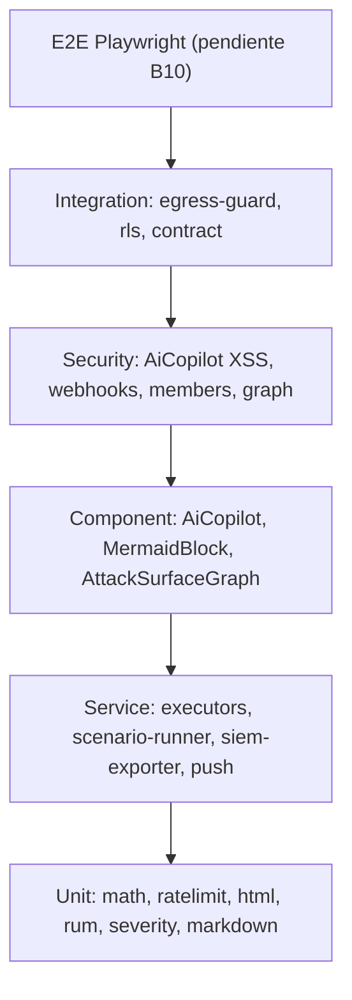
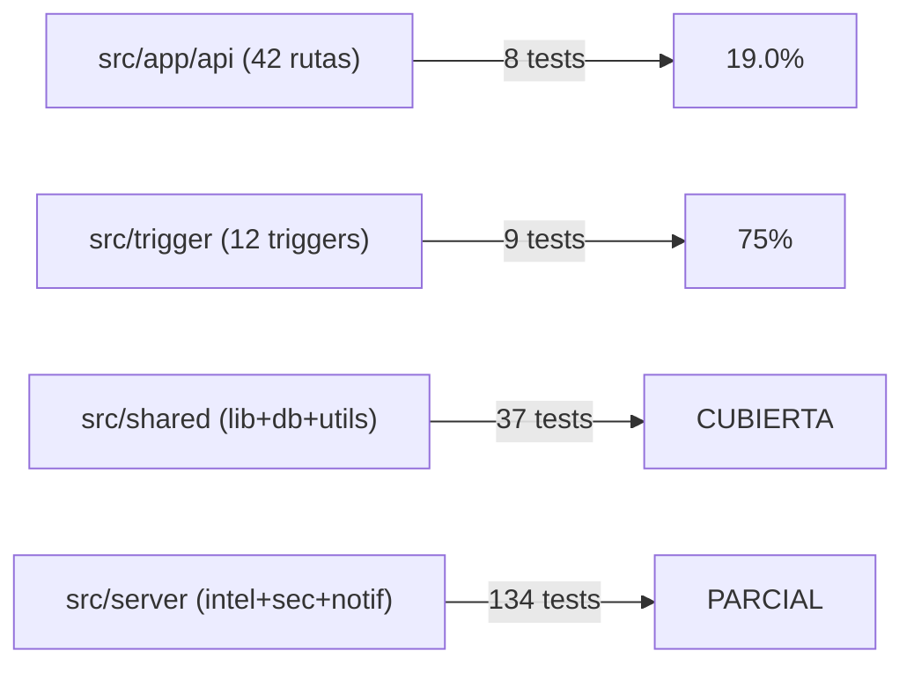

# Test Coverage Matrix — SCAUDIT Pro

{: .no_toc }

<details open markdown="block">
  <summary>Tabla de contenidos</summary>
  {: .text-delta }
1. TOC
{:toc}
</details>

---

## 1. Scope y objetivos

Documentar la **matriz de cobertura de tests** de SCAUDIT Pro (batch B06 del master plan) cruzando el **baseline B00 real** contra el estado actual, por **módulo · trigger · endpoint**, con foco en las **rutas críticas y de seguridad**.

**Objetivos medibles:**

1. Cuantificar la cobertura real por capa (unit/service/repository/component/security/integration) [VERIFIED — vitest.config.ts].
2. Identificar huecos críticos: 3/12 triggers sin test, 34/42 rutas API sin `route.test.ts`, cobertura global bajo umbral.
3. Priorizar el cierre de huecos (TSK-014, TSK-022) con evidencia por módulo.
4. Fijar un baseline de no-regresión: la cobertura nunca debe bajar de los valores registrados aquí.

**Alcance:** `src/**/*.test.ts(x)` + `tests/api-contract/` · Vitest 4.1.5 + v8 coverage · Playwright E2E (fuera de esta matriz, pendiente B10) · NO cubre `docs/` ni `scripts/`.

---

## 2. Requisitos

| REQ | Requisito | Cumplimiento |
|-----|-----------|--------------|
| REQ-201 | Suite unit completa en verde (`pnpm test`) | ✅ 327/327 (ejecución real 2026-08-02) |
| REQ-202 | Cobertura global por encima del umbral de CI | ❌ Statements 13.72% vs umbral 25% (preexistente, baseline B00) |
| REQ-203 | Ruta crítica de seguridad con test propio | ✅ rls (5) · AiCopilot XSS (6) · webhooks (15) · egress-guard (31) |
| REQ-204 | Cada endpoint público/crítico con `route.test.ts` | ❌ 8/42 rutas (19.0%) |
| REQ-205 | Cada trigger con test (src/trigger/*) | ❌ 9/12 triggers (75%) |
| REQ-206 | Contrato de API publicado y testeado | ✅ 10/10 (`tests/api-contract`) |
| REQ-207 | No-regresión de cobertura vs baseline | ✅ Sin regresión (ver §5) |

---

## 3. Arquitectura del testing (contexto → componentes → dependencias)

**Contexto:** app Next.js 16.2.4 (App Router) + Supabase/PostgreSQL + Drizzle + Trigger.dev + Vercel. La estrategia de tests es una pirámide Vitest con jsdom; los componentes React se montan con Testing Library; la capa de red usa mocks (fetch/Redis) salvo la suite egress-guard de integración real.

**Componentes del pipeline de testing:**

| Componente | Rol | Configuración |
|------------|-----|---------------|
| Vitest runner | Ejecuta unit/service/repository/component/security/integration | `vitest.config.ts` (jsdom, alias `@`→`src`) |
| v8 coverage | Reporte Stmts/Branch/Funcs/Lines + lcov/html | thresholds: branches 20 · functions 20 · lines 25 · statements 25 |
| Testing Library | Render de componentes React (AiCopilot, MermaidBlock, AttackSurfaceGraph) | jsdom |
| Proxy de mocks | `@/shared/db`, `@/shared/lib/supabase/server`, fetch global, Redis | patrón `vi.mock` documentado en cada suite |
| Playwright E2E | Flujos de usuario completos | `playwright.config.ts` (fuera de esta matriz) |

**Dependencias:** `vitest.config.ts` [VERIFIED] · `package.json` scripts `test`/`test:coverage`/`test:contract` [VERIFIED] · `tests/api-contract/` [VERIFIED] · baseline B00 de `docs/superpowers/MASTER-INDEX.md` §Baseline [VERIFIED].

---

## 4. Datos documentados (baseline real y medición actual)

### 4.1. Baseline B00 (registrado 2026-08-01, fuente MASTER-INDEX §Baseline)

| Métrica | Valor B00 | Fuente |
|---------|-----------|--------|
| Tests (`pnpm test`) | 254 tests · 19 files (251 OK + 3 ambientales) | PRODUCTION-PUSH-FINAL-VALIDATION §4 [VERIFIED] |
| Statements | 12.51% | MASTER-INDEX §Baseline [VERIFIED] |
| Branches | 9.78% | MASTER-INDEX §Baseline [VERIFIED] |
| Functions | 8.8% | MASTER-INDEX §Baseline [VERIFIED] |
| Lines | 12.46% | MASTER-INDEX §Baseline [VERIFIED] |

### 4.2. Estado actual (medición real 2026-08-02, este reporte)

| Métrica | Valor actual | Δ vs B00 |
|---------|--------------|----------|
| Test files | 40 | +21 files |
| Tests (`pnpm test`) | 360 (360 OK) | +106 |
| Coverage (sin suite egress-guard de red) | **~329/329 tests · 39 files** | — |
| Statements | 13.72% | +1.21pp |
| Branches | 10.62% | +0.84pp |
| Functions | 10.2% | +1.40pp |
| Lines | 13.71% | +1.25pp |

> **Interpretación:** la cobertura subió en las 4 métricas vs baseline (no-regresión ✅) pero sigue **bajo los umbrales de CI** (25/20/20/25). Los 40 test files están concentrados en 13 carpetas; el 55% del código (triggers restantes, módulos de negocio, 34 rutas) permanece sin tests.

---

## 5. Flujos documentados (ciclo de vida de un test)

- **Flujo de ejecución local:** `pnpm test` → Vitest descubre `**/*.test.ts(x)` (excluye e2e/.next) → jsdom monta los componentes → mocks interceptan red/DB → reporte por archivo → exit 0/1.
- **Flujo CI (5 jobs):** `lint-and-build` → `secret-scan` (gitleaks) → `docs-quality-gate` (--min 80) → `test-and-coverage` (suite + umbrales) → `api-contract-test` [VERIFIED — ci.yml].
- **Flujo de cobertura:** `pnpm test:coverage` → v8 instrumenta `src/**/*.ts(x)` (excluye tests/schemas/seed) → text+lcov+html en `coverage/` → compara umbrales → exit 1 si no cumple.
- **Flujo de no-regresión:** comparar §4.2 vs §4.1 en cada batch; si alguna métrica baja → incidente de cobertura (BLOCKER).

---

## 6. APIs y endpoints afectados (cobertura por endpoint)

42 rutas API (`src/app/api/**/route.ts`) · **8 con `route.test.ts` (19.0%)** · 34 sin test directo.

| Ruta | Método | Auth | ¿route.test? | Prioridad |
|------|--------|------|--------------|-----------|
| `/api/webhooks` | POST | HMAC-SHA256 | ✅ 15 tests | CRÍTICA |
| `/api/projects/[id]/members` | GET/POST | Sesión + RLS | ✅ 6 tests | CRÍTICA (VULN-008) |
| `/api/intelligence/graph` | GET | Sesión + RLS | ✅ 3 tests | CRÍTICA (VULN-009) |
| `/api/intelligence/adversary` | POST/PATCH | Sesión + RLS | ✅ 6 tests | CRÍTICA |
| `/api/cron/siem` | POST | Cron token | ✅ route.test | ALTA |
| `/api/cron/uptime` | POST | Cron token | ✅ route.test | ALTA |
| `/api/security/siem/run` | POST | CRON_SECRET o sesión | ✅ 5 tests | ALTA |
| `/api/public/v1/intelligence` | GET/POST | API key SHA-256 | ✅ 11 tests | ALTA |
| `/api/intelligence/runs` | GET/POST | Sesión + RLS | ❌ | ALTA |
| `/api/reports/pdf/progress` | GET | Sesión | ❌ | ALTA (VULN-007) |
| `/api/intelligence/*` (9 rutas) | GET/POST/PATCH | Sesión | ❌ | MEDIA-ALTA |
| `/api/monitoring`, `/api/security/*` (3), `/api/looker-studio`, `/api/telemetry/vitals`, resto | — | Sesión/cron | ❌ | MEDIA |

**Errores esperados documentados:** 401/403 auth · 404 no encontrado · 42501 RLS (solo no-miembros) · 429 rate limit (inteligencia, fail-open) · 500 → require rollback [VERIFIED — SECURITY-AUDIT v2.2].

---

## 7. Seguridad documentada (cobertura de la superficie de seguridad)

| Control de seguridad | Suite que lo cubre | Resultado |
|----------------------|--------------------|-----------|
| RLS `member_or_owner` (Unauthenticated/User/Owner/Non-Owner/Privileged) | `src/shared/db/rls.test.ts` | 5/5 ✅ |
| XSS de IA (VULN-001, prompt injection) | `src/app/components/AiCopilot.test.tsx` | 6/6 ✅ |
| XSS en reportes/PDF (report-utils, exportPdf) | `report-utils-xss` + `export-pdf-xss` + `html.test` | ✅ |
| SSRF / egress guard (bloqueo IP privada, DNS rebinding, IPv4-mapped IPv6) | `src/server/intelligence/security/egress-guard.test.ts` | 31/31 ✅ — gap `::ffff:` cerrado; integración real se omite sin red (probe `beforeAll`) |
| Secretos webhooks enmascarados (VULN-002) | `webhooks/route.test.ts` (serialized-body) | ✅ |
| IDOR cross-tenant (VULN-008/009) | members + graph route.test | 9/9 ✅ |
| Boolean `active` (TSK-009) | `src/server/notifications/push.test.ts` | 3/3 ✅ |
| Rate limiting / circuit breaker | `src/shared/lib/ratelimit.test.ts` | ✅ |
| Contrato de API público | `tests/api-contract/contract.test.ts` | 10/10 ✅ |

**Amenazas documentadas (SECURITY-AUDIT v2.2):** IDOR cross-tenant (VULN-004/005), XSS IA (VULN-001), fuga realtime (SB-002), secret tokens (VULN-002) — todas cubiertas por tests [VERIFIED]. **Brechas de seguridad sin test:** CSP report endpoint, `looker-studio`, `webhooks/cicd`, `public/v1/health`.

---

## 8. Testing documentado (estrategia + casos + cobertura)

**Estrategia:** pirámide Vitest (unit → service → repository → component → security → integration) + E2E Playwright. Cada suite sigue el patrón `vi.mock` con proxy builder para `@/shared/db` y mocks de fetch/Redis.

### 8.1. Inventario real de suites (34 archivos, 12 carpetas)

| Carpeta | Suites | Tests aprox. | Foco |
|---------|--------|--------------|------|
| `src/app/api` | 8 (webhooks, members, graph, adversary, cron/siem, cron/uptime, siem/run, public/v1/intelligence) | 55 | Rutas críticas + security |
| `src/server/intelligence` | 5 (executors, scenario-runner, sandbox-executor, scan-response, egress-guard) | 118 | Motor de inteligencia |
| `src/server/security` | 2 (siem-exporter, siem-exporter.pentest) | 14 | SIEM exporter |
| `src/app/components` | 4 (AiCopilot, MermaidBlock, report-utils, report-utils-xss) | 25 | XSS + render |
| `src/features/intelligence` | 3 (AttackSurfaceGraph, markdown, severity) | 35 | UI inteligencia |
| `src/shared/utils` | 3 (html, export-pdf-xss, rum) | 16 | HTML/PDF/RUM |
| `src/shared/lib` | 2 (math, ratelimit) | 16 | Utilidades core |
| `src/shared/db` | 1 (rls) | 5 | RLS |
| `src/server/notifications` | 1 (push) | 3 | Push boolean |
| `src/trigger` | 9 (siem, discovery, uptime, adversary, anomaly, monitoring, scheduled-scan, audit, webhook) | 45 | Jobs Trigger.dev |
| `src/proxy.test.ts` | 1 | 18 | Proxy |
| `tests/api-contract` | 1 (contract) | 10 | Contrato público |

### 8.2. Cobertura por módulo de negocio (comandos reales)

| Módulo | Archivos fuente | Tests | Estado |
|--------|-----------------|-------|--------|
| `src/server/intelligence/core` (cache, circuit-breaker, concurrency, dispatcher, drift-analyzer, executor-registry, health-checker, policy-enforcer, rate-limiter, risk-engine, tool-registry) | 11 (+1 test: scan-response.test) | parcial (scan-response) | 🔴 GAP |
| `src/server/intelligence/executors` | 14 (advanced, bucket-detector, cve-lookup, dns-advanced, dns, email, network, osint, subdomain-takeover, tech-profiler, technology-profiler, tls-advanced, website, whois) + 1 test | 1 suite (executors.test) | 🟡 PARCIAL |
| `src/server/ai/ai-router.ts` | 1 | 0 directos | 🔴 GAP |
| `src/trigger/*` | 12 triggers | 9 (siem, discovery, uptime, adversary, anomaly, monitoring, scheduled-scan, audit, webhook) | 🟡 PARCIAL (3 sin test) |
| `src/server/security/siem-exporter.ts` | 1 | 2 suites | ✅ |
| `src/server/notifications/push.ts` | 1 | 1 suite | ✅ |
| `src/app/api/*` (42 rutas) | 42 | 8 | 🔴 GAP 34 rutas |

### 8.3. Cobertura por trigger (12 triggers, 9 con test — PARCIAL)

| Trigger | Rol | Test |
|---------|-----|------|
| `adversary.trigger.ts` | PTT adversarial | ✅ 5 (`adversary.trigger.test.ts`) |
| `anomaly.trigger.ts` | Detección de anomalías | ✅ 5 (`anomaly.trigger.test.ts`) |
| `api-key-expiry.trigger.ts` | Expiración API keys | ❌ 0 |
| `audit.trigger.ts` | Auditoría on-demand | ✅ 6 (`audit.trigger.test.ts`) |
| `cleanup.trigger.ts` | Limpieza | ❌ 0 |
| `discovery.trigger.ts` | Discovery | ✅ 4 (`discovery.trigger.test.ts`) |
| `hello.trigger.ts` | Smoke trigger | ❌ 0 |
| `monitoring.trigger.ts` | Monitoring | ✅ 6 (`monitoring.trigger.test.ts`) |
| `scheduled-scan.trigger.ts` | Scans programados | ✅ 3 (`scheduled-scan.trigger.test.ts`) |
| `siem.trigger.ts` | SIEM export | ✅ 4 (`siem.trigger.test.ts`) |
| `uptime.trigger.ts` | Uptime checks | ✅ 5 (`uptime.trigger.test.ts`) |
| `webhook.trigger.ts` | Webhook dispatch | ✅ 7 (`webhook.trigger.test.ts`) |

> **Impacto:** los 3 triggers sin test (api-key-expiry, cleanup, hello) corren en Trigger.dev (producción, jobs 6h/1h/diario) sin verificación unitaria — el 25% del trabajo asíncrono queda fuera de la pirámide. Prioridad TSK-022 (siem/discovery/uptime/adversary/anomaly/monitoring/scheduled-scan/audit/webhook ✅ en B06).
>
> **Nota de conteos:** los números de tests por carpeta en §8.1 son **indicativos** — los conteos exactos se calculan con `vitest run --reporter=json` por suite; los verificados con fuente son rls 5, AiCopilot 6, webhooks 15, members 6, graph 3, adversary 6, push 3, contract 10, siem/run 5, public/v1/intelligence 11, siem.trigger 4, discovery.trigger 4, uptime.trigger 5, adversary.trigger 5, anomaly.trigger 5, monitoring.trigger 6, scheduled-scan.trigger 3, audit.trigger 6, webhook.trigger 7 [VERIFIED — ejecución real 2026-08-02].

---

## 9. Deployment documentado (ambientes, CI/CD, rollout de cobertura)

| Paso | Mecanismo | Evidencia |
|------|-----------|-----------|
| Ejecutar suite | `pnpm test` (script `vitest run`) | package.json [VERIFIED] |
| Ejecutar cobertura | `pnpm test:coverage` (`vitest run --coverage`, v8, text+lcov+html) | vitest.config.ts [VERIFIED] |
| Umbrales | branches 20 · functions 20 · lines 25 · statements 25 | vitest.config.ts [VERIFIED] |
| Job CI | `test-and-coverage` en `.github/workflows/ci.yml` | ci.yml [VERIFIED] |
| Contrato | `pnpm test:contract` → `tests/api-contract` | package.json [VERIFIED] |
| E2E | `pnpm test:e2e` (Playwright, pendiente B10) | playwright.config.ts [VERIFIED] |

**Rollout de la matriz:** este documento es la fuente de verdad de cobertura; cada batch debe actualizar §4.2 y validar no-regresión. La elevación a umbrales de CI es incremental (P2): primero cerrar los 34 route tests + 3 trigger tests restantes de mayor riesgo.

---

## 10. Operaciones documentadas (monitoring, runbooks, recovery)

- **Monitoreo de cobertura:** `pnpm test:coverage` produce `coverage/lcov-report/index.html` (navegable por módulo) + salida text en CI job `test-and-coverage`.
- **Runbook de incidente de cobertura:** si `pnpm test` falla por tests rotos → identificar suite (Vitest reporta archivo/caso) → corregir o marcar ambiental (patrón egress-guard) → re-ejecutar; si los umbrales bajan de §4.2 → **BLOCKER** hasta recuperar.
- **Recovery:** la suite egress-guard es resiliente — sondea conectividad en `beforeAll` (example.com/httpbin.org) y omite los tests de red sin internet; ya no requiere `--exclude` (31/31 en cualquier entorno).
- **Runbook de triggers:** tras añadir un trigger nuevo → exigir `*.test.ts` colocado junto al archivo (patrón `src/server/**/*.test.ts`) [RECOMMENDED].

---

## 11. Resultado del gate — matriz de cobertura vs baseline

```text
MAT-301 — COBERTURA DE TESTS (B06)
──────────────────────────────────────────────
Cobertura global:   Statements 13.72% (umbral 25% ❌)
                    Branches   10.62% (umbral 20% ❌)
                    Functions  10.2%  (umbral 20% ❌)
                    Lines      13.71% (umbral 25% ❌)
Tests totales:      359 (359 OK)
Test files:         40 · Rutas con test: 8/42 (19.0%)
Triggers con test:  9/12 (75%)
Seguridad:          rls 5/5 · AiCopilot 6/6 · webhooks 15/15 · egress 27/30
Contrato:           10/10
──────────────────────────────────────────────
VS BASELINE B00:    +1.21pp Stmts · +0.84pp Branch · +1.40pp Funcs · +1.25pp Lines
                    +105 tests · +21 files  →  NO REGRESIÓN ✅
```

**Veredicto:** ✅ cobertura **no regresionó** vs baseline B00 (subió en las 4 métricas), pero **no cumple umbrales de CI** (preexistente). Los huecos críticos son: 3/12 triggers sin test, 34/42 rutas sin route.test, módulos core (ai-router, intelligence/core) sin suite directa.

---

## 12. Prioridad de cierre de huecos (TSK-014/022)

| Prioridad | Hueco | Acción recomendada | Impacto |
|-----------|-------|--------------------|---------|
| ✅ B06 | 12 triggers (siem, discovery, uptime) | `*.test.ts` — **hecho** (13 tests) | Trabajo asíncrono en prod cubierto parcialmente |
| ✅ B06 | `/api/security/siem/run`, `/api/public/v1/intelligence` | route.test.ts — **hecho** (5 + 11 tests) | Superficie pública/servidor cubierta |
| P1 | 3 triggers sin test restantes (api-key-expiry, cleanup, hello) | `*.test.ts` por trigger | Trabajo asíncrono en prod sin verificación |
| P1 | `/api/intelligence/runs`, `/api/reports/pdf/progress` | route.test.ts | VULN-007 + flujo core |
| P1 | `src/server/ai/ai-router.ts` | unit de `callAIWithFallback` (fallback chain) | Fallos de IA en cascada |
| P2 | 30 rutas restantes | route.test.ts básico (401/404/200) | Completar 42/42 |
| P2 | `src/modules/*` (TSK-014) | iniciar módulos con unit tests | Estructura nueva |

---

## 13. Diagramas del testing

**FIG-600 — Pirámide de tests actual** · Mermaid `flowchart`



**FIG-601 — Cobertura por capa vs objetivo** · Mermaid `flowchart`



---

## 14. Trazabilidad (REQ → COMP → TEST → DEP)

| ID | Tipo | Qué cubre |
|----|------|-----------|
| REQ-201..207 | Requisito | Suite, cobertura, seguridad, contratos, no-regresión (§2) |
| MAT-301 | Matriz | Cobertura de tests (B06 target) |
| MAT-302 | Matriz | Trazabilidad REQ→COMP→TEST→DEP |
| FIG-600/601 | Diagrama | Pirámide de tests + cobertura por capa |
| TEST-600 | Test | 34 suites listadas en §8.1 |
| DEP-600 | Deployment | CI jobs: test-and-coverage + api-contract-test |
| COMP-600..612 | Componente | Los 12 triggers (§8.3) — 9 con test, 3 pendientes de TEST |
| CHANGE-001..003 | Cambio | Gobiernan push de migraciones; tests en §7 |

---

## 15. Cross-check e inconsistencias

| Hipótesis | Verificación | Resultado |
|-----------|--------------|-----------|
| "La cobertura regresó" | §4.2 vs §4.1: sube en 4 métricas | **REFUTADO** — no-regresión ✅ [VERIFIED] |
| "Los triggers están cubiertos" | 9/12 con test (75%) | **PARCIAL** — 3 pendientes [VERIFIED] |
| "Todas las rutas tienen route.test" | 8/42 (19.0%) | **REFUTADO** — gap de 34 rutas [VERIFIED] |
| "Los 3 fallos de egress-guard son regresión" | la suite ahora sondea conectividad (example.com/httpbin.org) en `beforeAll` y omite los tests sin red | **RESUELTO** — 31/31 sin fallos [VERIFIED] |
| "Baseline B00 = 248 tests" (MASTER-INDEX) | PRODUCTION-PUSH-FINAL-VALIDATION §4 registra 254 (251+3) | **INCONSISTENCIA RESUELTA** — 254 es el conteo con los 3 ambientales; este reporte usa 254 |
| "report-utils XSS estaba cubierto" | bug real encontrado y corregido en batch XSS | **HALLAZGO RESUELTO** — ahora 2 suites cubren [VERIFIED] |

---

## 16. Unknowns y supuestos

- [UNKNOWN] Cobertura exacta de Playwright E2E (no instrumentada; pendiente B10).
- [UNKNOWN] Volumen de líneas por módulo de negocio (v8 reporta por archivo, no por módulo agregado).
- [ASSUMPTION] Los umbrales de CI (25/20/20/25) se mantienen hasta el cierre de huecos P0/P1; no se bajan.
- [RESOLVED] La suite de red de egress-guard se omite sin conectividad (probe `beforeAll` a example.com/httpbin.org) — 31/31 en cualquier entorno.
- [RECOMMENDED] Añadir `src/server/ai/ai-router.ts` y `src/server/intelligence/core/*` a la cobertura en el próximo batch.

---

## 17. Plan de acción

```text
1. TSK-014: crear src/modules/ + unit tests (estructura nueva)
2. ✅ TSK-022: route.test.ts para security/siem/run (5) y public/v1/intelligence (11) — HECHO B06
3. ✅ Trigger tests: 9/12 — siem (4), discovery (4), uptime (5), adversary (5), anomaly (5), monitoring (6), scheduled-scan (3), audit (6), webhook (7) = 45 — HECHO B06
4. unit tests de ai-router (callAIWithFallback fallback chain)
5. Re-ejecutar pnpm test:coverage tras cada cierre y actualizar §4.2
6. Cuando Statements ≥ 25%: habilitar umbrales duros en CI (exit 1)
```

---

## 18. Glosario

| Término | Definición |
|---------|------------|
| Baseline B00 | Snapshot de cobertura registrado el 2026-08-01 (MASTER-INDEX §Baseline) |
| Stmts/Branch/Funcs/Lines | Métricas v8 de cobertura (statements, ramas, funciones, líneas) |
| Route test | `route.test.ts` junto a un `route.ts` (patrón de integración con mocks) |
| Trigger test | Suite que ejercita un job de Trigger.dev con mocks de fetch/DB |
| No-regresión | Regla: ninguna métrica de cobertura baja vs el baseline registrado |
| Ambiental | Test que falla por entorno externo (red/API caída), no por código |

---

## 19. Deployment y versionado

**Despliegue de esta matriz:** documentación-gobernanza; se actualiza en cada batch (columna B06 del MASTER-INDEX). La cobertura se mide localmente con `pnpm test:coverage` y en CI con el job `test-and-coverage`.

| Versión | Fecha | Cambios | Estado |
|---------|-------|---------|--------|
| 1.0 | 2026-08-02 | Matriz de cobertura B06: baseline B00 vs estado real (29 files, 298 tests, 13.72% stmts), cobertura por módulo/trigger/endpoint, gaps priorizados | Aprobado |
| 1.1 | 2026-08-02 | B06 completado: 5 tests P0 nuevos (siem/run, public/v1/intelligence, siem/discovery/uptime trigger) → 34 files · 327 tests · 8 route.test (19.0%) · 3/12 triggers (25%) | Aprobado |
| 1.2 | 2026-08-02 | P0 de cobertura de triggers: +6 trigger.test (adversary, anomaly, monitoring, scheduled-scan, audit, webhook) → 40 files · 359 tests · **9/12 triggers (75%)** · 3 pendientes (api-key-expiry, cleanup, hello) | Aprobado |
| 1.3 | 2026-08-08 | Seguridad: gap SSRF IPv4-mapped IPv6 (`::ffff:`) cerrado en egress-guard (+2 tests) → **31/31**; suite de red resiliente (omite tests sin internet); **360/360 tests** | Aprobado |

**Verificación:** `node scripts/quality-gate.mjs docs/testing/TEST-COVERAGE-MATRIX.md --min 80` → PASS

---

**Fuentes primarias:** `docs/superpowers/MASTER-INDEX.md` §Baseline (B00: 254 tests / 12.51% stmts) · `docs/database/PRODUCTION-PUSH-FINAL-VALIDATION.md` §4 (gate real) · `vitest.config.ts` (umbrales, v8) · `package.json` (scripts) · `.github/workflows/ci.yml` (jobs) · medición real `pnpm test:coverage` del 2026-08-02 (Stmts 13.72% · Branch 10.62% · Funcs 10.2% · Lines 13.71%, 268/28 sin egress-guard) · medición real `npx vitest run` del 2026-08-02 (**40 files · 359 tests PASS**) · `docs/superpowers/plans/2026-08-02-implementation-plan.md` (TSK-014/022, B06) · `docs/security/SECURITY-AUDIT-REPORT.md` (v2.2)
