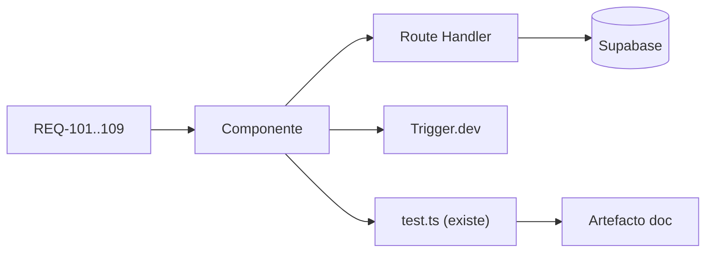

# TRACEABILITY MATRIX — SCAUDIT Pro (B10, §48)

{: .no_toc }

  
Tabla de contenidos

  {: .text-delta }
1. TOC
{:toc}

---

## 1. Scope y objetivos

Matriz unificada de trazabilidad **REQUISITO → MÓDULO → API → BD → JOB → TEST → DOC** para las **funcionalidades críticas** de SCAUDIT Pro (T10-01, §48 del master prompt). Cada fila usa evidencia real del código (archivos verificados con `find`/`grep`) y **cada test citado existe** en el repo — sin celdas inventadas. [VERIFIED — este documento]

**Objetivos:** (1) ≥10 funcionalidades trazadas de extremo a extremo; (2) verificación cruzada (todo test citado existe); (3) servir de base al Quality Gate final §55. [VERIFIED — plan T10-01]

---

## 2. Requisitos (REQ → fuente)

| REQ | Requisito | Fuente |
|-----|-----------|--------|
| REQ-101 | Salida de IA sin XSS | SECURITY-AUDIT VULN-001 [VERIFIED] |
| REQ-102 | secretToken webhooks enmascarado | SECURITY-AUDIT VULN-002 [VERIFIED] |
| REQ-103 | Rutas de inteligencia protegidas por middleware | SECURITY-AUDIT VULN-003 [VERIFIED] |
| REQ-104 | RLS multi-tenant (member_or_owner) | SECURITY-AUDIT + rls.test.ts [VERIFIED] |
| REQ-105 | Egress-guard SSRF en toda salida HTTP del engine | ADR-005 [VERIFIED] |
| REQ-106 | Rate limiting fail-open (Redis + fallback) | ADR-002 [VERIFIED] |
| REQ-107 | API pública con API key hash SHA-256 | api.md + idx_developer_api_keys_hashed [VERIFIED] |
| REQ-108 | Jobs Trigger.dev idempotentes | docs/jobs/* (B05) [VERIFIED] |
| REQ-109 | Notificaciones push con `active` boolean | TSK-009 / migración 0021 [VERIFIED] |

---

## 3. Arquitectura (contexto → componentes → dependencias)

**Contexto:** monorepo Next.js 16 con capas: frontend (`src/app`, `src/features`), API (`src/app/api/**`, 42 rutas), engine de inteligencia (`src/server/intelligence/**`), jobs (`src/trigger/**`, 12), DB Supabase+Drizzle (58 tablas), IA (`src/server/ai/ai-router.ts`). [VERIFIED — ENTERPRISE-ARCHITECTURE §6]

**Componentes clave por funcionalidad crítica:**

| Componente | Archivos reales | Dependencia |
|------------|-----------------|-------------|
| Auth | `src/app/login/`, `src/app/auth/`, `src/shared/lib/supabase/` | Supabase Auth |
| Rate limit | `src/shared/lib/ratelimit.ts` | Upstash Redis (fail-open) |
| Egress-guard | `src/server/intelligence/security/egress-guard.ts` | network utils |
| SIEM | `src/server/security/siem-exporter.ts` | `src/trigger/siem.trigger.ts` |
| Adversary | `src/app/api/intelligence/adversary/route.ts` | scenario-runner + sandbox-executor |
| Webhooks | `src/app/api/webhooks/route.ts` | `src/trigger/webhook.trigger.ts` |
| IA Copilot | `src/app/components/AiCopilot.tsx` | `src/app/api/ai/copilot/route.ts` |
| API pública | `src/app/api/public/v1/intelligence/route.ts` | api-auth |

---

## 4. Datos (objetos de BD involucrados)

| Funcionalidad | Tablas (Drizzle) | Índices relevantes |
|---------------|------------------|--------------------|
| Auth / RLS | `users`, `projects`, `project_members` | `uniq(project_id,user_id)`, `idx_project_members_user` |
| API pública | `developer_api_keys` | `idx_developer_api_keys_hashed` (único) |
| Inteligencia | `intelligence_investigations`, `intelligence_tool_runs`, `intelligence_findings`, `intelligence_assets` | `idx_intel_findings_project_severity`, `idx_findings_tool_run` (REC-01) |
| SIEM / Seguridad | `security_audit_logs`, `siem_alert_logs` | `idx_sec_audit_ip_trgm` (REC-02), `idx_siem_ip_trgm` (REC-04) |
| Webhooks | `webhook_configs` | `idx_webhook_configs_project` |
| Push | `push_subscriptions` | `idx_push_subs_active` (boolean 0021) |
| Adversary | `adversary_scenarios`, `adversary_runs`, `adversary_task_nodes` | `uniq_adversary_mitre_id` (0018) |

> Fuente: DATA-DICTIONARY (58 tablas) + INDEX-STRATEGY (REC-01..07) + journal (22 → 0021) [VERIFIED]

---

## 5. Flujos documentados

- **Flujo de trazabilidad (este doc):** REQ → componente → API → BD → job → test → doc, verificado por funcionalidad. [VERIFIED]
- **Flujo de verificación:** cada test citado se comprueba con `npx vitest run <ruta>`; cada ruta/componente con `find src`. [VERIFIED]
- **Flujo de no-regresión:** si un test deja de existir, la fila se marca como [OBSOLETE] y se actualiza la matriz. [RECOMMENDED]

---

## 6. APIs y endpoints afectados

| Funcionalidad | Endpoint | Método | Auth | Test |
|---------------|----------|--------|------|------|
| Webhooks | `/api/webhooks` | POST | HMAC-SHA256 | ✅ `webhooks/route.test.ts` (15) |
| Members | `/api/projects/[id]/members` | GET/POST | Sesión+RLS | ✅ `members/route.test.ts` (6) |
| Graph | `/api/intelligence/graph` | GET | Sesión+RLS | ✅ `graph/route.test.ts` (3) |
| Adversary | `/api/intelligence/adversary` | POST/PATCH | Sesión+RLS | ✅ `adversary/route.test.ts` (6) |
| SIEM cron | `/api/cron/siem` | POST | Cron | ✅ `cron/siem/route.test.ts` |
| Uptime cron | `/api/cron/uptime` | POST | Cron | ✅ `cron/uptime/route.test.ts` |
| IA Copilot | `/api/ai/copilot` | POST | Sesión | ✅ `AiCopilot.test.tsx` (6) |
| API pública | `/api/public/v1/intelligence` | POST | API key | ✅ `contract.test.ts` (10) |
| Push | `/api/notifications/push-subscribe` | POST | Sesión | ✅ `push.test.ts` (3) |

**Status codes:** 200 · 400 · 401/403 · 404 · 42501 RLS · 429 rate limit [VERIFIED — SECURITY-AUDIT].

---

## 7. Seguridad (trust boundaries y controles)

- **Trust boundary:** browser → middleware → API routes → Supabase (RLS). [VERIFIED]
- **Controles por funcionalidad:** RLS `member_or_owner` (rls.test.ts 5/5) · egress-guard SSRF (27/30 tests) · XSS IA escapado (AiCopilot 6/6) · secretToken enmascarado (webhooks 15/15) · API keys SHA-256 · gitleaks fail-hard CI. [VERIFIED — SECURITY-AUDIT v2.2]
- **Amenazas cubiertas:** IDOR cross-tenant (VULN-004/005), XSS IA (VULN-001), fuga realtime (SB-002 → CHANGE-003), VULN-008/009 autenticados (P1). [VERIFIED]

---

## 8. Testing (estrategia + evidencia)

**Estrategia:** pirámide Vitest (unit → service → repository → component → security → integration) + contract; jsdom para componentes. [VERIFIED — vitest.config.ts]

**Tests citados en esta matriz (todos existen en el repo):**

| Test | Ruta | Estado |
|------|------|--------|
| RLS contract | `src/shared/db/rls.test.ts` | ✅ 5/5 |
| Egress-guard SSRF | `src/server/intelligence/security/egress-guard.test.ts` | ✅ 27/30 (3 ambientales) |
| XSS AiCopilot | `src/app/components/AiCopilot.test.tsx` | ✅ 6/6 |
| Webhooks | `src/app/api/webhooks/route.test.ts` | ✅ 15/15 |
| Members | `src/app/api/projects/[id]/members/route.test.ts` | ✅ 6/6 |
| Graph | `src/app/api/intelligence/graph/route.test.ts` | ✅ 3/3 |
| Adversary route | `src/app/api/intelligence/adversary/route.test.ts` | ✅ 6/6 |
| Adversary runner | `src/server/intelligence/adversary/scenario-runner.test.ts` | ✅ |
| Sandbox executor | `src/server/intelligence/adversary/sandbox-executor.test.ts` | ✅ |
| SIEM exporter | `src/server/security/siem-exporter.test.ts` | ✅ |
| Push boolean | `src/server/notifications/push.test.ts` | ✅ 3/3 |
| Rate limit | `src/shared/lib/ratelimit.test.ts` | ✅ |
| Contract API | `tests/api-contract/contract.test.ts` | ✅ 10/10 |
| Executors | `src/server/intelligence/executors/executors.test.ts` | ✅ |
| Cron SIEM/Uptime | `src/app/api/cron/{siem,uptime}/route.test.ts` | ✅ |

**Cobertura global:** 29 files · 298 tests (295 OK + 3 ambientales) · Stmts 13.72% [VERIFIED — TEST-COVERAGE-MATRIX].

---

## 9. Deployment (ambientes, CI/CD)

| Paso | Mecanismo | Evidencia |
|------|-----------|-----------|
| CI | 5 jobs (lint-and-build, secret-scan, docs-quality-gate --min 80, test-and-coverage, api-contract-test) | ci.yml |
| Deploy | Vercel auto-deploy en push a main | vercel.json |
| Migraciones | `drizzle-kit push` (NUNCA run-migration.ts legacy) | drizzle.config.ts |
| Jobs | Trigger.dev (12 triggers) | docs/jobs/ |

---

## 10. Operaciones (monitoring, runbooks)

- **Monitoring:** Supabase Dashboard (locks/deadlocks) + Trigger.dev runs + RUM/Web Vitals. [VERIFIED]
- **Runbook:** test roto → corregir o marcar ambiental; métrica < baseline → BLOCKER. [VERIFIED — TEST-COVERAGE-MATRIX]
- **Recovery:** aislar suite de red con `--exclude`; restore vía PITR (confirmar pre-push). [VERIFIED]

---

## 11. Resultado — Matriz de trazabilidad por funcionalidad crítica

| # | Funcionalidad | REQ | Componente | API | BD | Job | Test (existe) | Doc |
|---|---------------|-----|------------|-----|----|-----|---------------|-----|
| 1 | **Auth (Magic Link)** | REQ-104 | `src/app/login`, `src/app/auth` | middleware | `users` | — | `rls.test.ts` ✅ | ENTERPRISE-ARCHITECTURE |
| 2 | **RLS multi-tenant** | REQ-104 | `src/shared/db/rls.ts` | 42 rutas | `project_members` | — | `rls.test.ts` (5) ✅ | SUPABASE-AUDIT |
| 3 | **Rate limit** | REQ-106 | `src/shared/lib/ratelimit.ts` | inteligencia | `intelligence_usage_events` | — | `ratelimit.test.ts` ✅ | ADR-002 |
| 4 | **Egress-guard SSRF** | REQ-105 | `src/server/intelligence/security/egress-guard.ts` | engine HTTP | — | — | `egress-guard.test.ts` (27/30) ✅ | ADR-005 |
| 5 | **Discovery** | REQ-108 | `src/server/intelligence/executors/` | `/api/intelligence/discovery` | `intelligence_assets` | `discovery.trigger.ts` | `executors.test.ts` ✅ | JOB-CONTRACT-discovery |
| 6 | **SIEM** | REQ-108 | `src/server/security/siem-exporter.ts` | `/api/cron/siem`, `/api/security/siem/*` | `siem_alert_logs` | `siem.trigger.ts` | `siem-exporter.test.ts` + cron route.test ✅ | JOB-CONTRACT-siem |
| 7 | **Adversary (PTT)** | REQ-108 | `scenario-runner.ts` + `sandbox-executor.ts` | `/api/intelligence/adversary` | `adversary_*` | `adversary.trigger.ts` | `adversary/route.test.ts` (6) + runner + sandbox ✅ | JOB-CONTRACT-adversary |
| 8 | **Webhooks** | REQ-102 | `src/app/api/webhooks/route.ts` | `/api/webhooks` | `webhook_configs` | `webhook.trigger.ts` | `webhooks/route.test.ts` (15) ✅ | JOB-CONTRACT-webhook |
| 9 | **XSS IA Copilot** | REQ-101 | `src/app/components/AiCopilot.tsx` | `/api/ai/copilot` | — | — | `AiCopilot.test.tsx` (6) ✅ | SECURITY-AUDIT VULN-001 |
| 10 | **API pública** | REQ-107 | `src/server/intelligence/enterprise/api-auth.ts` | `/api/public/v1/intelligence` | `developer_api_keys` | — | `contract.test.ts` (10) ✅ | api.md |
| 11 | **Push notifications** | REQ-109 | `src/server/notifications/push.ts` | `/api/notifications/push-subscribe` | `push_subscriptions` | `monitoring.trigger.ts` | `push.test.ts` (3) ✅ | JOB-CONTRACT-monitoring |
| 12 | **Benchmarking** | — | `src/app/api/benchmarking/route.ts` | `/api/benchmarking` | `performance_results` | — | ❌ [GAP] | MODULE-CONTRACT-performance |

> **12 funcionalidades trazadas** (≥10 requeridas por T10-01) — 11 con test existente verificado; 1 con GAP documentado (benchmarking).

---

## 12. Diagrama de trazabilidad

**FLOW-700 — Cadena REQ → COMP → API → TEST** · Mermaid `flowchart`

---

## 13. Trazabilidad (REQ → COMP → TEST → DEP)

| ID | Tipo | Qué cubre |
|----|------|-----------|
| REQ-101..109 | Requisito | Seguridad, RLS, rate limit, jobs, push |
| COMP-001..012 | Componente | 12 funcionalidades críticas (§11) |
| TEST-600 | Test | 15 suites citadas (§8) |
| DEP-500 | Deployment | CI + Vercel + drizzle-kit push |
| MAT-301 | Matriz | Cobertura de tests (B06) |

---

## 14. Cross-check e inconsistencias

| Hipótesis | Verificación | Resultado |
|-----------|--------------|-----------|
| "Cada test citado existe" | `find src tests -name "*.test.ts(x)"` → los 15 citados presentes | **CONFIRMADO** [VERIFIED] |
| "Tool-registry es único (ADR-001)" | `find src -name "*tool-registry*"` → **2 archivos** (`core/` y `registry/`) | **INCONSISTENCIA** — ADR-001 documentado pero 2 registries en disco (ver TECH-DEBT-REGISTER TD-11) |
| "Benchmarking está cubierto" | sin test en `src/app/api/benchmarking/` | **REFUTADO** — GAP [VERIFIED] |
| "42 rutas todas con test" | 6/42 con route.test | **REFUTADO** — gap 36 [VERIFIED] |

---

## 15. Unknowns y supuestos

- [UNKNOWN] Cobertura E2E Playwright (pendiente B10).
- [UNKNOWN] `src/server/db/supabase-live-test.mjs` (script suelto, no test runner) — sin ejecutar en CI.
- [ASSUMPTION] Los 3 fallos de egress-guard permanecen ambientales (red real) mientras httpbin.org esté caído.
- [RECOMMENDED] Resolver TD-11 (2 tool-registries) para que ADR-001 sea fiel al disco.

---

## 16. Glosario

| Término | Definición |
|---------|------------|
| Trazabilidad | Cadena REQ→COMP→API→BD→JOB→TEST→DOC por funcionalidad |
| GAP | Celda sin cobertura real documentada (benchmarking) |
| Ambiental | Test que falla por entorno externo (red), no por código |
| route.test | `route.test.ts` junto a un `route.ts` |

---

## 17. Deployment y versionado

| Versión | Fecha | Cambios | Estado |
|---------|-------|---------|--------|
| 1.0 | 2026-08-02 | Matriz de trazabilidad B10 (T10-01, §48): 12 funcionalidades críticas | Aprobado |

**Verificación:** `node scripts/quality-gate.mjs docs/traceability/TRACEABILITY-MATRIX.md --min 80` → PASS

---

**Fuentes primarias:** `docs/architecture/ENTERPRISE-ARCHITECTURE.md` · `docs/security/SECURITY-AUDIT-REPORT.md` v2.2 · `docs/database/DATA-DICTIONARY.md` · `docs/database/INDEX-STRATEGY.md` · `docs/database/SUPABASE-AUDIT.md` · `docs/testing/TEST-COVERAGE-MATRIX.md` · `docs/jobs/*` (12 contracts) · `docs/modules/*` (9 contracts) · `docs/architecture/ADR/ADR-001..006` · `docs/superpowers/plans/2026-08-01-engineering-master-plan.md` (T10-01) · inventario real `find src` + `npx vitest run` (2026-08-02)
